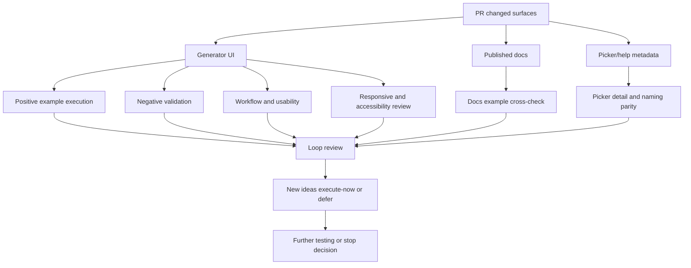

# Issue 226 Second Session Test Report

## Executive Summary

This second session was run as a stricter multi-agent exploratory review of issue #226 and PR #231 against the deployed test environment only.

The final-review retests changed the result substantially. A broad “most parameterized commands are broken” conclusion is not justified from this session. In fresh sessions, with the live split workflow used correctly, these examples worked:

- `autoIncrement.sequence(start=10, step=5)`
- `date.month(abbreviated=true)`
- `finance.pin(length=5)`
- `number.int(min=10, max=12)`
- `helpers.replaceSymbols("##??-##")`

The strongest remaining concerns are:

- published full-command examples are not directly transferable to the primary split picker-plus-params workflow
- `helpers.arrayElement` still appeared genuinely broken in clean retesting
- removed-command cleanup appears incomplete because `image.urlLoremFlickr` is gone from the picker/runtime but still visible in published image docs
- validation feedback remains inconsistent and sometimes leaves stale prior output visible
- docs/help path drift, naming drift, and generator accessibility issues remain

Overall recommendation: the changes look partially successful, but not fully acceptable yet for the story outcome because example discoverability improved more than example executability clarity, and at least one command/helper path plus several docs/help/accessibility issues still need follow-up.

## Scope And References

- Story: [Issue #226](https://github.com/eviltester/grid-table-editor/issues/226)
- Pull request: [PR #231](https://github.com/eviltester/grid-table-editor/pull/231)
- Test environment: [Published test environment](https://eviltester.github.io/grid-table-editor/)
- Session prompt: [issue-226-second-session-goal-prompt.md](issue-226-second-session-goal-prompt.md)
- Main log: [issue-226-second-session-test-log.md](issue-226-second-session-test-log.md)

## Planning Summary

### Story Summary

Issue #226 requires command definitions to have examples and validators, with broader example coverage preferred for parameterized commands.

### PR Summary

PR #231 describes changes across:

- `usageExamples` and help metadata
- validator support
- contract tests around examples and validators
- docs/help surfaces
- command catalog organization

### Risk Analysis

- High risk: examples may exist in docs/help but still be hard to execute correctly in the live UI.
- High risk: validators may behave inconsistently across bad-input paths.
- High risk: broad command-definition churn may hide isolated command regressions inside an otherwise improved catalog.
- Medium risk: docs/help pathing and naming may drift away from the nested test environment.
- Medium risk: modal-heavy help and picker flows may regress accessibility and mobile usability.

### Changed-Surface Inventory

Changed-file groups confirmed from the live PR file list:

- broad domain docs rewrites under `docs-src/docs/040-test-data/domain/`, including especially large changes in `date`, `finance`, `internet`, `lorem`, `number`, `string`, and `word`
- picker/help UI files such as `packages/core-ui/js/gui_components/shared/test-data/ui/method-picker-modal.js`, `packages/core-ui/js/gui_components/shared/domain-command-help-metadata.js`, and `packages/core-ui/js/gui_components/shared/test-data/help/help-model-builder.js`
- new command-help contract/validator files: `packages/core/js/command-help/command-help-contract.js` and `packages/core/js/command-help/command-help-validators.js`
- keyword-definition reorganization under `packages/core/js/keywords/domain/...` and `packages/core/js/domain/domain-keywords.js`
- helper/domain keyword definition changes including `packages/core/js/faker/faker-helper-keyword-definitions.js`
- interaction-matrix and support updates under `packages/core-ui/src/tests/interaction/matrix/...`
- command-specific implementation changes including `packages/core/js/domain/internet-http-method.js`, `packages/core/js/domain/auto-increment-sequence.js`, and `packages/core/js/domain/auto-increment-timestamp.js`

### Command Coverage Strategy

- sample many command families rather than only one
- include domain and faker/helper commands
- compare published examples, picker examples, and runtime behavior
- include positive controls, parameterized examples, and malformed input probes
- re-run suspicious failures in fresh sessions before treating them as confirmed defects

### Delegation Summary

- Command coverage and example execution:
  [command-coverage-test-log.md](command-coverage-test-log.md)
- Negative validation and malformed parameter testing:
  [negative-validation-test-log.md](negative-validation-test-log.md)
- Docs/help/content consistency:
  [docs-consistency-test-log.md](docs-consistency-test-log.md)
- UX/usability and workflow regression:
  [ux-regression-test-log.md](ux-regression-test-log.md)
- Responsive/mobile and accessibility review:
  [responsive-accessibility-test-log.md](responsive-accessibility-test-log.md)

Notes:

- All five delegated areas produced logs and were integrated.
- The command-coverage subagent later added focused coverage for `internet.httpMethod`, removed-command leakage around `image.urlLoremFlickr`, and extra breadth notes across additional amended families.

### Coverage Model

## Techniques And Heuristics Used

- exploratory testing
- risk-based testing
- documentation testing
- consistency/oracle checking
- equivalence partitioning
- boundary analysis
- negative testing
- state/flow modeling
- responsive testing heuristics
- accessibility heuristics
- pairwise thinking

## Coverage Tracking

### Command Families Sampled

- `autoIncrement.sequence`
- `autoIncrement.timestamp`
- `date.month`
- `finance.pin`
- `helpers.arrayElement`
- `helpers.replaceSymbols`
- `internet.httpMethod`
- `internet.protocol`
- `literal.value`
- `number.int`
- `string.alpha`
- `word.words` presence check

### Docs Pages Reviewed

- `site/docs/test-data/domain/string/`
- `site/docs/test-data/domain/literal/`
- `site/docs/test-data/domain/finance/`
- `site/docs/test-data/domain/image/`
- `site/docs/test-data/domain/internet/`
- `site/docs/test-data/auto-increment-sequences/`
- `site/docs/intro`
- `site/docs/category/generating-data`
- `site/docs/test-data/method-picker-ui-spec`
- `site/docs/test-data/domain/airline`
- `site/docs/test-data/domain/animal`
- `site/docs/test-data/domain/autoIncrement`
- `site/docs/test-data/domain/color`
- `site/docs/test-data/domain/finance`
- `site/docs/test-data/domain/internet`
- `site/docs/test-data/domain/literal`
- deployed `app.html`
- deployed `generator.html`

### Workflow Areas Reviewed

- generator row editing
- method-picker details and selection flow
- params field behavior after command changes
- preview refresh and output sync
- docs example translation into row mode
- invalid-params feedback
- stored-history side effects
- docs/help links and naming
- removed-command leakage across picker versus published docs/help
- mobile docs readability
- generator accessibility semantics

### Prompt Coverage Classes

- Domain command families sampled:
  - `autoIncrement`, `date`, `finance`, `internet`, `literal`, `number`, `string`, `word`
- Faker/helper commands sampled:
  - `helpers.arrayElement`, `helpers.replaceSymbols`
- Newly added or highlighted command sampled:
  - `internet.httpMethod`
- Removed/deprecated surface checked:
  - `image.urlLoremFlickr`
- Commands with validators or malformed-input probes:
  - `string.alpha`, `internet.httpMethod`, `internet.protocol`, `autoIncrement.sequence`, `number.int`
- Structured or constrained params sampled:
  - `autoIncrement.sequence(start=10, step=5)`
  - `date.month(abbreviated=true)`
  - `finance.pin(length=5)`
  - `number.int(min=10, max=12)`
  - `helpers.replaceSymbols("##??-##")`
- Commands/docs with multiple examples explicitly consulted:
  - `autoIncrement.sequence`
  - `string.alpha`
  - `finance.pin`
  - `helpers.replaceSymbols`

## Loop Tracking

- Loop 1: completed
- Loop 2: completed
- Loop 3: completed
- Final review loop: completed

## Loop Details

### Loop 1

- Built the required planning, delegation, changed-surface inventory, and coverage model.
- Established direct execution, docs/help parity, UX/workflow, and responsive/accessibility evidence lanes.
- Main change after Loop 1:
  - the session moved from isolated concern to a broad hypothesis that docs/help examples and runtime behavior might not line up reliably.

### Loop 2

- Reviewed accumulated evidence and generated 10 new ideas.
- `execute-now` items focused on more parameterized examples and same-family controls.
- Main change after Loop 2:
  - the session initially appeared to show a broad split between working defaults and failing parameterized examples.

### Loop 3

- Reviewed the next gaps and generated another 10 ideas.
- `execute-now` items focused on helper coverage and textbox-versus-dialog behavior.
- Main change after Loop 3:
  - the session temporarily pointed toward a raw params-entry problem.

### Final Review Loop

- Re-read the story, PR summary, accumulated logs, current report, sampled families, docs reviewed, examples tried, and remaining gaps.
- Generated 10 additional ideas.
- `execute-now` items:
  - re-run `date.month(abbreviated=true)` cleanly
  - execute `helpers.replaceSymbols("##??-##")` cleanly
  - re-run `finance.pin(length=5)` with picker plus params only
  - re-run `number.int(min=10, max=12)` with picker plus params only
  - re-run `autoIncrement.sequence(start=10, step=5)` with picker plus params only
- `defer` items:
  - re-test `literal.value` after confirming whether the split UI expects a positional literal rather than `value=...`
  - re-test `string.alpha` in a fully clean session
  - compare row mode with text-mode schema execution
  - re-check stored-history behavior after refresh
  - add screenshots only if the corrected defect set still needs them
- Main change after the final review:
  - the earlier broad runtime-failure theory did not survive fresh-session retesting
  - the final result is narrower and more precise: many amended command examples do work, but the docs-to-workflow translation remains weak and at least one helper command still appears broken

## Findings

### Confirmed Defects

- `helpers.arrayElement` still produced malformed outputs such as `helpersmarrayElementC`, `helpersbarrayElementA`, and `helpers#arrayElementB` instead of returning one supplied array member during fresh retesting.
  

- Published full-command examples are not directly transferable to the primary row-mode workflow because the UI splits command choice from params entry. This creates a high usability/documentation defect for the story’s practical outcome.
- Deployed inline docs/help links are not consistently nested-site-safe and drift across `/grid-table-editor/docs/...`, `eviltester.github.io/docs/...`, and `anywaydata.com/...` instead of staying consistently within the nested test-environment docs path.
- `image.urlLoremFlickr` is absent from the live picker/runtime but still present in the published image docs/help surface, so removed-command cleanup appears incomplete.
- Published airline docs naming does not line up cleanly with the flattened picker naming, which weakens docs-to-picker discoverability.
- Delegated negative testing found inconsistent invalid-input outcomes:
  - malformed regenerated output with no clear validation message
  - generic `**ERROR**` output with weak explanation
  - explicit row-level validation while stale prior generated data remains visible
- The malformed-parentheses guidance path is itself misleading because it teaches a broken correction format.
- Delegated responsive/accessibility coverage found:
  - `generator.html` lacks `main`, `h1`, and a skip link
  - some generator help triggers use `span[role="button"]` instead of native buttons
  - the top help trigger exposes content without updating `aria-expanded`
  - dense mobile docs tables overflow and require awkward horizontal scrolling
- Switching commands can preserve stale params text rather than resetting or reconciling it for the new command, which can easily contaminate subsequent example execution.

### Important Reclassifications From Final Review

- `autoIncrement.sequence(start=10, step=5)` is not a confirmed defect from this session. It passed in a fresh picker-plus-params retest.
- `finance.pin(length=5)` is not a confirmed defect from this session. It passed in a fresh picker-plus-params retest.
- `number.int(min=10, max=12)` is not a confirmed defect from this session. It passed in a fresh picker-plus-params retest.
- `date.month(abbreviated=true)` is not a confirmed defect from this session. It passed in a fresh picker-plus-params retest.
- `helpers.replaceSymbols("##??-##")` is not a defect from this session. It passed in a fresh picker-plus-params retest.

### Unresolved Or Ambiguous Items

- `literal.value` looked bad in earlier probes, but the final review did not complete a clean re-check against the exact split-UI expectation, so it should not be treated as a final confirmed runtime defect from this session.
- `string.alpha` produced suspicious behavior in an earlier state-contaminated sequence, but it was not re-run cleanly in the final loop, so it should remain unresolved rather than confirmed.
- Preview “stuck” behavior and stored-history pollution still look suspicious, but this session did not prioritize enough clean repro work to elevate them beyond follow-up risk.

## Good Signals And Controls

- The picker and published docs expose many usage examples and richer metadata than before, which supports the story intent at the content layer.
- `internet.httpMethod` is present in the live picker and generated plausible verbs such as `PATCH`, `TRACE`, `PUT`, `OPTIONS`, `DELETE`, and `CONNECT`.
- `internet.protocol` worked as a useful no-params control.
- `autoIncrement.timestamp()` worked as a useful same-family control.
- Fresh-session retests confirmed that multiple parameterized examples across different families do execute successfully when the live split workflow is followed correctly.

## Risks And Remaining Concerns

- Reviewers can easily mistake the published full-command examples for something they can paste directly into the row workflow, which can create false failure signals and real usability friction.
- Broad command-definition changes still justify more targeted family sampling, because the final session shows that isolated helper defects can hide inside an otherwise mostly working catalog.
- Inconsistent validator feedback means users may struggle to distinguish current failure, stale output, and corrected state.
- Docs/help path drift can send users to the wrong host/path during testing and weaken trust in the deployed test environment.
- Accessibility issues in the generator shell still matter because the story outcome depends heavily on example discoverability and help usage.

## Deferred Ideas

- Re-test `literal.value` against the exact split-UI expectation from the picker details.
- Re-test `string.alpha` in a fully clean session after clearing all stale row state.
- Compare row mode with text-mode schema execution for the same examples.
- Re-check stored-history pollution after refresh and new session setup.
- Add more helper/faker family coverage beyond `helpers.arrayElement` and `helpers.replaceSymbols`.

## Why Stopping Was Justified

- Multiple explicit loops were completed, including the mandatory final review loop.
- Coverage is broad enough for a story-level assessment across domain commands, helper commands, new/removed surfaces, validation behavior, docs/help parity, workflow, and accessibility.
- The most recent work changed interpretation and deliverable quality more than it produced new defect families, which is a sign that the session was converging.
- The remaining gaps are narrower follow-up probes rather than evidence that the broad testing objective was still unmet.

## Not Covered And Why

- Full broad command-family coverage across every amended command definition was not completed; the session used representative sampling plus fresh retests to challenge provisional conclusions.
- No text-mode schema execution comparison was completed because the final review prioritized resolving whether earlier runtime failures were real defects or workflow/state artifacts.
- The PR advertised filter/exclusion support for `internet.httpMethod`, but this session only confirmed base runtime presence and positive-path generation; it did not complete a focused parameter-support retest for that command.

## Final Recommendation

The story looks improved but not complete from a user-testing perspective.

The strongest positive result is that many representative parameterized examples do work in the deployed app when the live UI is used correctly. The strongest negative result is that the live workflow makes that “used correctly” distinction too implicit: docs examples, picker examples, and row-mode input expectations are still not aligned clearly enough, and at least one helper command plus several validation, docs/help, and accessibility issues remain.

I would not call the current deployed outcome fully acceptable for issue #226 until:

- docs/help/example formatting is made obviously compatible with the split UI
- `helpers.arrayElement` is investigated
- invalid-input feedback is made more consistent
- the identified docs/help/accessibility issues are addressed
