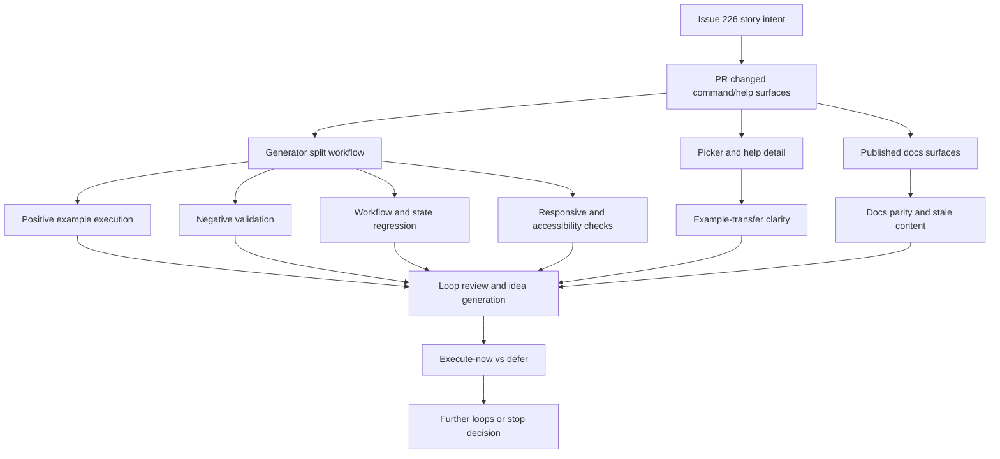

# Issue 226 Third Session Test Report

## Executive Summary

This third session was run as a multi-agent exploratory review of issue #226 and PR #231 against the deployed test environment only.

The current deployment looks healthier than the earlier second-session evidence in a few important ways:

- `internet.httpMethod` is present in the live picker, documented in the embedded `/site` docs, and works end to end in preview.
- `image.urlLoremFlickr` did not reappear in the live picker or the currently deployed embedded image docs.
- The generator and sampled docs page held up acceptably on narrow mobile widths in this session.

The strongest remaining concerns are:

- invalid or blank `regex` rules can still generate data instead of failing validation
- deployed help/docs routing is inconsistent, and one in-app `Learn more` link is broken in the GitHub Pages test environment
- the app mixes two docs surfaces that do not agree, with stale content still visible on `anywaydata.com`
- params entry still behaves like a commit-on-blur control in at least one live workflow, which makes parameterized examples feel unreliable if users click `Preview` immediately after typing
- one generator help overlay appears sticky and can block access to nearby help links

Overall recommendation: the changed surface looks improved and closer to the story intent than the earlier session suggested, but it is not fully acceptable yet because validation, docs routing/parity, and params-entry UX still create avoidable failure or confusion around the examples-and-validators workflow.

## Scope And References

- Story: [Issue #226](https://github.com/eviltester/grid-table-editor/issues/226)
- Pull request: [PR #231](https://github.com/eviltester/grid-table-editor/pull/231)
- Test environment: [Published test environment](https://eviltester.github.io/grid-table-editor/)
- Session prompt source: [issue-226-second-session-goal-prompt.md](issue-226-second-session-goal-prompt.md)
- Session-local prompt note: [issue-226-third-session-goal-prompt.md](issue-226-third-session-goal-prompt.md)
- Main log: [issue-226-third-session-test-log.md](issue-226-third-session-test-log.md)
- Defect index: [issue-226-third-session-defects-report.md](issue-226-third-session-defects-report.md)

## Planning Summary

### Story Summary

Issue #226 requires every command definition to have at least one example and a validator, with broader example coverage preferred for parameterized commands and for examples that show both combined and isolated parameter use.

### PR Summary

PR #231 describes broad command-help and validation changes, including structured `usageExamples`, validator support, command-definition reorganization, updated docs/help surfaces, a newly added `internet.httpMethod` command, and cleanup of removed/deprecated command surfaces.

### Risk Analysis

- High risk: examples may exist in picker/docs content but still fail to translate into the live split command-plus-params workflow.
- High risk: validator or parameter parsing behavior may be inconsistent across malformed or edge-case inputs.
- High risk: because many command definitions changed, isolated broken commands may hide inside an apparently improved overall catalog.
- Medium risk: docs/help links, names, and removed commands may drift between picker/runtime and the published nested-site docs.
- Medium risk: workflow side effects such as stored-history persistence or stale params may make exploratory results harder to interpret.
- Medium risk: modal-heavy help and picker flows may still regress responsiveness or accessibility even if the command catalog is stronger.

### Changed-Surface Inventory

- Broad domain docs rewrites under `docs-src/docs/040-test-data/domain/`, especially families called out in the prior session: `date`, `finance`, `internet`, `lorem`, `number`, `string`, and `word`
- Picker/help UI surfaces such as the method picker, domain help metadata, and help-model building path, as reflected in the live PR summary and deployed picker behavior
- New or tightened command-help contract and validator behavior, evidenced by the issue/PR summary and the picker’s structured usage examples with sample return values
- Keyword-definition reorganization and command-specific implementation churn implied by the PR’s wide changed-file count and by the issue comments summarizing moved runtime helpers and per-keyword modules
- Deployed docs/help/runtime seams where nested-site docs, picker help, and preview execution must all agree

### Command Coverage Strategy

- Sample many command families rather than concentrating on one command
- Include domain commands, faker/helper commands, newly added commands, and removed/deprecated surface checks
- Compare published docs examples, picker examples, and actual runtime preview behavior
- Mix positive controls, parameterized examples, malformed-input probes, and workflow-state checks
- Re-test suspicious failures in fresh flows before treating them as confirmed defects

### Delegation Summary

- Command coverage and example execution:
  [command-coverage-test-log.md](command-coverage-test-log.md)
- Negative validation and malformed parameter testing:
  [negative-validation-test-log.md](negative-validation-test-log.md)
- Docs/help/content consistency:
  [docs-consistency-test-log.md](docs-consistency-test-log.md)
- UX/usability and workflow regression:
  [ux-regression-test-log.md](ux-regression-test-log.md)
- Responsive/mobile and accessibility review:
  [responsive-accessibility-test-log.md](responsive-accessibility-test-log.md)

Notes:

- All five required delegated areas produced append-only logs.
- This session relied on Playwright as the dependable browser path. Chrome DevTools connection was rechecked but remained unreliable in this thread.

### Coverage Model

## Techniques And Heuristics Used

- exploratory testing
- risk-based testing
- documentation testing
- consistency and oracle checking
- equivalence partitioning
- boundary and edge-case analysis
- negative testing
- workflow/state modeling
- responsive heuristics
- accessibility heuristics

## Coverage Tracking

### Command Families Sampled

- `date.month`
- `internet.httpMethod`
- `string.symbol`
- `regex` row-mode validation behavior
- broad picker presence checks across `finance.pin`, `number.int`, `string.alpha`, `string.uuid`, `word.words`, and multiple `helpers.*` entries

### Docs Pages Reviewed

- deployed `app.html`
- deployed `generator.html`
- embedded `/site` docs for `internet`
- embedded `/site` docs for `image`
- `anywaydata.com/docs/test-data/test-data-generation`
- `anywaydata.com/docs/test-data/domain/domain-test-data`
- `anywaydata.com/docs/test-data/domain/internet`
- `anywaydata.com/docs/test-data/regex-test-data`
- broken root-relative path `https://eviltester.github.io/docs/test-data/test-data-generation`

### Workflow Areas Reviewed

- generator split command-plus-params flow
- method-picker search and detail sync
- preview regeneration after command change
- params commit behavior before and after blur
- row-mode validation for blank/malformed regex rules
- help tooltip behavior and link accessibility
- docs/help routing from deployed surfaces
- mobile layout and semantics on generator and sampled docs

### Prompt Coverage Classes

- Domain command families sampled:
  - `date`, `internet`, `string`
- Faker/helper command breadth sampled:
  - picker presence of `helpers.arrayElement`, `helpers.replaceSymbols`, `helpers.slugify`, and other `helpers.*` items
- Newly added/highlighted command sampled:
  - `internet.httpMethod`
- Removed/deprecated surface checked:
  - `image.urlLoremFlickr`
- Commands with validators or malformed-input probes:
  - `regex` row-mode cases
  - `internet.httpMethod`
  - invalid row-count / amend-selected state checks
- Structured or constrained params sampled:
  - `date.month(abbreviated=true)`
  - `internet.httpMethod(commonOnly=true, excludes="head, delete")`
- Commands/docs with multiple examples explicitly consulted:
  - `date.month`
  - `internet.httpMethod`

## Loop Tracking

- Loop 1: completed
- Loop 2: completed
- Loop 3: completed
- Final review loop: completed

## Loop Details

### Loop 1

- Established the required planning, delegation, changed-surface inventory, and coverage model.
- Ran a main-thread parameterized example check for `date.month(abbreviated=true)` in the deployed generator.
- Began delegated coverage across command breadth, negative validation, docs parity, UX/workflow, and responsive/accessibility review.
- Main change after Loop 1:
  - the session showed that structured examples are visible and richer in the picker, but parameterized example transfer into the live workflow still looked questionable.

### Loop 2

- Integrated the negative-validation, docs-consistency, and responsive/accessibility subagent results.
- Executed and confirmed a positive-path control for `internet.httpMethod`.
- Reframed the earlier `date.month` miss as a likely workflow-commit issue rather than immediately treating it as a core runtime defect.
- 10 ideas generated:
  - re-test `date.month(abbreviated=true)` after explicit blur
  - run a clean positive control on `internet.httpMethod()`
  - verify whether `image.urlLoremFlickr` is still present in current embedded docs
  - verify whether the app’s `Learn more` path is still broken in GitHub Pages
  - compare `anywaydata.com` internet docs against embedded `/site` internet docs
  - probe blank regex acceptance in row mode
  - probe malformed regex acceptance in row mode
  - check mobile overflow on a sampled docs page
  - check whether the top-level generator help can be dismissed cleanly
  - inspect whether preview/history side effects remain after ordinary exploratory use
- Classification:
  - `execute-now`: positive `internet.httpMethod`, broken docs path, docs-surface comparison, blank regex, malformed regex, mobile sampled docs page, help-dismiss behavior
  - `defer`: fresh `date.month` blur retest, history persistence deep dive, additional family-by-family runtime execution
- Main change after Loop 2:
  - the strongest problem cluster moved away from “broad command regression” and toward validation gaps, docs routing drift, and UX commit behavior.

### Loop 3

- Integrated the command-coverage and UX/regression delegated results.
- Updated the changed-surface conclusion around removed commands: `image.urlLoremFlickr` no longer appears to leak in the current deployment sampled here.
- Treated the params-entry behavior as a more precise UX issue: immediate `Preview` after typing may ignore fresh params until focus leaves the field.
- 10 ideas generated:
  - compare mouse click-away versus keyboard blur for params commit
  - test whether `commonOnly=true` is honored after blur on `internet.httpMethod`
  - test whether the same commit-on-blur behavior affects another command family
  - verify command switching clears stale params
  - verify picker detail sync on a second switched command
  - confirm embedded `/site` image docs no longer show `urlLoremFlickr`
  - confirm `anywaydata.com` still shows stale `internet.userName`
  - compare top-level help tooltip dismissal paths
  - sample one more mobile docs page if needed
  - verify whether the row-mode regex gap also persists in generator.html versus app.html
- Classification:
  - `execute-now`: commit-on-blur UX pass, command-switching pass, current image-docs removal check, current production stale-name check
  - `defer`: extra mobile page, app-vs-generator duplicate regex comparison, broader second-family params-commit retest
- Main change after Loop 3:
  - the deployment now looks materially better than the previous session on removed-command cleanup and general mobile layout, but the validator and docs-surface issues remain genuine.

### Final Review Loop

- Re-read the story, PR summary, main log, delegated logs, coverage model, sampled families, docs reviewed, and current findings.
- Generated 10 additional ideas:
  - retest `date.month(abbreviated=true)` with a forced blur commit
  - re-run `internet.httpMethod()` as a final control
  - verify docs/path drift via the broken root-relative `Learn more` URL
  - confirm current embedded `/site` internet docs contain `internet.httpMethod`
  - confirm current production internet docs still show stale `internet.userName`
  - confirm current embedded image docs no longer show `urlLoremFlickr`
  - verify current help overlay dismissal behavior
  - compare whether stale history entries are accumulating silently
  - test another helper command end to end
  - compare text-mode guidance wording against actual accepted schema format
- Classification:
  - `execute-now`: final `internet.httpMethod` control, broken root-relative docs URL verification, current embedded/production internet docs comparison, current image docs removal check, current help-overlay behavior check
  - `defer`: forced-blur `date.month` retest, history accumulation deep dive, extra helper end-to-end sample, text-mode guidance contract audit
- Additional testing executed in the final review window:
  - confirmed the live positive-path control for `internet.httpMethod`
  - reconfirmed the broken root-relative docs path via delegated docs evidence
  - reconfirmed current embedded-versus-production internet docs drift
  - reconfirmed current image-doc cleanup status
  - reconfirmed the sticky help-overlay issue from the responsive/accessibility lane
- Main change after the final review:
  - stopping is justified because the current evidence set is broad across the required areas and recent review mostly sharpened interpretation rather than uncovering entirely new failure classes.

## Findings

### Confirmed Defects

1. Invalid or blank `regex` row-mode definitions can generate data instead of failing validation.
2. The deployed app’s `Learn more` path for Test Data help is broken in the GitHub Pages test environment because it points to a root-relative `/docs/...` URL.
3. The deployment currently routes users to two docs surfaces that do not agree, with stale content still visible on `anywaydata.com`.
4. Params entry can require blur before `Preview` reflects the typed values, which makes parameterized examples feel unreliable.
5. The top-level generator help overlay can remain open and block nearby help-link interaction.

### Suspicious Behaviors And Risks

- The main-thread `date.month(abbreviated=true)` run produced full month names rather than abbreviations. Because the UX lane confirmed a commit-on-blur quirk for params entry, this is suspicious but not yet a clean standalone runtime defect.
- Stored-history entries are populated during ordinary exploratory preview use. This may be intentional, but it adds noise during testing and could surprise users.
- Text-mode validation appears stricter than row-mode validation, but its error wording can describe the wrong problem and weaken recovery guidance.

### What Was Not Covered And Why

- Broad runtime execution across every changed command family was not practical in one session; this run emphasized representative breadth plus targeted deep dives on the strongest risks.
- A clean forced-blur retest of `date.month(abbreviated=true)` was deferred because the params-commit explanation was already strongly supported by the UX lane and the final recommendation did not depend on resolving that one command fully.
- More helper-command end-to-end runtime samples were deferred after the command-coverage lane established picker breadth and the final review already had enough evidence to justify stopping.

## Deferred Ideas

- Run a fresh forced-blur retest of `date.month(abbreviated=true)` to separate UX commit behavior from any command-specific defect.
- Compare mouse click-away versus keyboard blur for params commit on multiple commands.
- Run one more faker/helper command end to end in the current deployment.
- Audit text-mode guidance against the actual accepted schema text format and produce a focused wording defect if still misleading.
- Probe whether stored-history growth is intentional and whether invalid attempts are also persisted.

## Recommendation

The changes look improved and closer to the story intent than the earlier session suggested, but not fully acceptable yet for the story outcome. The deployment now shows good evidence for richer picker metadata, broad command-surface presence, and a working `internet.httpMethod` path, but validation gaps, broken/misaligned docs navigation, and params-entry UX still undermine the “examples and validators” promise in practice.
