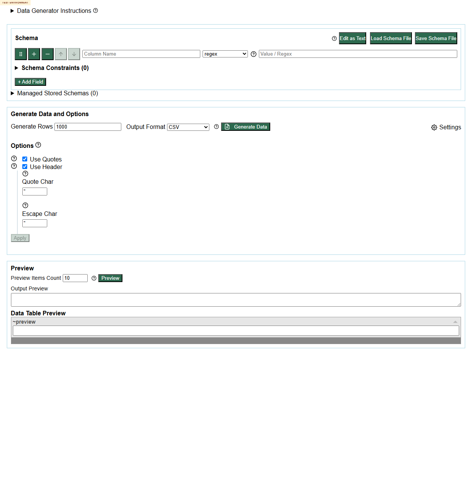
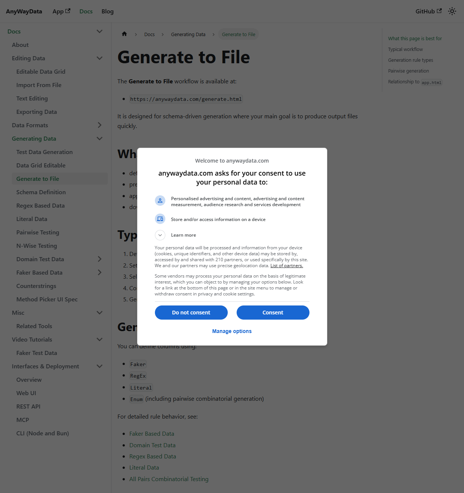

# Defect 01: Family Help Links Still Leak To Production

## Summary

The deployed test environment still exposes family-level help links that navigate to `https://anywaydata.com/...` instead of staying inside the nested GitHub Pages docs under `https://eviltester.github.io/grid-table-editor/site/...`.

This is a direct miss against issue #233 because users can leave the test environment from default, visible help entrypoints in `app.html`, `generator.html`, `site/app.html`, `site/generator.html`, and `writer-schema.html`.

## Repeatability

Repeatable.

## Surfaces Confirmed

- `https://eviltester.github.io/grid-table-editor/generator.html`
- `https://eviltester.github.io/grid-table-editor/site/generator.html`
- `https://eviltester.github.io/grid-table-editor/site/app.html`
- `https://eviltester.github.io/grid-table-editor/writer-schema.html`

## Representative Examples

- `Regex data help` -> `https://anywaydata.com/docs/test-data/regex-test-data`
- `Domain data help` -> `https://anywaydata.com/docs/test-data/domain/domain-test-data`
- `Faker data help` -> `https://anywaydata.com/docs/test-data/faker-test-data`

## Reproduction

1. Open `https://eviltester.github.io/grid-table-editor/generator.html`.
2. Observe the default first schema row.
3. Inspect or activate the visible `Regex data help` link.
4. Observe that it targets `https://anywaydata.com/docs/test-data/regex-test-data`.
5. Repeat on `https://eviltester.github.io/grid-table-editor/site/generator.html`.
6. Open `https://eviltester.github.io/grid-table-editor/site/app.html`.
7. Expand `Test Data`.
8. Observe the visible row-level `Regex data help` link.
9. Open `https://eviltester.github.io/grid-table-editor/writer-schema.html`.
10. Observe the visible row-level `Regex data help` link in the shared schema editor.

## Expected

Owned help/docs links in the deployed test environment should stay inside the nested testenv docs path, for example under `https://eviltester.github.io/grid-table-editor/site/docs/...`.

## Actual

Visible family-level help entrypoints still target production-host docs on `anywaydata.com`.

## Why This Matters

- It breaks the core story expectation for testenv URL consistency.
- It mixes production and testenv content inside the same workflow.
- It can hide testenv-only differences because users are silently switched to production docs.
- It is easy to hit because the regex family help is visible by default.

## Supporting Evidence

- Main screenshot:
  
- Related negative-pass screenshot:
  
- Supporting logs:
  - [issue-233-test-log.md](../issue-233-test-log.md)
  - [command-coverage-test-log.md](../command-coverage-test-log.md)
  - [negative-validation-test-log.md](../negative-validation-test-log.md)
  - [cross-surface-root-links-test-log.md](../cross-surface-root-links-test-log.md)

## Notes For Investigation

- Tooltip-based links were often rewritten correctly in the same session.
- The likely seam is that family-level visible help links are not going through the same runtime/build-time rewrite path as tooltip HTML links.
