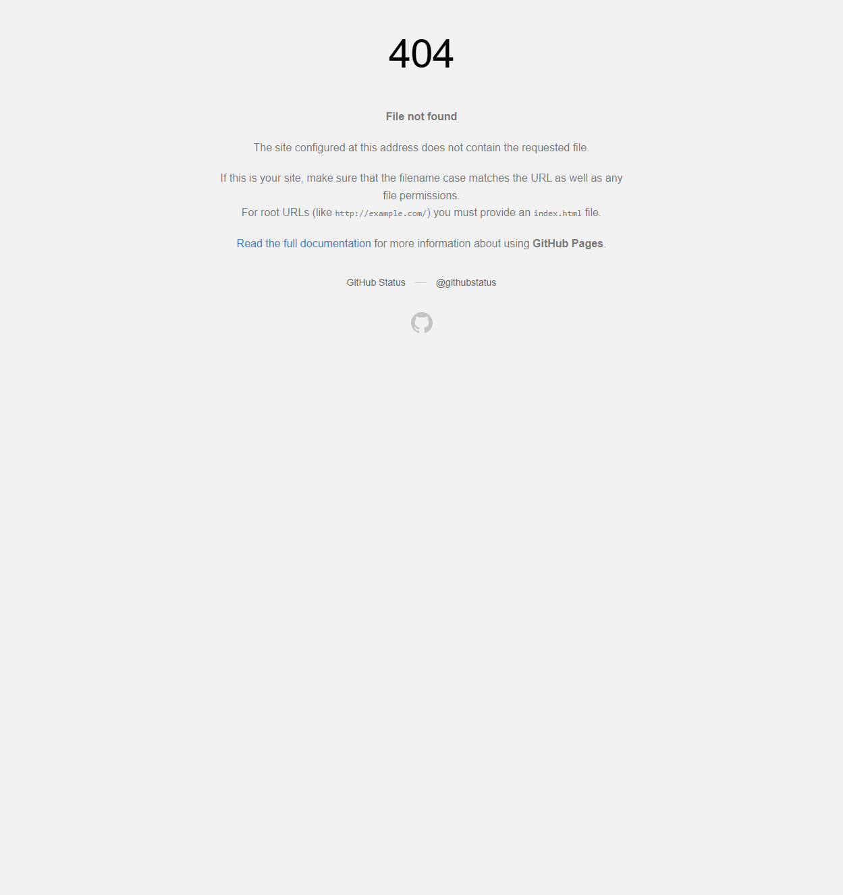

# Defect 02: Root And Repo-Relative Docs Links Still 404

## Summary

The deployed test environment still exposes owned docs links that resolve to broken GitHub Pages URLs because they omit the nested `/site/` mount point.

Two broken classes were confirmed:

- root-relative `/docs/...` links that escape to `https://eviltester.github.io/docs/...`
- repo-relative `docs/...` links that resolve to `https://eviltester.github.io/grid-table-editor/docs/...`

## Repeatability

Repeatable.

## Representative Broken Destinations

- `https://eviltester.github.io/docs/editing-data/text-editing`
- `https://eviltester.github.io/grid-table-editor/docs/data-formats/markdown/options`

## Reproduction

1. Open `https://eviltester.github.io/grid-table-editor/app.html` or `https://eviltester.github.io/grid-table-editor/generator.html`.
2. Inspect or follow owned docs links that are rendered as `/docs/...` or `docs/...`.
3. Open the resulting destination URL.
4. Observe that GitHub Pages returns a `404 File not found` page instead of nested-site docs.

## Expected

Owned docs links should resolve under `https://eviltester.github.io/grid-table-editor/site/docs/...`.

## Actual

Broken root-relative and repo-relative links resolve outside the nested docs mount and land on GitHub Pages 404 pages.

## Why This Matters

- It creates hard failures, not just cosmetic inconsistency.
- It affects user trust because some help/docs links work while others fail.
- It makes the deployment look partially broken even when the nested docs site itself is healthy.

## Supporting Evidence

- Root-relative 404:
  
- Repo-relative 404:
  
- Supporting logs:
  - [negative-validation-test-log.md](../negative-validation-test-log.md)
  - [cross-surface-root-links-test-log.md](../cross-surface-root-links-test-log.md)

## Notes For Investigation

- The nested `/site/` shell itself worked as a positive control.
- The problem is not that the docs build is unavailable; it is that some link-generation paths still omit `/site/`.
