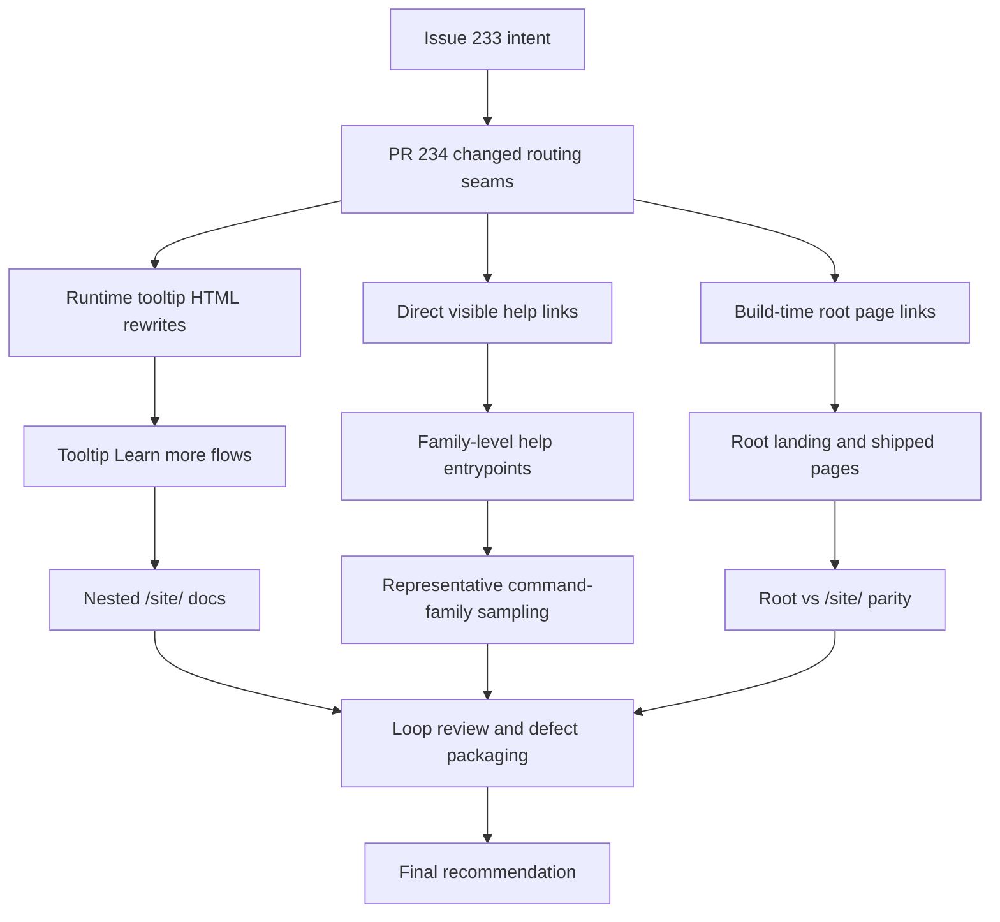

# Issue 233 Test Report

## Executive Summary

This session was a comprehensive multi-agent exploratory review of issue #233 and PR #234 against the deployed test environment only.

The deployment shows a real partial improvement: several tooltip-based docs links and the nested `/site/` docs/blog shell now route correctly inside `https://eviltester.github.io/grid-table-editor/site/...`. However, the story outcome is not met yet because visible family-level help links, root-relative docs links, and repo-relative docs links still break the testenv routing model in repeatable ways.

The most important confirmed findings are:

- visible family-help links still leak to `anywaydata.com`
- some owned docs links still resolve to GitHub Pages 404s because they omit `/site/`
- root and nested surfaces still disagree about how fully they rewrite owned links
- at least one live picker family, `chemicalElement.*`, appears to lack the expected nested docs page

Overall recommendation: the changes are not yet acceptable for the story because the deployed test environment is still inconsistent enough that users can leave the test environment or hit broken docs routes during ordinary help usage.

## Scope And References

- Story: [Issue #233](https://github.com/eviltester/grid-table-editor/issues/233)
- Pull request: [PR #234](https://github.com/eviltester/grid-table-editor/pull/234)
- Test environment: [Published test environment](https://eviltester.github.io/grid-table-editor/)
- Session prompt: [issue-233-session-goal-prompt.md](issue-233-session-goal-prompt.md)
- Main log: [issue-233-test-log.md](issue-233-test-log.md)
- Collated evidence: [test-logs-and-defects.md](test-logs-and-defects.md)

## Planning Summary

### Scope Summary Of The Story And PR

Issue #233 requires the test environment to stop leaking `anywaydata.com` and to keep owned docs/help navigation inside the nested GitHub Pages test environment, especially under `https://eviltester.github.io/grid-table-editor/site/...`.

PR #234 changes:

- root-page link rewriting in the testenv build
- runtime owned-site URL rewriting helpers
- inline help tooltip HTML rewriting
- tests around these behaviors

### Risk Analysis Based On The Actual PR Changes

- High risk: some owned-link variants may still bypass rewriting, especially `/docs`, `docs`, and direct production-host docs links.
- High risk: tooltip content and visible family-help links may use different rewrite paths and drift apart.
- High risk: root pages and nested `/site/` pages may behave differently because of base-path differences.
- Medium risk: shared schema-editor surfaces such as `app.html`, `generator.html`, and `writer-schema.html` may all inherit the same stale help-link behavior.
- Medium risk: even when routing is correct, docs inventory may still be incomplete for some exposed command families.

### Changed-Surface Inventory Derived From The PR

- `scripts/create-testenv.mjs`
  - root-page link rewriting
  - landing-page content change toward nested-site wording
- `packages/core-ui/js/gui_components/shared/test-data/help/runtime-docs-url.js`
  - owned-site URL normalization and broader runtime site URL handling
  - HTML snippet rewriting support
- `packages/core-ui/js/help/help-tooltips.js`
  - tooltip content rewriting through runtime owned-site logic
- tests
  - root-page rewrite tests
  - runtime site/docs rewrite tests
  - tooltip rewrite tests

### Command Coverage Strategy

The prompt asked for broad command-family sampling. For this story, that meant broad sampling of help/docs/navigation behavior across command families rather than broad data-generation verification.

The session intentionally sampled:

- domain families
- faker/helper families
- newly added commands
- removed/deprecated commands
- validator-oriented or constrained examples
- structured-parameter examples
- pages with multiple examples

The key oracle was consistency between:

- visible help links
- tooltip `Learn more` links
- method-picker documentation links
- root page links
- nested `/site/` docs pages

### Delegation Summary

- Main agent:
  - planning, loop orchestration, synthesis, defect packaging, final report, PDF export
- Subagent logs:
  - [command-coverage-test-log.md](command-coverage-test-log.md)
  - [negative-validation-test-log.md](negative-validation-test-log.md)
  - [docs-consistency-test-log.md](docs-consistency-test-log.md)
  - [ux-regression-test-log.md](ux-regression-test-log.md)
  - [responsive-accessibility-test-log.md](responsive-accessibility-test-log.md)
  - [cross-surface-root-links-test-log.md](cross-surface-root-links-test-log.md)

### Model-Based Coverage Diagram

### Loop Strategy

- Loop 1:
  - broad delegated coverage and first live confirmation of a production-link leak
- Loop 2:
  - targeted expansion into nested `/site/` variants and shared schema surfaces
- Loop 3:
  - parity/contrast checks to prove tooltip links and visible family-help links diverge on the same pages
- Final review loop:
  - stop-control checks and explicit stop-justification review

## Techniques And Heuristics Used

- exploratory testing
- risk-based testing
- documentation testing
- consistency and oracle checking
- equivalence partitioning
- boundary analysis
- negative testing
- state and flow modeling
- pairwise thinking
- responsive testing heuristics
- accessibility heuristics

## Coverage Tracking

### Command Families Sampled

- `regex`
- `domain`
- `faker`
- `internet.httpMethod`
- `helpers.arrayElement`
- `helpers.rangeToNumber`
- `helpers.slugify`
- `finance.pin`
- `string.alpha`
- `chemicalElement.*`
- removed/deprecated docs coverage for `image.urlLoremFlickr`

### Coverage By Command-Family Class

- Domain command families sampled:
  - `internet`, `finance`, `string`, `chemicalElement`
- Faker/helper command families sampled:
  - `helpers.arrayElement`, `helpers.rangeToNumber`, `helpers.slugify`, `helpers.fake`, `helpers.multiple`
- Newly added command sampled:
  - `internet.httpMethod`
- Removed/deprecated surface sampled:
  - `image.urlLoremFlickr`
  - deprecated helper-form guidance in faker/docs content
- Validator/constrained examples sampled:
  - `string.alpha`
  - schema constraint examples
  - regex help/docs flows
- Structured-parameter examples sampled:
  - `internet.httpMethod`
  - `helpers.rangeToNumber`
  - domain examples such as `date.between`, `finance.iban`, `number.int`
- Multiple-example docs surfaces sampled:
  - domain docs
  - faker/helper docs
  - schema-definition docs

### Docs Surfaces Reviewed

- root landing page
- `app.html`
- `generator.html`
- `writer-schema.html`
- `combinatorial.html`
- `webmcp.html`
- `site/`
- `site/app.html`
- `site/generator.html`
- `site/docs/intro`
- `site/blog`
- `site/docs/test-data/test-data-generation`
- `site/docs/test-data/generate-to-file`
- `site/docs/test-data/domain/domain-test-data`
- `site/docs/test-data/domain/internet`
- `site/docs/test-data/domain/string`
- `site/docs/test-data/domain/image`
- `site/docs/test-data/faker/helpers`
- `site/docs/test-data/Schema-Definition`
- `site/docs/test-data/domain/chemicalElement` (404)

### Workflow Areas Reviewed

- root launch-page navigation
- app and generator help flows
- shared schema-editor row help
- method-picker documentation links
- tooltip `Learn more` flows
- params-editor help flow
- root versus nested `/site/` parity
- responsive/mobile and keyboard entry behavior

## Loops Performed

- Loop 1: completed
- Loop 2: completed
- Loop 3: completed
- Final review loop: completed

## Loop Details

### Loop 1

- Established the planning model, delegation map, and changed-surface inventory.
- Confirmed browser interaction through Playwright before substantive testing.
- Ran broad delegated coverage across command breadth, negative routing, docs consistency, UX, responsive/accessibility, and cross-surface parity.
- Main change after Loop 1:
  - the session moved quickly from “possible inconsistency” to “repeatable mixed-routing defect classes.”

### Loop 2

- Generated 10 new ideas.
- Executed these `execute-now` ideas:
  - verify `site/generator.html` row-level regex help
  - verify `site/app.html` row-level regex help
  - verify `site/app.html` nested nav remains a positive control
  - verify broken root-relative docs class still exists
  - verify `writer-schema.html` repeats the shared-schema leak
  - verify `chemicalElement` nested docs route still 404s
- Deferred:
  - exhaustive family-by-family help census
  - Storybook deep pass
  - article-body production URL audit
  - full picker-to-docs route inventory matrix
- Main change after Loop 2:
  - the stale family-help leak was proven to survive inside nested `/site/` surfaces and the writer-schema page, not just root pages.

### Loop 3

- Generated 10 additional ideas.
- Executed these `execute-now` ideas:
  - compare `site/generator.html` tooltip help versus row-level help
  - compare `site/app.html` tooltip help versus row-level help
  - re-check `writer-schema.html` shared row behavior
  - compare root versus nested generator behavior
  - compare root versus nested app behavior
- Deferred:
  - keyboard-specific tooltip interception retest
  - narrower mobile breakpoint retest
  - Storybook story-by-story pass
  - wider blog-link search
  - full docs inventory matrix
- Main change after Loop 3:
  - the dominant defect became very precise: tooltip-driven help is often fixed, but visible family-help links still use stale or broken routing.

### Final Review Loop

- Re-read the story, PR, main log, all delegated logs, current findings, and drafted defect files.
- Generated 10 final ideas.
- Executed these `execute-now` ideas:
  - re-check a known clean control surface (`combinatorial.html`)
  - re-check root `app.html`
  - confirm nested tooltip-vs-row divergence remains the main defect class
  - separate runtime-owned help/link failures from article-body documentary examples
- Deferred:
  - exhaustive family-link census
  - article-body content audit
  - broader Storybook sweep
  - deeper app shell accessibility audit
  - route-by-route domain docs matrix
- Main change after final review:
  - the stop decision became stronger because recent work reinforced the same repeatable defect classes without producing a competing interpretation.

## Confirmed Defects

1. Family-level command help links still leak to production-host docs.
   - See [defect-01-family-help-links-leak-to-production.md](defects/defect-01-family-help-links-leak-to-production.md)
2. Root-relative and repo-relative owned docs links still resolve to GitHub Pages 404s.
   - See [defect-02-root-and-repo-relative-docs-links-404.md](defects/defect-02-root-and-repo-relative-docs-links-404.md)
3. Root and nested `/site/` surfaces still disagree about how fully they rewrite owned links.
   - See [defect-03-root-vs-site-surface-link-parity-gap.md](defects/defect-03-root-vs-site-surface-link-parity-gap.md)
4. `chemicalElement.*` appears in the live UI but the sampled nested docs page route 404s.
   - See [defect-04-chemicalelement-docs-page-missing.md](defects/defect-04-chemicalelement-docs-page-missing.md)
5. Adjacent help overlays can block nearby help actions in the params workflow.
   - See [defect-05-adjacent-help-tooltips-block-clicks.md](defects/defect-05-adjacent-help-tooltips-block-clicks.md)

## Evidence Snapshots

Visible production-host help leak:

Broken root-relative docs target:

Broken repo-relative docs target:

## Suspicious Behaviors And Risks

- Nested docs article bodies still include some production-host example URLs. This may be intentional reference content rather than a runtime routing defect, but it is still a potential confusion risk for users arriving from the test environment.
- `app.html` remains the weakest shell from a mobile/accessibility baseline perspective compared with the root landing page, generator, and nested docs shell.
- The mixed helper naming seen in nested faker docs (`helpers.*`, `faker.helpers.*`, `domain.helpers.*`) is a softer docs clarity risk even where routing is correct.

## Deferred Ideas

- Exhaustive family-by-family visible help census for `enum`, `literal`, `domain`, `faker`, and more domain subsets.
- Storybook story-by-story docs/help audit beyond the default page.
- Full article-body production URL audit within nested docs content.
- Domain-picker to docs-route inventory matrix beyond the confirmed `chemicalElement` case.
- Deeper app-shell keyboard/screen-reader review.

## What Was Not Covered And Why

- Every visible help family was not opened individually because the same stale-link pattern was already repeatable across multiple representative surfaces and families.
- Storybook deeper pages were deferred after the default view did not expose the same link families and the main recommendation no longer depended on Storybook-specific evidence.
- Full article-body docs content auditing was deferred because the stronger story-relevant failures were already in runtime-owned help and navigation seams.

## Recommendation

The changes are not yet acceptable for issue #233.

The deployed test environment is clearly closer to the story intent than a fully broken deployment would be: several tooltip routes and the nested `/site/` shell are working correctly. But users can still:

- leave the test environment through visible family-help links
- hit GitHub Pages 404s through owned docs links
- encounter different routing behavior on equivalent root versus nested surfaces

Because those failures are easy to reproduce and directly contradict the story goal, the change should be treated as needing further fix-and-retest work before sign-off.
