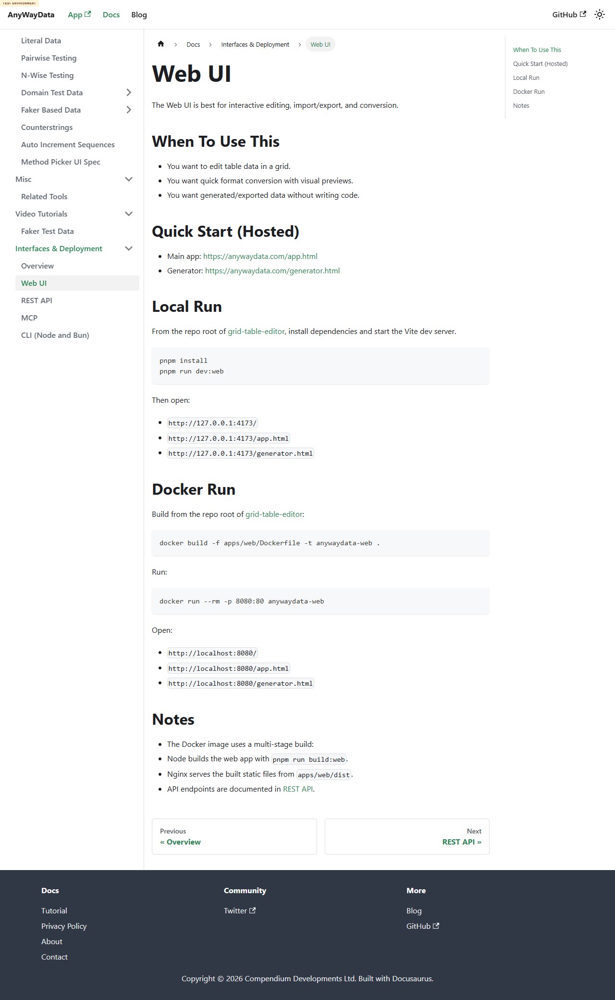

# Defect 001: Web UI docs page still points hosted quick-start links at `anywaydata.com`

## Summary

The published nested docs page `site/docs/interfaces-and-deployment/web-ui` still shows hosted quick-start links to `https://anywaydata.com/app.html` and `https://anywaydata.com/generator.html` instead of the GitHub Pages test environment under review.

## Why This Matters

Issue `#233` explicitly says the test environment should not contain `anywaydata.com` URLs and calls out AI tooling reading the environment. This is a visible docs-content leak, not just hidden metadata.

## Environment

- Deployed environment: `https://eviltester.github.io/grid-table-editor/`
- Docs page: `https://eviltester.github.io/grid-table-editor/site/docs/interfaces-and-deployment/web-ui`

## Steps To Reproduce

1. Open `https://eviltester.github.io/grid-table-editor/site/docs/interfaces-and-deployment/web-ui`.
2. Scroll to `Quick Start (Hosted)`.
3. Observe the visible hosted links.

## Expected

Hosted links shown inside the test environment should stay inside the test environment, e.g. `https://eviltester.github.io/grid-table-editor/app.html` and `https://eviltester.github.io/grid-table-editor/generator.html`, or otherwise be clearly marked as intentional production-only links.

## Actual

The page visibly shows:

- `https://anywaydata.com/app.html`
- `https://anywaydata.com/generator.html`

## Repeatability

- Repeatable

## Evidence

- Screenshot: 
- Supporting log: [../docs-consistency-test-log.md](../docs-consistency-test-log.md)

## Notes

- This may be intentional production guidance, but it is inconsistent with the test-environment-only story requirement and is likely to confuse both users and AI tooling reviewing the deployed testenv.
