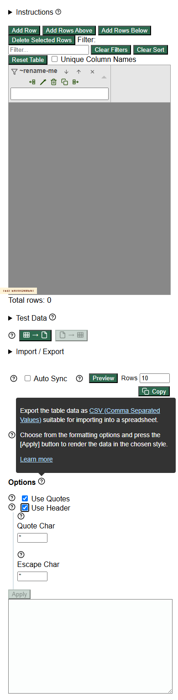

# Defect 005: Visible help popup links in `app.html` are not keyboard reachable

## Summary

The `app.html` help popups visibly contain interactive links, but keyboard traversal does not move focus into those links once the popup is open.

## Environment

- App under test: `https://eviltester.github.io/grid-table-editor/app.html`
- Viewport used in evidence: `390x844`

## Steps To Reproduce

1. Open `https://eviltester.github.io/grid-table-editor/app.html`.
2. Resize to a mobile-like width such as `390x844`.
3. Open the `Options` help popup in the import/export section.
4. Observe that the popup visibly contains links such as `CSV (Comma Separated Values)` and `Learn more`.
5. Press `Tab` repeatedly.

## Expected

Once the popup is open, keyboard users should be able to move focus to the visible interactive links in that popup and activate them.

## Actual

Focus skips the visible popup links and moves to underlying page controls instead. Mouse activation works, but keyboard-only traversal does not reach the popup links.

## Repeatability

- Repeatable

## Evidence

- Screenshot: 
- Supporting log: [../responsive-accessibility-test-log.md](../responsive-accessibility-test-log.md)

## Notes

- `Escape` closes the popup correctly, so the issue is specifically keyboard reachability of the popup's interactive content, not basic popup dismissal.
