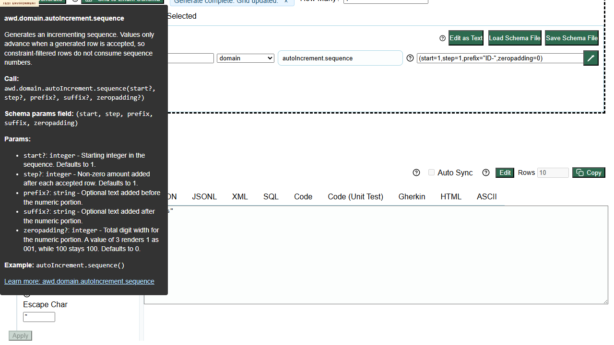

# Defect 006: Stale help tooltips can persist and block `Generate`

## Summary

After switching methods and opening more than one help surface in `app.html`, stale tooltips can remain visible and one can intercept pointer events, blocking the first `Generate` click until manually dismissed.

## Environment

- App under test: `https://eviltester.github.io/grid-table-editor/app.html`

## Steps To Reproduce

1. Open `https://eviltester.github.io/grid-table-editor/app.html`.
2. Open schema help for `regex`.
3. Switch the row method away from `regex` to `domain`.
4. Open domain command help.
5. Continue editing params and attempt to click `Generate`.

## Expected

Old help overlays should close or be replaced as the workflow context changes, and they should not block primary actions like `Generate`.

## Actual

Old and new help overlays can remain visible together, and a lingering tooltip can intercept the first `Generate` click until dismissed with `Escape`.

## Repeatability

- Observed as repeatable enough to treat as a defect candidate

## Evidence

- Screenshot: 
- Supporting log: [../ux-regression-test-log.md](../ux-regression-test-log.md)

## Notes

- The same UX pass still confirmed that the core positive flow works once the tooltip is dismissed, so this is an interruption defect rather than a complete workflow outage.
