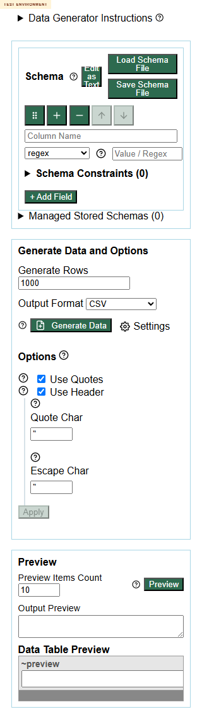

# Defect 008: `Edit as Text` button becomes illegible at `320x568`

## Summary

At `320x568`, the `Edit as Text` button in `generator.html` shrinks enough that the label wraps into an unreadable stacked fragment.

## Environment

- Page under test: `https://eviltester.github.io/grid-table-editor/generator.html`
- Viewport used in evidence: `320x568`

## Steps To Reproduce

1. Open `https://eviltester.github.io/grid-table-editor/generator.html`.
2. Resize to `320x568`.
3. Inspect the `Edit as Text` button in the schema panel.

## Expected

The button label should remain readable, or the layout should adapt so the control keeps a usable text label.

## Actual

The button compresses into a very small square and the label wraps into an unreadable vertical fragment beside the neighboring file buttons.

## Repeatability

- Repeatable

## Evidence

- Screenshot: 
- Supporting log: [../responsive-accessibility-test-log.md](../responsive-accessibility-test-log.md)

## Notes

- The responsive pass did not find horizontal overflow here, so this is a legibility and control-density defect rather than a page overflow defect.
