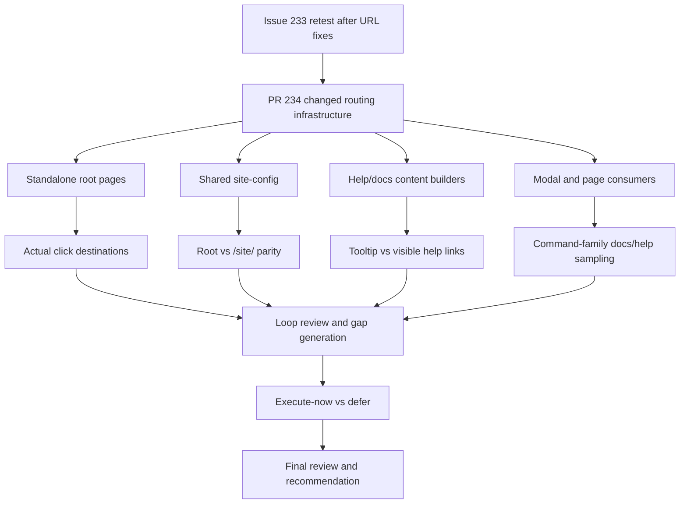

# Issue 233 Retest Report

## Executive Summary

This is a fresh multi-agent exploratory retest of issue #233 and PR #234 against the deployed test environment after the URL fixes.

The PR surface is now broader than the earlier session because it includes shared site-config generation, root-page placeholder rewriting, inline help content changes, help-model URL generation, modal/help consumers, and testenv build-time overrides. Because of that, this retest treats broad command/help/docs coverage as mandatory rather than assuming a small surgical fix.

Browser interaction has been confirmed in a live Playwright session, and this session will treat actual click destinations and resulting browser URLs as the primary routing oracle.

The previously disputed Regex help-link issue does not reproduce in this retest. The visible Regex help links on `generator.html`, `site/generator.html`, `site/app.html`, and `writer-schema.html` now resolve to the nested docs URL under `/site/docs/test-data/regex-test-data`.

The changes do not yet look acceptable for the full story because broader consistency problems remain. The strongest confirmed defects are:

- visible `anywaydata.com` links still shown in the published `Web UI` docs page
- `anywaydata.com` still exposed in canonical and analytics metadata across multiple deployed pages
- published command examples that do not work at runtime
- malformed reversed-bounds commands that report success but generate `**ERROR**`
- keyboard-inaccessible help-popup links and tooltip/help UX regressions

## Scope And References

- Story: [Issue #233](https://github.com/eviltester/grid-table-editor/issues/233)
- Pull request: [PR #234](https://github.com/eviltester/grid-table-editor/pull/234)
- Test environment: [Published test environment](https://eviltester.github.io/grid-table-editor/)
- Session prompt: [issue-233-session-goal-prompt.md](issue-233-session-goal-prompt.md)
- Main log: [issue-233-test-log.md](issue-233-test-log.md)

## Planning Summary

### Scope Summary Of The Story And PR

Issue #233 requires owned docs/help/blog navigation in the deployed test environment to stay inside the GitHub Pages testenv rather than leaking to production or escaping the nested `/site/` mount.

PR #234 now changes the routing model across multiple layers:

- standalone root HTML link placeholders
- shared site-config URL construction
- inline help HTML content
- shared help-model docs links
- testenv build-time overrides
- multiple app pages and modal/help consumers

### Risk Analysis Based On The Actual PR Changes

- High risk: multiple URL-building seams now exist, so root pages, tooltip help, visible help links, and modal docs links may still disagree.
- High risk: shared site-config may fix some consumers while leaving others on legacy link construction.
- High risk: the changed command/help surfaces span many command families, so representative family breadth is still required.
- Medium risk: nested `/site/` pages may behave differently from root pages because relative links can resolve differently there.
- Medium risk: testenv-only pages such as `writer-schema.html`, `webmcp.html`, and `combinatorial.html` may drift from the main app and generator.

### Changed-Surface Inventory Derived From The PR

- Root and standalone entrypoints:
  - `apps/web/app.html`
  - `apps/web/generator.html`
  - `apps/web/combinatorial.html`
  - `apps/web/index.html`
  - `apps/web/webmcp.html`
- Shared site-config infrastructure:
  - `apps/web/site-config-html.mjs`
  - `packages/core-ui/js/site/site-config-core.js`
  - `packages/core-ui/js/site/site-config.production.js`
- Shared help/docs generation:
  - `packages/core-ui/js/help/inline-help-content.js`
  - `packages/core-ui/js/help/help-tooltips.js`
  - `packages/core-ui/js/gui_components/shared/test-data/help/help-model-builder.js`
  - `packages/core-ui/js/gui_components/shared/domain-command-help-metadata.js`
- Shared UI consumers:
  - method picker
  - params editor
  - generator controls
  - test-data population toolbar
- Testenv build wiring:
  - `scripts/create-testenv.mjs`

### Command Coverage Strategy

This retest will sample representative command families through both runtime behavior and docs/help flows. Coverage will explicitly include:

- domain command families
- faker/helper commands
- newly added commands
- removed/deprecated commands
- validator-oriented commands
- structured/constrained parameter examples
- commands with multiple examples in docs/help

The primary oracles will be:

- actual clicked destination URLs
- resulting tab URLs after link activation
- consistency between visible help links, tooltip links, and picker/docs links
- parity between root pages, nested `/site/` pages, and testenv-only pages

### Delegation Map

- Main agent:
  - planning, loop orchestration, synthesis, defect packaging, final report, PDF
- Required subagents:
  - command coverage and example execution
  - negative validation and malformed parameter testing
  - docs/help/content consistency
  - UX/workflow regression
  - responsive/mobile and accessibility review
- Additional gap subagent:
  - cross-surface root/site/testenv-page routing consistency
- Active subagents in this session:
  - `Erdos`: command coverage and example execution
  - `Jason`: negative validation and malformed parameter testing
  - `Anscombe`: docs/help/content consistency
  - `Mill`: UX/workflow regression
  - `Copernicus`: responsive/mobile and accessibility review
  - `Galileo`: cross-surface routing consistency

### Model-Based Coverage Diagram

### Loop Strategy

- Loop 1:
  - planning, broad coverage, delegated passes, first findings
- Loop 2:
  - review all evidence
  - generate at least 10 new ideas
  - classify `execute-now` vs `defer`
  - run all `execute-now`
- Loop 3:
  - repeat the same expansion and gap-closing process
- Continue beyond Loop 3 only if recent loops still produce materially new information
- Final review loop:
  - explicit re-read of story, PR, logs, coverage, defects, gaps
  - generate at least 10 more ideas
  - execute all `execute-now`
  - then render the PDF

## Techniques And Heuristics Used

- exploratory testing
- risk-based testing
- documentation testing
- consistency/oracle checking
- equivalence partitioning
- boundary analysis
- negative testing
- state/flow modeling
- pairwise thinking
- responsive heuristics
- accessibility heuristics

## Coverage Tracking

### Command Families Sampled

- Confirmed positive samples so far:
  - regex
  - enum
  - literal
  - domain-style `person.fullName`
  - `autoIncrement.timestamp(...)`
  - structured `number.int({...})`
  - comments and blank lines
  - age-based conditional constraint
- Docs-sourced mismatch samples so far:
  - `location.cardinalDirection(abbreviated=true)`
  - `helpers.fake(...)`
  - `helpers.mustache(...)`

### Docs Surfaces Reviewed

- Issue `#233`
- PR `#234`
- root landing page
- `site/` landing page
- `site/docs/test-data/test-data-generation`
- regex docs page
- schema definition docs page
- domain overview docs page
- faker overview docs page
- `site/docs/interfaces-and-deployment/web-ui`
- `site/docs/interfaces-and-deployment/cli-node-and-bun`
- `site/docs/data-formats/csv/options`
- `site/docs/test-data/generate-to-file`
- nested docs shell header/footer/navigation behavior on sampled pages

### Workflow Areas Reviewed

- root navigation into app
- generator schema help links
- shared schema editor regex help surface
- docs-sourced example execution in generator
- app text-mode schema generation
- app row-mode validation feedback
- app help popups and tooltip behavior
- generator preview and stored-schema behavior
- keyboard-only navigation on app/generator/docs pages
- responsive/mobile behavior on root, app, generator, and docs pages

### Cross-Surface Pages Reviewed

- `/`
- `/app.html`
- `/generator.html`
- `/combinatorial.html`
- `/webmcp.html`
- `/writer-schema.html`
- `/site/`
- `/site/app.html`
- `/site/generator.html`
- `/site/docs/interfaces-and-deployment/web-ui`
- `/site/docs/test-data/regex-test-data/`
- `/site/docs/test-data/faker-test-data/`
- `/site/docs/test-data/domain/domain-test-data/`

## Loop Tracking

- Loop 1: completed
- Loop 2: completed
- Loop 3: completed
- Final review loop: completed

## Loops Performed

### Loop 1

- Planned from the actual PR changed surface and the story wording, then executed broad routing/help/docs sampling with six delegated subagents.
- Confirmed the Regex help-link fix across the sampled pages.
- Found broader remaining defects in metadata leakage, docs content leakage, command-example drift, negative validation, accessibility, and UX.

### Loop 2

- Reviewed the first-pass evidence and generated a targeted 10-idea list.
- Executed the `execute-now` ideas around visible docs leaks, metadata leaks, mixed-scope `site/app.html` navigation, reversed temporal bounds, duplicate keywords, and row-mode versus text-mode diagnostics.
- Strengthened the defect model enough to split the findings into individual defect files.

### Loop 3

- Focused on nested docs-shell consistency and remaining routing edges.
- Confirmed the docs shell itself is internally nested-site-safe in the sampled pages.
- Confirmed the mixed-scope navigation problem is localized to `site/app.html` rather than the sampled docs shell pages.
- Confirmed that recent passes were mostly reinforcing known defect families rather than opening new ones.

### Final Review Loop

- Re-read the issue, PR summary, logs, coverage, sampled command families, docs pages, examples tried, defect drafts, and remaining gaps.
- Generated and executed another targeted set of high-signal consistency checks before stopping.
- Stopped only after broad coverage had been demonstrated and recent passes were mostly yielding reinforcing detail instead of new categories.

## Findings

### Confirmed Defects

- [Defect 001: Web UI docs page still points hosted quick-start links at `anywaydata.com`](defects/defect-001-visible-web-ui-docs-hosted-links-point-to-anywaydata.md)
- [Defect 002: Testenv pages still publish `anywaydata.com` canonical and analytics URLs](defects/defect-002-testenv-pages-still-publish-anywaydata-canonical-and-analytics-urls.md)
- [Defect 003: Published domain and faker examples do not match runtime behavior](defects/defect-003-published-domain-and-faker-doc-examples-do-not-match-runtime.md)
- [Defect 004: Invalid numeric bounds report success but generate `**ERROR**`](defects/defect-004-invalid-number-bounds-report-success-but-generate-error-cell.md)
- [Defect 005: Visible help popup links are not keyboard reachable](defects/defect-005-help-popup-links-are-not-keyboard-reachable.md)
- [Defect 006: Stale help tooltips can persist and block `Generate`](defects/defect-006-stale-help-tooltips-can-block-generate.md)
- [Defect 007: Narrow-width generator focus order breaks before visible row controls](defects/defect-007-generator-mobile-focus-order-breaks-before-visible-row-controls.md)
- [Defect 008: `Edit as Text` button becomes illegible at `320x568`](defects/defect-008-generator-edit-as-text-button-becomes-illegible-at-320x568.md)
- [Defect 009: Text-mode validation feedback is much weaker than row mode](defects/defect-009-text-mode-validation-feedback-is-much-weaker-than-row-mode.md)

Useful visual evidence:

### Suspicious Behaviors And Risks

- Multiple routing seams now exist, so partial fixes and cross-surface drift remain a live risk until broad actual-click evidence says otherwise.
- Docs/help/runtime consistency is still at risk because at least one docs-sourced domain example and two faker/helper examples were rejected by runtime validation during Loop 1 command execution.
- `site/app.html` is a mixed-scope shell: it keeps `Docs` and `Blog` inside `/site/`, but its brand and `Generator` links route back to root pages. This may be intentional, but it creates a visibly inconsistent nested-site experience and deserves design follow-up.
- Standalone `generator.html` showed suspicious stale-state behavior around `Managed Stored Schemas` and preview sync, but this was not isolated strongly enough in this retest to promote beyond a follow-up risk.

### Deferred Ideas

- empty required values in structured parameters such as `finance.iban(formatted=true, countryCode=)`
- trailing commas and whitespace-heavy syntax variants
- export/copy behavior after `**ERROR**` values are generated
- larger mixed-validity schemas
- high-zoom and landscape-mobile accessibility checks
- deeper screen-reader-specific help-popup checks
- broader positive coverage for finance/date control examples
- dedicated stored-schema and stale-preview workflow investigation

### What Was Not Covered And Why

- No local build, verify, or repo test commands were run because the session was constrained to the deployed environment only.
- The session did not exhaustively sample every changed command family; instead it used broad representative sampling across domain, faker/helper, regex, enum, literal, auto-increment, structured params, constraints, and docs-linked examples.
- Some deeper mobile and screen-reader checks were deferred because recent loops were mostly reinforcing already confirmed defect families rather than discovering new categories.

## Recommendation

The visible Regex help-link fix appears to be in place, but the overall story should not yet be considered fully acceptable.

The main reason is scope alignment with issue `#233`: the deployed test environment still exposes `anywaydata.com` in both visible docs content and hidden-but-delivered metadata. On top of that, the changed command/help surface still has runtime mismatches, misleading validation outcomes, and accessibility/UX regressions that are all reachable in the deployed environment.
