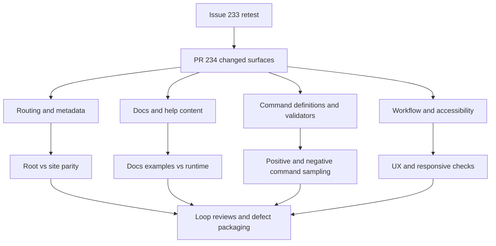

# Issue 233 Retest Report

## Executive Summary

This is a fresh 2026-06-22 multi-agent exploratory retest of issue #233 and PR #234 against the deployed test environment.

This session treats actual clicked destinations, resulting browser URLs, and visible runtime behavior as the primary routing and behavior oracles. It also treats the latest issue comments as verify-after-fix guidance, because several findings from prior reviews were explicitly called out as fixed, accepted, or intentionally allowed.

## Scope And References

- Story: [Issue #233](https://github.com/eviltester/grid-table-editor/issues/233)
- Pull request: [PR #234](https://github.com/eviltester/grid-table-editor/pull/234)
- Test environment: [Published test environment](https://eviltester.github.io/grid-table-editor/)
- Session prompt: [issue-233-session-goal-prompt.md](issue-233-session-goal-prompt.md)
- Main log: [issue-233-test-log.md](issue-233-test-log.md)

## Planning Summary

### Scope Summary Of The Story And PR

Issue `#233` is about deployed test-environment link consistency: the testenv should keep users and AI tooling inside the GitHub Pages environment and nested docs path where appropriate, rather than leaking to inconsistent or incorrect destinations.

PR `#234` has expanded since the earlier review and now covers two broad areas:

- testenv/runtime/docs link generation and routing consistency
- domain keyword-argument validation for ordered bounds across multiple command families

The issue comments also change the retest shape:

- the earlier pre-JS Regex-link report was explicitly called out as invalid and the implementation was changed to generate the correct URLs earlier in the pipeline
- the quick-start hosted links in the docs were explicitly called out as acceptable production guidance
- the stale `abbreviated` examples were said to be amended
- the reversed-bounds false-success behavior was explicitly accepted as a real issue needing a fix
- the keyboard reachability of help-popup links was explicitly accepted as needing investigation

### Risk Analysis Based On The Actual PR Changes

- High risk: the PR now spans both routing/help seams and command validator behavior, so narrow link-only sampling would miss meaningful regressions.
- High risk: shared site-config and build-time substitution affect root pages, nested `/site/` pages, help content, docs URLs, and testenv generation, so cross-surface drift is still possible.
- High risk: the new ordered-bounds validators touch multiple domain families such as date, finance, location, and number keywords, so representative family breadth is mandatory.
- Medium risk: issue comments say some earlier findings were intentionally allowed or already fixed, so this retest has to distinguish true regressions from accepted behavior.
- Medium risk: help/tooltip behavior changed again, including “hide other open tippies”, so UX/accessibility regressions need explicit retesting rather than being inferred from older sessions.
- Medium risk: text mode and row mode may surface different validation quality for the same malformed command, which can hide defects if only one editing mode is sampled.

### Changed-Surface Inventory Derived From The PR

- Root and standalone entrypoints:
  - `apps/web/app.html`
  - `apps/web/generator.html`
  - `apps/web/combinatorial.html`
  - `apps/web/index.html`
  - `apps/web/webmcp.html`
- Shared site-config and testenv generation:
  - `apps/web/site-config-html.mjs`
  - `apps/web/vite.config.mjs`
  - `packages/core-ui/js/site/site-config-core.js`
  - `packages/core-ui/js/site/site-config.production.js`
  - `scripts/create-testenv.mjs`
- Shared help/docs consumers:
  - `packages/core-ui/js/help/help-tooltips.js`
  - `packages/core-ui/js/help/inline-help-content.js`
  - `packages/core-ui/js/gui_components/shared/test-data/help/help-model-builder.js`
  - `packages/core-ui/js/gui_components/shared/domain-command-help-metadata.js`
  - method picker and params editor modal seams
  - generator controls
  - test-data population toolbar
- New validator-oriented domain surfaces:
  - `packages/core/js/domain/domain-keyword-arg-validators.js`
  - `packages/core/js/domain/domain-keywords.js`
  - ordered-bounds keyword definitions across date, finance, location, and number families
- Regression tests added in the PR indicate the intended behavioral seams:
  - shared row validation
  - end-to-end generation service
  - schema rules adapter
  - cross-surface integration parity
  - help tooltip behavior

### Command Coverage Strategy

This retest will cover both runtime routing/help behavior and command-definition behavior. Command-family sampling will explicitly include:

- positive examples from domain, faker/helper, regex, enum, literal, auto-increment, and structured-parameter families
- negative examples for malformed parameters, duplicate keywords, reversed bounds, stale docs examples, and unsupported syntax shapes
- validators and ordered-bounds coverage across multiple families, not just one representative keyword
- row-mode and text-mode comparison where feedback quality is a risk

Primary oracles:

- actual clicked destinations and resulting browser URLs
- visible runtime generation behavior and validation messages
- parity between docs examples, help/picker examples, and actual runtime behavior
- consistency between root pages, nested `/site/` pages, and shared editor/help surfaces

Explicit verify-after-fix focus from issue comments:

- Regex/help links should now be correct without waiting for page-load rewriting
- only one tippy should remain open at a time
- quick-start hosted docs links are informative but not by themselves a defect
- stale `abbreviated` examples should no longer be presented as valid
- reversed-bounds commands should now be rejected instead of producing false-success behavior
- keyboard reachability of help-popup links still needs investigation

### Delegation Map

- Main agent:
  - planning, loop orchestration, synthesis, defect packaging, full-content collation, PDFs, and final recommendation
- Required subagents:
  - command coverage and example execution
  - negative validation and malformed parameter testing
  - docs/help/content consistency across app and published docs
  - UX/usability and workflow regression
  - responsive/mobile and accessibility review
- Additional gap subagent:
  - cross-surface routing consistency and verify-after-fix routing checks

Planned fresh subagent ownership:

- command coverage: broad positive sampling and docs-example execution
- negative validation: malformed parameters, validators, row-mode vs text-mode diagnostics, reversed-bounds retest
- docs consistency: published docs pages, in-app help, stale/removed examples, accepted-vs-defect content boundaries
- UX regression: tippy behavior, generation workflow, method picker, params editor, preview trust
- responsive/accessibility: keyboard reachability, focus order, mobile legibility, popup interaction
- routing consistency: root/site/page parity, nested docs-shell routing, shared editor help routes

### Model-Based Coverage Diagram

### Loop Strategy

- Loop 1:
  - finalize planning from the current PR and issue comments
  - run broad fresh sampling through the deployed environment
  - record first findings and immediate gaps
- Loop 2:
  - review all logs and coverage
  - generate at least 10 new ideas
  - classify `execute-now` vs `defer`
  - execute every `execute-now` idea
- Loop 3:
  - repeat the same review and gap-closing cycle with at least 10 more ideas
- Final review loop:
  - re-read the story, PR, logs, coverage, sampled command families, docs pages, examples, defect set, and remaining gaps
  - generate at least 10 more ideas
  - execute all `execute-now`
  - only then generate the PDFs and stop

## Techniques And Heuristics Used

- exploratory testing
- risk-based testing
- documentation testing
- consistency/oracle checking
- equivalence partitioning
- boundary analysis
- negative testing
- state/flow modeling
- pairwise thinking
- responsive heuristics
- accessibility heuristics

## Coverage Tracking

### Command Families Sampled

- `regex` help routing on standalone and nested generator surfaces
- subagent-confirmed `faker.helpers.arrayElement` method-picker/details flow
- subagent-confirmed `domain.internet.httpMethod` picker and params-editor flow
- docs-derived domain coverage sampled across `person`, `internet`, `location`, `date`, `finance`, and `number`
- negative validation sampled for ordered-bounds, duplicate named args, bare values, and helper/domain boundary errors
- UI/help surfaces reviewed for `enum`, `literal`, and `regex` presence, with direct runtime route checks on regex help

### Docs Surfaces Reviewed

- `site/docs/test-data/regex-test-data/`
- top-level test environment landing page
- visible docs/help destinations exposed from standalone and nested generator surfaces
- `site/docs/test-data/test-data-generation`
- `site/docs/test-data/method-picker-ui-spec`
- `site/docs/test-data/faker-test-data`
- domain docs under `site/docs/test-data/domain/` including `date`, `finance`, `location`, and `number`
- deployed Faker Helpers docs page used for negative example checks

### Workflow Areas Reviewed

- standalone generator initial schema row and Regex help flow
- nested site generator initial schema row and Regex help flow
- nested docs-to-app navigation
- writer-schema page load and shared schema editor reachability
- method picker category switching, details pane content, and command docs affordances
- params editor launch for `awd.domain.internet.httpMethod`
- sequential generator help/tippy interactions
- text-mode negative validation execution
- row-mode vs text-mode params comparison for `date.between`
- keyboard traversal through shared help popups

### Cross-Surface Pages Reviewed

- `/`
- `/generator.html`
- `/app.html`
- `/site/generator.html`
- `/site/docs/test-data/regex-test-data/`
- `/site/app.html`
- `/site/`
- `/writer-schema.html`

## Loop Tracking

- Loop 1: completed
- Loop 2: completed
- Loop 3: completed
- Final review loop: completed

### What Changed After Each Loop

- Loop 1:
  - disproved the old pre-JS Regex/help route concern in the current runtime
  - confirmed the single-active-tippy behavior in the exercised generator help flows
  - confirmed text-mode ordered-bounds validation
  - confirmed the help-popup keyboard reachability defect
  - identified the row-mode/text-mode params inconsistency
- Loop 2:
  - widened nested `/site/` route coverage across `site/`, `site/blog`, `site/privacy`, and the published `Method Picker UI Spec`
  - confirmed the nested site shell is broadly routing correctly
  - found the public blog-listing frontmatter-rendering defect
- Loop 3:
  - strengthened the blog defect by reproducing it on the individual post page
  - invalidated the earlier `domain.helpers.arrayElement(...)` false-positive by directly checking the live Faker Helpers page
  - confirmed the live `Faker Helpers` route is not a `404`
- Final review loop:
  - confirmed `site/about` and `site/contact` route correctly under the nested site shell
  - confirmed the helpers-page false positive was invalid and removed it from the defect set
  - confirmed the blog frontmatter-rendering issue on the individual post page as well as the blog listing

## Findings

### Confirmed Defects

- [Defect 001: Help Popup Links And Buttons Are Not Keyboard Reachable](defects/defect-001-help-popup-keyboard-reachability.md)
- [Defect 003: Row-Mode Domain Params Behave Inconsistently Compared With Text Mode](defects/defect-003-row-mode-domain-params-inconsistent-validation.md)
- [Defect 004: Site Blog Listing Renders Frontmatter As Visible Article Content](defects/defect-004-blog-listing-shows-frontmatter.md)

### Suspicious Behaviors And Risks

- One transient `ERR_CONNECTION_RESET` occurred when opening `site/` from the root card, but direct navigation to the same nested site surfaces then worked. This is currently treated as an environment/network flake rather than a confirmed product defect unless it becomes repeatable in later loops.
- A subagent observed one console error on the landing page initial load but did not yet isolate it. This is a follow-up risk, not a confirmed defect.
- `writer-schema.html` did not expose the Writer API flow in this browser session because the page reported Writer API unavailable. This limited that surface to structure/responsive/shared-editor checks rather than end-to-end AI generation coverage.
- Published faker docs still foreground `faker.location.cardinalDirection({ abbreviated: true })` while the live picker/help surfaces present the domain command `location.cardinalDirection` as the current oracle for that concept. This looks like docs drift, but it was not yet executed end to end in runtime.
- The Faker Helpers page itself is not currently a defect for `domain.helpers.arrayElement(...)`: Loop 3 confirmed the page now presents that form inside an explicit `Do not use` warning block rather than as a recommended example.

### Deferred Ideas

- Execute `faker.location.cardinalDirection({ abbreviated: true })` end to end against runtime behavior.
- Isolate the landing-page console error.
- Recheck `target="_blank"` help-link tab creation in a browser path that exposes new tabs more reliably.
- Extend row-mode validator parity checks to additional commands such as `number.int` and `finance.iban`.
- Inspect Storybook shared help/docs anchors.
- Compare embedded `app.html` picker behavior against generator for the same faker/domain commands.

### What Was Not Covered And Why

- Full Writer API generation on `writer-schema.html` was blocked because the page reported Writer API unavailable in this browser session.
- Some browser-path-specific checks were deferred because Playwright and alternate browser attachments did not expose all new-tab/console behaviors equally reliably in this session.
- End-to-end runtime execution of the published direct faker `abbreviated` example was deferred to avoid spending the final loop on a lower-yield path after broader coverage had already been achieved.
- Storybook and deeper auxiliary-surface spot checks were deferred once the main changed surfaces had broad enough coverage and later loops were mostly confirming edge cases rather than exposing new major areas.

## Recommendation

The routing and link-generation goals of issue `#233` and the shared help-route fixes in PR `#234` look largely successful in the current deployed environment. The earlier pre-JS Regex/help concern does not reproduce, nested `/site/...` routes are broadly healthy, and the exercised single-active-tippy behavior is working.

The current deployed changes do not look fully acceptable to close out the review yet because there are still confirmed user-visible issues:

- help popup links/buttons are not keyboard reachable on shared help flows
- row-mode domain params can diverge from text-mode validation and hide the real ordered-bounds error
- the nested site blog renders frontmatter metadata as public content on both the listing and the individual post page

If the team is deciding specifically on the original URL-fix goal, that part looks good. If the decision is on the broader current PR surface, I would recommend follow-up fixes for the confirmed accessibility, row-mode validation, and blog-content defects before calling the full change set acceptable.
