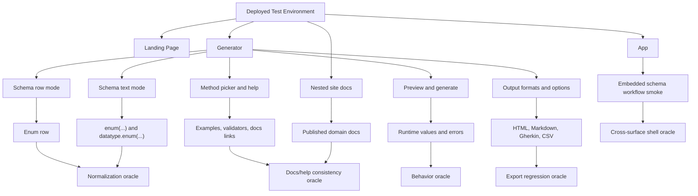
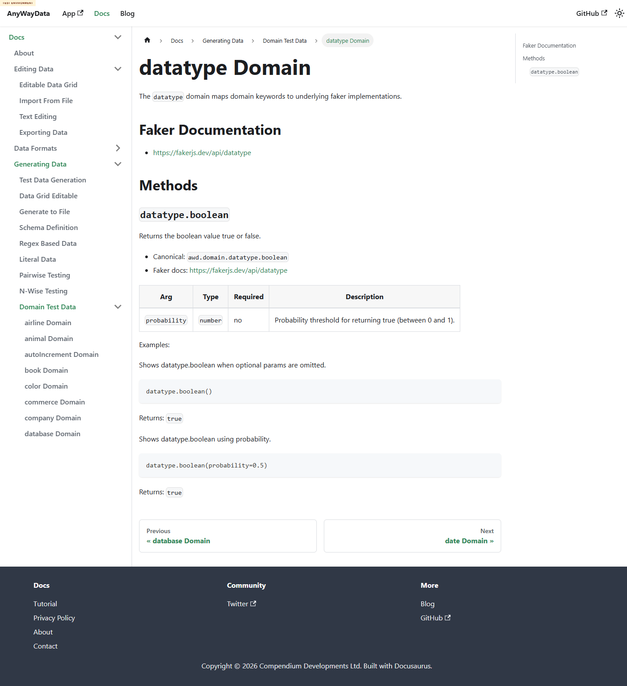
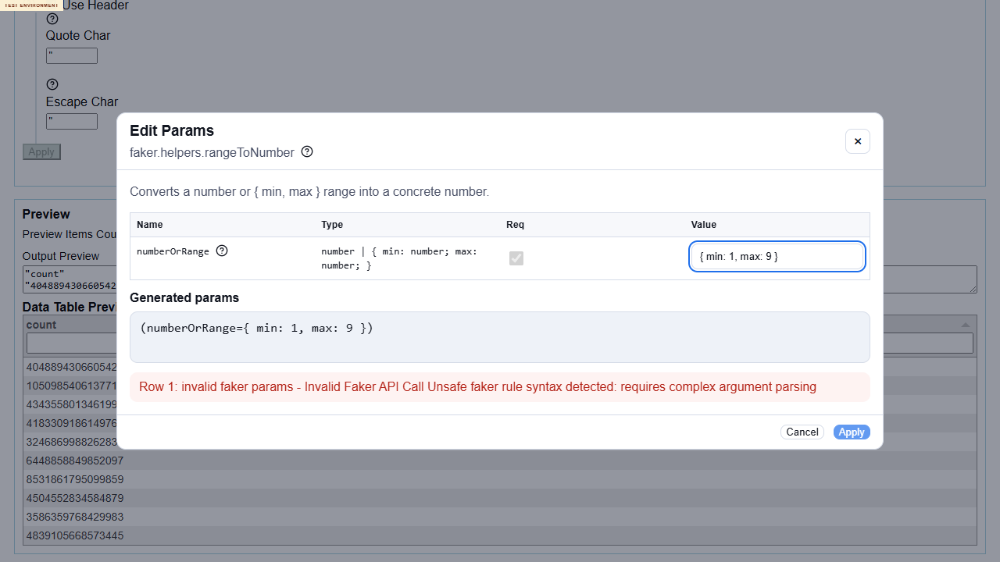
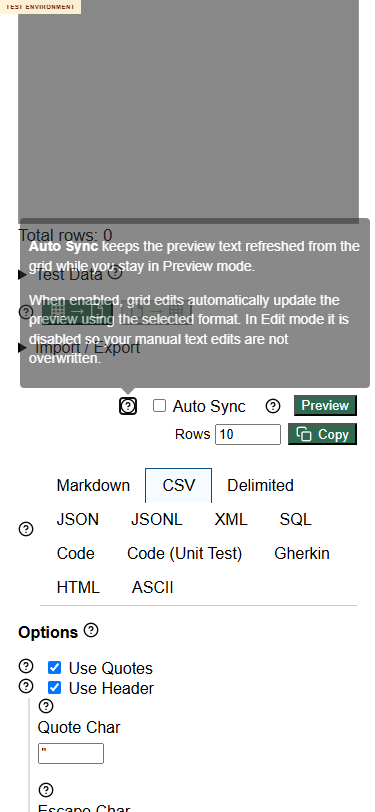

# Issue 228 / PR 243 Deployed Exploratory Review

## Executive Summary

This is a fresh 2026-06-24 multi-agent exploratory review of issue `#228` and PR `#243` against the deployed test environment only.

This session treats the deployed GitHub Pages runtime as the test oracle for interactive behavior, while also sampling the broader command-definition/help surfaces present on the same deployed branch because the user explicitly required wide command-family coverage beyond the new enum path alone.

## Scope And References

- Story: [Issue #228](https://github.com/eviltester/grid-table-editor/issues/228)
- Primary PR under review: [PR #243](https://github.com/eviltester/grid-table-editor/pull/243)
- User-provided related PR link kept for mismatch tracking: [PR #231](https://github.com/eviltester/grid-table-editor/pull/231)
- Deployed test environment: [Published test environment](https://eviltester.github.io/grid-table-editor/)
- Session prompt: [issue-228-session-goal-prompt.md](issue-228-session-goal-prompt.md)
- Main log: [issue-228-test-log.md](issue-228-test-log.md)

The request text and pasted PR link disagree. This review treats issue `#228` plus PR `#243` as the primary target because PR `#243` explicitly closes issue `#228`. The pasted PR `#231` is still relevant background because the deployed branch includes broad command-definition and help-surface changes that the user wants covered.

## Planning Summary

### Scope Summary Of The Story And PR

Issue `#228` describes an effort to improve command definition maintenance by merging command definitions and help metadata so the system relies less on duplicated standalone metadata structures.

PR `#243` implements that work through a narrower but high-impact runtime seam: enum handling is normalized into the shared domain-command execution model via `datatype.enum`, while preserving canonical emitted schema text and removing broad redundant page-parity fixtures in favor of runtime coverage and focused page smoke suites.

For this deployed-only review, the practical runtime scope is broader than the raw PR summary:

- enum entry and normalization across row mode, text mode, schema parsing, preview, and generation
- shared domain command/help metadata exposure in the UI
- command picker/help/docs surfaces on the deployed branch, including broader command-definition changes already present in this build
- export and rendering surfaces that received enum-related regression coverage in the PR
- workflow confidence after the matrix rationalization removed wide app-vs-generator parity fixtures

### Risk Analysis Based On The Actual PR Changes

- High risk: enum behavior now crosses compiler, parser, schema editor, generator, validation, and render/export seams, so a defect can surface as inconsistent behavior rather than a simple hard failure.
- High risk: `datatype.enum` is meant to normalize multiple public spellings and input shapes, which creates ambiguity risks around accepted syntax, displayed syntax, and saved syntax.
- High risk: the UI now depends on shared domain-command metadata rather than synthetic help fallbacks, so app help, method-picker content, docs links, and runtime behavior can drift together or fail together.
- High risk: the deployed branch also contains prior wide command-definition/help changes, and the user explicitly requires broad sampling across command families, validators, structured params, removed commands, and multi-example docs.
- Medium risk: matrix rationalization removed broad parity artifacts, which increases the importance of exploratory cross-surface checks between app, generator, row mode, text mode, and exported output.
- Medium risk: enum-like detection heuristics can misclassify comma-separated text, parenthesized values, or command-looking strings, especially when switching editing modes or using structured params.
- Medium risk: docs/help may present examples that look valid in one surface but not another because the branch merges newer help-definition content with current deployed UI affordances.

### Changed-Surface Inventory Derived From The PR

- Shared command/help metadata and command-list seams:
  - `packages/core-ui/js/gui_components/shared/domain-command-help-metadata.js`
  - `packages/core-ui/js/gui_components/shared/domain-commands.js`
  - `packages/core/js/domain/domain-command-metadata.js`
  - `packages/core/js/domain/domain-keywords.js`
- Schema row parsing, mapping, normalization, and runtime counting:
  - `packages/core-ui/js/gui_components/shared/schema-row-rule-mapper.js`
  - `packages/core-ui/js/gui_components/shared/test-data/schema/schema-row-mapper.js`
  - `packages/core-ui/js/gui_components/shared/test-data/schema/schema-runtime.js`
- Generation and rule compilation seams:
  - `packages/core-ui/js/gui_components/shared/test-data/generation/generation-controller.js`
  - `packages/core/js/data_generation/testDataRulesCompiler.js`
  - `packages/core/js/data_generation/schema-rules-adapter.js`
  - `packages/core/js/data_generation/rulesParser.js`
  - `packages/core/js/data_generation/schema-conversion.js`
  - `packages/core/js/data_generation/schema-constraint-validator.js`
- New enum-specific shared logic:
  - `packages/core/js/data_generation/utils/enumParser.js`
  - `packages/core/js/data_generation/utils/enum-rule-detection.js`
  - `packages/core/js/data_generation/enum/enumTestDataRuleValidator.js`
  - `packages/core/js/keywords/domain/datatype/datatype-enum.js`
  - `packages/core/js/keywords/domain/datatype/enum-keyword-definition.js`
- Page and workflow confidence seams implied by changed tests:
  - app/generator schema interaction smoke suites
  - shared generation controller and schema runtime tests
  - params editor and shared schema-definition view tests
  - export-string conversion tests for HTML, Markdown, and Gherkin
- Non-runtime but test-shaping documentation change:
  - `docs/frontend-ui-matrix-rationalization-plan.md`

### Command Coverage Strategy

The user explicitly required broad command-definition coverage, and the deployed branch contains both the current enum refactor and earlier help-definition changes. Coverage will therefore combine issue-focused enum work with breadth sampling across changed command/help behavior.

Primary command-family sampling targets:

- enum and `datatype.enum` surfaces:
  - row mode enum rows
  - domain-command rows using `datatype.enum`
  - text-mode authored `enum(...)`, `enum value1,value2`, and `datatype.enum(...)`
- domain command families with structured or constrained params:
  - `date`, `number`, `internet`, `commerce`, and `datatype`
- faker/helper families with explicit usage examples and validators:
  - helper commands, representative faker families, and constrained params where the UI exposes guidance
- removed/deprecated or previously changed surfaces:
  - hidden/removed commands such as `image.urlLoremFlickr`
  - commands with richer example/help rendering in the picker
- docs/help/runtime consistency checks:
  - published docs pages
  - in-app help links
  - method-picker examples
  - actual runtime generation behavior

Positive and negative sampling rules:

- try both default examples and parameterized examples where available
- compare row mode and text mode for the same command family when normalization risk exists
- probe malformed enum shapes, malformed structured params, missing params, and unexpected spellings
- explicitly record which command families were sampled, which were deferred, and why

### Delegation Map

- Main agent:
  - plan from issue/PR surfaces
  - orchestrate loops
  - perform cross-lane rechecks
  - package defects
  - collate logs and PDFs
- Required subagents:
  - command coverage and example execution
  - negative validation and malformed parameter testing
  - docs/help/content consistency across app and published docs
  - UX/usability and workflow regression
  - responsive/mobile and accessibility review
- Additional gap subagent:
  - enum cross-surface normalization and export/workflow regression

Planned ownership:

- `command-coverage-test-log.md`: broad positive sampling across domain, faker/helper, removed/deprecated, and multi-example command families
- `negative-validation-test-log.md`: malformed params, validators, syntax variants, and error-message quality
- `docs-consistency-test-log.md`: published docs pages, in-app help, picker/help examples, stale or missing content
- `ux-regression-test-log.md`: generator, method-picker, params editor, help flows, schema editing, and workflow friction
- `responsive-accessibility-test-log.md`: narrow viewports, keyboarding, focus, semantics, and accessibility heuristics
- `enum-cross-surface-test-log.md`: enum normalization across row mode, text mode, app/generator parity, preview/export, and saved/displayed syntax

### Mermaid Model-Based Coverage Diagram

### Loop Strategy

Loop 1 will establish the planning baseline, prove browser access, execute broad first-pass coverage, and identify the first concrete gaps.

Loop 2 will review all accumulated notes, generate at least 10 new ideas from uncovered command families, docs inconsistencies, negative cases, and cross-surface mismatches, classify each as `execute-now` or `defer`, execute every `execute-now` item, and update the report and main log.

Loop 3 will repeat the same process with another 10 ideas, emphasizing areas still under-sampled after Loop 2 and any patterns emerging from subagent evidence.

If recent loops are still producing genuinely new information, additional loops will continue. A mandatory final review loop will then re-read the story, PR, logs, defects, docs reviewed, command families sampled, and remaining gaps, produce at least 10 more ideas, execute the `execute-now` set, update the report and main log, and only then trigger the final Pandoc PDF generation.

## Delegation Summary

Six delegated lanes are active:

- command coverage and example execution
- negative validation and malformed parameter testing
- docs/help/content consistency
- UX/usability and workflow regression
- responsive/mobile and accessibility review
- enum cross-surface normalization and export/workflow regression

Delegated findings integrated into the final model:

- docs-consistency lane:
  - published method-picker UI spec is ahead of the deployed UI shape
  - nested docs/help links largely resolve correctly
- negative-validation lane:
  - `date.between` row-mode validation is strong for missing params, wrong primitive shape, and reversed bounds
- UX-regression lane:
  - `helpers.rangeToNumber` object params are documented but blocked in the params workflow
- responsive/accessibility lane:
  - collapsed sections leak hidden focus targets into keyboard order on mobile
  - mobile target sizes are uncomfortably small, treated here as a lower-severity risk rather than a primary defect
- enum cross-surface lane:
  - valid enum authoring round-trips to public `enum(...)` text
  - one shorthand text variant fails to parse in generator text mode

## Coverage By Command Family, Docs Surface, And Workflow Area

### Loop 1 Initial Main-Agent Coverage

Command families and surfaces sampled so far:

- enum text-mode syntax:
  - `enum(active,inactive,pending)`
  - `awd.datatype.enum(GET,POST,PUT,PATCH)`
- shared domain-command exposure:
  - generator domain picker visibly contains `datatype.enum`
- docs surface:
  - deployed nested site `datatype` domain page

Early result summary:

- `enum(...)` and `awd.datatype.enum(...)` both generated valid enum-member output in the deployed generator.
- `datatype.enum` is exposed in the generator domain picker.
- the visible deployed datatype docs content did not yet show a visible `datatype.enum` section in the captured accessible tree, which is currently being treated as suspicious pending deeper docs review.
- docs-page console output showed at least one `404` resource failure plus structural issues that may affect docs quality and accessibility.

Currently deferred or pending from the main lane while subagents execute:

- direct row-mode domain-picker selection of `datatype.enum`
- app-shell cross-surface parity beyond generator text mode
- exported-format-specific enum checks
- broader removed/deprecated command sampling
- broader docs-example execution across other command families

## Loops Performed And What Changed After Each Loop

### Loop 1

- Planning, browser proof, and first broad coverage have been completed.
- New information gained in Loop 1:
  - deployed generator interaction is proven
  - enum shorthand and canonical awd-domain enum syntax both execute successfully in text mode
  - the domain picker exposes `datatype.enum`
  - the deployed datatype docs page may lag the runtime surface and emitted structural console issues
- Gaps carried forward from Loop 1:
  - row-mode domain picker workflow needs a follow-up pass
  - docs/help/runtime consistency needs wider command-family sampling
  - command-family breadth still needs the delegated lanes to return

### Loop 2

Loop 2 generated 10 explicit ideas and executed 8 of them. The main theme was to turn the earlier enum/doc suspicions into higher-confidence evidence with cheap, targeted checks.

Loop 2 execute-now ideas completed:

- `datatype.enum(values="GET,POST,PUT")` in generator text mode
- Markdown output sampling for enum data
- row-mode normalization check after authoring named-values domain enum syntax
- fetched HTML verification for deployed datatype docs content
- fetched HTML verification for deployed image docs removal of `urlLoremFlickr`
- fetched HTML verification for deployed internet docs coverage of `internet.httpMethod`, `commonOnly`, and `excludes`
- fetched HTML verification for deployed method-picker UI spec coverage
- quick app-shell console sanity pass

Loop 2 execute-now outcomes:

- runtime enum normalization looks healthy:
  - named-values `datatype.enum(...)` executes in text mode
  - generated Markdown output only contains the authored values
  - switching back to row mode produces a plain `enum` row with `GET,POST,PUT`
- docs/help drift is now stronger evidence:
  - deployed datatype docs are missing `datatype.enum`
  - deployed method-picker UI spec docs are also missing `datatype.enum`
- broader command-definition docs are not uniformly broken:
  - deployed image docs omit removed `urlLoremFlickr`
  - deployed internet docs include `internet.httpMethod` and its documented params
- app-shell help quality still has at least one suspicious console signal:
  - `TODO: Create help for instructions-summary-title`

Loop 2 deferred ideas:

- direct row-mode domain-picker selection workflow for `datatype.enum`
- export-specific HTML/Gherkin enum checks

### Loop 3

Loop 3 generated 10 additional ideas and executed 6 of them, all centered on public-syntax round-tripping and malformed explicit enum handling.

Loop 3 execute-now outcomes:

- valid named-values enum syntax round-trips cleanly:
  - `datatype.enum(values="GET,POST,PUT")` normalizes back to row-mode `enum`
  - switching back to text mode emits public `enum(GET,POST,PUT)`
- malformed explicit enum handling is not safe:
  - `datatype.enum(unclosed` does not raise a validation error
  - preview succeeds and emits the malformed string literally

This loop materially changed the recommendation because it turned a parser-risk hypothesis into a confirmed runtime defect.

### Final Review Loop

The mandatory final review loop re-read:

- issue `#228`
- PR `#243` summary and changed-surface inventory
- the accumulated main and delegated logs
- the coverage model
- sampled command families and docs surfaces
- examples already executed
- confirmed defects and suspicious behaviors
- remaining coverage gaps

The final review loop generated 10 additional ideas, executed the 4 high-value rechecks and synthesis tasks, and deferred narrower follow-ups that no longer changed the release recommendation.

## Test Techniques And Heuristics Used

- exploratory testing
- risk-based testing
- equivalence partitioning
- boundary analysis
- negative testing
- consistency and oracle checking
- state and flow modeling
- pairwise thinking
- accessibility heuristics
- responsive testing heuristics
- documentation testing

## Confirmed Defects

- [defect-001-datatype-enum-missing-from-published-docs.md](defects/defect-001-datatype-enum-missing-from-published-docs.md)
  - runtime and UI expose `datatype.enum`, but key published docs surfaces do not
- [defect-002-malformed-explicit-enum-silently-treated-as-literal.md](defects/defect-002-malformed-explicit-enum-silently-treated-as-literal.md)
  - malformed explicit enum text is accepted and emitted as literal data instead of being rejected
- [defect-003-faker-range-to-number-object-params-blocked.md](defects/defect-003-faker-range-to-number-object-params-blocked.md)
  - faker helper help and params workflow contradict each other
- [defect-004-collapsed-sections-leak-hidden-focus-targets.md](defects/defect-004-collapsed-sections-leak-hidden-focus-targets.md)
  - collapsed mobile app sections leak hidden focus targets into keyboard order

## Suspicious Behaviors And Risks

- The published `Method Picker UI Spec` appears ahead of the deployed UI. The docs describe a richer shared modal picker than the live deployed runtime visibly exposes.
- `app.html` logs `TODO: Create help for instructions-summary-title` in the live console, which suggests a help path is still unfinished or debug-oriented.
- The deployed datatype docs page logged a `favicon.ico` `404` plus structural issues such as interactive elements inside `summary` and Quirks Mode warnings. These are likely broader docs quality concerns rather than issue-228-specific regressions.
- Mobile tap targets are noticeably small across many icon/help controls. This looked real but lower severity than the confirmed hidden-focus defect.

## Deferred Ideas

- direct row-mode domain-picker selection workflow for `datatype.enum`
- full app-side enum authoring parity against generator
- HTML, Gherkin, and additional export-surface enum checks
- broader positive validator-family sampling across finance, location, and number after `date.between`
- deeper screen-reader announcement auditing
- load/save schema file persistence for enum syntax
- wider faker-helper family sweep beyond `helpers.rangeToNumber`

## What Was Not Covered And Why

- Full app/generator parity for enum authoring was only partially covered because the generator provided faster, higher-confidence evidence for the core normalization path and the app surface is denser to automate.
- Export-format parity beyond Markdown was deferred once core parser/docs/accessibility defects were confirmed.
- Direct row-mode domain-picker selection for `datatype.enum` remained partially covered because automation against that picker path was more brittle than text-mode authoring, while text mode already proved the shared normalization behavior.
- A full screen-reader audit was not attempted; the responsive/accessibility lane stayed within browser-MCP heuristics and keyboard checks.

## Final Recommendation

The deployed changes do not look acceptable for the story yet.

The strongest blockers are:

- malformed explicit enum syntax is silently treated as literal generated data
- `datatype.enum` is exposed in runtime but missing from important published docs surfaces
- the faker helper params workflow contradicts its own help for `helpers.rangeToNumber`
- mobile keyboard accessibility is broken by hidden focus targets inside collapsed sections

The underlying normalization path does show real progress: valid enum inputs round-trip cleanly back to public `enum(...)` text, and representative structured validation such as `date.between` behaves well. But the confirmed defects are substantial enough that I would not recommend the current deployed build as acceptable for issue `#228` without follow-up fixes.
