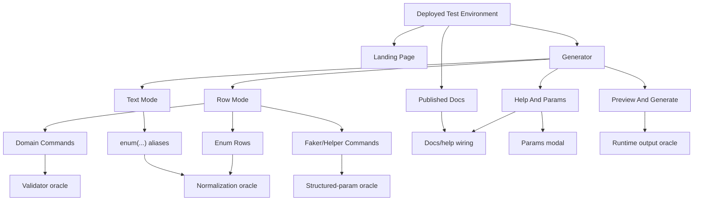
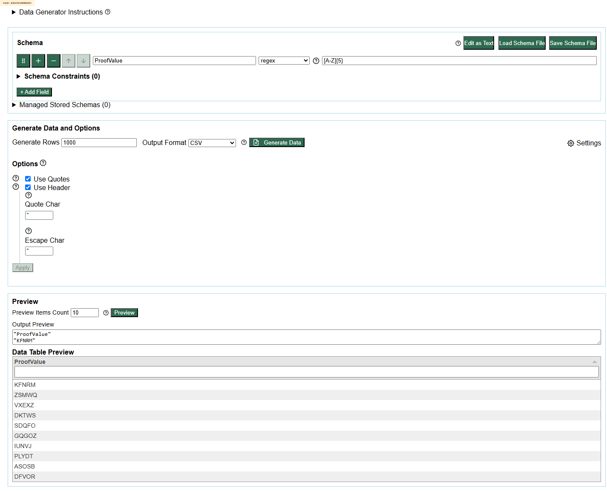

# Issue 228 / PR 243 Deployed Exploratory Review Session 002

## Executive Summary

This was a fresh second 2026-06-24 multi-agent exploratory review of issue `#228` and PR `#243` against the deployed test environment only.

This session was intentionally separated from `issue-228-001` because the deployed build changed during the day. The earlier session observed commit `8382b9e1947b`; this session observed branch `codex/228-improve-command-definition`, commit `fb9e8e2049e1`, built `2026-06-24T20:13:50.037Z`.

Most important outcome: the newer deployment fixed at least one earlier issue, because `datatype.enum` is now present in the published datatype docs, but the overall change set still does not look acceptable for issue `#228` yet. The strongest confirmed problems are:

- published docs still route users toward `generate.html` even though the deployed workflow is `generator.html`
- published Faker Helpers docs still miss commands exposed in the runtime picker
- stale regex validation survives a row-type switch to `enum`
- inline `helpers.rangeToNumber` validation is weaker than modal validation and still reaches Preview with missing required bounds
- the `Edit Params` dialog does not trap focus at mobile width

## Scope And References

- Story: [Issue #228](https://github.com/eviltester/grid-table-editor/issues/228)
- Primary PR under review: [PR #243](https://github.com/eviltester/grid-table-editor/pull/243)
- User-pasted related PR link kept for mismatch tracking: [PR #231](https://github.com/eviltester/grid-table-editor/pull/231)
- Deployed test environment: [Published test environment](https://eviltester.github.io/grid-table-editor/)
- Session prompt: [issue-228-session-goal-prompt.md](issue-228-session-goal-prompt.md)
- Main log: [issue-228-test-log.md](issue-228-test-log.md)

The request text and pasted PR link disagreed. This review treated issue `#228` plus PR `#243` as the primary target because PR `#243` explicitly closes issue `#228`.

## Planning Summary

### Scope Summary Of The Story And PR

Issue `#228` is about consolidating command definitions and help/metadata behavior so the product relies less on duplicated, divergent command-description sources.

On the deployed head reviewed in this session, the changed surface was broader than the earlier session and included:

- `docs-src/docs/.../datatype.md`
- `docs/method-picker-ui-spec.md`
- shared domain-command/help metadata
- params-editor modal behavior
- enum parser/normalization seams
- `range-to-number` helper definition changes

That widened the exploratory scope beyond enum parsing alone into docs/help wiring, params-editor behavior, workflow friction, and cross-surface normalization.

### Risk Analysis Based On The Actual PR Changes

- High risk: enum behavior spans parsing, normalization, row mode, text mode, preview generation, and public syntax serialization.
- High risk: shared help/metadata consolidation can create runtime/docs/help drift even when the underlying command executes correctly.
- High risk: params-editor and helper-definition changes can diverge between inline params, modal params, and preview behavior.
- Medium risk: the deployed head changed after the earlier session, so earlier defects might be fixed, replaced, or reshaped.
- Medium risk: command-definition breadth is a primary coverage requirement because many command families and examples were touched indirectly by the consolidation.

### Changed-Surface Inventory Derived From The Current PR Head

- docs and published guidance:
  - datatype docs
  - method-picker spec docs
  - broader generated site pages
- shared UI metadata and command-list seams:
  - domain-command metadata
  - domain-command list exposure
  - params-editor modal
- runtime and mapping seams:
  - schema-row mapping
  - generation controller/runtime
  - schema rules adapter/compiler
- enum-specific internals:
  - parser/detection/compiler and keyword definitions
- related helper surface:
  - `range-to-number`

### Command Coverage Strategy

The session combined issue-focused enum coverage with explicit breadth sampling across changed command/help/params behavior on the deployed branch.

Targeted representative categories:

- `enum` public syntax and `datatype.enum` normalization
- domain families with structured or validator-backed params
- faker/helper commands, especially structured-param helpers
- removed/deprecated visibility checks
- docs surfaces with multiple examples
- positive and negative runtime cases

Sampling rules used:

- cover both positive and negative cases
- use docs examples where practical
- compare row mode, text mode, help, and published docs when normalization risk exists
- explicitly record sampled versus deferred families

### Delegation Map

- Main agent:
  - planning, orchestration, synthesis, defect packaging, collation, and PDF generation
- Subagents:
  - command coverage and example execution
  - negative validation and malformed parameter testing
  - docs/help/content consistency
  - UX/workflow regression
  - responsive/mobile and accessibility review
  - enum and params cross-surface normalization

### Mermaid Model-Based Coverage Diagram

### Loop Strategy

- Loop 1: establish the new-head baseline, prove browser control, and identify whether earlier findings were still live
- Loop 2: use returned evidence and gap analysis to generate 10 ideas, classify each, and execute the `execute-now` set
- Loop 3: repeat the process with broader runtime execution and enum/params normalization emphasis
- Final review loop: re-read the story, current PR surface, logs, coverage model, sampled families, docs reviewed, examples tried, defects found, and remaining gaps; then generate 10 more ideas, classify them, execute the `execute-now` set, and only then package the PDFs

## Delegation Summary

Delegated lanes used:

- command coverage and example execution
- negative validation and malformed parameter testing
- docs/help/content consistency
- UX/usability and workflow regression
- responsive/mobile and accessibility review
- enum and params cross-surface normalization

Returned lane highlights:

- command coverage:
  - sampled `regex`, `datatype`, `internet`, `number`, `date`, and `finance` surfaces
  - identified `internet.email` and `number.*` as good validator/structured-param follow-ons
- negative validation:
  - confirmed stale regex validation after switching to `enum`
  - confirmed inline/modal inconsistency for `helpers.rangeToNumber`
  - confirmed malformed enum syntax is detected, but wording is misleading
- docs consistency:
  - confirmed `datatype.enum` is now present in published datatype docs
  - confirmed docs still reference `generate.html`
  - confirmed published Faker Helpers docs still miss runtime-exposed commands
- UX regression:
  - found repeated icon-only help triggers reduce discoverability
  - found preview can feel misleading while invalid placeholder output remains visible
  - found `Insert Example Schema` is buried inside schema help
- responsive/accessibility:
  - confirmed the params-editor modal focus trap is broken at `390x844`
  - raised a secondary suspicion around keyboard reachability of visible help content
- enum cross-surface:
  - confirmed `enum(...)`, `datatype.enum(...)`, and `awd.datatype.enum(...)` are accepted but normalize back to plain `enum(...)`
  - confirmed `datatype.enum` still also appears in the domain picker
  - confirmed unsupported imported params can remain visible while guided editing is disabled

## Test Techniques And Heuristics Used

- exploratory testing
- risk-based testing
- equivalence partitioning
- boundary analysis
- negative testing
- consistency/oracle checking
- state/flow modeling
- pairwise thinking
- accessibility heuristics
- responsive testing heuristics
- documentation testing

## Coverage By Command Family, Docs Surface, And Workflow Area

### Runtime Command-Family Sampling

Positive runtime sampling completed:

- `regex`
  - `[A-Z]{5}` generated valid uppercase five-letter preview data
- `internet.email`
  - `internet.email(provider="example.com")` generated only `@example.com` addresses
- `datatype.boolean`
  - default no-param generation produced valid `true`/`false` values
- enum alias handling
  - `enum(...)`, `datatype.enum(...)`, and `awd.datatype.enum(...)` were accepted in text mode and normalized back to plain `enum(...)`

Negative runtime sampling completed:

- invalid `regex` value `(` then switch to `enum`
- malformed enum `active,,pending`
- inline `helpers.rangeToNumber` with missing `max`
- modal `helpers.rangeToNumber` with missing or reversed bounds
- invalid `number.float(min=1,max=2,multipleOf=0.25,fractionDigits=2)`

### Docs Surfaces Reviewed

- `site/docs/category/generating-data`
- `site/docs/test-data/test-data-generation`
- `site/docs/test-data/regex-test-data`
- `site/docs/test-data/faker-test-data`
- `site/docs/test-data/faker/helpers`
- `site/docs/test-data/domain/domain-test-data`
- `site/docs/test-data/domain/datatype`
- `site/docs/test-data/domain/internet`
- `site/docs/test-data/domain/number`
- relevant pairwise docs exposing enum syntax variants

### Workflow Areas Reviewed

- landing page and generator entry
- row-mode authoring
- text-mode import/round-trip
- help links and tooltip/help affordances
- params inline editing
- params modal editing
- preview flow
- generate/download flow
- responsive/mobile keyboarding on changed flows

### Sampled Versus Deferred Families

Sampled now:

- `regex`
- `enum`
- `datatype.enum`
- `datatype.boolean`
- `internet.email`
- `number.float`
- `date` docs surface
- `finance` docs surface
- faker/helper visibility with emphasis on `helpers.rangeToNumber`

Deferred:

- deeper finance-family runtime execution
- broader export-format parity
- more helper-family runtime execution beyond the sampled changed helper surface
- full app-shell parity beyond the generator-focused pass

## Loops Performed And What Changed After Each Loop

### Loop 1

Loop 1 established the new-head baseline and proved browser interaction on the current deployed build.

What changed relative to `issue-228-001`:

- the deployed head advanced to `fb9e8e2049e1`
- `datatype.enum` is no longer missing from the published datatype docs
- the remaining problem set shifted toward docs/help drift, validation consistency, and params-editor accessibility

Loop 1 gaps identified:

- broad runtime command-family execution
- negative validation breadth
- cross-surface enum normalization detail
- UX and accessibility behavior in changed params/help flows

### Loop 2

Loop 2 generated 10 ideas and executed the 8 `execute-now` items.

Loop 2 changed the picture materially:

- confirmed the earlier missing-docs defect for `datatype.enum` is fixed on the newer build
- confirmed current-state docs/runtime naming drift around `generate.html`
- confirmed current-state Faker Helpers docs coverage gaps
- confirmed stale validation and helper-validation inconsistencies
- confirmed the mobile params-dialog focus-trap defect

### Loop 3

Loop 3 generated 10 more ideas and executed the 7 `execute-now` items.

Loop 3 broadened coverage in useful ways:

- added positive runtime execution for domain families `internet` and `datatype.boolean`
- clarified enum alias behavior as normalization rather than syntax preservation
- showed invalid `number.float` conflicting params degrade into preview `**ERROR**` placeholders instead of a cleaner validation stop

### Final Review Loop

The final review loop re-read:

- issue `#228`
- the current PR/head summary already captured for `#243`
- the accumulated main and delegated logs
- the coverage model
- sampled command families
- docs reviewed
- examples tried
- defects found
- remaining gaps

The final review loop generated 10 more ideas and executed the 8 `execute-now` items. Those rechecks confirmed that the current conclusions were stable rather than one-off observations, and that recent work was yielding confirmation and shape-refinement rather than fundamentally new defect classes.

Stopping was justified because:

- coverage is broad enough for the story and current head
- multiple explicit loops were completed
- the recent loops were mostly confirming and refining, not uncovering whole new areas
- the remaining deferred items are narrower than the confirmed defects already sufficient to block acceptance

## Confirmed Defects

- [issue-228-docs-reference-generate-html-but-deployed-page-is-generator-html.md](defects/issue-228-docs-reference-generate-html-but-deployed-page-is-generator-html.md)
- [issue-228-faker-helper-docs-miss-runtime-exposed-commands.md](defects/issue-228-faker-helper-docs-miss-runtime-exposed-commands.md)
- [issue-228-stale-regex-error-persists-after-switching-row-to-enum.md](defects/issue-228-stale-regex-error-persists-after-switching-row-to-enum.md)
- [issue-228-inline-range-to-number-missing-max-still-generates-output.md](defects/issue-228-inline-range-to-number-missing-max-still-generates-output.md)
- [issue-228-modal-focus-escapes-params-editor.md](defects/issue-228-modal-focus-escapes-params-editor.md)

Useful evidence snapshots:

## Suspicious Behaviors And Risks

- live `Enum data help` still routes to the broad Generating Data category page instead of the more specific enum docs now published under datatype
- invalid `number.float(min=1,max=2,multipleOf=0.25,fractionDigits=2)` degrades into repeated `**ERROR**` preview rows instead of a clearer validation block
- preview can continue to show placeholder output while a row is invalid, which is misleading workflow feedback even if not yet packaged here as a standalone defect
- the same token family, `datatype.enum`, is split between enum syntax docs and the live domain picker, which raises product-definition clarity questions even though runtime normalization currently works

## Deferred Ideas

- broader finance-family runtime generation
- broader export-format parity checks
- more helper-family runtime execution outside `rangeToNumber`
- deeper screen-reader auditing beyond keyboard and responsive heuristics
- full app-shell parity beyond the generator-centered exploratory pass
- direct investigation of whether the generic enum help target is intentional product design or stale help wiring

## What Was Not Covered And Why

- Full app-shell parity was not exhaustively covered because the generator gave the fastest and highest-confidence evidence for the changed command/help/params surfaces.
- Export-format parity beyond the sampled preview/generate behavior was deferred once the docs, validation, and accessibility defects were already sufficient to block acceptance.
- Finance-family runtime generation was deferred because docs reachability was confirmed, but narrower domain-family positives would not have changed the release recommendation as much as the already confirmed validation/help issues.

## Final Recommendation

The deployed changes do not look acceptable for issue `#228` yet.

The consolidation work does show real progress:

- `datatype.enum` is now published in the datatype docs
- enum aliases are accepted and normalize consistently
- representative runtime generation for `regex`, `internet.email`, and `datatype.boolean` still works on the current head

But the remaining confirmed defects are substantial enough to block acceptance:

- users can still be sent to a dead `generate.html` page from published docs
- published helper docs still lag the runtime command inventory
- validation state can become stale across row-type changes
- inline and modal validation are inconsistent on a changed helper surface
- the params-editor modal still breaks keyboard containment on mobile width

My recommendation is to fix the confirmed docs, validation, and accessibility defects before treating the current deployed build as acceptable for the story.
