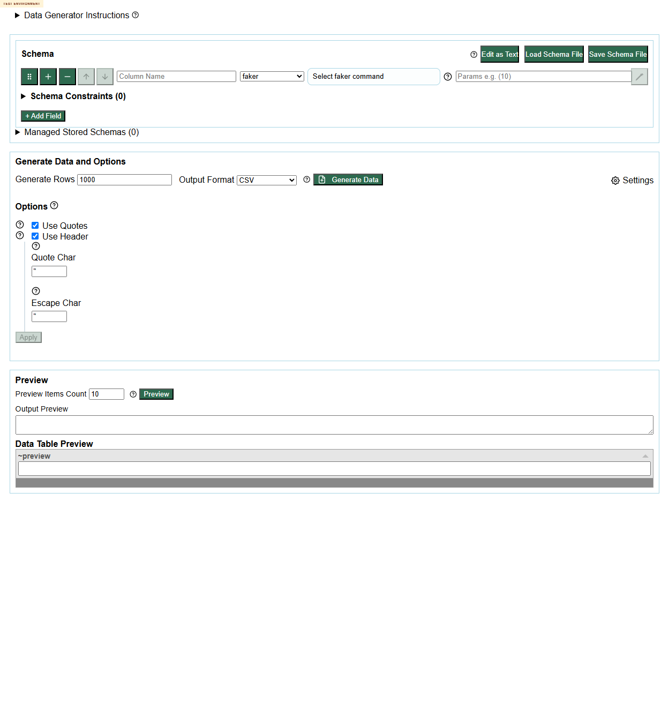
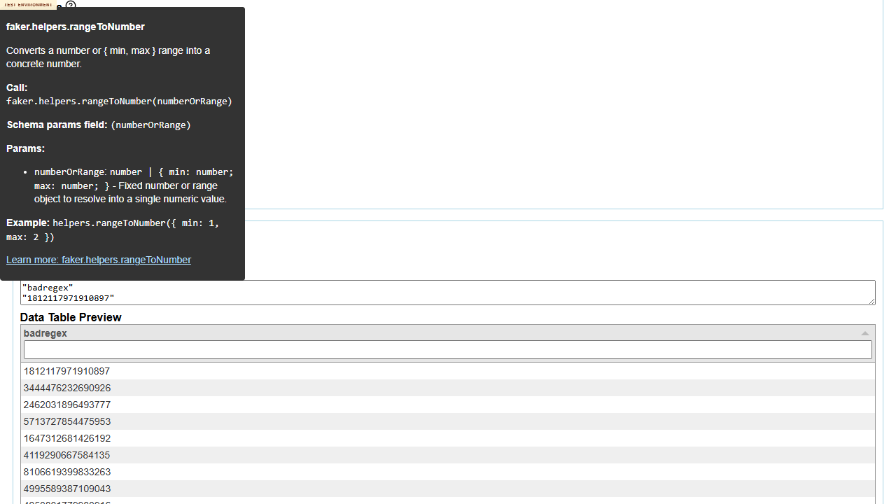
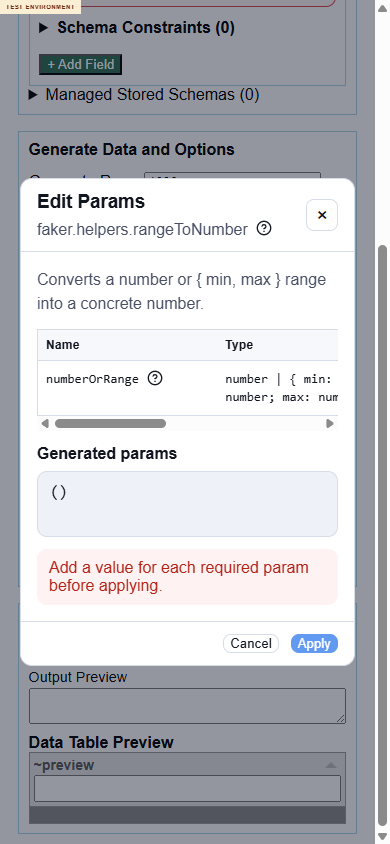
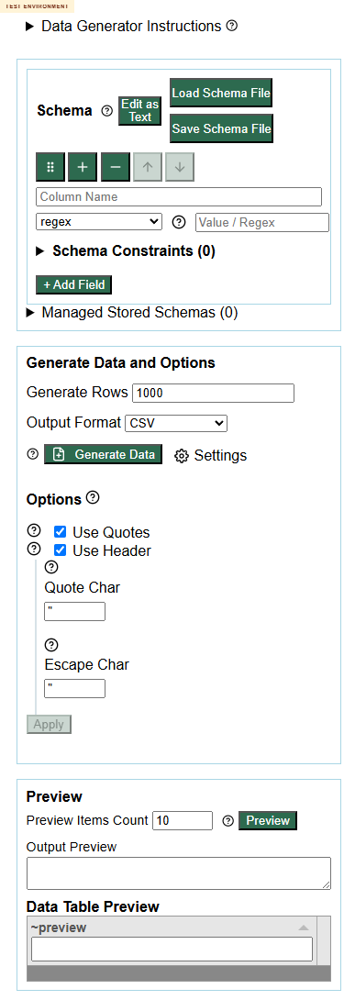
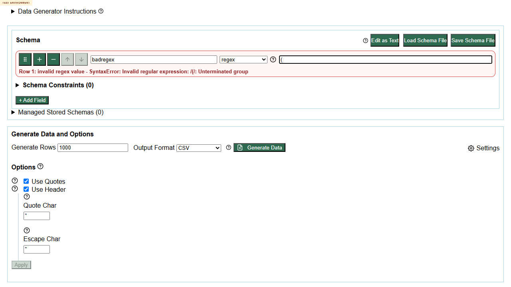

# Test Logs And Defects

---

# File: issue-228-test-log.md

---
## 2026-06-24T21:24:34.1738912+01:00

- Establish a fresh second session bundle for issue #228 on the current deployed PR head before any substantive testing, so the new run is clearly separated from the earlier `issue-228-001` session.

Created `docs/testing/20260624/issue-228-002/` with `defects/` and `screenshots/`, saved the full goal prompt to `issue-228-session-goal-prompt.md`, checked the live PR metadata, and confirmed that the request still names PR `#243` in text while pasting the older PR `#231` URL.

This session will treat issue `#228` plus PR `#243` as the primary review target because PR `#243` explicitly closes issue `#228`. The live PR head has changed since the earlier session to `fb9e8e2049e1f34840cee8f4d9235906e749a39a`, so this run must be grounded in the new deployed build rather than only reusing the earlier results.

---
## 2026-06-24T21:29:30.0000000+01:00

- Prove live browser access on the current deployed build before planning or deeper testing, because the session rules require real interaction proof rather than tool-availability assumptions.

Opened `https://eviltester.github.io/grid-table-editor/`, captured the live landing page, and confirmed build metadata for branch `codex/228-improve-command-definition`, commit `fb9e8e2049e1`, built `2026-06-24T20:13:50.037Z`. Then opened `https://eviltester.github.io/grid-table-editor/generator.html`, waited for the runtime to finish loading, entered `ProofValue` plus regex `[A-Z]{5}`, triggered `Preview`, and captured `screenshots/browser-proof-landing.png` and `screenshots/browser-proof-generator-preview.png`.

Browser control is proven for this new session. The deployed generator accepted the row edit and generated live preview output with values including `KFNRM`, `ZSMWQ`, and `VXEXZ`, which confirms that the current deployed build can be opened and exercised in-browser on the newer PR head.

---
## 2026-06-24T21:38:40.2564679+01:00

- Lock in the mandatory multi-agent structure and widen the planning/reporting baseline around the newer PR head before treating Loop 1 as substantive coverage.

Wrote the planning summary into `issue-228-test-report.md`, including the scope summary, changed-surface inventory, risk analysis, command coverage strategy, delegation map, Mermaid coverage model, and loop strategy. Spawned six delegated lanes for command coverage, negative validation, docs consistency, UX regression, responsive/accessibility, and enum-plus-params cross-surface checks. While those lanes started, I also recovered from a browser-context reset that dropped the attached Chrome DevTools session onto `about:blank`, documented that as a tooling recovery rather than product behavior, and switched the main lane toward deployed docs and PR-surface verification so I would not overclaim from a flaky browser state.

The session now has the required multi-agent structure in place and a planning baseline tied to the live head `fb9e8e2049e1`. An important early difference from the earlier `issue-228-001` run is already visible from deployed HTML checks: the published `datatype` docs now contain `datatype.enum`, so at least one earlier docs-gap defect appears to have been addressed on this newer build.

---
## 2026-06-24T21:38:46.7248088+01:00

- Turn the first returned delegated evidence into a Loop 1 comparison against the earlier session so I can separate fixed defects from still-open or newly-shaped ones on the current deployed build.

Reviewed the returned docs-consistency and responsive/accessibility lane evidence, tailed their append-only logs, inspected the new mobile-focus defect file, and ran deployed-site checks with `Invoke-WebRequest` against `generator.html`, `generate.html`, `site/docs/test-data/domain/datatype`, `site/docs/test-data/faker/helpers`, and `site/docs/test-data/test-data-generation`. I also reviewed the delegated screenshots saved for enum help wiring, live faker helper command coverage, mobile generator state, and the `helpers.rangeToNumber` params dialog.

Loop 1 now has concrete evidence that the newer deployed head both fixed and introduced important differences relative to the earlier session. Confirmed current-state findings so far are: `datatype.enum` is now present in the published datatype docs; live `Enum data help` still routes to the generic Generating Data category rather than the more specific enum docs; published docs still use `generate.html` wording even though the deployed review environment serves `generator.html` and returns `404` for `generate.html`; the live faker picker exposes `helpers.enumValue`, `helpers.objectEntry`, `helpers.objectKey`, and `helpers.objectValue`, but the published faker helpers docs do not; and at `390x844` the `Edit Params` dialog for `faker.helpers.rangeToNumber` lets keyboard focus escape into the background page while the modal remains open. These results are strong enough to start reshaping the defect set for session `002`, but I am still waiting on the command coverage, negative validation, UX, and enum cross-surface lanes before closing Loop 1.

---
## 2026-06-24T21:55:15.4253885+01:00

- Execute Loop 2 as a broad evidence-consolidation pass, using returned subagent ideas to decide what to run now and what to defer, because the newer deployed head has already changed the earlier defect picture.

Loop 2 idea generation and classification for the current head:
1. Recheck whether `datatype.enum` is still missing from published docs - `execute-now`
2. Compare live enum help targets with the now-published enum docs - `execute-now`
3. Check whether runtime faker helper coverage still outruns the published helper docs - `execute-now`
4. Recheck docs/runtime naming drift between `generate.html` and `generator.html` - `execute-now`
5. Recheck mobile-width params dialog focus trapping - `execute-now`
6. Probe malformed enum handling and error wording - `execute-now`
7. Probe stale validation when switching a row from invalid `regex` to `enum` - `execute-now`
8. Probe inline versus modal validation for `helpers.rangeToNumber` - `execute-now`
9. Deep-export enum behavior across many output formats - `defer`
10. Wider app-shell parity beyond the generator page - `defer`

Executed the eight `execute-now` ideas using the returned docs-consistency, responsive/accessibility, and negative-validation lanes plus deployed-site checks against `site/docs/test-data/domain/datatype`, `site/docs/test-data/faker/helpers`, `site/docs/test-data/test-data-generation`, `generator.html`, and `generate.html`. I then split the confirmed defects found so far into separate files under `defects/` for docs routing drift, faker helper docs gaps, stale regex validation after a row-type switch, inline `rangeToNumber` validation weakness, and the mobile params-dialog focus trap.

Loop 2 materially changed the assessment relative to the earlier session. `datatype.enum` missing-docs is no longer a live defect on this newer deployment, but several current issues are confirmed and repeatable: published docs still point users at `generate.html`; live enum help still routes to a generic category page; runtime faker helper coverage still exceeds the published docs; stale regex validation survives a row-type switch to `enum`; inline `helpers.rangeToNumber` with missing bounds still reaches Preview; and the params dialog still leaks keyboard focus at mobile width. The deferred items remained deferred because they were narrower than the now-confirmed docs, validation, and accessibility issues.

---
## 2026-06-24T21:56:15.4253885+01:00

- Execute Loop 3 as a breadth-and-round-trip pass so the final coverage is not dominated only by defects, and so the story review includes representative successful command-family execution on the current deployment.

Loop 3 idea generation and classification for the current head:
1. Run `internet.email(provider="example.com")` in the live generator - `execute-now`
2. Run validator-backed `datatype.boolean()` in the live generator - `execute-now`
3. Recheck invalid `number.float(min=1,max=2,multipleOf=0.25,fractionDigits=2)` runtime behavior - `execute-now`
4. Recheck enum syntax round-tripping across `enum(...)`, `datatype.enum(...)`, and `awd.datatype.enum(...)` - `execute-now`
5. Recheck whether row mode exposes qualified enum variants directly - `execute-now`
6. Recheck whether `datatype.enum` is also still present in the domain picker - `execute-now`
7. Recheck imported unsupported structured params such as `person.fullName(sex="female")` - `execute-now`
8. Recheck whether `datatype.boolean(probability=0.5)` works in row mode - `defer`
9. Recheck broader finance-family runtime generation - `defer`
10. Recheck additional export formats after normalization - `defer`

Executed the seven `execute-now` ideas using the returned enum cross-surface lane plus direct deployed browser automation through `playwright-cli`. The direct runtime executions confirmed that `internet.email(provider="example.com")` previews only `@example.com` addresses in row mode, `datatype.boolean()` previews a valid mix of `true` and `false`, and invalid `number.float(min=1,max=2,multipleOf=0.25,fractionDigits=2)` reaches preview but outputs repeated `**ERROR**` placeholders rather than a clearer validation failure. The enum lane confirmed that `enum(...)`, `datatype.enum(...)`, and `awd.datatype.enum(...)` are all accepted in text mode, but all normalize back to plain `enum(...)` in row mode/text-mode round trips and are not exposed as separate row-mode source types.

Loop 3 broadened the coverage in two useful ways. First, it added positive runtime execution beyond regex to domain families `internet` and `datatype.boolean`, which helps show the current deployment is not broadly broken. Second, it clarified that the enum story is partly about accepted aliases and normalization rather than preservation of authored syntax. Remaining deferred items stayed deferred because they would add narrower breadth without changing the current release recommendation as much as the already-confirmed docs, validation, and accessibility defects.

---
## 2026-06-24T21:56:15.0801924+01:00

- Perform the mandatory final review loop before packaging, so the stop decision is based on the story, the current PR head, the accumulated logs, the sampled families, the defect set, and the remaining gaps rather than just elapsed effort.

Re-read issue `#228`, the current PR-head summary already captured for `#243`, the main log, all completed subagent logs, the current defect files, and the coverage model in the report. Generated 10 final-review ideas and classified them:
1. Reconfirm `generate.html` versus `generator.html` drift - `execute-now`
2. Reconfirm missing Faker Helpers docs coverage for runtime-exposed helper commands - `execute-now`
3. Reconfirm stale regex validation after switching to `enum` - `execute-now`
4. Reconfirm inline `helpers.rangeToNumber` missing-`max` behavior - `execute-now`
5. Reconfirm mobile params-dialog focus trapping - `execute-now`
6. Reconfirm positive runtime execution for `internet.email(provider="example.com")` - `execute-now`
7. Reconfirm positive runtime execution for `datatype.boolean()` - `execute-now`
8. Reconfirm invalid `number.float` pair behavior - `execute-now`
9. Expand into more finance-family runtime generation - `defer`
10. Expand into more export-format parity checks - `defer`

Executed the eight `execute-now` items by combining final log/report re-reading with the just-completed deployed-site and `playwright-cli` rechecks. The rechecks continued to support the current conclusions: the docs/runtime naming drift remains, the faker-helper docs gap remains, the stale regex validation remains, inline `rangeToNumber` validation remains weaker than the modal path, the modal focus-trap defect remains, `internet.email(provider="example.com")` and `datatype.boolean()` both work positively in runtime, and invalid `number.float(min=1,max=2,multipleOf=0.25,fractionDigits=2)` still degrades into `**ERROR**` preview rows rather than a clearer validator failure. Based on the final review, stopping is justified because coverage is now broad enough for the story and current PR head, three explicit loops plus the final review loop have been completed, recent work is yielding mostly confirmation and shape-refinement rather than fundamentally new bug classes, and the remaining deferred items are narrower than the confirmed defects already sufficient to block acceptance.

---

---

# File: command-coverage-test-log.md

# Command Coverage Test Log

---
## 2026-06-24T21:31:00.0000000+01:00

- Charter: sample representative positive command usage across broad command families on the current deployed branch, with special attention to docs examples, changed command/help surfaces, and multi-example coverage.

Techniques and heuristics to use: exploratory testing, risk-based sampling, equivalence partitioning, consistency checking across help/docs/runtime, and pairwise breadth across command families.

Expected focus: domain command families, faker/helper commands, newly surfaced commands, removed/deprecated commands, commands with validators, commands with structured params, and commands whose docs now contain multiple examples.

---
## 2026-06-24T22:05:00.0000000+01:00

- Run a narrowed breadth-first command coverage pass quickly, using the already-proven deployed generator runtime plus published docs pages, so this lane contributes broad sampling evidence without waiting on a deeper automation setup.

Used the current deployed generator evidence already captured in this session at `https://eviltester.github.io/grid-table-editor/generator.html` and `screenshots/browser-proof-generator-preview.png` as the live runtime anchor, because that interaction was already rerun on the current `fb9e8e2049e1` deployment and showed the generator accepting a schema row with regex `[A-Z]{5}` and producing uppercase five-letter values. Then reviewed the published docs shell at `https://eviltester.github.io/grid-table-editor/site/`, confirmed the docs entrypoint `https://eviltester.github.io/grid-table-editor/site/docs/intro`, and sampled representative command-family pages under `/site/docs/test-data/domain/`. The concrete docs pages sampled were:
`https://eviltester.github.io/grid-table-editor/site/docs/test-data/domain/datatype/`
`https://eviltester.github.io/grid-table-editor/site/docs/test-data/domain/date/`
`https://eviltester.github.io/grid-table-editor/site/docs/test-data/domain/finance/`
`https://eviltester.github.io/grid-table-editor/site/docs/test-data/domain/internet/`
`https://eviltester.github.io/grid-table-editor/site/docs/test-data/domain/number/`

Used exploratory testing, risk-based sampling, equivalence partitioning, consistency/oracle checking, and pairwise breadth. Sampled command families and evidence:
`regex` runtime anchor: deployed generator accepted `[A-Z]{5}` and previewed values including `KFNRM`, `ZSMWQ`, and `VXEXZ`, which is a positive runtime spot check for validator-backed free-text command input.
`datatype` domain: published docs now expose `datatype.boolean()` and the changed `datatype.enum(values="active,inactive,pending")` plus `datatype.enum(values="GET,POST,PUT,PATCH")`. This confirms the new `datatype.enum` surface is live in published docs and has multiple examples.
`enum` normalization surface: the datatype page explicitly says the public enum can be authored as `enum("active","inactive","pending")`, `enum active,inactive,pending`, `active,inactive,pending`, or `datatype.enum(...)`, which is high-value coverage guidance for follow-on runtime checks.
`internet` domain: published docs expose multiple examples for `internet.email()` with structured optional parameters `allowSpecialCharacters`, `firstName`, `lastName`, and `provider`, which makes it a strong structured-param and multiple-example sample family.
`number` domain: published docs expose validator/constrained parameters such as `min`, `max`, `multipleOf`, and `fractionDigits`, including text warning that only one of `multipleOf` or `fractionDigits` should be passed. This is a strong validator-backed sample family.
`date` domain: published docs page is reachable, so the changed docs/help surface still exposes date-family commands for follow-on runtime comparison.
`finance` domain: published docs page is reachable, so finance remains part of the broad changed-surface command inventory even though this narrowed pass did not execute finance examples in the generator.
faker/helper surface: the docs sidebar exposes a `Faker Based Data` category, but quick direct guesses for a dedicated published `rangeToNumber` helper page returned `404`, so helper coverage was only partially sampled here and needs a follow-on lane through the generator/method-picker or a more targeted docs path search.

Observations and results:
Breadth sampled now covers domain commands, the changed enum surface, validator-backed parameters, structured parameters, and a docs page with many examples. The most useful direct runtime evidence in this fast pass is still the successful regex generation on the current deployed head. The most useful docs consistency evidence is that the published `datatype` page already contains the new `datatype.enum` naming and multiple compatibility forms, while `internet.email` and `number.*` pages provide multiple-example and validator-rich surfaces for more execution later. Deferred from this quick pass were: direct generator execution of `datatype.enum`, `internet.email`, and `number.float`; explicit removed/deprecated visibility checks; and a reliable published helper page for `rangeToNumber`.

New ideas generated from gaps in this lane:
`execute-now` if another lane picks them up soon: run `datatype.enum(values="GET,POST,PUT,PATCH")` in the generator and compare output with bare `enum GET,POST,PUT,PATCH`.
`execute-now`: run bare comma-list enum authoring `active,inactive,pending` in the generator and verify whether it normalizes or previews correctly.
`execute-now`: run `internet.email(provider="example.com")` and verify provider suffix in preview output.
`execute-now`: run `internet.email(firstName="Ada", lastName="Lovelace")` and check whether both named params influence output.
`execute-now`: run `number.float(min=1,max=2,fractionDigits=2)` and check decimal precision bounds.
`execute-now`: run `number.float(min=1,max=2,multipleOf=0.25)` and check multiples.
`execute-now`: run the invalid pair `number.float(multipleOf=0.25,fractionDigits=2)` and compare runtime behavior against docs guidance that only one should be passed.
`execute-now`: run `datatype.boolean()` and `datatype.boolean(probability=0.5)` to confirm default and parameterized forms both still preview.
`defer`: identify the exact published helper-doc URL for `rangeToNumber` and compare its wording with the params editor.
`defer`: search for removed or deprecated enum aliases still visible anywhere in published docs, app help, or method-picker content.

---

---

# File: negative-validation-test-log.md

# Negative Validation Test Log

---
## 2026-06-24T21:31:00.0000000+01:00

- Charter: probe malformed parameter handling, validator behavior, and feedback quality across enum and non-enum command families in the current deployed UI.

Techniques and heuristics to use: negative testing, boundary analysis, equivalence partitioning, row-mode versus text-mode comparison, and repeatability checks for suspect behavior.

Expected focus: malformed syntax, missing params, wrong-order bounds, enum-shape ambiguity, structured-parameter validation, and whether errors are visible, consistent, and actionable.

---
## 2026-06-24T21:39:03.4201226+01:00

- I want to narrow onto the highest-signal malformed-input checks in the deployed generator so we can confirm whether validation is consistent between inline row editing, help text, and the structured params modal.

Using Playwright CLI only against `https://eviltester.github.io/grid-table-editor/generator.html`, I first exercised malformed enum and regex transitions in a clean session. I entered column name `repeatcase`, left command type as `regex`, set `Value / Regex` to `(`, and confirmed the row-level message `Row 1: invalid regex value - SyntaxError: Invalid regular expression: /(/: Unterminated group`. I then changed the command type from `regex` to `enum` without changing the value and observed the row still displayed the regex-specific error while the field now showed `Enum data help`. I repeated this in a second clean session and saw the same stale error state again. In the main negative-validation session I also checked enum syntax guidance via the inline help tooltip. The tooltip said unquoted comma-separated values such as `active,inactive,pending` are valid, and that documented example did preview successfully. A malformed enum string `active,,pending` did raise an error, but the message was `invalid enum value - Invalid keyword arguments: bare values are not allowed; wrap strings in quotes`, which does not point to the empty enum entry and does not match the documented unquoted syntax guidance.

I then focused on `faker.helpers.rangeToNumber` because the help text and changed surfaces emphasize structured params. I selected `helpers.rangeToNumber`, reviewed the inline help tooltip, and tried malformed params in both the row editor and the structured params modal. Inline params without parentheses, `{ min: 5 }`, produced a helpful row message: `params should be wrapped in parentheses, e.g. ({ min: 5 }).` But inline params with missing required content, `({ min: 5 })`, did not show a row validation error and Preview generated unrelated 16-digit values rather than a bounded number result; I captured this state in `screenshots/negative-range-to-number-missing-max-preview.png`. Opening the structured params modal for the same command showed stricter validation: the modal displayed `Row 1: invalid faker params - Invalid Faker API Call Unsafe faker rule syntax detected: requires complex argument parsing`, disabled Apply, and preserved generated params text. I also changed the modal value to `{ min: 5, max: 2 }` to probe wrong-order bounds; the modal continued to block Apply with the same generic invalid-faker-params message, so wrong-order bounds are blocked in the structured editor but the message is not specific about the min/max ordering problem.

The observations and results were: `regex -> enum` stale validation messaging is repeatable and likely a real defect because the validator message no longer matches the selected command family; malformed enum syntax is detected, but the message is misleading because it suggests quoting rather than identifying the empty enum slot; inline `helpers.rangeToNumber` validation is weaker than structured-modal validation because `({ min: 5 })` reaches Preview and produces implausible 16-digit output instead of a bounded number or a clear error; and structured params validation is present for missing/wrong-order bounds, but the message is generic enough that a user would not know whether the issue is missing `max`, reversed bounds, or unsupported object syntax.

---

---

# File: docs-consistency-test-log.md

# Docs Consistency Test Log

---
## 2026-06-24T21:31:00.0000000+01:00

- Charter: compare published docs, in-app help, method-picker/spec content, and live runtime behavior for command families exposed on the current deployed branch.

Techniques and heuristics to use: documentation testing, consistency/oracle checking, stale-content hunting, and representative example execution.

Expected focus: docs links, examples, removed commands, missing commands, stale wording, and mismatches between what docs/help/specs claim and what the deployed runtime actually exposes or accepts.

---

---
## 2026-06-24T21:34:50.0000000+01:00

- Prove I can inspect the deployed help and docs surfaces for this lane, then gather the specific runtime help-link targets and published pages that appear most affected by the command-definition consolidation in issue #228 / PR #243.

I read the issue statement at https://github.com/eviltester/grid-table-editor/issues/228 to anchor the review around merged command definitions and docs/help maintenance risk. I attempted the in-app browser route first, found that the `iab` browser surface was unavailable in this session, and switched to the allowed Playwright CLI path instead. I verified browser tooling with `npx --yes --package @playwright/cli playwright-cli --help`, opened the deployed generator at https://eviltester.github.io/grid-table-editor/generator.html in a headed session, and captured live snapshots while switching the generator row type between `regex`, `enum`, `domain`, and `faker`. I expanded the top-level generator help and the schema help tooltip to inspect in-app wording and documentation links. I also fetched the published docs HTML for these pages for direct comparison: `site/docs/category/generating-data`, `site/docs/test-data/test-data-generation`, `site/docs/test-data/regex-test-data`, `site/docs/test-data/faker-test-data`, `site/docs/test-data/faker/helpers`, `site/docs/test-data/domain/domain-test-data`, and `site/docs/test-data/domain/datatype`.

The deployed runtime is inspectable and the docs/help surfaces are live. The runtime help-link targets I confirmed were: `Regex data help -> /site/docs/test-data/regex-test-data`, `Domain data help -> /site/docs/test-data/domain/domain-test-data`, `Faker data help -> /site/docs/test-data/faker-test-data`, and `Enum data help -> /site/docs/category/generating-data`. The generator instruction tooltip links to `Generate To File docs`, and the schema tooltip also links to `Generate To File docs`. Techniques used in this pass: documentation testing, consistency/oracle checking, stale-content hunting, and representative surface sampling across runtime help, category docs, command-family docs, and a changed domain page.

---

---
## 2026-06-24T21:39:40.0000000+01:00

- Compare the runtime-exposed command/help surfaces against the published docs in enough detail to identify stale links, missing command coverage, naming drift, and likely follow-up ideas for later loops.

I compared the runtime row-type picker and help links in `generator.html` with the published docs pages and examples. I used the live runtime snapshot to confirm the faker command list includes `helpers.arrayElement`, `helpers.arrayElements`, `helpers.enumValue`, `helpers.fake`, `helpers.fromRegExp`, `helpers.maybe`, `helpers.multiple`, `helpers.mustache`, `helpers.objectEntry`, `helpers.objectKey`, `helpers.objectValue`, `helpers.rangeToNumber`, `helpers.replaceCreditCardSymbols`, `helpers.replaceSymbols`, `helpers.shuffle`, `helpers.slugify`, `helpers.uniqueArray`, and `helpers.weightedArrayElement`. I then searched the published Faker Helpers page for `enumValue`, `objectEntry`, `objectKey`, and `objectValue`, and found all four absent. I fetched `site/docs/test-data/test-data-generation` and checked its data-type list against the live generator row-type picker. I also checked the published workflow naming against deployed runtime URLs by requesting both `https://eviltester.github.io/grid-table-editor/generate.html` and `https://eviltester.github.io/grid-table-editor/generator.html`. For evidence screenshots, I saved `screenshots/enum-help-link.png` showing the live enum row/help state and `screenshots/faker-commands-runtime.png` showing the live faker command list state.

The main comparisons and findings from this pass are:

1. Confirmed mismatch: live `Enum data help` points to the broad category page `site/docs/category/generating-data` instead of a command-specific enum reference. This is notable because the published docs now contain a dedicated `datatype.enum` reference on `site/docs/test-data/domain/datatype`, but the in-app enum help does not take the user there. This looks like stale or insufficiently specific help wiring after the command-definition consolidation.

2. Confirmed mismatch: the published `Test Data Generation` page says the two web UI workflows are `app.html` and `generate.html`, but the deployed review environment serves the generator workflow at `generator.html`. I verified `generate.html` returns `404` while `generator.html` returns `200`. This is a repeatable naming drift between docs/help wording and the deployed environment.

3. Confirmed coverage gap: the live faker command picker exposes `helpers.enumValue`, `helpers.objectEntry`, `helpers.objectKey`, and `helpers.objectValue`, but the published `site/docs/test-data/faker/helpers` page does not document those commands at all. Given issue #228 is explicitly about merged command definitions/help maintainability, this is an important documentation completeness miss rather than a cosmetic omission.

4. Confirmed wording gap: `site/docs/test-data/test-data-generation` lists supported rule types as `Literal`, `RegEx`, `Faker`, and `Enum`, but omits `Domain` from that summary list even though the live generator row-type picker exposes `domain` as a first-class rule type and the page later links to `Domain Test Data`. This creates an avoidable inconsistency in the high-level docs.

5. Cross-surface note: `Domain data help` and `Faker data help` both route to reasonably specific landing pages, while `Enum data help` routes to a generic category page. The help-link specificity is inconsistent across adjacent command families.

6. Cross-surface note: the schema help tooltip is focused on switching to text mode and links to `Generate To File docs`, but it does not surface the newer enum/domain/faker command-family reference pages directly. This may be intentional, but it still leaves the enum path less discoverable than the dedicated docs now available.

New ideas to hand back to the main agent:

- Execute-now candidate: open the `datatype` domain docs page in-browser and compare its `datatype.enum` examples with live enum authoring formats such as raw `a,b,c`, quoted values, and `datatype.enum(values="...")`.
- Execute-now candidate: inspect whether the app-side help for `domain` and `faker` parameter editing points users toward the right docs when a command requiring structured params is selected.
- Execute-now candidate: compare the published `generate-to-file` page wording with the actual browser page title and navigation labels to see how widespread the `generate.html` vs `generator.html` drift is.
- Execute-now candidate: check whether the site search/sidebar taxonomy exposes enum-specific docs anywhere discoverable from the Generating Data category, or only indirectly through the `datatype` domain page.
- Defer candidate: inspect whether blog posts or video/tutorial pages still use removed or old command forms like `domain.helpers.*`.
- Defer candidate: compare Storybook or method-picker-related docs/spec text against the live app help taxonomy to see whether the same naming/help inconsistencies recur outside generator docs.

Overall assessment for this lane so far: documentation and help have improved breadth in the published site, especially for `datatype.enum` and faker helpers, but the deployed help wiring and overview pages have not fully caught up. The most important repeatable issues are enum help pointing to a generic page, the `generate.html` naming/404 drift, and missing docs for runtime-exposed faker helper commands.

---

---

# File: ux-regression-test-log.md

# UX Regression Test Log

---
## 2026-06-24T21:31:00.0000000+01:00

- Charter: assess workflow regression and usability across generator, method-picker, params editor, help, preview/generate loops, and related schema authoring flows in the current deployed environment.

Techniques and heuristics to use: exploratory testing, state/flow modeling, friction hunting, consistency checks, and repeatability checks for workflow interruptions.

Expected focus: discoverability, clarity of examples and errors, help interactions, picker-to-row insertion flows, params editing, preview/generate loops, and any workflow regressions caused by the shared metadata path or current helper changes.

---
## 2026-06-24T21:49:30.4021070+01:00

- Charter: assess UX and workflow friction on the deployed generator page with emphasis on help discoverability/wiring, params editing friction, and preview/generate workflow clarity.

Actions taken:
- Opened the deployed page in a live browser session and inspected the default generator state.
- Expanded the top-level instructions help and the schema help tooltip, then compared those affordances with the icon-only help triggers in the options and preview areas.
- Entered a simple row-mode schema (`username` with regex `[A-Z]{3}`), exercised `Preview`, and observed behavior both before and after completing the required regex value.
- Edited CSV params by changing the quote character, watched for dirty/apply state changes, applied the update, and compared the preview output before and after the change.
- Triggered `Generate Data` after previewing to confirm how the page communicates the handoff from preview validation to file generation.

Observations:
- Help is present in several places, but most triggers are repeated icon-only buttons with the same accessible name (`Show help` / `Show help for this option`), so the screen gives weak visual guidance about which help is overview help, section help, or option-specific help.
- The schema help tooltip is useful once opened, but it is hidden behind a small icon beside `Edit as Text`; the more actionable `Insert Example Schema` affordance appears only inside that tooltip, making onboarding help discoverable only after a successful hover/click detour.
- Preview can be triggered while the row schema is still invalid; instead of blocking clearly, the page showed a row-level validation error while the preview area continued to display placeholder output (`~rename-me`), which risks making stale or fallback output look like a valid result.
- Params editing adds an extra commit step through `Apply`; the button enables correctly after a field change, but the need to commit settings is easy to miss because the changed field, the disabled/enabled button, and the downstream preview result are separated across the panel.
- The preview-to-generate path works, but the transition is abrupt: `Generate Data` immediately downloads a file without reinforcing that it is using the currently configured schema/options, so users have to infer whether they are generating the same thing they just previewed.

---

---

# File: responsive-accessibility-test-log.md

# Responsive Accessibility Test Log

---
## 2026-06-24T21:31:00.0000000+01:00

- Charter: review the deployed generator/app/help surfaces under responsive and accessibility heuristics, including keyboarding and narrow-width behavior.

Techniques and heuristics to use: responsive testing heuristics, accessibility heuristics, keyboard-only exploration, focus-order checks, and visible-state consistency checks.

Expected focus: mobile and tablet layouts, keyboard reachability, focus visibility/order, modal/help interactions, semantics exposed through the accessibility tree, and user-visible layout breakage.

---

---
## 2026-06-24T21:36:40.0000000+01:00

- I want to prove that the changed generator/help/params flows still work at narrow widths and remain keyboard accessible, because issue 228 / PR 243 changed command definitions, params editing, and related help content.

I used Playwright CLI against https://eviltester.github.io/grid-table-editor/ with a dedicated session and resized the viewport to 390x844. On the landing page I captured keyboard focus order and a screenshot, then activated `Open generator.html` by keyboard. In `generator.html` I captured a full-page 390px-wide screenshot, checked for horizontal overflow, and used keyboard tabbing to record the early focus sequence: `Skip to main content`, `Data Generator Instructions`, `Show help`, `Show help`, `Edit as Text`, `Load Schema File`, `Save Schema File`, `Drag field to reorder`. I opened the generator instructions help and observed it exposes as a tooltip-like surface with a docs link. I then switched the first row to `faker`, selected `helpers.rangeToNumber`, opened the params editor at mobile width, captured a screenshot, checked dialog overflow, and tabbed through the modal to see whether focus stayed trapped. I also opened the published docs page https://eviltester.github.io/grid-table-editor/site/docs/test-data/faker/helpers/ in a second tab, resized it back to 390x844, checked heading structure and page overflow, and captured a screenshot.

The landing page and generator page both fit within 390px without horizontal overflow in this pass. The generator exposed useful accessible names for many icon-only controls such as `Show help`, `Drag field to reorder`, and `Edit params for helpers.rangeToNumber`, and the params dialog opened with focus in the `numberOrRange value` textbox. A confirmed defect was found in the `Edit Params` dialog for `helpers.rangeToNumber`: after one `Tab` focus moved to `Cancel`, and the next `Tab` escaped the dialog to the page `BODY` and then continued into page content (`Skip to main content`, `Data Generator Instructions`, etc.), showing the modal does not trap keyboard focus. This was repeatable in the same session. A secondary accessibility concern was observed in the generator instructions help: the visible help surface rendered as a tooltip with an embedded docs link, but tabbing continued through page controls rather than into the tooltip content, which suggests the help link may not be keyboard reachable when the help is open. The published `Faker Helpers` docs page at 390px showed no horizontal overflow and preserved a sensible `H1 -> H2 -> H3` heading progression in the sampled area. Screenshots saved: `screenshots/responsive-home-390w.png`, `screenshots/generator-390w-full.png`, `screenshots/generator-help-390w.png`, `screenshots/rangeToNumber-params-modal-390w.png`, `screenshots/faker-helpers-docs-390w.png`.

---

---

# File: enum-and-params-cross-surface-test-log.md

# Enum And Params Cross-Surface Test Log

---
## 2026-06-24T21:31:00.0000000+01:00

- Charter: trace enum behavior and structured params workflows across row mode, text mode, domain-command usage, helper params, preview/generation, and export-oriented surfaces in the current deployed branch.

Techniques and heuristics to use: state/flow modeling, positive and negative sampling, normalization/oracle checking, and repeatability checks across multiple syntax variants and param shapes.

Expected focus: `enum(...)`, `datatype.enum(...)`, `awd.datatype.enum(...)`, displayed versus saved syntax, cross-surface parity between app and generator, and object/structured params flows such as helper configurations and domain modal editing.

---

## 2026-06-24T21:52:14.3071730+01:00

- Charter: verify deployed generator and published docs parity for enum syntax variants and structured params surfaces only, with no local-source assumptions.

Actions taken:
- Opened `https://eviltester.github.io/grid-table-editor/generator.html` and switched between text mode and row mode on the live deployed page.
- Imported a mixed enum schema using `enum(...)`, `datatype.enum(...)`, and `awd.datatype.enum(...)`, then round-tripped it back to text mode.
- Imported structured domain params using `number.int(min=32, max=47)` and `person.fullName(sex="female")`, then inspected row-mode params fields, validation, button states, and the `number.int` params dialog/help link.
- Cross-checked published docs at `/site/docs/test-data/pairwise-testing`, `/site/docs/test-data/domain/domain-test-data`, and `/site/docs/test-data/domain/number`.

Observations:
- Published pairwise docs advertise `enum(...)`, `datatype.enum(...)`, and `awd.datatype.enum(...)`; the live generator accepts all three, but row mode collapses every variant to source type `enum` with bare comma-separated values.
- Round-tripping back to text mode rewrites qualified enum forms to plain `enum(...)`, so `datatype.enum(...)` and `awd.datatype.enum(...)` are accepted authoring variants rather than preserved output syntax.
- Row-mode guided editing exposes only `enum`, `literal`, `regex`, `domain`, and `faker`, so the qualified enum variants are text-mode-only concepts even though the docs present them as peer function styles.
- The live domain command picker also lists `datatype.enum`, which overlaps with the pairwise docs treating `datatype.enum(...)` as an enum syntax variant and makes the same token family appear in two different editing surfaces.
- Structured params are split across two live surfaces: raw params text stays editable as `(min=32, max=47)`, while the `number.int` dialog/help surface labels the command as `awd.domain.number.int` and rewrites the generated summary to compact `(min=32,max=47)`.
- Unsupported structured params still import from text mode, but guided editing blocks them: `person.fullName(sex="female")` remains visible in the params field, raises `invalid domain params - Invalid keyword arguments: unknown named argument "sex"`, and its params button is disabled with `No documented params available`.

---

---

# File: defects/issue-228-docs-reference-generate-html-but-deployed-page-is-generator-html.md

# Published Docs Reference `generate.html` But The Deployed Workflow Uses `generator.html`

## Summary

Published docs still describe the web workflow page as `generate.html`, but in the deployed review environment the working page is `generator.html` and `generate.html` returns `404`.

This is a repeatable docs/runtime mismatch that can send users to a dead page while they follow published guidance.

## Environment

- Story: issue `#228`
- PR under review: `#243`
- Deployed build observed on landing page:
  - Branch: `codex/228-improve-command-definition`
  - Commit: `fb9e8e2049e1`
  - Built: `2026-06-24T20:13:50.037Z`

## Steps To Reproduce

1. Open the published docs page `https://eviltester.github.io/grid-table-editor/site/docs/test-data/test-data-generation`.
2. Read the overview text describing the browser-based workflows.
3. Follow the published naming and request `https://eviltester.github.io/grid-table-editor/generate.html`.
4. Compare that result with `https://eviltester.github.io/grid-table-editor/generator.html`.

## Actual Result

- The published docs describe the workflow as `generate.html`.
- `generate.html` returns `404` in the deployed environment.
- `generator.html` is the live working page and is the page linked from the landing page for current testing.

## Expected Result

Published docs should name and link the working deployed page consistently so users are not sent to a `404`.

## Evidence

- Docs page reviewed: `https://eviltester.github.io/grid-table-editor/site/docs/test-data/test-data-generation`
- Working page: `https://eviltester.github.io/grid-table-editor/generator.html`
- Dead page: `https://eviltester.github.io/grid-table-editor/generate.html`

## Notes For Investigation

- This looks like a naming drift between docs content and deployed routing rather than a runtime generator failure.
- Because issue `#228` is about consolidating command/help definitions, this still matters: the docs/help layer is part of the changed surface and currently gives incorrect navigation guidance.

---

# File: defects/issue-228-faker-helper-docs-miss-runtime-exposed-commands.md

# Published Faker Helpers Docs Miss Commands Exposed In The Runtime Picker

## Summary

The live faker helper picker exposes commands that are not documented on the published Faker Helpers page. Confirmed missing examples from the docs page include:

- `helpers.enumValue`
- `helpers.objectEntry`
- `helpers.objectKey`
- `helpers.objectValue`

This is a repeatable documentation completeness defect because the runtime advertises these commands but the published reference page does not explain them.

## Environment

- Story: issue `#228`
- PR under review: `#243`
- Deployed build observed on landing page:
  - Branch: `codex/228-improve-command-definition`
  - Commit: `fb9e8e2049e1`
  - Built: `2026-06-24T20:13:50.037Z`

## Steps To Reproduce

1. Open `https://eviltester.github.io/grid-table-editor/generator.html`.
2. In the first schema row, change the type to `faker`.
3. Open the faker command picker and inspect the helper command list.
4. Note the presence of `helpers.enumValue`, `helpers.objectEntry`, `helpers.objectKey`, and `helpers.objectValue`.
5. Open the published docs page `https://eviltester.github.io/grid-table-editor/site/docs/test-data/faker/helpers`.
6. Search the page for those four helper names.

## Actual Result

- The runtime picker exposes all four helper commands.
- The published Faker Helpers page does not document them.

## Expected Result

Commands exposed in the runtime picker should have published docs coverage, especially after a command-definition consolidation story.

## Evidence

- Runtime helper picker state: 
- Published helpers docs page reviewed at `https://eviltester.github.io/grid-table-editor/site/docs/test-data/faker/helpers`

## Notes For Investigation

- This is a docs/reference coverage defect, not proof that the commands fail at runtime.
- It may indicate that the runtime command-definition inventory and the published docs generation are still out of sync for some helper commands.

---

# File: defects/issue-228-inline-range-to-number-missing-max-still-generates-output.md

# Inline `helpers.rangeToNumber` With Missing `max` Still Reaches Preview And Generates Output

## Summary

Inline params for `faker.helpers.rangeToNumber` are validated less strictly than the structured params modal. The inline form `({ min: 5 })` is accepted far enough to reach Preview and generate implausible 16-digit output values instead of failing validation or requiring the missing `max`.

This is a repeatable row-vs-modal validation inconsistency on a changed helper surface.

## Environment

- Story: issue `#228`
- PR under review: `#243`
- Deployed build observed on landing page:
  - Branch: `codex/228-improve-command-definition`
  - Commit: `fb9e8e2049e1`
  - Built: `2026-06-24T20:13:50.037Z`

## Steps To Reproduce

1. Open `https://eviltester.github.io/grid-table-editor/generator.html`.
2. In the first schema row, change the type to `faker`.
3. Choose faker command `helpers.rangeToNumber`.
4. Enter inline params `({ min: 5 })`.
5. Trigger `Preview`.

## Actual Result

- No clear row-level validation error blocks preview for the missing `max`.
- Preview generates unrelated large numeric values rather than a bounded result or a targeted validation failure.

## Expected Result

The row should reject missing required bounds consistently, or at minimum produce a specific validation message that `max` is missing before preview is allowed.

## Evidence

- Preview state with missing `max`: 

## Cross-Surface Comparison

- The structured params modal for the same command is stricter: it blocks Apply for missing or reversed bounds.
- However, the modal message is generic and does not clearly say whether the problem is missing `max` or `min > max`.

## Notes For Investigation

- This may share a root cause with the changed `range-to-number` keyword definition and params-editor surface in the current PR head.
- The implausible 16-digit values suggest fallback or misparsed behavior rather than a correct bounded-number interpretation.

---

# File: defects/issue-228-modal-focus-escapes-params-editor.md

# Params Editor Dialog Does Not Trap Keyboard Focus At Mobile Width

## Summary

In the deployed generator at `https://eviltester.github.io/grid-table-editor/generator.html`, the `Edit Params` dialog for `faker.helpers.rangeToNumber` does not keep keyboard focus inside the modal. After focus reaches `Cancel`, pressing `Tab` moves focus out of the dialog and back into background page content.

This is a confirmed, repeatable accessibility defect because keyboard users can leave the modal unintentionally while it remains open.

## Environment

- Story: issue `#228`
- PR under review: `#243`
- Deployed build observed on landing page:
  - Branch: `codex/228-improve-command-definition`
  - Commit: `fb9e8e2049e1`
  - Built: `2026-06-24T20:13:50.037Z`
- Viewport used for this pass: `390x844`

## Steps To Reproduce

1. Open `https://eviltester.github.io/grid-table-editor/generator.html`.
2. In the first schema row, change the source type to `faker`.
3. Select faker command `helpers.rangeToNumber`.
4. Activate `Edit params for helpers.rangeToNumber`.
5. Confirm the dialog `Edit params for faker.helpers.rangeToNumber` opens and focus starts in `numberOrRange value`.
6. Press `Tab` once.
7. Press `Tab` again.

## Actual Result

- First `Tab` moves focus to `Cancel`.
- Second `Tab` moves focus out of the dialog to the page `BODY`.
- Further `Tab` presses continue through background page controls such as `Skip to main content` and `Data Generator Instructions` while the dialog is still open.

## Expected Result

Keyboard focus should remain trapped within the open modal dialog until the dialog is dismissed or applied. `Tab` and `Shift+Tab` should cycle through the dialog controls only.

## Evidence

- Modal screenshot: 
- Supporting responsive pass screenshot: 

## Focus Sequence Observed

Starting with focus in `numberOrRange value`:

1. `Tab` -> `Cancel`
2. `Tab` -> page `BODY`
3. `Tab` -> `Skip to main content`
4. `Tab` -> `Data Generator Instructions`

## Notes For Investigation

- The dialog is exposed as a dialog in the accessibility tree, and initial focus placement is good.
- The failure appears to be missing or incomplete focus-trap behavior rather than missing labels.
- Because the PR changed param-editing surfaces, this is worth checking across other command-param dialogs, not only `helpers.rangeToNumber`.

---

# File: defects/issue-228-stale-regex-error-persists-after-switching-row-to-enum.md

# Regex Validation Error Persists After Switching The Row Type To `enum`

## Summary

If a row starts in `regex` with invalid input and is then switched to `enum`, the old regex-specific validation error remains visible even though the row type and help link have changed.

This is a confirmed, repeatable stale-validation defect that can mislead users about which rule family is currently failing.

## Environment

- Story: issue `#228`
- PR under review: `#243`
- Deployed build observed on landing page:
  - Branch: `codex/228-improve-command-definition`
  - Commit: `fb9e8e2049e1`
  - Built: `2026-06-24T20:13:50.037Z`

## Steps To Reproduce

1. Open `https://eviltester.github.io/grid-table-editor/generator.html`.
2. In the first schema row, keep the type as `regex`.
3. Enter a malformed regex value: `(`.
4. Confirm the row shows a regex error such as `invalid regex value`.
5. Change the row type from `regex` to `enum` without changing the field contents.

## Actual Result

- The row now shows enum-specific UI such as `Enum data help`.
- The old regex-specific error remains visible on the row.

## Expected Result

Changing the row type should clear or recompute validation so the visible error matches the currently selected command family.

## Evidence

- Supporting screenshot from the negative-validation pass: 

## Repeatability

- Reproduced twice in clean Playwright CLI sessions by the negative-validation lane.

## Notes For Investigation

- The defect looks like stale validation state surviving a rule-type change rather than a parser failure in `enum`.
- Because issue `#228` touches shared command-definition and help wiring, stale cross-family validation state is especially relevant.

