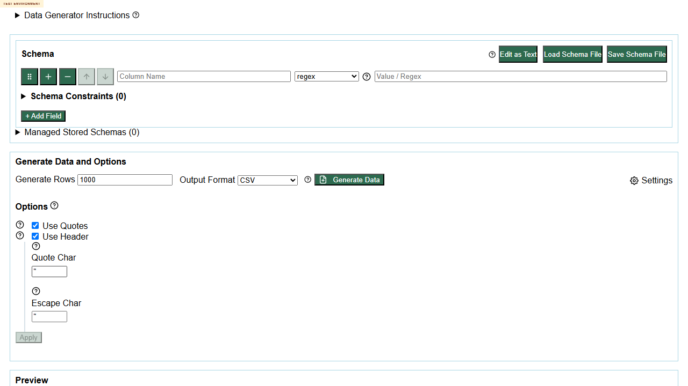

# Issue 228 Deployment Monitor Log

## 2026-06-24T23:05:55+01:00

### Objective

Monitor `https://eviltester.github.io/grid-table-editor/` for a new deployed version. When the deployed version changes, start the next full multi-agent exploratory retest session for issue #228 / PR #243 under the next ordinal folder.

### Last Completed Review Baseline

- Folder: `../issue-228-002/`
- Branch: `codex/228-improve-command-definition`
- Commit: `fb9e8e2049e1`
- Built: `2026-06-24T20:13:50.037Z`

### Current Deployment Check

- URL checked: `https://eviltester.github.io/grid-table-editor/`
- HTTP result: `200`
- Branch shown by deployed page: `codex/228-improve-command-definition`
- Commit shown by deployed page: `fb9e8e2049e1`
- Built shown by deployed page: `2026-06-24T20:13:50.037Z`
- `site-config.json`: `404`
- `version.json`: `404`

### Browser Interaction Proof

- Tool: Playwright CLI via `npx.cmd --yes --package @playwright/cli playwright-cli`
- Initial browser open hit transient `net::ERR_CONNECTION_RESET`.
- Retry with `goto https://eviltester.github.io/grid-table-editor/` succeeded.
- Snapshot confirmed rendered build metadata and the `Open generator.html` link.
- Clicked `Open generator.html`.
- Browser landed on `https://eviltester.github.io/grid-table-editor/generator.html`.
- Page title after click: `Data Generator - AnyWayData`.
- Screenshot: `screenshots/20260624-220547-generator-browser-proof.png`

### Trigger Decision

No new full exploratory retest session was started.

Reason: the deployed build metadata exactly matches the latest completed review baseline in `../issue-228-002/`. The next full review should start only when branch, commit, or build timestamp changes.

### Automation Constraint

The first automation lookup did not expose a callable automation tool. A follow-up lookup exposed the Codex app automation tool, and I created an active heartbeat monitor.

- Automation id: `issue-228-deployed-testenv-monitor`
- Kind: heartbeat
- Destination: current thread
- Schedule: every 10 minutes
- Behavior: compare deployed build metadata to the latest completed issue #228 review bundle and this monitor log; append monitor evidence if unchanged; start the next full multi-agent retest session only when branch, commit, or build timestamp changes.

## 2026-06-24T23:07:54+01:00

### Current Deployment Check

- URL checked: `https://eviltester.github.io/grid-table-editor/?monitor=2026-06-24T23%3A07%3A32.9589834%2B01%3A00`
- First plain HTTP check result: transient transport reset, `Unable to write data to the transport connection: An existing connection was forcibly closed by the remote host.`
- Retry HTTP result: `200`
- Branch shown by deployed page: `codex/228-improve-command-definition`
- Commit shown by deployed page: `fb9e8e2049e1`
- Built shown by deployed page: `2026-06-24T20:13:50.037Z`

### Browser Reachability

- Tool: Playwright CLI via `npx.cmd --yes --package @playwright/cli playwright-cli`
- Action: `goto https://eviltester.github.io/grid-table-editor/`
- Browser result: reached `https://eviltester.github.io/grid-table-editor/`
- Page title: `Grid Table Editor Test Environment`

### Trigger Decision

No new full exploratory retest session was started.

Reason: the deployed branch, commit, and build timestamp still match the latest completed review baseline in `../issue-228-002/`.

## 2026-06-24T23:08:57+01:00

### Current Deployment Check

- URL checked: `https://eviltester.github.io/grid-table-editor/?monitor=2026-06-24T23%3A08%3A46.3382185%2B01%3A00`
- Raw HTTP result: transient SSL failure, `The SSL connection could not be established, see inner exception.`
- Browser fallback: Playwright reached `https://eviltester.github.io/grid-table-editor/`
- Page title: `Grid Table Editor Test Environment`
- Branch shown by deployed page: `codex/228-improve-command-definition`
- Commit shown by deployed page: `fb9e8e2049e1`
- Built shown by deployed page: `2026-06-24T20:13:50.037Z`

### Trigger Decision

No new full exploratory retest session was started.

Reason: browser-rendered deployed metadata still matches the latest completed review baseline in `../issue-228-002/`.

## 2026-06-24T23:09:55+01:00

### Current Deployment Check

- URL checked: `https://eviltester.github.io/grid-table-editor/?monitor=2026-06-24T23%3A09%3A46.1223177%2B01%3A00`
- Raw HTTP result: transient SSL failure, `The SSL connection could not be established, see inner exception.`
- Browser fallback: Playwright reached `https://eviltester.github.io/grid-table-editor/`
- Page title: `Grid Table Editor Test Environment`
- Branch shown by deployed page: `codex/228-improve-command-definition`
- Commit shown by deployed page: `fb9e8e2049e1`
- Built shown by deployed page: `2026-06-24T20:13:50.037Z`

### Trigger Decision

No new full exploratory retest session was started.

Reason: browser-rendered deployed metadata still matches the latest completed review baseline in `../issue-228-002/`.

## 2026-06-24T23:10:51+01:00

### Current Deployment Check

- URL checked: `https://eviltester.github.io/grid-table-editor/?monitor=2026-06-24T23%3A10%3A41.3526802%2B01%3A00`
- Raw HTTP result: transient SSL failure, `The SSL connection could not be established, see inner exception.`
- Browser fallback: Playwright reached `https://eviltester.github.io/grid-table-editor/`
- Page title: `Grid Table Editor Test Environment`
- Branch shown by deployed page: `codex/228-improve-command-definition`
- Commit shown by deployed page: `fb9e8e2049e1`
- Built shown by deployed page: `2026-06-24T20:13:50.037Z`

### Trigger Decision

No new full exploratory retest session was started.

Reason: browser-rendered deployed metadata still matches the latest completed review baseline in `../issue-228-002/`.

## 2026-06-24T23:12:18+01:00

### Current Deployment Check

- URL checked: `https://eviltester.github.io/grid-table-editor/?monitor=2026-06-24T23%3A12%3A12.8712411%2B01%3A00`
- Raw HTTP result: `200`
- Browser check: Playwright reached `https://eviltester.github.io/grid-table-editor/`
- Page title: `Grid Table Editor Test Environment`
- Branch shown by deployed page: `codex/228-improve-command-definition`
- Commit shown by deployed page: `fb9e8e2049e1`
- Built shown by deployed page: `2026-06-24T20:13:50.037Z`

### Trigger Decision

No new full exploratory retest session was started.

Reason: deployed metadata still matches the latest completed review baseline in `../issue-228-002/`.

## 2026-06-24T23:14:23+01:00

### Current Deployment Check

- URL checked: `https://eviltester.github.io/grid-table-editor/?monitor=2026-06-24T23%3A14%3A12.7160778%2B01%3A00`
- Raw HTTP result: transient SSL failure, `The SSL connection could not be established, see inner exception.`
- Browser fallback: Playwright reached `https://eviltester.github.io/grid-table-editor/`
- Page title: `Grid Table Editor Test Environment`
- Branch shown by deployed page: `codex/228-improve-command-definition`
- Commit shown by deployed page: `fb9e8e2049e1`
- Built shown by deployed page: `2026-06-24T20:13:50.037Z`

### Trigger Decision

No new full exploratory retest session was started.

Reason: browser-rendered deployed metadata still matches the latest completed review baseline in `../issue-228-002/`.

## 2026-06-24T23:15:23+01:00

### Current Deployment Check

- URL checked: `https://eviltester.github.io/grid-table-editor/?monitor=2026-06-24T23%3A15%3A18.1629831%2B01%3A00`
- Raw HTTP result: `200`
- Browser check: Playwright reached `https://eviltester.github.io/grid-table-editor/`
- Page title: `Grid Table Editor Test Environment`
- Branch shown by deployed page: `codex/228-improve-command-definition`
- Commit shown by deployed page: `fb9e8e2049e1`
- Built shown by deployed page: `2026-06-24T20:13:50.037Z`

### Trigger Decision

No new full exploratory retest session was started.

Reason: deployed metadata still matches the latest completed review baseline in `../issue-228-002/`.

## 2026-06-24T23:16:26+01:00

### Current Deployment Check

- URL checked: `https://eviltester.github.io/grid-table-editor/?monitor=2026-06-24T23%3A16%3A19.3815534%2B01%3A00`
- Raw HTTP result: `200`
- Browser check: Playwright reached `https://eviltester.github.io/grid-table-editor/`
- Page title: `Grid Table Editor Test Environment`
- Branch shown by deployed page: `codex/228-improve-command-definition`
- Commit shown by deployed page: `fb9e8e2049e1`
- Built shown by deployed page: `2026-06-24T20:13:50.037Z`

### Trigger Decision

No new full exploratory retest session was started.

Reason: deployed metadata still matches the latest completed review baseline in `../issue-228-002/`.

## 2026-06-24T23:17:26+01:00

### Current Deployment Check

- URL checked: `https://eviltester.github.io/grid-table-editor/?monitor=2026-06-24T23%3A17%3A20.7301887%2B01%3A00`
- Raw HTTP result: `200`
- Browser check: Playwright reached `https://eviltester.github.io/grid-table-editor/`
- Page title: `Grid Table Editor Test Environment`
- Branch shown by deployed page: `codex/228-improve-command-definition`
- Commit shown by deployed page: `fb9e8e2049e1`
- Built shown by deployed page: `2026-06-24T20:13:50.037Z`

### Trigger Decision

No new full exploratory retest session was started.

Reason: deployed metadata still matches the latest completed review baseline in `../issue-228-002/`.

## 2026-06-24T23:18:33+01:00

### Current Deployment Check

- URL checked: `https://eviltester.github.io/grid-table-editor/?monitor=2026-06-24T23%3A18%3A21.6785137%2B01%3A00`
- Raw HTTP result: transient SSL failure, `The SSL connection could not be established, see inner exception.`
- Browser fallback: Playwright reached `https://eviltester.github.io/grid-table-editor/`
- Page title: `Grid Table Editor Test Environment`
- Branch shown by deployed page: `codex/228-improve-command-definition`
- Commit shown by deployed page: `fb9e8e2049e1`
- Built shown by deployed page: `2026-06-24T20:13:50.037Z`

### Trigger Decision

No new full exploratory retest session was started.

Reason: browser-rendered deployed metadata still matches the latest completed review baseline in `../issue-228-002/`.

## 2026-06-24T23:19:39+01:00

### Current Deployment Check

- URL checked: `https://eviltester.github.io/grid-table-editor/?monitor=2026-06-24T23%3A19%3A32.1052433%2B01%3A00`
- Raw HTTP result: `200`
- Browser check: Playwright reached `https://eviltester.github.io/grid-table-editor/`
- Page title: `Grid Table Editor Test Environment`
- Branch shown by deployed page: `codex/228-improve-command-definition`
- Commit shown by deployed page: `fb9e8e2049e1`
- Built shown by deployed page: `2026-06-24T20:13:50.037Z`

### Trigger Decision

No new full exploratory retest session was started.

Reason: deployed metadata still matches the latest completed review baseline in `../issue-228-002/`.

## 2026-06-24T23:20:51+01:00

### Current Deployment Check

- URL checked: `https://eviltester.github.io/grid-table-editor/?monitor=2026-06-24T23%3A20%3A42.6211147%2B01%3A00`
- Raw HTTP result: `200`
- Browser check: Playwright reached `https://eviltester.github.io/grid-table-editor/`
- Page title: `Grid Table Editor Test Environment`
- Branch shown by deployed page: `codex/228-improve-command-definition`
- Commit shown by deployed page: `fb9e8e2049e1`
- Built shown by deployed page: `2026-06-24T20:13:50.037Z`

### Trigger Decision

No new full exploratory retest session was started.

Reason: deployed metadata still matches the latest completed review baseline in `../issue-228-002/`.

## 2026-06-24T23:21:58+01:00

### Current Deployment Check

- URL checked: `https://eviltester.github.io/grid-table-editor/?monitor=2026-06-24T23%3A21%3A49.4521212%2B01%3A00`
- Raw HTTP result: `200`
- Browser check: Playwright reached `https://eviltester.github.io/grid-table-editor/`
- Page title: `Grid Table Editor Test Environment`
- Branch shown by deployed page: `codex/228-improve-command-definition`
- Commit shown by deployed page: `fb9e8e2049e1`
- Built shown by deployed page: `2026-06-24T20:13:50.037Z`

### Trigger Decision

No new full exploratory retest session was started.

Reason: deployed metadata still matches the latest completed review baseline in `../issue-228-002/`.

## 2026-06-24T23:22:58+01:00

### Current Deployment Check

- URL checked: `https://eviltester.github.io/grid-table-editor/?monitor=2026-06-24T23%3A22%3A52.8342485%2B01%3A00`
- Raw HTTP result: `200`
- Browser check: Playwright reached `https://eviltester.github.io/grid-table-editor/`
- Page title: `Grid Table Editor Test Environment`
- Branch shown by deployed page: `codex/228-improve-command-definition`
- Commit shown by deployed page: `fb9e8e2049e1`
- Built shown by deployed page: `2026-06-24T20:13:50.037Z`

### Trigger Decision

No new full exploratory retest session was started.

Reason: deployed metadata still matches the latest completed review baseline in `../issue-228-002/`.

## 2026-06-24T23:24:03+01:00

### Current Deployment Check

- URL checked: `https://eviltester.github.io/grid-table-editor/?monitor=2026-06-24T23%3A23%3A58.2510075%2B01%3A00`
- Raw HTTP result: `200`
- Browser check: Playwright reached `https://eviltester.github.io/grid-table-editor/`
- Page title: `Grid Table Editor Test Environment`
- Branch shown by deployed page: `codex/228-improve-command-definition`
- Commit shown by deployed page: `fb9e8e2049e1`
- Built shown by deployed page: `2026-06-24T20:13:50.037Z`

### Trigger Decision

No new full exploratory retest session was started.

Reason: deployed metadata still matches the latest completed review baseline in `../issue-228-002/`.

## 2026-06-24T23:25:13+01:00

### Current Deployment Check

- URL checked: `https://eviltester.github.io/grid-table-editor/?monitor=2026-06-24T23%3A25%3A05.1293697%2B01%3A00`
- Raw HTTP result: `200`
- Browser check: Playwright reached `https://eviltester.github.io/grid-table-editor/`
- Page title: `Grid Table Editor Test Environment`
- Branch shown by deployed page: `codex/228-improve-command-definition`
- Commit shown by deployed page: `fb9e8e2049e1`
- Built shown by deployed page: `2026-06-24T20:13:50.037Z`

### Trigger Decision

No new full exploratory retest session was started.

Reason: deployed metadata still matches the latest completed review baseline in `../issue-228-002/`.

## 2026-06-24T23:26:29+01:00

### Current Deployment Check

- URL checked: `https://eviltester.github.io/grid-table-editor/?monitor=2026-06-24T23%3A26%3A23.4581715%2B01%3A00`
- Raw HTTP result: `200`
- Browser check: Playwright reached `https://eviltester.github.io/grid-table-editor/`
- Page title: `Grid Table Editor Test Environment`
- Branch shown by deployed page: `codex/228-improve-command-definition`
- Commit shown by deployed page: `fb9e8e2049e1`
- Built shown by deployed page: `2026-06-24T20:13:50.037Z`

### Trigger Decision

No new full exploratory retest session was started.

Reason: deployed metadata still matches the latest completed review baseline in `../issue-228-002/`.

## 2026-06-24T23:27:42+01:00

### Current Deployment Check

- URL checked: `https://eviltester.github.io/grid-table-editor/?monitor=2026-06-24T23%3A27%3A34.7200089%2B01%3A00`
- Raw HTTP result: `200`
- Browser check: Playwright reached `https://eviltester.github.io/grid-table-editor/`
- Page title: `Grid Table Editor Test Environment`
- Branch shown by deployed page: `codex/228-improve-command-definition`
- Commit shown by deployed page: `fb9e8e2049e1`
- Built shown by deployed page: `2026-06-24T20:13:50.037Z`

### Trigger Decision

No new full exploratory retest session was started.

Reason: deployed metadata still matches the latest completed review baseline in `../issue-228-002/`.

## 2026-06-24T23:28:52+01:00

### Current Deployment Check

- URL checked: `https://eviltester.github.io/grid-table-editor/?monitor=2026-06-24T23%3A28%3A43.6979994%2B01%3A00`
- Raw HTTP result: `200`
- Browser check: Playwright reached `https://eviltester.github.io/grid-table-editor/`
- Page title: `Grid Table Editor Test Environment`
- Branch shown by deployed page: `codex/228-improve-command-definition`
- Commit shown by deployed page: `fb9e8e2049e1`
- Built shown by deployed page: `2026-06-24T20:13:50.037Z`

### Trigger Decision

No new full exploratory retest session was started.

Reason: deployed metadata still matches the latest completed review baseline in `../issue-228-002/`.

## 2026-06-24T23:32:34+01:00

### Current Deployment Check

- URL checked: `https://eviltester.github.io/grid-table-editor/?monitor=2026-06-24T23%3A32%3A12.3651514%2B01%3A00`
- Raw HTTP result: `200`
- Browser check: Playwright reached `https://eviltester.github.io/grid-table-editor/`
- Page title: `Grid Table Editor Test Environment`
- Branch shown by deployed page: `codex/228-improve-command-definition`
- Commit shown by deployed page: `fb9e8e2049e1`
- Built shown by deployed page: `2026-06-24T20:13:50.037Z`

### Trigger Decision

No new full exploratory retest session was started.

Reason: deployed metadata still matches the latest completed review baseline in `../issue-228-002/`.

## 2026-06-24T23:33:43+01:00

### Current Deployment Check

- URL checked: `https://eviltester.github.io/grid-table-editor/?monitor=2026-06-24T23%3A33%3A34.6012200%2B01%3A00`
- Raw HTTP result: `200`
- Browser check: Playwright reached `https://eviltester.github.io/grid-table-editor/`
- Page title: `Grid Table Editor Test Environment`
- Branch shown by deployed page: `codex/228-improve-command-definition`
- Commit shown by deployed page: `fb9e8e2049e1`
- Built shown by deployed page: `2026-06-24T20:13:50.037Z`

### Trigger Decision

No new full exploratory retest session was started.

Reason: deployed metadata still matches the latest completed review baseline in `../issue-228-002/`.

## 2026-06-24T23:35:05+01:00

### Current Deployment Check

- URL checked: `https://eviltester.github.io/grid-table-editor/?monitor=2026-06-24T23%3A34%3A58.7191519%2B01%3A00`
- Raw HTTP result: `200`
- Browser check: Playwright reached `https://eviltester.github.io/grid-table-editor/`
- Page title: `Grid Table Editor Test Environment`
- Branch shown by deployed page: `codex/228-improve-command-definition`
- Commit shown by deployed page: `fb9e8e2049e1`
- Built shown by deployed page: `2026-06-24T20:13:50.037Z`

### Trigger Decision

No new full exploratory retest session was started.

Reason: deployed metadata still matches the latest completed review baseline in `../issue-228-002/`.

## 2026-06-24T23:36:28+01:00

### Current Deployment Check

- URL checked: `https://eviltester.github.io/grid-table-editor/?monitor=2026-06-24T23%3A36%3A18.3598502%2B01%3A00`
- Raw HTTP result: `200`
- Browser check: Playwright reached `https://eviltester.github.io/grid-table-editor/`
- Page title: `Grid Table Editor Test Environment`
- Branch shown by deployed page: `codex/228-improve-command-definition`
- Commit shown by deployed page: `fb9e8e2049e1`
- Built shown by deployed page: `2026-06-24T20:13:50.037Z`

### Trigger Decision

No new full exploratory retest session was started.

Reason: deployed metadata still matches the latest completed review baseline in `../issue-228-002/`.

## 2026-06-24T23:37:53+01:00

### Current Deployment Check

- URL checked: `https://eviltester.github.io/grid-table-editor/?monitor=2026-06-24T23%3A37%3A38.8380240%2B01%3A00`
- Raw HTTP result: `200`
- Browser check: Playwright reached `https://eviltester.github.io/grid-table-editor/`
- Page title: `Grid Table Editor Test Environment`
- Branch shown by deployed page: `codex/228-improve-command-definition`
- Commit shown by deployed page: `fb9e8e2049e1`
- Built shown by deployed page: `2026-06-24T20:13:50.037Z`

### Trigger Decision

No new full exploratory retest session was started.

Reason: deployed metadata still matches the latest completed review baseline in `../issue-228-002/`.

## 2026-06-24T23:39:11+01:00

### Current Deployment Check

- URL checked: `https://eviltester.github.io/grid-table-editor/?monitor=2026-06-24T23%3A39%3A04.6406425%2B01%3A00`
- Raw HTTP result: `200`
- Browser check: Playwright reached `https://eviltester.github.io/grid-table-editor/`
- Page title: `Grid Table Editor Test Environment`
- Branch shown by deployed page: `codex/228-improve-command-definition`
- Commit shown by deployed page: `fb9e8e2049e1`
- Built shown by deployed page: `2026-06-24T20:13:50.037Z`

### Trigger Decision

No new full exploratory retest session was started.

Reason: deployed metadata still matches the latest completed review baseline in `../issue-228-002/`.

## 2026-06-24T23:40:23+01:00

### Current Deployment Check

- URL checked: `https://eviltester.github.io/grid-table-editor/?monitor=2026-06-24T23%3A40%3A16.9668025%2B01%3A00`
- Raw HTTP result: `200`
- Browser check: Playwright reached `https://eviltester.github.io/grid-table-editor/`
- Page title: `Grid Table Editor Test Environment`
- Branch shown by deployed page: `codex/228-improve-command-definition`
- Commit shown by deployed page: `fb9e8e2049e1`
- Built shown by deployed page: `2026-06-24T20:13:50.037Z`

### Trigger Decision

No new full exploratory retest session was started.

Reason: deployed metadata still matches the latest completed review baseline in `../issue-228-002/`.

## 2026-06-24T23:41:40+01:00

### Current Deployment Check

- URL checked: `https://eviltester.github.io/grid-table-editor/?monitor=2026-06-24T23%3A41%3A30.5867218%2B01%3A00`
- Raw HTTP result: `200`
- Browser check: Playwright reached `https://eviltester.github.io/grid-table-editor/`
- Page title: `Grid Table Editor Test Environment`
- Branch shown by deployed page: `codex/228-improve-command-definition`
- Commit shown by deployed page: `fb9e8e2049e1`
- Built shown by deployed page: `2026-06-24T20:13:50.037Z`

### Trigger Decision

No new full exploratory retest session was started.

Reason: deployed metadata still matches the latest completed review baseline in `../issue-228-002/`.

## 2026-06-24T23:42:54+01:00

### Current Deployment Check

- URL checked: `https://eviltester.github.io/grid-table-editor/?monitor=2026-06-24T23%3A42%3A48.0078371%2B01%3A00`
- Raw HTTP result: `200`
- Browser check: Playwright reached `https://eviltester.github.io/grid-table-editor/`
- Page title: `Grid Table Editor Test Environment`
- Branch shown by deployed page: `codex/228-improve-command-definition`
- Commit shown by deployed page: `fb9e8e2049e1`
- Built shown by deployed page: `2026-06-24T20:13:50.037Z`

### Trigger Decision

No new full exploratory retest session was started.

Reason: deployed metadata still matches the latest completed review baseline in `../issue-228-002/`.

## 2026-06-24T23:44:19+01:00

### Current Deployment Check

- URL checked: `https://eviltester.github.io/grid-table-editor/?monitor=2026-06-24T23%3A44%3A03.4672895%2B01%3A00`
- Raw HTTP result: transient SSL failure, `The SSL connection could not be established, see inner exception.`
- Browser fallback: Playwright reached `https://eviltester.github.io/grid-table-editor/`
- Page title: `Grid Table Editor Test Environment`
- Branch shown by deployed page: `codex/228-improve-command-definition`
- Commit shown by deployed page: `fb9e8e2049e1`
- Built shown by deployed page: `2026-06-24T20:13:50.037Z`

### Trigger Decision

No new full exploratory retest session was started.

Reason: browser-rendered deployed metadata still matches the latest completed review baseline in `../issue-228-002/`.

## 2026-06-24T23:46:31+01:00

### Current Deployment Check

- URL checked: `https://eviltester.github.io/grid-table-editor/?monitor=2026-06-24T23%3A46%3A29.0567533%2B01%3A00`
- Raw HTTP result: `200`
- Browser check: Playwright reached `https://eviltester.github.io/grid-table-editor/`
- Page title: `Grid Table Editor Test Environment`
- Branch shown by deployed page: `codex/228-improve-command-definition`
- Commit shown by deployed page: `fb9e8e2049e1`
- Built shown by deployed page: `2026-06-24T20:13:50.037Z`

### Trigger Decision

No new full exploratory retest session was started.

Reason: deployed metadata still matches the latest completed review baseline in `../issue-228-002/`.

## 2026-06-24T23:48:18+01:00

### Current Deployment Check

- URL checked: `https://eviltester.github.io/grid-table-editor/?monitor=2026-06-24T23%3A48%3A15.4640757%2B01%3A00`
- Raw HTTP result: transient SSL failure, `The SSL connection could not be established, see inner exception.`
- Browser fallback: Playwright reached `https://eviltester.github.io/grid-table-editor/`
- Page title: `Grid Table Editor Test Environment`
- Branch shown by deployed page: `codex/228-improve-command-definition`
- Commit shown by deployed page: `fb9e8e2049e1`
- Built shown by deployed page: `2026-06-24T20:13:50.037Z`

### Trigger Decision

No new full exploratory retest session was started.

Reason: browser-rendered deployed metadata still matches the latest completed review baseline in `../issue-228-002/`.

## 2026-06-24T23:49:19+01:00

### Current Deployment Check

- URL checked: `https://eviltester.github.io/grid-table-editor/?monitor=2026-06-24T23%3A49%3A16.8934155%2B01%3A00`
- Raw HTTP result: transient SSL failure, `The SSL connection could not be established, see inner exception.`
- Browser fallback: Playwright reached `https://eviltester.github.io/grid-table-editor/`
- Page title: `Grid Table Editor Test Environment`
- Branch shown by deployed page: `codex/228-improve-command-definition`
- Commit shown by deployed page: `fb9e8e2049e1`
- Built shown by deployed page: `2026-06-24T20:13:50.037Z`

### Trigger Decision

No new full exploratory retest session was started.

Reason: browser-rendered deployed metadata still matches the latest completed review baseline in `../issue-228-002/`.

## 2026-06-24T23:50:26+01:00

### Current Deployment Check

- URL checked: `https://eviltester.github.io/grid-table-editor/?monitor=2026-06-24T23%3A50%3A23.0812663%2B01%3A00`
- Raw HTTP result: transient SSL failure, `The SSL connection could not be established, see inner exception.`
- Browser fallback: Playwright reached `https://eviltester.github.io/grid-table-editor/`
- Page title: `Grid Table Editor Test Environment`
- Branch shown by deployed page: `codex/228-improve-command-definition`
- Commit shown by deployed page: `fb9e8e2049e1`
- Built shown by deployed page: `2026-06-24T20:13:50.037Z`

### Trigger Decision

No new full exploratory retest session was started.

Reason: browser-rendered deployed metadata still matches the latest completed review baseline in `../issue-228-002/`.

## 2026-06-24T23:51:35+01:00

### Current Deployment Check

- URL checked: `https://eviltester.github.io/grid-table-editor/?monitor=2026-06-24T23%3A51%3A32.6362359%2B01%3A00`
- Raw HTTP result: `200`
- Browser check: Playwright reached `https://eviltester.github.io/grid-table-editor/`
- Page title: `Grid Table Editor Test Environment`
- Branch shown by deployed page: `codex/228-improve-command-definition`
- Commit shown by deployed page: `fb9e8e2049e1`
- Built shown by deployed page: `2026-06-24T20:13:50.037Z`

### Trigger Decision

No new full exploratory retest session was started.

Reason: deployed metadata still matches the latest completed review baseline in `../issue-228-002/`.

## 2026-06-24T23:52:32+01:00

### Current Deployment Check

- URL checked: `https://eviltester.github.io/grid-table-editor/?monitor=2026-06-24T23%3A52%3A30.0514448%2B01%3A00`
- Raw HTTP result: `200`
- Browser check: Playwright reached `https://eviltester.github.io/grid-table-editor/`
- Page title: `Grid Table Editor Test Environment`
- Branch shown by deployed page: `codex/228-improve-command-definition`
- Commit shown by deployed page: `fb9e8e2049e1`
- Built shown by deployed page: `2026-06-24T20:13:50.037Z`

### Trigger Decision

No new full exploratory retest session was started.

Reason: deployed metadata still matches the latest completed review baseline in `../issue-228-002/`.

## 2026-06-24T23:53:33+01:00

### Current Deployment Check

- URL checked: `https://eviltester.github.io/grid-table-editor/?monitor=2026-06-24T23%3A53%3A30.5644478%2B01%3A00`
- Raw HTTP result: transient SSL failure, `The SSL connection could not be established, see inner exception.`
- Browser fallback: Playwright reached `https://eviltester.github.io/grid-table-editor/`
- Page title: `Grid Table Editor Test Environment`
- Branch shown by deployed page: `codex/228-improve-command-definition`
- Commit shown by deployed page: `fb9e8e2049e1`
- Built shown by deployed page: `2026-06-24T20:13:50.037Z`

### Trigger Decision

No new full exploratory retest session was started.

Reason: browser-rendered deployed metadata still matches the latest completed review baseline in `../issue-228-002/`.

## 2026-06-24T23:54:41+01:00

### Current Deployment Check

- URL checked: `https://eviltester.github.io/grid-table-editor/?monitor=2026-06-24T23%3A54%3A37.1304341%2B01%3A00`
- Raw HTTP result: transient SSL failure, `The SSL connection could not be established, see inner exception.`
- Browser fallback: Playwright reached `https://eviltester.github.io/grid-table-editor/`
- Page title: `Grid Table Editor Test Environment`
- Branch shown by deployed page: `codex/228-improve-command-definition`
- Commit shown by deployed page: `fb9e8e2049e1`
- Built shown by deployed page: `2026-06-24T20:13:50.037Z`

### Trigger Decision

No new full exploratory retest session was started.

Reason: browser-rendered deployed metadata still matches the latest completed review baseline in `../issue-228-002/`.

## 2026-06-24T23:56:02+01:00

### Current Deployment Check

- URL checked: `https://eviltester.github.io/grid-table-editor/?monitor=2026-06-24T23%3A55%3A54.8920096%2B01%3A00`
- Raw HTTP result: transient SSL failure, `The SSL connection could not be established, see inner exception.`
- Browser fallback: Playwright reached `https://eviltester.github.io/grid-table-editor/`
- Page title: `Grid Table Editor Test Environment`
- Branch shown by deployed page: `codex/228-improve-command-definition`
- Commit shown by deployed page: `fb9e8e2049e1`
- Built shown by deployed page: `2026-06-24T20:13:50.037Z`

### Trigger Decision

No new full exploratory retest session was started.

Reason: browser-rendered deployed metadata still matches the latest completed review baseline in `../issue-228-002/`.

## 2026-06-24T23:57:18+01:00

### Current Deployment Check

- URL checked: `https://eviltester.github.io/grid-table-editor/?monitor=2026-06-24T23%3A57%3A13.8091908%2B01%3A00`
- Raw HTTP result: `200`
- Browser check: Playwright reached `https://eviltester.github.io/grid-table-editor/`
- Page title: `Grid Table Editor Test Environment`
- Branch shown by deployed page: `codex/228-improve-command-definition`
- Commit shown by deployed page: `fb9e8e2049e1`
- Built shown by deployed page: `2026-06-24T20:13:50.037Z`

### Trigger Decision

No new full exploratory retest session was started.

Reason: deployed metadata still matches the latest completed review baseline in `../issue-228-002/`.

## 2026-06-24T23:58:28+01:00

### Current Deployment Check

- URL checked: `https://eviltester.github.io/grid-table-editor/?monitor=2026-06-24T23%3A58%3A22.5415459%2B01%3A00`
- Raw HTTP result: transient SSL failure, `The SSL connection could not be established, see inner exception.`
- Browser fallback: Playwright reached `https://eviltester.github.io/grid-table-editor/`
- Page title: `Grid Table Editor Test Environment`
- Branch shown by deployed page: `codex/228-improve-command-definition`
- Commit shown by deployed page: `fb9e8e2049e1`
- Built shown by deployed page: `2026-06-24T20:13:50.037Z`

### Trigger Decision

No new full exploratory retest session was started.

Reason: browser-rendered deployed metadata still matches the latest completed review baseline in `../issue-228-002/`.

## 2026-06-24T23:59:50+01:00

### Current Deployment Check

- URL checked: `https://eviltester.github.io/grid-table-editor/?monitor=2026-06-24T23%3A59%3A47.5556770%2B01%3A00`
- Raw HTTP result: transient SSL failure, `The SSL connection could not be established, see inner exception.`
- Browser fallback: Playwright reached `https://eviltester.github.io/grid-table-editor/`
- Page title: `Grid Table Editor Test Environment`
- Branch shown by deployed page: `codex/228-improve-command-definition`
- Commit shown by deployed page: `fb9e8e2049e1`
- Built shown by deployed page: `2026-06-24T20:13:50.037Z`

### Trigger Decision

No new full exploratory retest session was started.

Reason: browser-rendered deployed metadata still matches the latest completed review baseline in `../issue-228-002/`.
