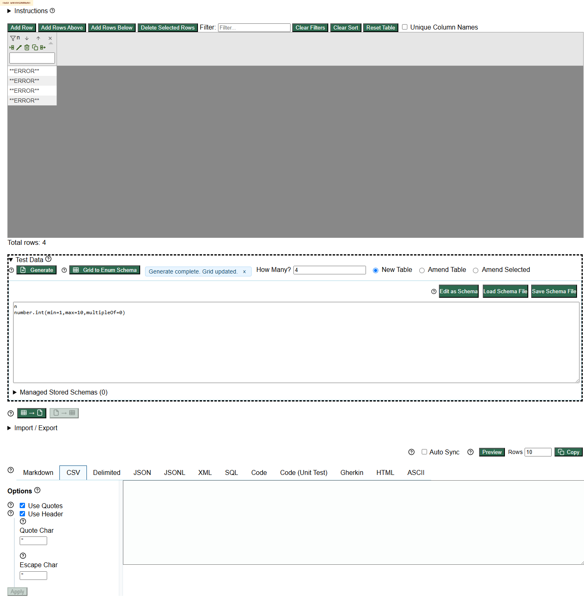

# Invalid Number And Date Constraints Generate Error Rows

## Summary

Invalid numeric/date constraints generate literal `**ERROR**` rows instead of failing validation before generation.

## Environment

- URL: https://eviltester.github.io/grid-table-editor/
- Deployment branch: `codex/228-improve-command-definition`
- Deployment commit: `a3b39ddcfe0f`
- Deployment build: `2026-06-24T23:03:43.621Z`

## Steps To Reproduce

Generator:

1. Open `generator.html`.
2. Click `Edit as Text`.
3. Enter:

   ```text
   n
   number.int(min=1,max=10,multipleOf=0)
   ```

4. Click `Preview`.
5. Repeat with:

   ```text
   d
   date.recent(days=-7)
   ```

App:

1. Open `app.html`.
2. Expand `Test Data`.
3. Generate with `number.int(min=1,max=10,multipleOf=0)`.

## Expected Result

Invalid constraints should fail validation before generation. The app should not report success when output contains internal `**ERROR**` placeholders.

## Actual Result

- Generator Preview produced `**ERROR**` rows for both invalid rules.
- App Generate reported `Generate complete. Grid updated.` for `multipleOf=0` and inserted `**ERROR**` rows.

## Evidence



Supporting raw evidence is in:

- `../negative-validation-matrix-results.json`
- `../negative-validation-recheck-results.json`
- `../negative-validation-app-sample-results.json`
- `negative-validation-defects.md`

## Repeatability

Repeated by the negative-validation subagent in generator Preview and sampled in the app flow.
