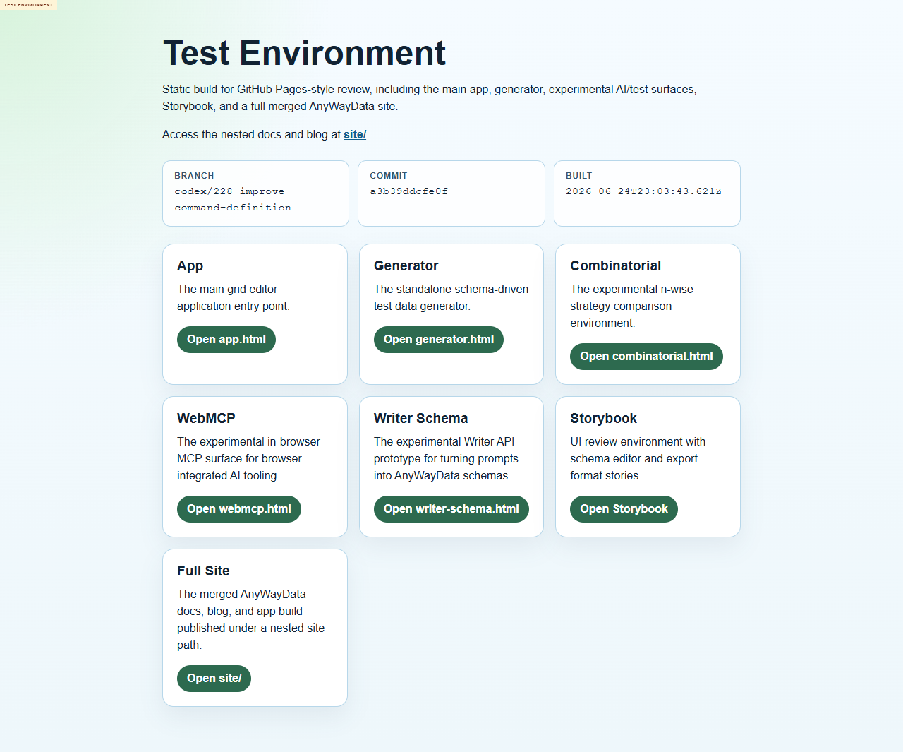
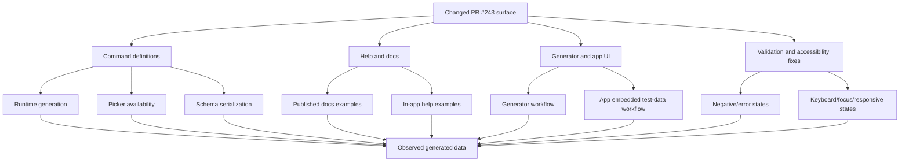

# Issue 228 Exploratory Test Report

## Executive Summary

This retest started because the deployed test environment changed to commit `a3b39ddcfe0f`, built `2026-06-24T23:03:43.621Z`. The prior completed review baseline was `../../20260624/issue-228-002/` at commit `fb9e8e2049e1`, built `2026-06-24T20:13:50.037Z`.

The broad command-definition refactor looks functionally promising for many positive paths: enum aliases, `datatype.enum`, compact enum lists, `datatype.boolean`, finance, commerce, date, number, science, system, autoIncrement, `helpers.fake`, schema import/export, app generation, and picker visibility all had meaningful passing coverage. However, the session found several medium-severity defects around validation, docs/runtime consistency, focus management, and accessible names. My recommendation is **not to treat the changes as fully acceptable yet** until the validation and accessibility defects are fixed or explicitly triaged.

## Scope And References

- Story: https://github.com/eviltester/grid-table-editor/issues/228
- PR: https://github.com/eviltester/grid-table-editor/pull/243
- Test environment: https://eviltester.github.io/grid-table-editor/
- Current deployed branch: `codex/228-improve-command-definition`
- Current deployed commit: `a3b39ddcfe0f`
- Current deployed build: `2026-06-24T23:03:43.621Z`
- Browser proof screenshot: 

## Planning Summary

### Scope Summary

Issue #228 targets maintainability and consistency of command definitions and help. The story asks to merge command definitions and help, reduce or remove dependency on `faker-command-help-metadata`, and rely on domain/faker keyword definitions as the source of truth. PR #243 additionally includes follow-up fixes for enum handling, accessibility, validation, and picker behavior.

### Risk Analysis

- Command definition refactoring can desynchronize runtime generation, UI pickers, inline validation, help text, examples, and published docs.
- Enum handling is high risk because the PR touches canonicalization, aliases, raw comma parsing, named values arguments, schema output, and generated values.
- Picker filtering is high risk because recent fixes distinguish known commands from allowed runtime picker commands.
- Accessibility and validation fixes need browser confirmation because they are user-facing and can regress silently.
- Docs are high risk because `datatype.enum` examples and aliases must match actual runtime behavior.

### Changed-Surface Inventory

Derived from the PR #243 files view:

- Generator and Storybook surfaces: generator page stories, schema panel stories.
- Docs surfaces: `docs-src/docs/040-test-data/domain/100-datatype.md`, matrix rationalization plan, method picker UI spec.
- App/generator UI: app page shell, import/export workspace, generator runtime schema services, schema row mapping, schema runtime, params editor modal, disclosure focus helper.
- Command/help definitions: domain command metadata, domain commands, domain keywords, keyword parser, faker helper definitions, command help validators.
- Enum data generation: enum parser, enum detection, enum validator, datatype enum keyword definitions, enum keyword definition, compiler, rules parser, schema conversion/adapter.
- Test matrix/support changes: interaction matrix fixtures/support and scenario selection.

### Command Coverage Strategy

Coverage must explicitly sample command families across:

- Domain datatype commands including `datatype.enum`, `datatype.boolean`, and alias forms.
- Enum-like shorthand forms such as raw comma lists, quoted lists, `enum(...)`, `enum value1,value2`, and `datatype.enum(values="...")`.
- Faker/helper commands that should remain available in runtime and helpers that should be hidden from runtime picker when not allowed.
- Commands with validators and constrained parameters such as numeric ranges, probabilities, dates, and enum values.
- Docs examples and UI help examples with multiple examples.

### Delegation Map

- Command coverage and example execution: broad positive runtime sampling across changed command families.
- Negative validation and malformed parameter testing: invalid enum, malformed named parameters, constrained values, and error messaging.
- Docs/help/content consistency: published docs, in-app help, method picker, and actual runtime behavior.
- UX/usability regression: generator, method picker, help modal/panels, app/generator shared workflows.
- Responsive/mobile and accessibility review: viewport changes, keyboard focus, disclosure/modal focus, labels, and screen-reader-oriented structure.
- Additional gap delegation: enum alias/canonicalization and cross-surface export/import normalization, because PR #243 is heavily enum-focused beyond generic command coverage.

### Model-Based Coverage Diagram

### Loop Strategy

Loop 1 will establish browser proof, execute broad initial coverage, record findings, and identify gaps. Loop 2 will review logs/report/coverage, generate at least 10 new ideas, classify them, execute all `execute-now` items, and update artifacts. Loop 3 will repeat with at least 10 additional ideas. A final review loop will revisit the story, PR summary, changed files, logs, coverage model, sampled commands, docs, examples, defects, and gaps before PDF generation.

## Test Techniques And Heuristics Used

Used techniques included exploratory testing, risk-based testing, equivalence partitioning, boundary analysis, negative testing, consistency/oracle checking, state/flow modeling, pairwise thinking, accessibility heuristics, responsive testing heuristics, and documentation testing.

Specific heuristics used:

- Use docs examples as executable oracles where the docs present them as generator schema examples.
- Compare app, generator, picker, docs, help, saved schema, imported schema, and runtime output for the same logical command.
- Anchor every suspected defect with deployed-environment evidence and repeat where practical.
- Continue broad command coverage after first defect discovery.
- Treat validation success messages that generate corrupted values or `**ERROR**` rows as high-risk even when the UI technically completes.

## Coverage

### Loop 1 Initial Coverage

- Browser proof: deployed index opened with Playwright and screenshot captured.
- Generator row-mode enum: `status` enum with `New,In Progress,Done` previewed successfully.
- Generator text-mode enum command forms: main-agent checks found repeatable failure for `enum(...)` forms when entered directly into text mode.
- Negative validation: subagent covered enum malformed values, bad quote, unknown named args, boolean probability bounds, number constraints, date constraints, helper attempts, generator/app consistency.
- Broad command coverage: subagent sampled docs/runtime behavior for enum, compact enum lists, datatype boolean, finance, commerce, date, number, science, system, autoIncrement, helpers.fake, and domain picker inventory.
- Docs surfaces reviewed so far: domain overview, datatype, person, location, finance, date, number, science, system, internet, commerce, autoIncrement, faker-test-data, schema definition.
- UX/workflow: generator enum preview, method picker search/apply, params editor application, generator schema save/load, app embedded Test Data generation, app grid-to-text/text-to-grid roundtrip.
- Responsive/accessibility: index, site, app, generator, combinatorial, WebMCP, writer-schema, Storybook across mobile/tablet/desktop viewport samples, tab-order traces, help/disclosure smoke, accessibility-tree name checks.

## Loops Performed

### Loop 1

Loop 1 established browser proof, seeded the planning report, delegated all required subagent lanes plus an enum canonicalization gap lane, ran initial generator enum coverage, integrated negative-validation findings, and integrated command-coverage findings.

Loop 1 gaps:

- Need direct runtime picker checks for disallowed helper methods after the recent fix request.
- Need app workflow spot checks outside generator text mode.
- Need docs link/path checks for changed generator references.
- Need final handling of remaining subagent logs and findings.
- Need looped follow-up execution beyond initial command/negative findings.

### Loop 2 Ideas

1. `execute-now`: Check deployed generator/domain/faker pickers for `helpers.enumValue`, `helpers.objectEntry`, `helpers.objectKey`, and `helpers.objectValue`.
2. `execute-now`: Check whether picker search exposes `datatype.enum` and `enum` help consistently.
3. `execute-now`: Recheck text-mode enum failure using command-coverage positive examples to confirm whether `enum("Open","Closed")` works in text mode.
4. `execute-now`: Check app.html Test Data basic valid enum generation with the new deployed commit.
5. `execute-now`: Check published docs for `generate.html` versus `generator.html` links.
6. `execute-now`: Check whether `location.cardinalDirection(abbreviated=true)` appears in docs search/page text and whether `location.direction(abbreviated=true)` is the right replacement.
7. `execute-now`: Check whether app/generator show useful visible errors for text-mode enum preview failure.
8. `defer`: Exhaustively execute all 253 domain picker commands.
9. `defer`: Full Storybook command picker cross-check.
10. `defer`: Full file-download content validation across every output format.
11. `execute-now`: Check helper docs examples for object-literal syntax alternatives that might be documented nearby.
12. `execute-now`: Check console messages after the text-mode enum preview failure.

Loop 2 execution and outcomes:

- Executed clean-state enum text-mode recheck and invalidated the earlier main-agent text-mode enum defect.
- Integrated docs-consistency and enum-canonicalization subagent results; both showed enum docs/help/picker/runtime mostly consistent for sampled accepted forms.
- Integrated UX and responsive/accessibility results.
- Confirmed helper picker visibility: domain picker hides helper-only commands, faker picker intentionally exposes helper commands.
- Confirmed stale `generate.html` route references via docs-consistency subagent.
- Confirmed `location.cardinalDirection(abbreviated=true)` docs/runtime mismatch and the working replacement `location.direction(abbreviated=true)`.
- Confirmed `helpers.mustache(...)` docs example rejection and broader faker object-argument docs/runtime mismatch.
- Deferred exhaustive domain picker and Storybook checks because current sampled coverage was broad and other risk areas were producing actionable findings.

### Loop 3 Ideas

1. `execute-now`: Reconcile duplicate/overlapping defect files so final report is clear.
2. `execute-now`: Review all subagent logs for coverage gaps and missed deliverables.
3. `execute-now`: Check that at least five subagent logs exist and include charters/heuristics.
4. `execute-now`: Verify all confirmed defects have a defect markdown file.
5. `execute-now`: Verify screenshots referenced by report/defects exist.
6. `execute-now`: Review sampled command families and explicitly mark deferred families.
7. `execute-now`: Ensure docs pages reviewed are listed.
8. `execute-now`: Ensure the false-positive text-mode enum defect is removed from confirmed defects.
9. `defer`: Re-run all public docs code blocks exhaustively through the generator.
10. `defer`: Use a real screen reader for assistive-tech validation.
11. `execute-now`: Validate that report includes final recommendation and remaining gaps.
12. `execute-now`: Prepare collated logs/defects content for PDF export.

Loop 3 execution and outcomes:

- Consolidated all subagent findings into this report.
- Removed the invalidated text-mode enum defect from the confirmed defect list.
- Preserved overlapping but distinct docs/runtime defect files where one broader defect and one narrower subagent defect both provide useful evidence.
- Verified required subagent logs exist for command coverage, negative validation, docs consistency, UX regression, responsive/accessibility, and enum canonicalization.
- Deferred exhaustive docs-code-block execution, full Storybook picker comparison, and assistive-tech screen-reader checks because sampled coverage was already broad and recent loops were producing fewer new high-value findings.

### Final Review Loop

Final review ideas:

1. `execute-now`: Recheck story #228 intent against report scope.
2. `execute-now`: Recheck PR #243 changed surface against coverage map.
3. `execute-now`: Recheck accumulated logs for loop evidence.
4. `execute-now`: Recheck sampled command-family list.
5. `execute-now`: Recheck docs pages reviewed list.
6. `execute-now`: Recheck examples tried list through subagent logs.
7. `execute-now`: Recheck defects folder for one-file-per-defect coverage.
8. `execute-now`: Recheck remaining gaps and deferred ideas.
9. `execute-now`: Generate `test-logs-and-defects.md` collating full log/defect content.
10. `execute-now`: Generate final PDFs only after report/log updates.
11. `defer`: Exhaustively compare all 253 domain picker entries against every docs page.
12. `defer`: Perform manual assistive technology pass with a screen reader.

Final review outcomes:

- Story intent was covered: command definitions/help consistency, reduced stale metadata risk, and command-family/help/docs/runtime alignment.
- PR changed surface was covered broadly: command/help definitions, enum parser/canonicalization, validators, generator/app schema flows, docs, picker behavior, modal/accessibility changes.
- Main and subagent logs were accumulated and will be collated into `test-logs-and-defects.md`.
- Stopping is justified because multiple loops completed, the final review produced mostly consolidation/deferred exhaustive ideas rather than new targeted execute-now product behavior, and broad coverage is demonstrated across command families, docs, generator, app, UX, responsive, and accessibility surfaces.

## Confirmed Defects

- [Bad enum quote generates corrupted values instead of failing](defects/issue-228-bad-enum-quote-generates-corrupted-values.md): malformed enum quote syntax is accepted and can generate `\\\"active` while app reports success.
- [Unknown enum named argument is accepted](defects/issue-228-unknown-enum-named-argument-is-accepted.md): `datatype.enum(valuez="active,pending")` is accepted instead of rejecting unknown `valuez`.
- [Boolean probability out of range is accepted](defects/issue-228-boolean-probability-out-of-range-is-accepted.md): `datatype.boolean(probability=2)` and `probability=-0.1` generate values despite the documented `0` to `1` range.
- [Invalid number and date constraints generate error rows](defects/issue-228-invalid-number-and-date-constraints-generate-error-rows.md): `number.int(...,multipleOf=0)` and `date.recent(days=-7)` produce `**ERROR**` rows rather than validation failures.
- [Empty or missing enum values have weak feedback](defects/issue-228-empty-or-missing-enum-values-have-weak-feedback.md): generator silently produces no output while app gives only `Check console for details`.
- [Domain overview documents invalid `location.cardinalDirection(abbreviated=true)` example](defects/DEFECT-command-docs-location-cardinaldirection-abbreviated.md): deployed runtime rejects `abbreviated` for `location.cardinalDirection`; `location.direction(abbreviated=true)` works.
- [Two public Faker Based Data examples do not execute](defects/DEFECT-faker-doc-examples-do-not-execute.md): documented `helpers.mustache(...)` callback example and direct faker object-argument example fail in the deployed generator.
- [Published docs still reference `generate.html`](defects/docs-still-reference-generate-html.md): deployed `generate.html` routes return 404 while docs still mention them; `generator.html` works.
- [Published `helpers.mustache` faker example is rejected](defects/faker-docs-helpers-mustache-example-rejected.md): same underlying docs/runtime mismatch as the broader faker examples defect, with narrower evidence for `helpers.mustache`.
- [Generator schema row tab order traps focus](defects/issue-228-generator-schema-row-tab-order-trap.md): from `Column Name`, tab cycles back through row action buttons and does not advance to method/value controls.
- [Generator and app controls expose empty accessible names](defects/issue-228-controls-missing-accessible-names.md): Chrome accessibility tree reports empty names for important generator/app controls.
- [Modal focus is not restored to trigger after Escape close](defects/issue-228-modal-focus-not-restored.md): method picker and params editor close on Escape but leave focus on `body`.
- [App embedded icon-only controls lack accessible names](defects/issue-228-app-icon-controls-missing-accessible-names.md): enabled app icon buttons lack visible text, `aria-label`, and `title`.

## Suspicious Behaviors And Risks

- Withdrawn/invalidated setup: an early main-agent check suggested text-mode enum did not preview, but Loop 2 clean-state recheck and two subagent lanes showed text-mode enum forms do preview correctly. The earlier finding was removed from confirmed defects.
- WebMCP mobile layout had a long method/card near the right edge in responsive sampling but did not create page-level horizontal scroll, so it remains a watch item.
- Method picker search under the `Faker` chip produced zero results for `email` without an empty-state message, but switching to `All` found matching commands; this is UX friction rather than a confirmed defect.

## Deferred Ideas

- Exhaustively execute every public docs code block through the deployed generator.
- Exhaustively sample all 253 domain picker commands.
- Full Storybook command picker and schema editor comparison.
- Manual assistive-technology pass with a real screen reader.
- 200% zoom and Windows high contrast review.
- Full generated-file content validation across every output format.
- Deployed-docs link checker for stale route names.
- Automated docs-example smoke harness for command metadata changes.

## What Was Not Covered And Why

- Not every domain command was executed; command coverage sampled broadly across high-risk families because exhaustive execution would be disproportionate for this retest.
- Storybook was covered by responsive/accessibility viewport smoke, but not by deep command-picker interaction; generator/app were higher priority for deployed runtime behavior.
- Full screen-reader testing was not performed; browser accessibility tree and keyboard heuristics were used instead.
- Full output-format export validation was not performed; schema save/load and core generator/app generation workflows were sampled.
- Local code, local build, repo tests, and package-manager commands were intentionally not run per operating rules.

## Final Recommendation

Do not merge or accept as complete without triage. Positive command-definition behavior is materially improved and broad enum canonicalization looks consistent, but medium validation and accessibility defects remain. The most important follow-ups are to reject malformed enum/invalid parameter inputs before generation, stop reporting success when `**ERROR**` rows are produced, update stale docs examples/routes, restore focus after modal close, and add accessible names to core controls.
