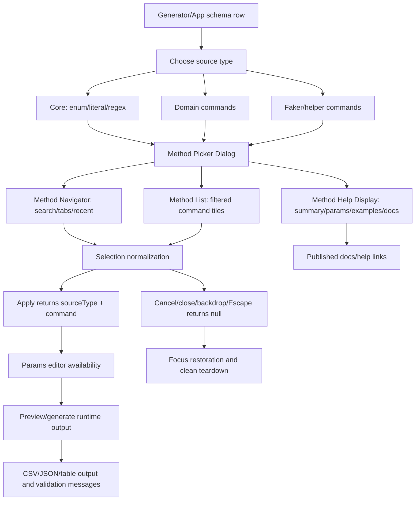
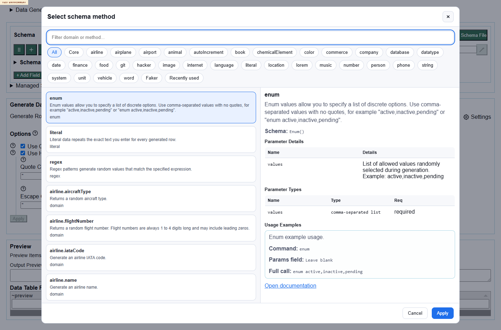
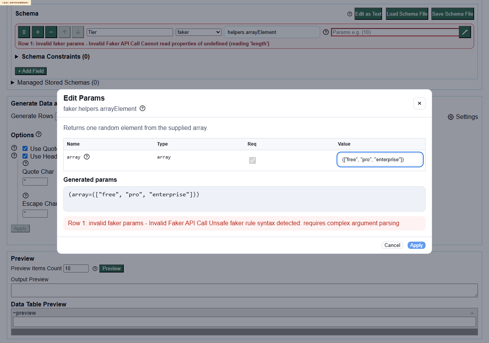
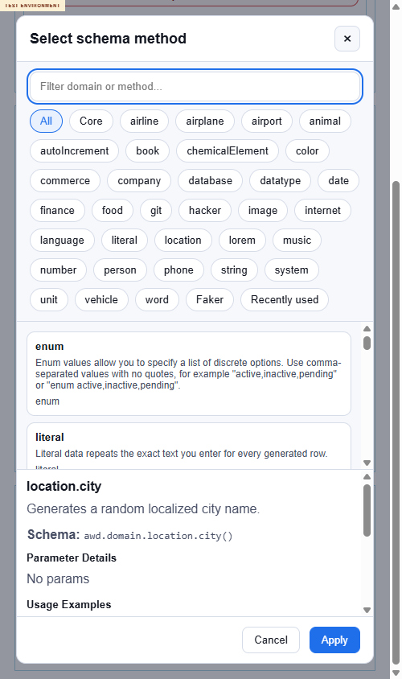
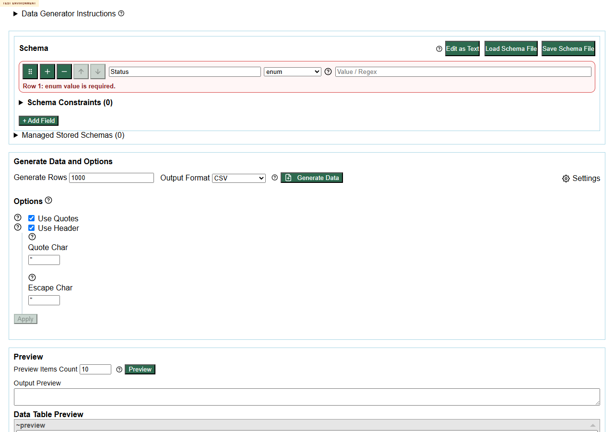

# Issue 230 Test Report

## Executive Summary

A comprehensive deployed-environment exploratory review was completed for issue #230 and PR #247 against `https://eviltester.github.io/grid-table-editor/` only. The deployed test environment identified itself as branch `codex/230-method-picker-mvc`, commit `04570e0e428d`, built `2026-06-25T21:29:58.356Z`, matching the PR head.

The Method Picker Dialog MVC refactor is present and broadly functional. The generator and app can open the new dialog, search methods, render the navigator/list/help display, apply domain/faker selections, preserve cancel semantics, and generate data for a representative spread of commands. Published Storybook contains Method Navigator, Method List, Method Help Display, and combined dialog stories.

Recommendation: not ready to accept without follow-up. The core story is substantially implemented, but several user-visible defects remain around picker-applied core commands, helper params, keyboard/focus behavior, modal scroll containment, and validation messaging.

## Scope and References

- Story: https://github.com/eviltester/grid-table-editor/issues/230
- PR: https://github.com/eviltester/grid-table-editor/pull/247
- Test environment: https://eviltester.github.io/grid-table-editor/
- Main app: https://eviltester.github.io/grid-table-editor/app.html
- Generator: https://eviltester.github.io/grid-table-editor/generator.html
- Published docs: https://eviltester.github.io/grid-table-editor/site/docs/intro
- Storybook: https://eviltester.github.io/grid-table-editor/storybook/index.html
- Session prompt: [issue-230-session-goal-prompt.md](issue-230-session-goal-prompt.md)
- Main sequential log: [issue-230-test-log.md](issue-230-test-log.md)

## Planning Summary

Issue #230 asked for a component-backed Method Picker Dialog with `MethodPickerDialogController`, `MethodPickerDialogView`, and `createMethodPickerDialog`, plus subcomponents for Method Navigator, Method List, and Method Help Display. PR #247 changed 21 files with 1689 additions and 795 deletions across Storybook, docs, new method-picker controllers/views/utilities, the compatibility modal wrapper, and focused tests.

Live deployed inventory after opening the method picker from `generator.html`:

- 36 tabs: All, Core, 33 family/category tabs, Faker, Recently used.
- 269 command tiles: 1 enum, 1 literal, 1 regex, 252 domain, 14 faker/helper.
- Families observed: airline, airplane, airport, animal, autoIncrement, book, chemicalElement, color, commerce, company, database, datatype, date, finance, food, git, hacker, image, internet, language, literal, location, lorem, music, number, person, phone, string, system, unit, vehicle, word, faker helpers.

## Delegation Summary

Six subagents were used as required:

- Galileo: command coverage and example execution, [logs/command-coverage-test-log.md](logs/command-coverage-test-log.md)
- Helmholtz: negative validation and malformed parameter testing, [logs/negative-validation-test-log.md](logs/negative-validation-test-log.md)
- Jason: docs/help/content consistency, [logs/docs-consistency-test-log.md](logs/docs-consistency-test-log.md)
- Planck: UX/usability and workflow regression, [logs/ux-regression-test-log.md](logs/ux-regression-test-log.md)
- Erdos: responsive/mobile and accessibility review, [logs/responsive-accessibility-test-log.md](logs/responsive-accessibility-test-log.md)
- Franklin: Storybook component parity and issue-story gap coverage, [logs/storybook-component-parity-test-log.md](logs/storybook-component-parity-test-log.md)

## Model-Based Coverage

## Techniques and Heuristics Used

Exploratory testing, risk-based testing, equivalence partitioning, boundary analysis, negative testing, consistency/oracle checking, state/flow modeling, pairwise thinking, accessibility heuristics, responsive testing heuristics, and documentation testing.

## Coverage Summary

Command families sampled end-to-end included core enum/literal/regex, commerce, internet, location, person, finance, date, datatype, string, system, vehicle, word, faker helpers, and removed/deprecated search probes. Loop 1 runtime matrix generated valid preview output for 15 representative command cases including `commerce.productName`, `commerce.price`, `internet.email`, `location.city`, `person.firstName`, `finance.iban`, `date.future`, `datatype.boolean`, `string.uuid`, `system.fileName`, `vehicle.vin`, and `word.words`.

Docs/pages reviewed included generating-data category, domain overview, commerce, datatype, internet, location, faker overview, faker helpers, regex, pairwise, CSV options, JSON options, Storybook docs, and Storybook method-picker iframe stories.

Storybook coverage was confirmed for Docs, Navigator Default, List Default, Help Display With Usage, Visual Always Open, Choose Faker Method, Filter And Choose Domain Method, and Cancel Method Selection.

Screenshots are stored in [screenshots](screenshots/). Support data is stored in [support](support/).

## Loops Performed

Loop 1: browser proof, story/PR review, changed-surface inventory, command inventory, initial method-picker interactions, broad command runtime matrix, docs scout, and subagent lane execution. This found the first command/params issues and modal accessibility risks.

Loop 2: reviewed logs and gaps, generated focused ideas, and executed rechecks for commerce params, helper array params, picker-applied core commands, `datatype.enum` search, no-match recovery, docs links, and recent/search behavior. This split confirmed defects from invalid setup and showed commerce params work through the params dialog.

Loop 3: completed delegated UX/docs/negative/responsive loops and consolidated additional keyboard, app integration, Storybook parity, docs consistency, and negative validation evidence.

Final review loop: reviewed story requirements, PR changed files, logs, coverage model, sampled families, docs, examples, defects, and gaps. Generated 12 final ideas, classified 5 as `execute-now`, executed all 5, and deferred 7 broader sweeps. Final executions reconfirmed Apply focus loss, Enter no-apply, background scroll, thin top-level domain/faker help, and Storybook/live docs-link base mismatch.

## Confirmed Defects

- [AD-001: helpers.arrayElement documented array params cannot be applied from the params editor](defects/AD-001-helper-arrayelement-params-unusable.md)
- [AD-002: Picker-applied enum and regex rows accept visible values but preview produces no data](defects/AD-002-core-enum-regex-picker-preview-no-output.md)
- [AD-003: Directly typed commerce.price help-style params are ignored while params-dialog values work](defects/AD-003-commerce-price-direct-help-params-ignored.md)
- [NV-002: Text schema unknown() is accepted as generated data instead of rejected](defects/NV-002-text-schema-unknown-call-accepted.md)
- [NV-003: Text-mode malformed schemas can show only a generic validation failure](defects/NV-003-text-mode-generic-validation-message.md)
- [NV-004: Top-level domain/faker help lacks params/examples compared with core command help](defects/NV-004-domain-faker-top-level-help-thin.md)
- [NV-005: Malformed faker params message can echo a malformed example](defects/NV-005-malformed-faker-params-example-echo.md)
- [RA-001: Method picker allows background page scroll](defects/RA-001-method-picker-background-scroll.md)
- [RA-002: All-methods dialog has very long Tab order](defects/RA-002-method-picker-long-tab-order.md)
- [RA-003: Method-picker filter button contrast below target](defects/RA-003-method-picker-filter-contrast.md)
- [RA-004: Direct Storybook iframe clips dialog top at narrow width](defects/RA-004-storybook-iframe-mobile-clipping.md)
- [RA-005: Option accessible names include neighboring help text](defects/RA-005-option-accessible-name-pollution.md)
- [UX-001: Apply does not restore focus](defects/ux-001-apply-does-not-restore-focus.md)
- [UX-002: Enter does not apply selected method](defects/ux-002-enter-does-not-apply-selected-method.md)
- [Docs candidate: Storybook docs links use production base while live picker uses deployed docs base](defects/docs-consistency-storybook-doc-link-base-mismatch-candidate.md)

## Evidence Highlights

Initial method picker inventory:

Helper params blocked in params editor:

Background scroll while modal remains open:

Picker-applied enum after value fill:

## Suspicious Behaviors and Risks

- Storybook uses a small mock catalog and labels the combined dialog `Choose Method`, while live generator uses a much larger real catalog and labels the dialog `Select schema method`.
- The picker opens from a domain row on the All tab with `enum` selected. This may be intentional cross-source discovery, but it increases risk around core command transitions.
- Hidden confirm/text-input dialogs remain in the DOM with `role="dialog"`; tests and assistive tech queries must distinguish hidden dialogs from the visible method picker.
- Some async validation/generation paths looked slow during short waits but recovered with longer waits.

## Deferred Ideas

- Exhaustively run all 269 commands end-to-end with either valid generated output or expected validation.
- Deep-run every faker helper with required and malformed params.
- Manual NVDA/VoiceOver screen-reader pass for modal announcements and focus recovery.
- Real mobile/touch pass below 390px; the Chrome DevTools session bottomed out at 500px content width.
- Full constraints and pairwise matrix using generated enum/domain values.
- Production `anywaydata.com` docs parity crawl against GitHub Pages docs.
- Multi-width visual regression for every Storybook method-picker story.

## What Was Not Covered and Why

- Exhaustive command execution was deferred because the live picker exposes 269 commands; this session used broad, risk-weighted sampling instead.
- No local repo tests, builds, package-manager commands, or verify commands were run, per operating rules.
- True mobile device and screen-reader testing were deferred because the available automated browser environment did not provide those exact modalities.
- Production docs parity was sampled, not exhaustively crawled.

## Final Recommendation

The implementation appears directionally correct and covers the requested MVC/component/story surfaces, but the PR should not be accepted as-is for the story until the medium defects are addressed or explicitly accepted: helper array params, picker-applied enum/regex behavior, Apply focus restoration, Enter behavior, and modal background scroll. The remaining low-severity issues can be triaged as follow-up polish, accessibility, and documentation consistency work.
