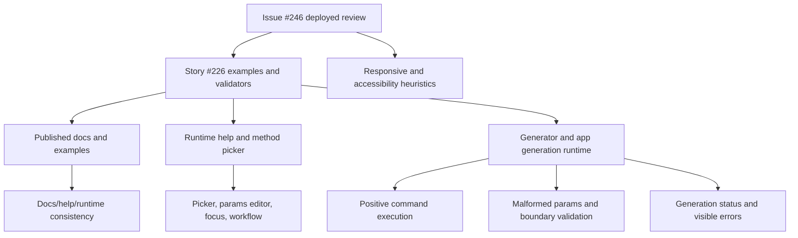

# Issue 246 Test Report

## Executive Summary

This deployed-environment exploratory review covered issue #246 against `https://eviltester.github.io/grid-table-editor/site/`, using story #226 and PR #231 as the reference scope. Browser access was proven through the deployed site, docs, app, and generator. Five delegated lanes ran in parallel and produced logs, screenshots, support data, and split defect files.

Overall result: the merged PR #231 command/example work looks broadly healthy for positive command execution. Representative domain, helper/faker, structured-parameter, constrained-parameter, CSV, and JSON examples generated valid output. The most important risks are negative-validation gaps where impossible semantic params generate `**ERROR**` rows as data, plus deployed-site accessibility/responsive issues that affect mobile and assistive-technology users.

Recommendation: do not treat the deployed state as fully acceptable for story #226 until the high-severity validation and ARIA grid defects are triaged. The command-example happy path is strong, but malformed or impossible schemas and accessibility structure need follow-up.

## Scope And References

- Tracking issue: https://github.com/eviltester/grid-table-editor/issues/246
- Story: https://github.com/eviltester/grid-table-editor/issues/226
- PR: https://github.com/eviltester/grid-table-editor/pull/231
- Deployed target: https://eviltester.github.io/grid-table-editor/site/
- Related deployed app pages:
  - https://eviltester.github.io/grid-table-editor/site/app.html
  - https://eviltester.github.io/grid-table-editor/site/generator.html
  - https://eviltester.github.io/grid-table-editor/app.html
  - https://eviltester.github.io/grid-table-editor/generator.html

## Planning Summary

Issue #246 requested a comprehensive multi-agent exploratory review of the deployed test environment, with broad command-definition coverage and no local build/test/verify commands. PR #231 changed command examples, validators, docs/help metadata, method picker behavior, params editing, generator/app generation feedback, and many domain docs. The plan therefore split the review into independent lanes and used deployed browser evidence only.

## Delegation Summary

- Command coverage and example execution: `logs/command-coverage-test-log.md`
- Negative validation and malformed parameter testing: `logs/negative-validation-test-log.md`
- Docs/help/content consistency: `logs/docs-consistency-test-log.md`
- UX/usability and workflow regression: `logs/ux-regression-test-log.md`
- Responsive/mobile and accessibility review: `logs/responsive-accessibility-test-log.md`

## Changed-Surface Inventory

PR #231 touched:

- Domain docs for airline, animal, autoIncrement, book, color, commerce, company, database, datatype, date, finance, food, git, hacker, image, internet, literal, location, lorem, music, number, person, phone, science, string, system, vehicle, and word.
- Command help contract and validators.
- Domain/faker/regex/schema rule parsing and validation.
- Generator page generation, preview, status feedback, schema mapping, and page state.
- App embedded Test Data generation and status feedback.
- Help model, docs URL behavior, method picker modal, params editor modal, and schema editor/mapping.

## Model-Based Coverage

## Test Techniques And Heuristics

Exploratory testing, risk-based testing, equivalence partitioning, boundary analysis, negative testing, consistency/oracle checking, state/flow modeling, pairwise thinking, accessibility heuristics, responsive testing heuristics, and documentation testing.

## Coverage By Command Family

Sampled families included internet, color, autoIncrement, date, finance, string, image, airline, commerce, location, lorem, number, person, system, vehicle, word, datatype, helpers, and faker helper aliases.

Positive examples included:

- `internet.httpMethod(commonOnly=true)`
- `internet.httpMethod(excludes="patch, TRACE")`
- `color.rgb(format="hex", includeAlpha=true)`
- `autoIncrement.sequence(start=1, step=5, prefix="filename", suffix=".txt", zeropadding=3)`
- `finance.amount(max=10, min=1)`
- `string.alpha(length=5, casing="upper", exclude=["A","B","C"])`
- `date.between(from=1577836800000, to=1609372800000)`
- `helpers.mustache("Hello {{name}}", { name: "Ada" })`
- `helpers.fromRegExp("[A-Z]{2}[0-9]{3}")`
- `datatype.enum(values=["GET","POST","PUT","PATCH"])`

## Coverage By Docs Surface

The docs-consistency lane fetched and inspected 40 deployed pages, including the home page, app/generator pages, core docs, all currently linked domain pages in the deployed sidebar, faker test-data docs, regex docs, and generate-to-file docs.

Healthy consistency checks:

- `internet.httpMethod` docs, method picker details, params, examples, and runtime preview aligned.
- `location.cardinalDirection(abbreviated=true)` docs/help/runtime aligned in the current deployment.
- `helpers.mustache("Hello {{name}}", { name: "Ada" })` executed successfully when entered exactly.
- `image.urlLoremFlickr` was absent from the docs audit and method picker search.

## Coverage By Workflow Area

- Site home navigation and Docs click proof.
- App `Add Row` interaction proof.
- Generator row-mode enum preview.
- Standalone generator domain command selection, method picker, params editor, docs link, preview generation.
- App embedded Test Data generation.
- Import/export workspace grid-to-text and text-to-grid workflow.
- Mobile site/app/generator/docs layouts and keyboard focus.
- Axe accessibility smoke checks on site, app, generator, and docs pages.

## Loops Performed

Loop 1:

- Proved browser access.
- Ran main site/docs/app/generator smoke.
- Delegated lane scouts and initial broad coverage.
- Found no blocking positive-path command failure.

Loop 2:

- Integrated command coverage, docs consistency, negative validation, UX, and responsive/accessibility logs.
- Generated and executed gap ideas around helper commands, aliases, removed commands, malformed domain params, docs/picker alignment, embedded app Test Data, and mobile/accessibility surfaces.
- Promoted repeatable findings into split defect files.

Loop 3:

- Expanded command-family sampling to JSON output and additional domains.
- Broadened negative-validation sampling across autoIncrement, string, number, date, and finance.
- Confirmed the repeated `**ERROR**`-as-data pattern across multiple command families.
- Confirmed positive command execution breadth remained healthy.

Final review loop:

- Reviewed story #226 requirements, PR #231 summary and changed surfaces, all lane logs, coverage model, sampled command families, docs reviewed, examples tried, defects found, and remaining gaps.
- Additional ideas classified:
  - execute-now: check removed command docs and picker presence. Done.
  - execute-now: verify `internet.httpMethod` docs/picker/runtime. Done.
  - execute-now: run broad helper/faker commands. Done.
  - execute-now: test semantic impossible params. Done.
  - execute-now: sample mobile app/generator keyboard focus. Done.
  - execute-now: run axe smoke checks on app/generator/docs. Done.
  - execute-now: split each confirmed defect into its own markdown file. Done.
  - execute-now: collate logs and defects for PDF export. Done after report finalization.
  - defer: exhaustive command-by-command sweep across every docs example; representative coverage was broad enough for this session.
  - defer: full real screen-reader pass; axe and keyboard checks are smoke evidence, not a replacement for manual AT testing.
  - defer: file upload/download schema round trips; visible save/load surfaces were noted but not deeply tested.
  - defer: production `anywaydata.com` link policy; not classified without a product decision.

Stopping is justified because multiple loops completed, recent loops repeated known risk patterns rather than revealing new classes, and coverage is broad across command families, docs, app/generator workflows, UX, responsive behavior, and accessibility.

## Confirmed Defects

High:

- [Semantic invalid params generate `**ERROR**` rows instead of validation feedback](defects/issue-246-semantic-invalid-params-generate-error-data.md)
- [App and generator grids have critical ARIA structure violations](defects/issue-246-app-generator-grids-have-critical-aria-structure-violations.md)

Medium:

- [Text schema unknown command falls back to regex-like generation](defects/issue-246-text-schema-unknown-command-falls-back-to-regex.md)
- [Invalid regex generates literal-looking values without warning](defects/issue-246-invalid-regex-generates-literalish-values.md)
- [Removed `image.urlLoremFlickr` has misleading feedback](defects/issue-246-removed-url-lorem-flickr-has-misleading-feedback.md)
- [`/site/` app and generator nav escapes the site context](defects/issue-246-site-app-generator-nav-escapes-site-context.md)
- [Mobile `/site/` app and generator nav overflows and focuses offscreen](defects/issue-246-mobile-site-app-generator-nav-overflows.md)
- [Generator settings panel opens offscreen on mobile](defects/issue-246-generator-settings-panel-offscreen-mobile.md)
- [Summary elements contain nested interactive controls](defects/issue-246-summary-elements-contain-nested-interactive-controls.md)
- [Docs active breadcrumb contrast fails WCAG AA](defects/issue-246-docs-active-breadcrumb-contrast-fails-aa.md)
- [App page lacks main landmark and H1](defects/issue-246-app-page-lacks-main-landmark-and-h1.md)

Low:

- [Unclosed domain quote reports faker validation](defects/issue-246-unclosed-domain-quote-reports-faker-validation.md)
- [Params editor labels optional params as required](defects/issue-246-params-editor-req-labels-optional-params-as-required.md)
- [Site home heading order skips H2](defects/issue-246-home-heading-order-skips-h2.md)

## Suspicious Behaviors And Risks

- Embedded Test Data generated a validation failure once immediately after fast regex entry, then succeeded after the field value was visibly retained. This was not repeatable enough to file as confirmed.
- `Set Grid From Text` can turn a single edited line into a header-only grid with zero rows. This may be expected parser behavior but is easy to misunderstand.
- Opening a picker from a domain row shows the `All` tab with both domain and faker/helper commands. The picker labels command source, so this was not filed as a defect.
- Some first navigations had transient `ERR_CONNECTION_RESET`, with immediate retry success. Not filed as product behavior.

## What Was Not Covered

- Exhaustive execution of every command example on every docs page.
- Full assistive-technology testing with screen readers.
- File chooser round trips for load/save schema.
- Deep production-link policy review for `anywaydata.com` links in public docs.
- Local unit, build, verify, or package-manager tests, because issue #246 explicitly scoped this to deployed environment testing.

## Artifacts

- Main log: `issue-246-test-log.md`
- Main report: `issue-246-test-report.md`
- Session goal prompt: `issue-246-session-goal-prompt.md`
- Collated logs/defects: `test-logs-and-defects.md`
- Final report PDF: `issue-246-test-report.pdf`
- Collated evidence PDF: `test-logs-and-defects.pdf`
- Screenshots: `screenshots/`
- Support data/scripts: `support/`
- Split defects: `defects/`
