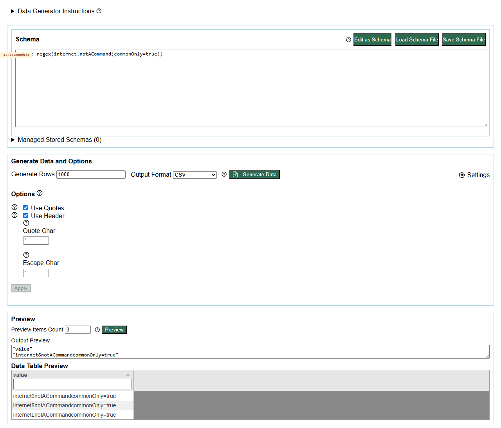
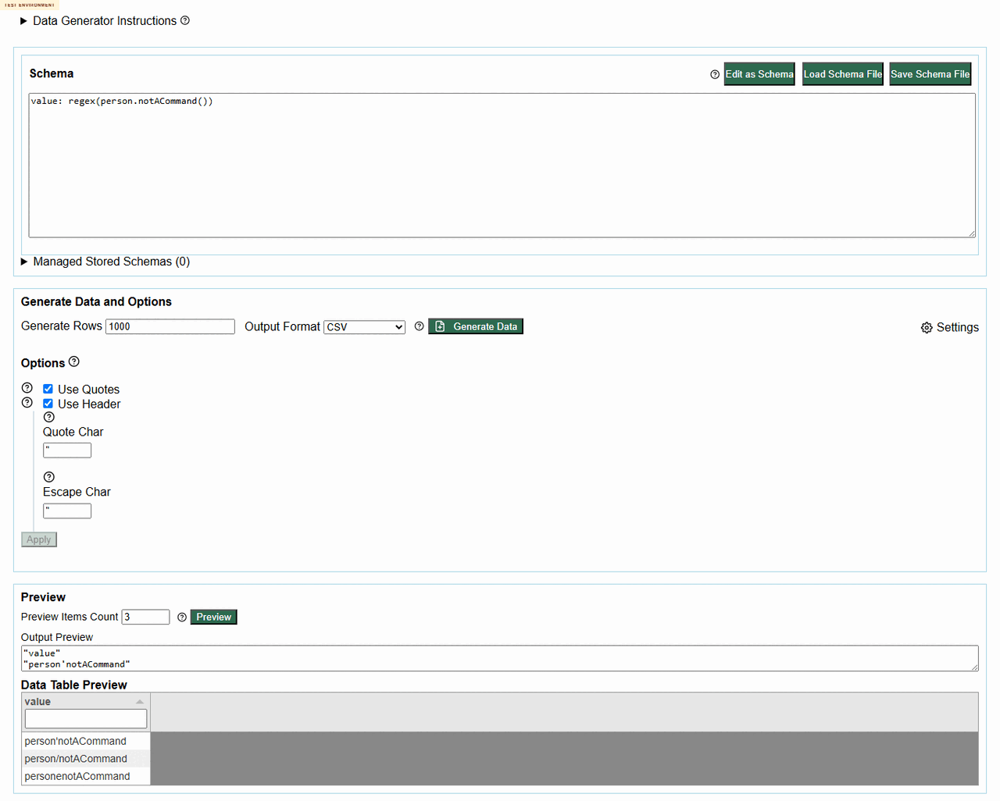

# Defect 001: Unknown command-like values generate regex-like output instead of validation errors

## Summary

Unknown command-like data definitions are accepted and generate randomized regex-like output instead of failing validation. This can hide typos in faker/domain/helper command names and produce plausible-looking but incorrect test data.

## Environment

- Project: eviltester/grid-table-editor
- Issue/story: #230
- PR: #247
- Deployed environment: https://eviltester.github.io/grid-table-editor/generator.html
- Date tested: 2026-06-27

## Repeat Steps

1. Open https://eviltester.github.io/grid-table-editor/generator.html.
2. Switch the schema editor to text mode with `Edit as Text`.
3. Enter this schema:

```text
value: internet.notACommand(commonOnly=true)
```

4. Click `Preview`.
5. Repeat from a clean page state.
6. Try equivalent unknown command-like values in other families:

```text
value: person.notACommand()
value: commerce.notACommand()
value: date.notACommand()
value: helpers.notACommand()
```

## Expected

The app should report an unknown command or invalid data definition error and should not generate output.

## Actual

The app generates output by treating the command-like text as a regex-like pattern. Examples observed:

- `internet%notACommandcommonOnly=true`
- `person'notACommand`
- `commerce~notACommand`
- `date%notACommand`
- `helpers6notACommand`

No validation status was shown for the repeated unknown command-like cases.

## Evidence

Screenshots:

- 
- 
- 
- 
- 
- 

Video:

- [defect-unknown-command-fallback.webm](../videos/defect-unknown-command-fallback.webm)

Structured evidence:

- [negative-validation-results.json](../support/negative-validation-results.json)
- [loop-gap-review-evidence.json](../support/loop-gap-review-evidence.json)

## Notes For Fix Investigation

This appears to affect command-like strings that are not recognized as valid domain/faker/helper commands. The parser/runtime may be falling back to regex generation rather than preserving a typed-command parse failure. A fix should preserve valid bare regex behavior while rejecting dotted command-like values that resemble known command namespaces but do not resolve to known methods.

