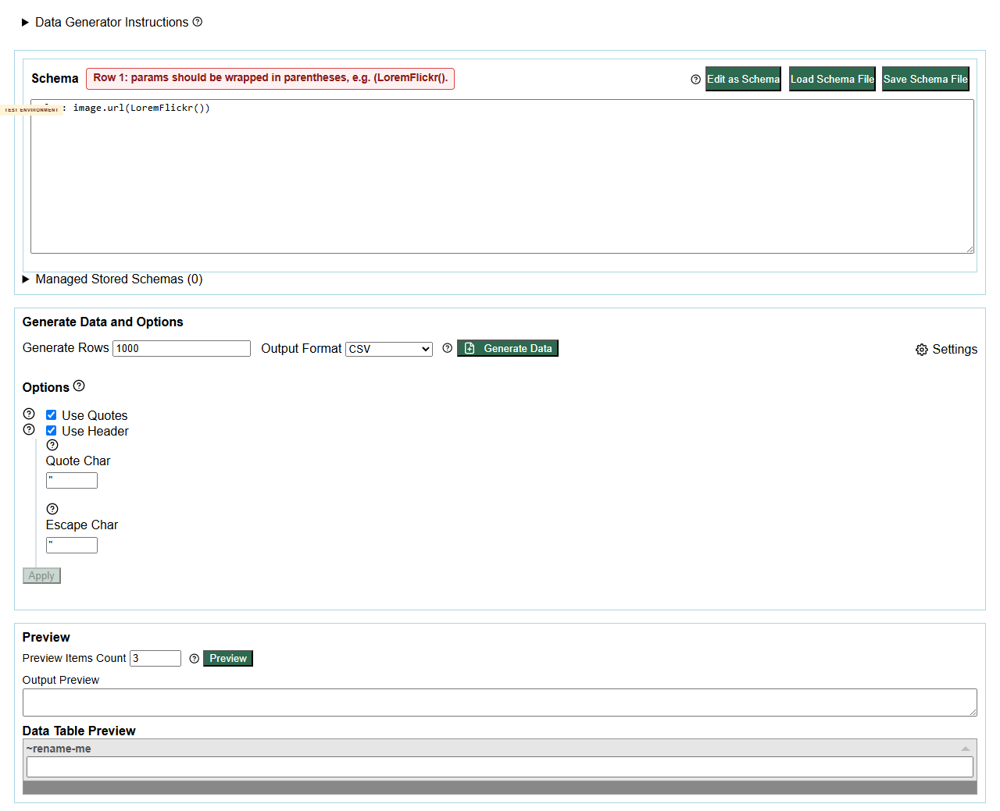
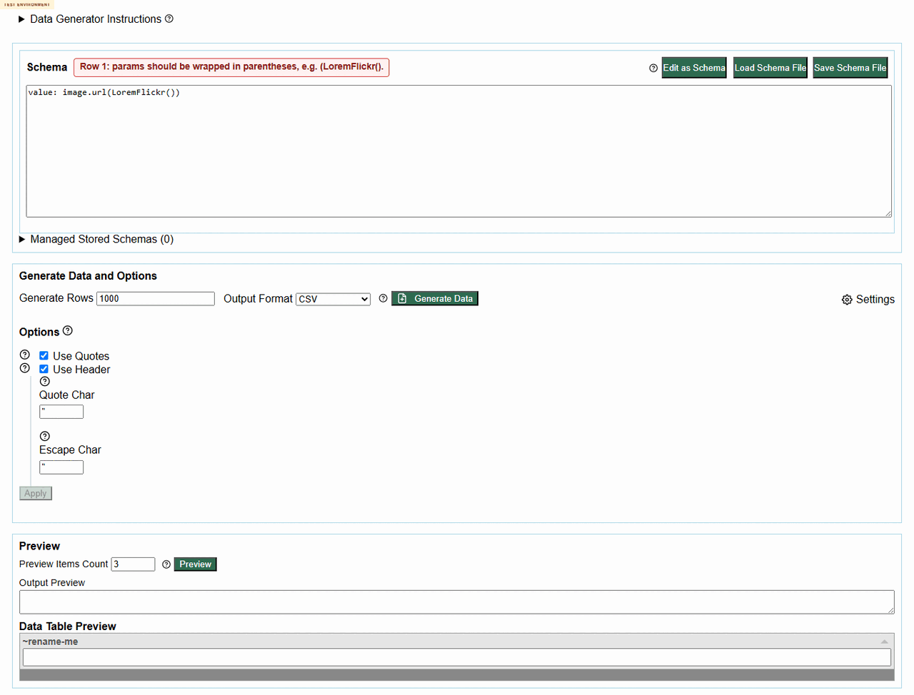

# Defect 002: Removed image.urlLoremFlickr command reports a misleading params-wrapping error

## Summary

The removed/deprecated command `image.urlLoremFlickr()` does not generate output, but the user-facing validation message is misleading. The app rewrites/displays the input as `image.url(LoremFlickr())` and reports a params-wrapping error rather than clearly saying the command is unknown, removed, or deprecated.

## Environment

- Project: eviltester/grid-table-editor
- Issue/story: #230
- PR: #247
- Deployed environment: https://eviltester.github.io/grid-table-editor/generator.html
- Date tested: 2026-06-27

## Repeat Steps

1. Open https://eviltester.github.io/grid-table-editor/generator.html.
2. Switch the schema editor to text mode with `Edit as Text`.
3. Enter this schema:

```text
value: image.urlLoremFlickr()
```

4. Click `Preview`.
5. Repeat from a clean page state.

## Expected

The app should report that `image.urlLoremFlickr` is unknown, removed, or deprecated, and ideally point to the supported replacement such as `image.url()`.

## Actual

The app does not generate output, but it rewrites/displays the value as `image.url(LoremFlickr())` and reports:

```text
Row 1: params should be wrapped in parentheses, e.g. (LoremFlickr().
```

The message points the user toward params wrapping rather than the real problem. The loop review also confirmed that current `image.url()` still generates valid image URLs, so this is specific to removed/deprecated command handling rather than the whole image family.

## Evidence

Screenshots:

- 
- 
- 

Video:

- [defect-removed-image-command-message.webm](../videos/defect-removed-image-command-message.webm)

Structured evidence:

- [negative-validation-results.json](../support/negative-validation-results.json)
- [loop-gap-review-evidence.json](../support/loop-gap-review-evidence.json)

## Notes For Fix Investigation

The parser appears to split `image.urlLoremFlickr()` into `image.url(...)` with a malformed `LoremFlickr()` argument. That may happen before command resolution has a chance to report the removed command. The fix likely belongs around command-name resolution or pre-fallback parsing for dotted command names.

