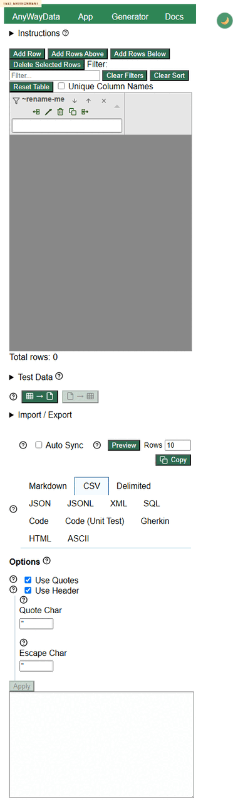
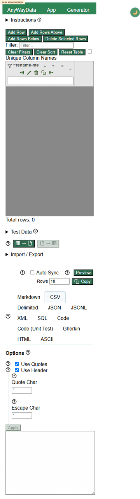

# Defect 003: App page has horizontal overflow on mobile and narrow widths

## Summary

The deployed app page overflows horizontally on mobile and narrow widths. The site home and docs pages did not show the same overflow in this lane, but `app.html` did.

## Environment

- Project: eviltester/grid-table-editor
- Issue/story: #230
- PR: #247
- Deployed environment: https://eviltester.github.io/grid-table-editor/site/app.html
- Date tested: 2026-06-27
- Viewports: approximately 390 px mobile and 320 px narrow

## Repeat Steps

1. Open https://eviltester.github.io/grid-table-editor/site/app.html.
2. Resize the viewport to approximately 390 px wide.
3. Wait for the app controls to finish loading.
4. Observe horizontal overflow.
5. Repeat at approximately 320 px wide.

## Expected

The app should fit within the viewport or use clearly intentional internal scrolling only for complex tables/panels. The page header and main layout should not cause whole-page horizontal overflow.

## Actual

The app page overflows horizontally. Structured evidence showed body/client width mismatches and overflow contributors including:

- Header: `AnyWayData App Generator Docs Blog`
- Main app controls
- Shared schema rows
- Import/export workspace

The responsive lane observed this on mobile and narrow app views. Desktop app, site home, and docs mobile checks were OK.

## Evidence

Screenshots:

- 
- 
- 
- 

Video:

- [defect-mobile-horizontal-overflow.webm](../videos/defect-mobile-horizontal-overflow.webm)

Structured evidence:

- [responsive-accessibility-evidence.json](../support/responsive-accessibility-evidence.json)
- [loop-gap-review-evidence.json](../support/loop-gap-review-evidence.json)

## Notes For Fix Investigation

The evidence points to multiple small overflow contributors rather than one single component. The header/nav width is a consistent contributor, while schema/import-export regions also add overflow. A fix should check both the app shell navigation and dense control rows in `app.html` at 390 px and 320 px widths.

