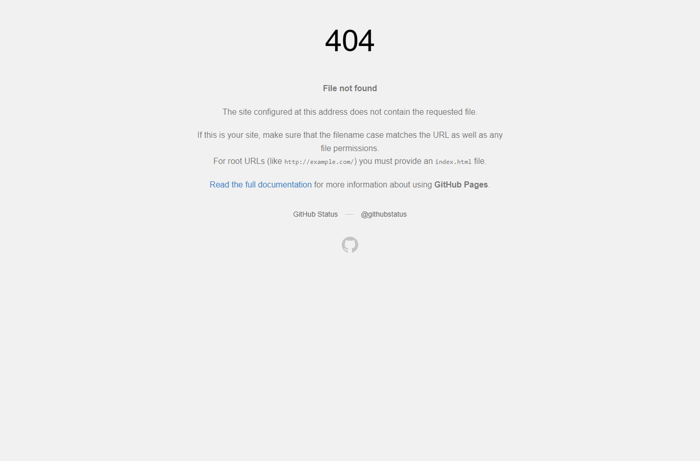

# Defect 004: `/site/docs` returns a GitHub Pages 404

## Summary

The deployed docs root URL `https://eviltester.github.io/grid-table-editor/site/docs` returns a GitHub Pages 404 page instead of a documentation landing page or redirect. Canonical docs pages such as `/site/docs/intro` and `/site/docs/test-data/...` load correctly, so this appears to be a route/index handling gap rather than a full docs deployment failure.

## Environment

- Project: eviltester/grid-table-editor
- Issue/story: #230
- PR: #247
- Deployed environment: https://eviltester.github.io/grid-table-editor/site/docs
- Date tested: 2026-06-27

## Repeat Steps

1. Open https://eviltester.github.io/grid-table-editor/site/docs.
2. Observe the loaded page.
3. Repeat in a fresh browser context.
4. Compare with https://eviltester.github.io/grid-table-editor/site/docs/intro.

## Expected

The docs root should show a documentation landing page, redirect to the docs introduction, or otherwise provide a useful docs navigation entry point.

## Actual

The docs root loads a GitHub Pages 404 page:

```text
404
File not found

The site configured at this address does not contain the requested file.
```

The canonical docs introduction page and test-data docs pages load correctly, so users following direct root-style documentation links can hit a dead end even though the docs are present.

## Evidence

Screenshot:

- 

Video:

- [docs-consistency-site-docs-404.webm](../videos/docs-consistency-site-docs-404.webm)

Related logs:

- [docs-consistency-test-log.md](../logs/docs-consistency-test-log.md)
- [issue-230-test-log.md](../issue-230-test-log.md)

## Notes For Fix Investigation

This may only require a generated `index.html` under the deployed docs root or an explicit redirect from `/site/docs` to `/site/docs/intro`. The test did not find evidence that linked docs pages are missing broadly; the problem is the root docs route itself.
