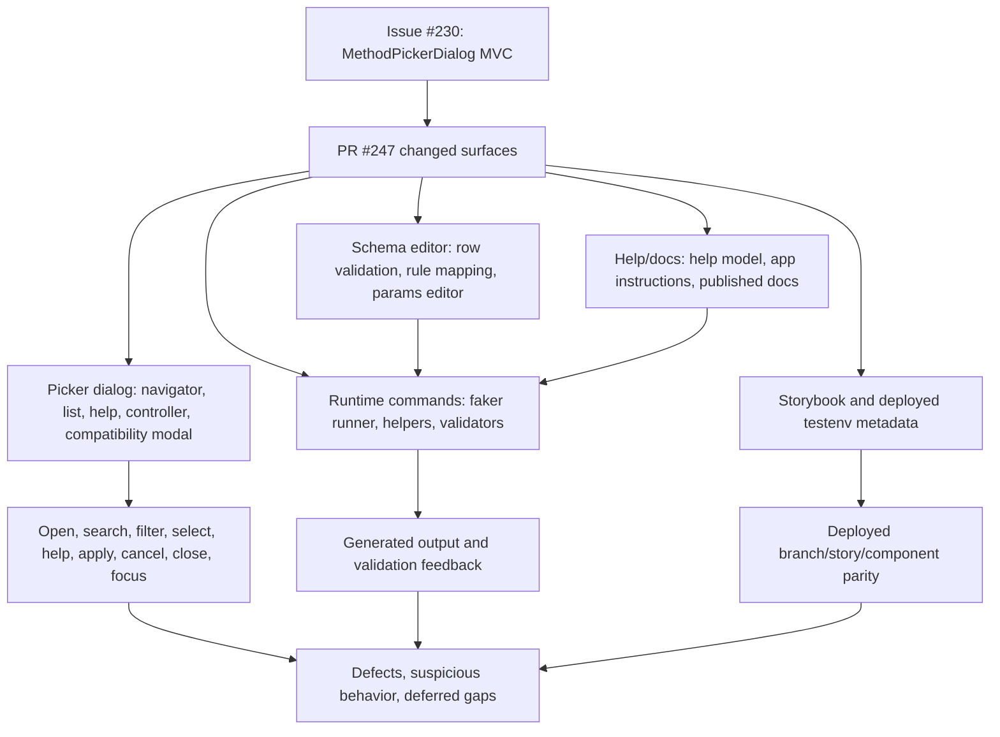
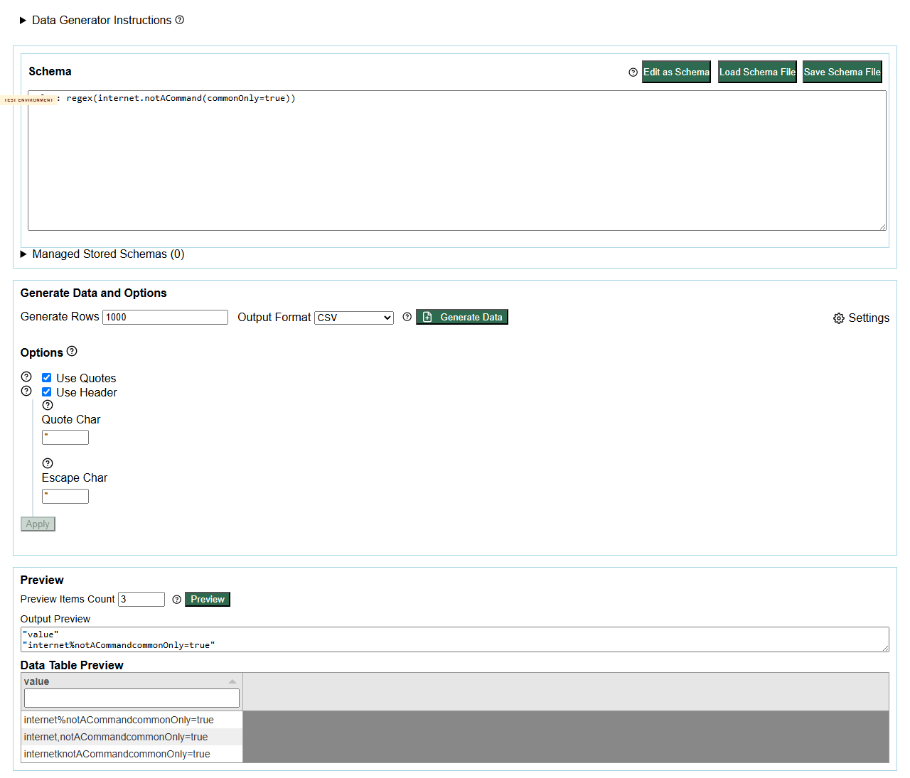
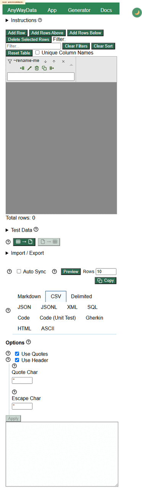

# Issue 230 / PR 247 Deployed Exploratory Test Report

## Executive Summary

Status: completed deployed-environment exploratory review.

The deployed method picker refactor is broadly usable across the sampled happy paths: the generator can open the component-backed picker, search/select/apply faker and domain commands, show help/details/examples/docs links, edit structured params for `helpers.arrayElement`, and execute representative docs examples. Storybook is deployed and includes the expected Method Picker Dialog stories for navigator, list, help display, combined dialog, choose/filter/cancel flows.

Four repeatable defects were confirmed:

1. `/site/docs` returns a GitHub Pages 404 instead of a docs landing page.
2. Unknown command-like values generate regex-like output instead of validation errors.
3. Removed `image.urlLoremFlickr()` reports a misleading params-wrapping error.
4. `app.html` horizontally overflows on mobile/narrow widths.

Recommendation: acceptable to continue PR review after triaging the four defects. The core picker component behavior looks healthy in the deployed environment, but docs routing, command-resolution validation, and mobile layout need follow-up.

## Scope And References

- Target repo: https://github.com/eviltester/grid-table-editor
- Story: https://github.com/eviltester/grid-table-editor/issues/230
- PR: https://github.com/eviltester/grid-table-editor/pull/247
- Test environment: https://eviltester.github.io/grid-table-editor/site/
- App: https://eviltester.github.io/grid-table-editor/site/app.html
- Generator: https://eviltester.github.io/grid-table-editor/generator.html and https://eviltester.github.io/grid-table-editor/site/generator.html
- Storybook: https://eviltester.github.io/grid-table-editor/storybook/
- Browser proof: [screenshots/browser-proof-app-loaded.png](screenshots/browser-proof-app-loaded.png)
- GitHub evidence: [support/github-issue-230.json](support/github-issue-230.json), [support/github-pr-247.json](support/github-pr-247.json), [support/github-pr-247-files.json](support/github-pr-247-files.json), [support/github-pr-247.diff](support/github-pr-247.diff)

## Planning Summary

Issue #230 asks for a real `MethodPickerDialogController` + `MethodPickerDialogView` + `createMethodPickerDialog` component instead of a document-level helper. It explicitly requires Method Navigator, Method List, Method Help Display, a combined Method Picker Dialog, component tests, and Storybook entries.

PR #247 implements the component family, keeps `openMethodPickerModal` as a compatibility service returning `{ sourceType, command } | null`, updates Storybook coverage, changes schema/help/params-editor handling, updates docs, and touches testenv/build metadata. Current live PR metadata showed 67 changed files, 3241 additions, and 905 deletions.

### Changed-Surface Inventory

- Method picker MVC/component family: `packages/core-ui/js/gui_components/shared/method-picker-dialog/*`, `method-picker-modal.js/css`, Storybook stories, related browser/Jest tests.
- Schema editor and rule mapping: shared schema editor controller, row validation, focus state, schema row mapper, generator schema sync, schema docs.
- Help and docs: help model builder, app instructions, schema docs, frontend architecture/migration docs.
- Faker command/validation: faker command runner, `helpers.arrayElement`, schema parsing errors, faker validator tests.
- Accessibility/app surfaces: data population panel and format option accessible names.
- Storybook/testenv metadata: `.storybook/main.js`, story cleanup, Vite config, build metadata, site config module path, `scripts/create-testenv.mjs`.

### Risk Analysis

- High interaction risk: picker open/search/select/help/apply/cancel/close/focus behavior changed substantially.
- High command-surface risk: method metadata covers many families and examples; broad sampling was required.
- Medium validation risk: structured faker/helper params and malformed command-like text changed near the parser/runtime boundary.
- Medium docs/help risk: published docs, app help, picker help, docs links, and runtime examples can disagree.
- Medium accessibility/mobile risk: new dialog roles, keyboard flow, focus restoration, and dense controls may regress.
- Medium compatibility risk: the new component must behave consistently through the existing generator/schema-row compatibility path.

### Delegation Summary

- Command coverage and example execution: sampled positive examples and validators across core/domain/faker/helper families.
- Negative validation and malformed parameter testing: malformed params, unknown commands, removed/deprecated command handling.
- Docs/help/content consistency: published docs, app help, picker help, docs links, runtime examples.
- UX/usability and workflow regression: generator picker open/search/select/apply/cancel/close, params editor, recent behavior.
- Responsive/mobile and accessibility review: desktop/mobile/narrow viewports, keyboard/focus, dialog state, overflow checks.
- Storybook/component parity gap lane: deployed Storybook discovery, component stories, app/component parity.

## Coverage Model

## Test Techniques And Heuristics

Techniques used: exploratory testing, risk-based testing, equivalence partitioning, boundary analysis, negative testing, consistency/oracle checking, state/flow modeling, pairwise thinking, accessibility heuristics, responsive testing heuristics, documentation testing, and component/app parity checking.

## Coverage By Area

### Command Families Sampled

Core/schema forms: `regex`, `enum`, `literal`.

Domain families: `company`, `person`, `internet`, `commerce`, `location`, `string`, `finance`, `date`, `number`, `image`, `autoIncrement`.

Faker/helpers: `helpers.arrayElement`, `helpers.mustache`, `helpers.fake`, `helpers.fromRegExp`, `helpers.rangeToNumber`, `helpers.weightedArrayElement`.

Validators/constrained params: booleans on `internet.httpMethod`, numeric min/max on `number.int`, array params on `helpers.arrayElement`, regex syntax errors, enum syntax, removed/deprecated command probe.

Deferred: exhaustive execution of every domain/faker method, every output format, every multi-example command, and every structured object shape. The inventory is too large for a single deployed exploratory session, so coverage used family/risk sampling.

### Docs Surfaces Reviewed

HTTP 200 canonical docs pages reviewed:

- `/site/docs/test-data/test-data-generation/`
- `/site/docs/test-data/data-grid-editable/`
- `/site/docs/test-data/generate-to-file/`
- `/site/docs/test-data/Schema-Definition/`
- `/site/docs/test-data/regex-test-data/`
- `/site/docs/test-data/literal-test-data/`
- `/site/docs/test-data/pairwise-testing/`
- `/site/docs/test-data/n-wise-testing/`
- `/site/docs/test-data/domain/domain-test-data/`
- `/site/docs/test-data/faker-test-data/`
- `/site/docs/test-data/counterstrings/`
- `/site/docs/test-data/auto-increment-sequences/`
- `/site/docs/videos/faker-test-data/`

Legacy/guessed docs routes under `/site/docs/generating-data/...` and `/site/docs/schema` returned 404. These were treated as discovery misses, not authoritative stale docs, because current canonical navigation worked.

### Examples Tried

Docs/runtime examples successfully generated in the deployed generator:

- `person.fullName`
- `internet.email()`
- `helpers.mustache("Hello {{name}}", { name: "Ada" })`
- `regex([A-Z]{3}-[0-9]{6})`
- `string.counterString(15)`
- `autoIncrement.sequence(start=10, step=5)`
- `helpers.fake("Hi, my name is {{person.firstName}} {{person.lastName}}!")`
- `location.cardinalDirection(abbreviated=true)`
- `date.between(from=1577836800000, to=1659312000000)`
- `number.int(min=32, max=47)`

## Loops Performed

### Loop 1

Initial broad coverage proved the deployed app/generator and picker were interactable, captured live GitHub issue/PR metadata, built the changed-surface inventory, opened the method picker, checked `helpers.arrayElement` help, reviewed initial faker docs, and executed a mixed broad schema across core/domain/faker/helper samples.

Loop 1 findings:

- Picker displayed search, category tabs, listbox/options, details/help, examples, and docs link.
- Broad positive schema generation was healthy.
- Bare enum values were rejected; quoted enum values generated.
- `literal("READY")` appeared as quoted literal content in CSV, left for docs comparison rather than defect classification.

### Loop 2

Loop 2 generated and executed additional ideas around unknown command families, removed versus current image command behavior, literal blank behavior, boolean/numeric validators, enum syntax, docs links, and recent behavior.

Executed-now ideas included:

- Repeat unknown command-like fallback across person/commerce/date/helpers/internet.
- Compare `image.urlLoremFlickr()` with current `image.url()`.
- Compare `literal()` with `literal("")`.
- Execute `internet.httpMethod(commonOnly=true)` and `commonOnly=false`.
- Reject unsupported `internet.httpMethod(exclude="POST")`.
- Test `number.int(min=5, max=5)` and `number.int(min=9, max=3)`.
- Test `enum("red","green")`.
- Inspect `helpers.arrayElement` docs link.
- Recheck no-result Apply behavior with targeted selectors.

Loop 2 changed the report by confirming unknown command fallback and removed image command messaging as defects, while downgrading blank literal and no-result Apply to non-defect/suspicious only.

### Loop 3

Loop 3 focused on Storybook/component parity, docs runtime examples, responsive/mobile/accessibility, and defect video evidence.

Executed-now ideas included:

- Discover deployed Storybook and exact Method Picker Dialog entries.
- Exercise Navigator Default, List Default, Help Display With Usage, Visual Always Open, Choose Faker Method, Filter And Choose Domain Method, and Cancel Method Selection.
- Compare Storybook and generator `helpers.arrayElement` help.
- Test generator source switch from `regex` to `faker`/`domain`.
- Exercise params editor for `helpers.arrayElement`.
- Run desktop/mobile/narrow overflow and method picker checks.
- Check canonical docs pages and runtime examples.
- Record videos for repeatable defects.

Loop 3 changed the report by confirming Storybook is deployed and broadly component-parity healthy, identifying Storybook fixture breadth as a coverage risk, and confirming mobile/narrow app overflow as a third defect.

### Final Review Loop

Final review revisited the story, PR changed surfaces, logs, coverage model, sampled command families, docs reviewed, examples tried, defects, videos, suspicious risks, and gaps.

Final-review execute-now items completed:

- Verified required lane logs exist.
- Appended summaries for docs-consistency, responsive/accessibility, and command-coverage lanes.
- Verified repeatable defects have split markdown files.
- Verified videos exist for all confirmed defects.
- Verified Storybook/component parity lane summary and screenshots exist.
- Removed bulky generated dependency/cache content and stray non-defect videos.
- Kept suspicious behaviors separate from confirmed defects.
- Prepared final report, collation, README, PDFs, and GitHub publication.

Stopping is justified because three loops plus a final review were completed, recent loops produced confirmations/refinements rather than new defect classes, and remaining gaps are explicit.

## Confirmed Defects

### Defect 001: Unknown command-like values generate regex-like output

Unknown command-like values such as `internet.notACommand(commonOnly=true)`, `person.notACommand()`, `commerce.notACommand()`, `date.notACommand()`, and `helpers.notACommand()` generated randomized regex-like output with no validation message.

See [defects/defect-001-unknown-command-like-values-generate-regex-output.md](defects/defect-001-unknown-command-like-values-generate-regex-output.md).

### Defect 002: Removed `image.urlLoremFlickr()` command reports misleading params error

`image.urlLoremFlickr()` was rewritten/displayed as `image.url(LoremFlickr())` and reported a params-wrapping message rather than a removed/deprecated/unknown command message.

See [defects/defect-002-removed-image-urlLoremFlickr-message-is-misleading.md](defects/defect-002-removed-image-urlLoremFlickr-message-is-misleading.md).

### Defect 003: App page overflows horizontally on mobile/narrow widths

`app.html` horizontally overflowed at mobile/narrow widths. Site home and docs mobile checks were OK, so this is specific to the dense app layout.

See [defects/defect-003-app-horizontal-overflow-on-mobile-and-narrow-widths.md](defects/defect-003-app-horizontal-overflow-on-mobile-and-narrow-widths.md).

### Defect 004: `/site/docs` returns a GitHub Pages 404

`https://eviltester.github.io/grid-table-editor/site/docs` returned a repeatable GitHub Pages 404, while canonical docs pages such as `/site/docs/intro` and `/site/docs/test-data/...` loaded correctly.

See [defects/defect-004-docs-root-site-docs-returns-404.md](defects/defect-004-docs-root-site-docs-returns-404.md).

## GitHub Publication

- Parent testing issue: https://github.com/eviltester/grid-table-editor/issues/248
- Defect subissue 001: https://github.com/eviltester/grid-table-editor/issues/249
- Defect subissue 002: https://github.com/eviltester/grid-table-editor/issues/250
- Defect subissue 003: https://github.com/eviltester/grid-table-editor/issues/251
- Defect subissue 004: https://github.com/eviltester/grid-table-editor/issues/252

## Suspicious Behaviors And Risks

- No-result Apply in the picker was seen in one UX screenshot, but targeted repeat with the correct `input.method-picker-search` left Apply disabled. Not reported as a confirmed defect.
- Storybook Method Picker stories use a compact fixture taxonomy while the generator picker exposes the full taxonomy. This is a test/story representativeness gap, not a deployed product defect.
- Focus after Escape was not conclusively proven to return to the picker opener in every viewport; evidence was not strong enough for a defect.
- `literal()` and `literal("")` both generate blank values. Current runtime evidence suggests benign shorthand/normalization, but docs should be explicit.
- Some guessed legacy docs URLs 404. Current canonical docs navigation works, so this is only a possible stale-external-link risk.

## What Was Not Covered And Why

- Local repo verify/build/package-manager commands: explicitly forbidden by operating rules.
- Exhaustive command inventory execution: too large for one deployed exploratory session; covered through family/risk sampling.
- Full assistive-technology screen reader testing: not available in this session.
- Code fixes: out of scope for a test-environment exploratory review.
- Every output format: CSV preview and selected docs/runtime examples were enough for command behavior sampling; output-format regression was not the PR's primary changed surface.

## Deferred Ideas

- Execute pairwise sampling across every command family with structured/constrained params.
- Add/verify a Storybook story using the full deployed command taxonomy.
- Add/verify a Storybook story for schema-row compatibility buttons `Select faker command` and `Select domain command`.
- Link-check every Method Picker `Open documentation` link.
- Test every helper with multiple docs examples.
- Test generated output across JSON, Markdown, SQL, and unit-test formats.
- Perform manual screen-reader review of picker role/name/focus behavior.
- Add redirects or link checks for old docs paths if external links exist.

## Final Recommendation

The deployed PR behavior looks broadly acceptable for the Method Picker MVC story, subject to triaging the four confirmed defects. The componentized picker and Storybook coverage are present, the generator compatibility flow works for representative faker/domain commands, and docs/runtime examples are mostly consistent. The biggest product risk is command-resolution fallback silently generating data for typoed command-like values.
