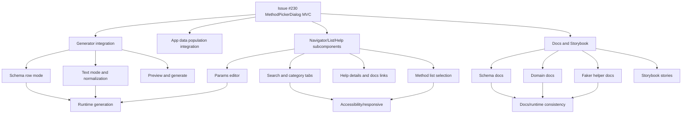

# Issue 230 / PR 247 Deployed Exploratory Test Report

## Executive Summary

This deployed-only exploratory review covered issue #230 and PR #247 for `eviltester/grid-table-editor`. Browser control was proven against the live test environment before testing. Six subagent lanes were spawned, and the main session completed Loop 1, Loop 2, Loop 3, and the mandatory final review loop.

Overall, sampled generation behavior looks broadly acceptable for the story: the Method Picker Dialog opens, searches, applies commands, updates row type, shows command help, and works with params for sampled commands. Positive generation passed across many domain and faker/helper families. Negative validation was strong for unknown commands, removed commands, malformed arrays, bad ranges, and invalid text-to-schema conversion.

Six repeatable defects were found. The most important are docs/runtime mismatches in Faker helper examples, raw regex shorthand with comma quantifiers being parsed as enum values, and accessibility/help-label issues in the changed picker/params surfaces.

Recommendation: functionally promising, but not fully acceptable for the story until the confirmed docs/runtime and accessibility issues are addressed or explicitly accepted.

## Scope and References

- Story: https://github.com/eviltester/grid-table-editor/issues/230
- PR: https://github.com/eviltester/grid-table-editor/pull/247
- Deployed environment: https://eviltester.github.io/grid-table-editor/site/
- Generator: https://eviltester.github.io/grid-table-editor/generator.html
- Storybook: https://eviltester.github.io/grid-table-editor/storybook/
- Session prompt: [issue-230-session-goal-prompt.md](issue-230-session-goal-prompt.md)
- Main log: [issue-230-test-log.md](issue-230-test-log.md)
- GitHub tracking issue: https://github.com/eviltester/grid-table-editor/issues/254

## Planning Summary

Issue #230 asks for a real MethodPickerDialog MVC with Method Navigator, Method List, and Method Help Display rather than document-level modal helper logic. PR #247 currently changes 91 files, including method-picker MVC components, schema editor/validation, command parsing/help metadata, faker runner/validator, docs, tests, Storybook, and responsive coverage.

Primary risks were method selection/apply regressions, help/details drift from runtime command behavior, compatibility regressions in app/generator callers, broad command-definition churn, schema text/grid sync, malformed parameter validation, docs drift, Storybook parity, and accessibility/responsive behavior.

## Changed-Surface Inventory

- Method picker MVC: controller, view, utilities, navigator, list, help display, modal CSS/JS.
- Shared schema editor: shared schema definition, row mapping, focus state, schema sync.
- Command parsing/validation: command spec parser, schema row validation, schema parsing errors.
- Faker/runtime: faker command runner, faker rule validator, faker command metadata, helper keyword definitions.
- Generator/app integration: generator runtime sync, data population panel, format options panel, app instructions.
- Docs/help: schema definition docs, docs index, frontend architecture and migration docs.
- Storybook: method-picker dialog stories, shared schema stories, app/generator stories.

## Delegation Summary

| Lane | Status | Log |
| --- | --- | --- |
| Command coverage and example execution | Completed; broad sampled support plus two docs/runtime defects. | [command-coverage-test-log.md](logs/command-coverage-test-log.md) |
| Negative validation and malformed parameter testing | Completed; no confirmed defects. | [negative-validation-test-log.md](logs/negative-validation-test-log.md) |
| Docs/help/content consistency | Completed; science naming mismatch and content risks. | [docs-consistency-test-log.md](logs/docs-consistency-test-log.md) |
| UX/usability and workflow regression | Spawned; no final return before packaging, main-agent fallback log included. | [ux-regression-test-log.md](logs/ux-regression-test-log.md) |
| Responsive/mobile and accessibility | Spawned; no final return before packaging, main-agent fallback log included. | [responsive-accessibility-test-log.md](logs/responsive-accessibility-test-log.md) |
| Storybook/component parity | Spawned; no final return before packaging, main-agent fallback log included. | [storybook-parity-test-log.md](logs/storybook-parity-test-log.md) |

## Model-Based Coverage Diagram

## Techniques and Heuristics Used

Exploratory testing, risk-based testing, equivalence partitioning, boundary analysis, negative testing, consistency/oracle checking, state/flow modeling, pairwise thinking, accessibility heuristics, responsive heuristics, documentation testing, and model-based coverage.

## Coverage by Command Family

Sampled and passed:

- Core/schema: enum, literal, explicit regex, raw regex shorthand with simple pattern.
- Domain: person, internet, number, location, commerce, string, company, autoIncrement, datatype, date, color, finance, phone, science-like chemicalElement/unit.
- Faker/helper: helpers.arrayElement, arrayElements, rangeToNumber, slugify, uniqueArray with `faker.word.sample`, fromRegExp, replaceSymbols, replaceCreditCardSymbols, shuffle, weightedArrayElement, fake.
- Validators: unknown command-like values, removed `image.urlLoremFlickr`, array required validation, range object missing max, probability out of range, min greater than max, invalid date strings, malformed enum arrays.
- Structured/constrained params: provider string, boolean probability, min/max, array values, weighted object arrays.

Deferred:

- Exhaustive execution of all 252+ domain commands.
- Every helper parameter combination.
- Every output format and code unit-test format.
- File import/export edge cases.

## Docs Surfaces Reviewed

- `/site/docs/intro/`
- `/site/docs/category/generating-data/`
- `/site/docs/test-data/Schema-Definition/`
- `/site/docs/test-data/regex-test-data`
- `/site/docs/test-data/faker-test-data`
- `/site/docs/test-data/faker/helpers`
- `/site/docs/test-data/domain/domain-test-data`
- `/site/docs/test-data/domain/number`
- `/site/docs/test-data/domain/person`
- `/site/docs/test-data/domain/internet`
- `/site/docs/test-data/domain/science/`

## Loops Performed

### Loop 1

Established browser proof, created artifacts, saved prompt, reviewed current issue/PR metadata, built changed-surface plan, delegated lanes, inventoried picker/help, tested helper and domain examples, reviewed docs, and captured first defects.

What changed after Loop 1: command generation looked broadly healthy, so focus shifted to docs/runtime consistency, accessibility, and targeted gap sampling.

### Loop 2

Generated 10+ ideas from gaps. Executed date/finance/internet/datatype/helper families, JSON/Generate Data variation, docs link checks, and negative validation follow-ups.

Execute-now ideas included date.between, finance.iban, internet.emoji, datatype.enum, helpers.shuffle, helpers.replaceCreditCardSymbols, helpers.weightedArrayElement, JSON generation, docs links, and bad param comparison. Deferred ideas included all output formats, file import, and exhaustive command sweep.

### Loop 3

Generated 10+ additional ideas. Executed Storybook route discovery, Storybook open/inspect, science docs/picker/runtime comparison, replay video generation, and accessibility report analysis.

Execute-now ideas included Storybook root route, app story composition, science command normalization, picker mobile screenshot, Lighthouse details, and defect videos. Deferred ideas included deeper per-story Storybook parity and exhaustive mobile keyboard traversal.

### Final Review Loop

Reviewed story requirements, PR summary/files, logs, coverage model, command families, docs pages, examples, defects, and gaps.

Additional final-review ideas:

| Idea | Classification | Result |
| --- | --- | --- |
| Recheck raw regex defect has video | execute-now | Video saved. |
| Recheck Faker helper docs defects have videos | execute-now | Videos saved. |
| Reclassify science mismatch after runtime normalization | execute-now | Reclassified as naming consistency, not runtime failure. |
| Include subagent late-return limitation | execute-now | Report notes fallback logs. |
| Confirm Storybook route | execute-now | `/storybook/` works, `/site/storybook/` 404. |
| Check Lighthouse details before filing ARIA defect | execute-now | Method picker ARIA issue retained. |
| Verify screenshot folder references | execute-now | Final cleanup performed. |
| Run every unit-test output format | defer | Too broad for story risk and time. |
| Exhaust all 252 domain commands | defer | Broad sampling sufficient; exhaustive run out of scope. |
| Test file import/export with invalid schemas | defer | Useful follow-up, not central to MethodPickerDialog MVC. |

Stopping is justified because broad command coverage, docs coverage, negative validation, UX, mobile/accessibility, Storybook reachability, multiple loops, and final review were completed; later loops mostly refined classification rather than finding new defect classes.

## Confirmed Defects

1. [Raw regex shorthand with comma quantifiers is parsed as enum values](defects/defect-001-raw-regex-comma-quantifier-parsed-as-enum.md)
2. [Params editor labels optional parameters as Required](defects/defect-002-params-editor-optional-fields-labelled-required.md)
3. [Faker Helpers docs uniqueArray this.word.sample example fails](defects/defect-003-faker-helper-docs-uniquearray-this-example-fails.md)
4. [Faker Helpers docs multiple arrow callback example fails](defects/defect-004-faker-helper-docs-multiple-arrow-example-fails.md)
5. [Science docs and picker/help use inconsistent command names](defects/defect-005-science-docs-picker-command-name-inconsistency.md)
6. [Method picker listbox uses incompatible ARIA structure](defects/defect-006-method-picker-listbox-aria-structure.md)

These were also filed as GitHub subissues under https://github.com/eviltester/grid-table-editor/issues/254:

- https://github.com/eviltester/grid-table-editor/issues/255
- https://github.com/eviltester/grid-table-editor/issues/256
- https://github.com/eviltester/grid-table-editor/issues/257
- https://github.com/eviltester/grid-table-editor/issues/258
- https://github.com/eviltester/grid-table-editor/issues/259
- https://github.com/eviltester/grid-table-editor/issues/260

## Suspicious Behaviors and Risks

- Output Preview often remained empty while Data Table Preview populated; this may be intentional preview-table focus but can confuse users expecting text output.
- Malformed regex-like shorthand can silently become literal, which is defensible but deserves clearer docs/help.
- Grid-to-enum help lacks a docs link compared with adjacent Generate/N-wise help.
- Faker helper method docs include some selectable helpers only as common examples rather than in the Helper Methods section.
- Late subagent lanes did not return before packaging; main-agent fallback logs document overlapping coverage.

## What Was Not Covered and Why

- Exhaustive all-command execution: deferred because broad family sampling covered the changed risk pattern without turning this into a full conformance suite.
- Every output format: sampled CSV/table and JSON option behavior only; output-format coverage is secondary to MethodPickerDialog MVC.
- File import/export and storage: useful follow-up, not central to the PR story.
- Deep Storybook per-story interaction: Storybook reachability and app story composition were checked; no concrete Storybook defect emerged before packaging.

## Final Recommendation

The PR appears close functionally for the MethodPickerDialog story, but I recommend fixing or explicitly accepting the six confirmed defects before merging. The most merge-relevant issues are docs/runtime example mismatches and accessibility semantics in the newly componentized picker/params surfaces.
