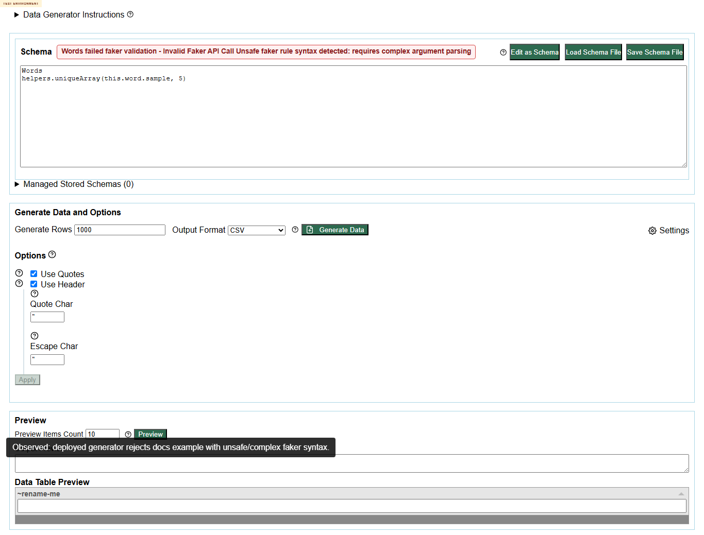
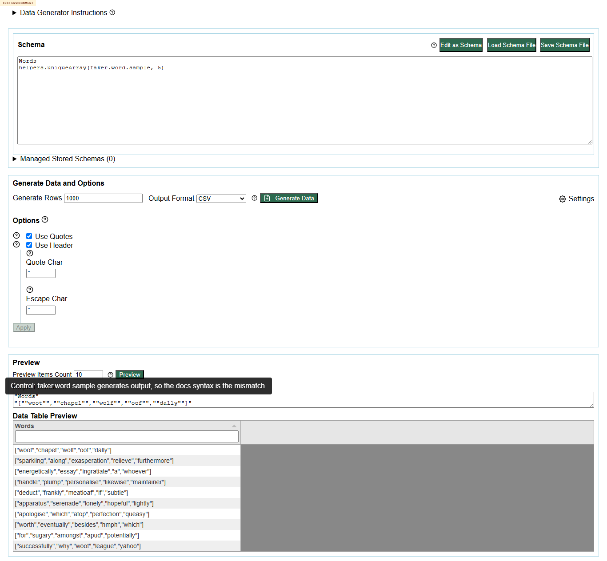

# DEF-001 - Published Faker Helpers `helpers.uniqueArray(this.word.sample, 5)` example is rejected by deployed generator

Status: confirmed repeatable defect  
Severity: Medium  
Area: published docs / generator runtime consistency  
Affected docs URL: https://eviltester.github.io/grid-table-editor/site/docs/test-data/faker/helpers/  
Runtime URL: https://eviltester.github.io/grid-table-editor/generator.html

## Summary

The published Faker Helpers docs show `helpers.uniqueArray(this.word.sample, 5)` as an example, but the deployed generator rejects that syntax. A nearby equivalent using `faker.word.sample` works, which makes this a stale or misleading docs/runtime mismatch rather than a general helper failure.

## Steps To Reproduce

1. Open https://eviltester.github.io/grid-table-editor/generator.html.
2. Click `Edit as Text`.
3. Enter:

```text
Words
helpers.uniqueArray(this.word.sample, 5)
```

4. Click `Preview`.

## Observed Result

The generator displays:

```text
Words failed faker validation - Invalid Faker API Call Unsafe faker rule syntax detected: requires complex argument parsing
```

## Expected Result

A published docs example should either execute successfully in the deployed generator or clearly state that it is not direct generator syntax. If `faker.word.sample` is the supported syntax, the docs should use that form.

## Repeatability

Repeated by the docs-consistency subagent and again in main Loop 3. Repeatable.

## Control Check

This similar schema works and generates arrays of sampled words:

```text
Words
helpers.uniqueArray(faker.word.sample, 5)
```

## Evidence





Video: [defect-001-docs-helpers-uniquearray-this-word.webm](../videos/defect-001-docs-helpers-uniquearray-this-word.webm)

Supporting data:

- `../support/docs-consistency-runtime-examples.json`
- `../support/main-loop3-ideas-results.json`
