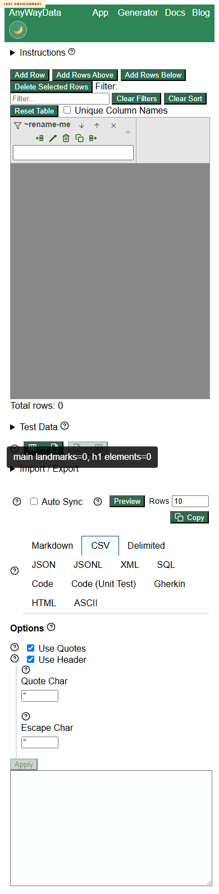

# DEF-002 - Deployed app page lacks a main landmark and H1

Status: confirmed repeatable defect  
Severity: Medium  
Area: accessibility / page structure  
Affected URL: https://eviltester.github.io/grid-table-editor/site/app.html

## Summary

The deployed app page exposes the editor UI but does not include a `main` landmark or an H1. This makes orientation harder for keyboard and assistive-technology users, especially because the editor surface is dense and has many controls.

## Steps To Reproduce

1. Open https://eviltester.github.io/grid-table-editor/site/app.html.
2. Inspect the DOM or accessibility structure.
3. Check for `main`, `[role="main"]`, and `h1` elements.
4. Repeat at desktop and mobile viewport sizes.

## Observed Result

DOM probes found:

```text
main landmarks: 0
h1 elements: 0
```

This repeated at `1440x900`, `390x844`, and `320x568`.

## Expected Result

The app page should expose a main landmark and a page-level heading so users can identify and jump to the primary editor content.

## Repeatability

Repeated by the responsive/accessibility subagent and main Loop 3. Repeatable.

## Evidence



Video: [defect-002-app-missing-main-h1.webm](../videos/defect-002-app-missing-main-h1.webm)

Supporting data:

- `../support/responsive-accessibility-responsive-scan.json`
- `../support/main-loop3-ideas-results.json`
