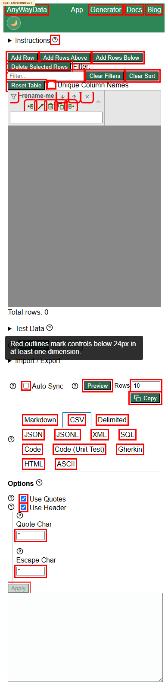
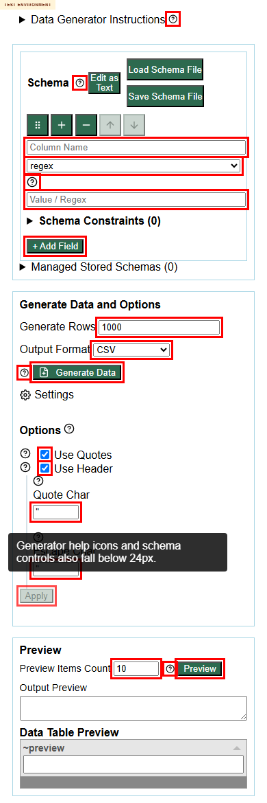

# DEF-003 - App and generator mobile controls include sub-24px touch targets

Status: confirmed repeatable defect  
Severity: Medium  
Area: mobile usability / accessibility  
Affected URLs:

- https://eviltester.github.io/grid-table-editor/site/app.html
- https://eviltester.github.io/grid-table-editor/generator.html

## Summary

Mobile scans found multiple visible interactive controls below 24px in at least one dimension. Examples include 13x13 help icons, small docs links, and schema row inputs/selects around 19-21px high. These controls are difficult to operate reliably on touch devices and fall below the WCAG 2.2 target-size floor used as the review heuristic.

## Steps To Reproduce

1. Open the app or generator at a mobile viewport such as `390x844`.
2. Inspect visible interactive controls (`button`, `a`, `input`, `select`, `textarea`).
3. Measure their rendered bounding boxes.
4. Note controls with width or height below 24px.

## Observed Result

Examples from the deployed app/generator include:

- Help icons around `13x13`.
- Generator field type select around `312x19`.
- Schema row inputs around `320x21`.
- Several mobile nav/doc links under 24px high.

## Expected Result

Interactive controls should provide at least a 24px target area, and preferably larger touch-friendly targets in mobile layouts.

## Repeatability

Repeated by the responsive/accessibility subagent and main Loop 3. Repeatable.

## Evidence

Red outlines mark controls below 24px in at least one dimension.

Video evidence was recorded locally at `videos/defect-003-sub-24px-touch-targets.webm` and is intentionally not checked in.

Supporting data:

- `../support/responsive-accessibility-responsive-scan.json`
- `../support/main-loop3-ideas-results.json`
