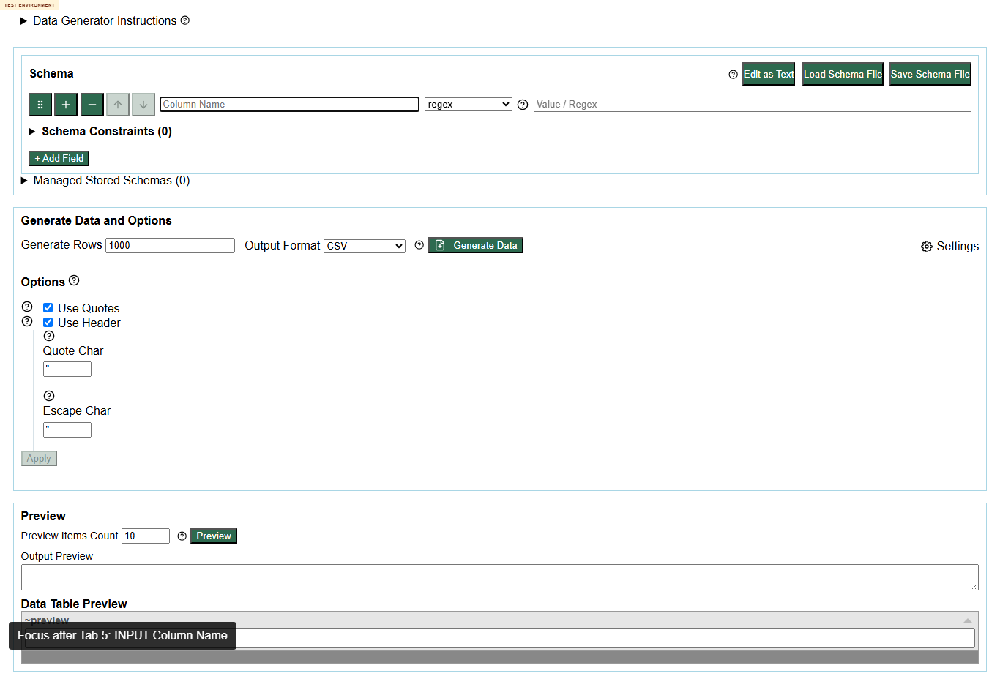

# DEF-004 - Generator schema row keyboard order skips from Column Name to page/body and row action controls before Field Type

Status: confirmed repeatable defect  
Severity: Medium  
Area: keyboard usability / schema editor workflow  
Affected URL: https://eviltester.github.io/grid-table-editor/generator.html

## Summary

When keyboard focus starts in the first schema row `Column Name` field, pressing Tab does not move directly to the next logical data-entry field (`Field type`) or value/command controls. In the main-agent repeat, focus moved to the document body and then through row action buttons such as drag/reorder/insert/remove before reaching the core editing controls. This makes schema row entry inefficient and confusing for keyboard users.

## Steps To Reproduce

1. Open https://eviltester.github.io/grid-table-editor/generator.html.
2. Focus the first schema row `Column Name` input.
3. Press Tab repeatedly.
4. Observe the focused element after each Tab.
5. Repeat on desktop and mobile viewport sizes.

## Observed Result

Main Loop 3 focus sequence began:

```text
Column Name input
BODY
Drag field to reorder
Insert field after this row
Remove field
...
```

The responsive/accessibility subagent also reported repeated keyboard-order problems around the schema row.

## Expected Result

Tab should move through the row's primary editing controls in a predictable order, such as `Column Name` -> `Field type` -> command/value/params controls -> constraints/additional row controls. Row management controls can remain reachable, but should not interrupt the primary data-entry path immediately after the first field.

## Repeatability

Repeated by responsive/accessibility lane and main Loop 3, with main Loop 3 refining the symptom from a trap to a poor/non-intuitive tab order. Repeatable.

## Evidence



Video: [defect-004-schema-row-tab-order.webm](../videos/defect-004-schema-row-tab-order.webm)

Supporting data:

- `../support/responsive-accessibility-generator-schema-tab-order.json`
- `../support/main-loop3-ideas-results.json`
