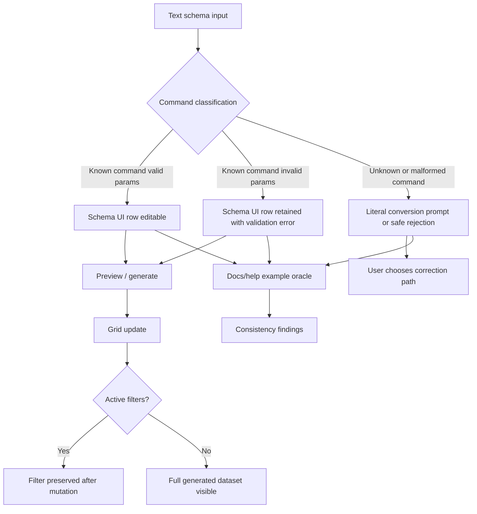

# Issue 253 / PR 285 Deployed Exploratory Test Report

## Executive Summary

A deployed-only multi-agent exploratory review was completed for issue #253 and the resolved merged PR #285. The user-supplied PR #295 is not resolvable in `eviltester/grid-table-editor`; PR #285 is the PR that closes issue #253 plus related issues #268, #269, and #270.

The core story behavior looks acceptable in the deployed environment: known commands with invalid parameters, including `number.int(min=1, min=2, max=3)`, switch into Schema UI and remain editable with row-level validation. Unknown command-like text remains distinct and triggers the literal-conversion decision path rather than silently falling back to regex/literal behavior.

Four repeatable defects were confirmed, all outside the core issue #253 success path: one docs/runtime mismatch and three accessibility/mobile/keyboard issues.

## Scope And References

- Story: [issue #253](https://github.com/eviltester/grid-table-editor/issues/253)
- User-supplied PR: [PR #295](https://github.com/eviltester/grid-table-editor/pull/295) - not resolvable in the target repo during this session
- Resolved PR under test: [PR #285](https://github.com/eviltester/grid-table-editor/pull/285)
- Deployed test environment: [site](https://eviltester.github.io/grid-table-editor/site/), [app](https://eviltester.github.io/grid-table-editor/site/app.html), [generator](https://eviltester.github.io/grid-table-editor/generator.html)
- Session prompt: [issue-253-session-goal-prompt.md](issue-253-session-goal-prompt.md)
- Main log: [issue-253-test-log.md](issue-253-test-log.md)

## Planning Summary

Issue #253 asked for a distinction between unknown/malformed commands and known commands with invalid params when moving between text schema and Schema UI. PR #285 was broader and also changed `autoIncrement.sequence` validation and grid filter preservation after bulk/generated data mutations.

Risk focus:

- Known invalid commands misclassified as unknown and forced into literal conversion.
- Unknown command-like text accepted as editable known commands.
- Validators behaving differently across text schema, Schema UI, preview, and docs examples.
- `autoIncrement.sequence` allowing `step=0` or negative `zeropadding`.
- Generated/bulk grid updates losing active filters.
- Docs/help examples drifting from runtime command behavior.
- Dense generator/app controls causing keyboard, mobile, and accessibility regressions.

Changed-surface inventory:

- Shared schema editor controller classification and switching behavior.
- `autoIncrement.sequence` domain validation.
- Tabulator grid filter preservation after bulk/generated amendments.
- Browser and unit coverage around text/schema sync, generator schema editing, sequence validation, and duplicate-column copy.

## Delegation Summary

Six subagents were used:

- Command coverage and example execution: [logs/command-coverage-test-log.md](logs/command-coverage-test-log.md), [support/command-coverage-findings.md](support/command-coverage-findings.md)
- Negative validation and malformed parameter testing: [logs/negative-validation-test-log.md](logs/negative-validation-test-log.md), [support/negative-validation-findings.md](support/negative-validation-findings.md)
- Docs/help/content consistency: [logs/docs-consistency-test-log.md](logs/docs-consistency-test-log.md), [support/docs-consistency-findings.md](support/docs-consistency-findings.md)
- UX/usability and workflow regression: [logs/ux-regression-test-log.md](logs/ux-regression-test-log.md), [support/ux-regression-findings.md](support/ux-regression-findings.md)
- Responsive/mobile and accessibility: [logs/responsive-accessibility-test-log.md](logs/responsive-accessibility-test-log.md), [support/responsive-accessibility-findings.md](support/responsive-accessibility-findings.md)
- Grid/filter and duplicate-column regression: [logs/grid-filter-regression-test-log.md](logs/grid-filter-regression-test-log.md), [support/grid-filter-regression-findings.md](support/grid-filter-regression-findings.md)

## Model-Based Coverage Diagram

## Test Techniques And Heuristics Used

Exploratory testing, risk-based testing, equivalence partitioning, boundary analysis, negative testing, consistency/oracle checking, state/flow modeling, pairwise thinking, accessibility heuristics, responsive testing heuristics, and documentation testing.

## Coverage By Command Family, Docs Surface, And Workflow Area

Command families sampled:

- Domain commands: `number.int`, `location.cardinalDirection`, `location.direction`, `finance.iban`, `date.between`, `autoIncrement.sequence`.
- Faker/helper commands: `helpers.mustache`, `helpers.fake`, `helpers.uniqueArray`, `person.firstName`, `person.fullName`.
- String/helper commands: `string.counterString`, `string.fromCharacters`.
- Default/inline examples: enum, regex, literal, inline colon schema syntax.
- Validators and boundaries: duplicate named params, reversed min/max, malformed params, invalid barewords, `step=0`, negative `zeropadding`.
- Unknown/removed/deprecated boundary: `unknown.command`, `person.notACommand`, searched stale `urlLoremFlickr` and did not find it in reviewed user-facing docs/picker surfaces.
- Structured/constrained params: arrays, booleans, object-like helper examples, date numeric bounds, prefixed/suffixed padded sequence.
- Output formats sampled: CSV, JSON, Markdown, plus grid/export lane checks.

Docs/pages reviewed included the site home, app, generator, docs intro, generating-data category, schema definition, Faker docs/helpers, domain docs, number docs, auto-increment docs, web UI, REST API, and CLI pages. See [support/docs-consistency-findings.md](support/docs-consistency-findings.md) for the full list.

Workflow areas covered:

- Text schema to Schema UI switching.
- Schema UI to text and back.
- Preview/generate from valid and invalid schemas.
- Method picker and command search/help.
- App Test Data schema editor path.
- Grid filter preservation after replacement/amendment generation flows.
- Duplicate-column copy/export behavior.
- Mobile layouts, landmarks/headings, focus order, target sizes.

## Loops Performed And What Changed

Loop 0 / setup:

- Saved the initiating prompt before testing.
- Proved browser control with Playwright MCP against the deployed site and app.
- Confirmed PR #295 is not resolvable; resolved PR #285 as the merged PR closing #253.

Loop 1:

- Executed broad command sampling from changed surfaces.
- Confirmed the exact issue example switches to Schema UI with row-level duplicate-param validation.
- Confirmed `autoIncrement.sequence(step=0)` and negative `zeropadding` are rejected but remain editable as known commands.
- Confirmed unknown command-like text stays distinct.

Loop 2:

- Generated 12 ideas from Loop 1 gaps and subagent logs.
- Executed duplicate-param variants on other command families, structured arrays, helper examples, `person.fullName`, unknown `person.notACommand`, and JSON/Markdown output format sampling.
- Docs lane identified the `helpers.uniqueArray(this.word.sample, 5)` docs/runtime mismatch.
- Responsive lane identified accessibility/mobile candidates.

Loop 3:

- Generated 12 additional ideas focused on confirmed candidates and controls.
- Reconfirmed the docs/runtime mismatch with a working control syntax.
- Confirmed app page missing `main`/H1 while generator has both.
- Confirmed sub-24px targets in app/generator mobile layouts.
- Refined the schema row keyboard finding to a poor/non-intuitive tab order.
- Reduced one candidate: method picker Tab navigation moved through controls in the main repeat, so it was not packaged as a confirmed defect.

Final review loop:

- Completed after the report/log/defect collation pass. See the final-review log entry for the final 10 ideas, classifications, and executed items.

## Confirmed Defects

- [DEF-001 - Published Faker Helpers `helpers.uniqueArray(this.word.sample, 5)` example is rejected by deployed generator](defects/defect-001-docs-helpers-uniquearray-this-word.md)
- [DEF-002 - Deployed app page lacks a main landmark and H1](defects/defect-002-app-missing-main-h1.md)
- [DEF-003 - App and generator mobile controls include sub-24px touch targets](defects/defect-003-sub-24px-touch-targets.md)
- [DEF-004 - Generator schema row keyboard order skips from Column Name to page/body and row action controls before Field Type](defects/defect-004-schema-row-tab-order.md)

## Suspicious Behaviors And Risks

- `string.fromCharacters(characters=[], length=4)` generated output; no defect filed because a product/source oracle is needed to know whether empty arrays should fail.
- Method picker Tab behavior was reported as trapped by one lane but moved through category controls in main Loop 3; left as a follow-up risk rather than confirmed defect.
- The user-supplied PR #295 link is not resolvable in the repo; this is a session input mismatch, not a deployed-app defect.

## Deferred Ideas

- Full combinatorial output-format sweep across every command matrix case.
- Product/source oracle for `string.fromCharacters` empty array behavior.
- Manual screen-reader confirmation of schema editor and method-picker flows.
- Cross-browser keyboard comparison.
- Axe/Lighthouse audit if a future pass allows dedicated audit tooling.
- Review all Faker Helpers callback examples for direct runtime executability.

## What Was Not Covered And Why

- Local tests, builds, package-manager commands, and repo verify commands were intentionally not run per operating rules.
- Full command inventory exhaustive testing was not attempted; broad risk-based sampling was used because command definitions are large.
- Full output-format by command-family cross-product was deferred because representative alternate formats were healthy and the matrix would be large.
- Manual assistive-technology testing was deferred because this session used browser automation in the deployed environment.

## Final Recommendation

The issue #253 and PR #285 core behavior looks acceptable in the deployed environment. Known commands with invalid params stay editable in Schema UI, unknown command-like text remains distinct, and `autoIncrement.sequence` validator changes appear deployed. Grid/filter preservation checks also passed.

I recommend accepting the issue #253 functional fix, with follow-up work for the four confirmed docs/accessibility defects before treating the broader user experience as fully polished.

## Final Review Loop Addendum

The mandatory final review loop generated 12 additional ideas. Ten were `execute-now` and two were deferred. Executed checks reconfirmed:

- The exact issue #253 schema still switches to Schema UI with row-level duplicate-param validation.
- Unknown command-like text still remains distinct and in text mode.
- Valid padded `autoIncrement.sequence` generates expected values.
- Invalid `autoIncrement.sequence(step=0)` gives row-level validation.
- App and generator load without console errors.
- The Faker Helpers docs page is reachable.
- Four defect videos exist and are non-empty.
- Defect screenshot references are valid.
- All six subagent logs exist.

Deferred final-review ideas:

- Production `anywaydata.com` comparison, because this session was scoped to the deployed test environment URL supplied by the user.
- Local source diff audit, because the operating rules prohibited local repo testing/verification work.

Stopping is justified because broad story/PR coverage, three main loops, final review, all six subagent lanes, split defect reports, screenshots, and videos are complete. Recent loops produced confirmation/refinement rather than new functional failures.
