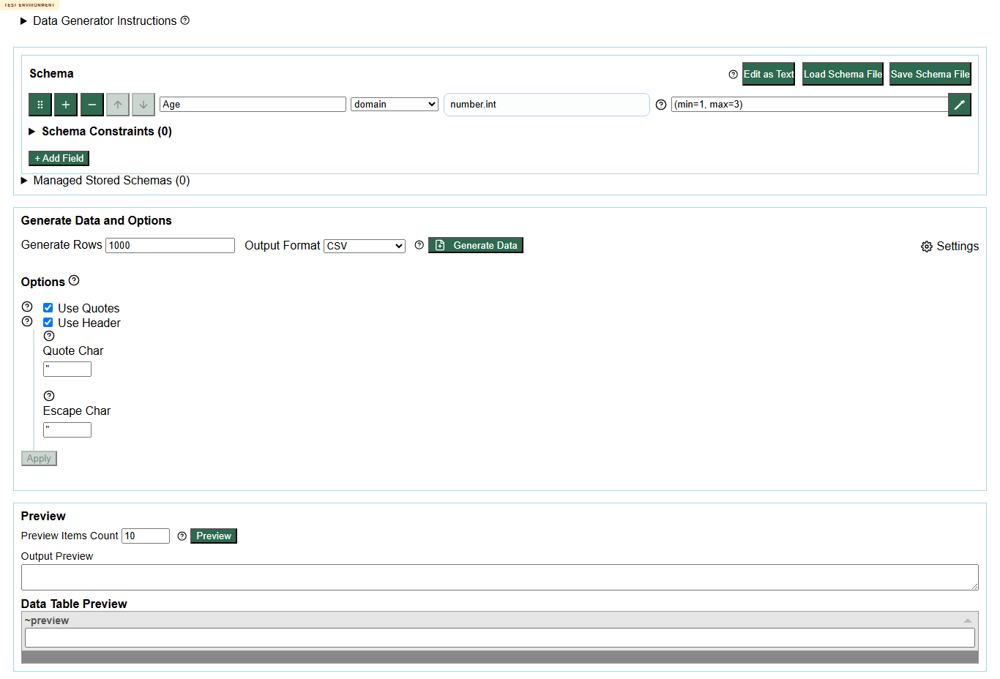
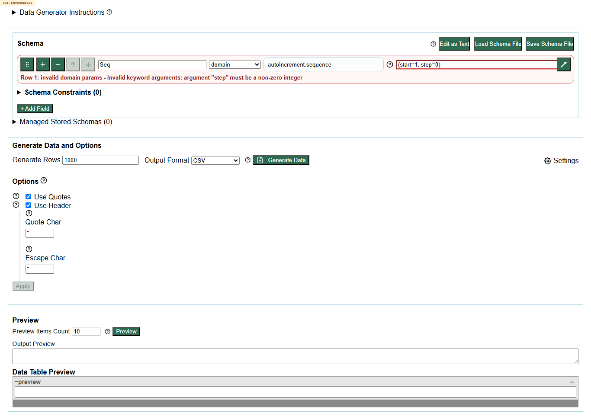
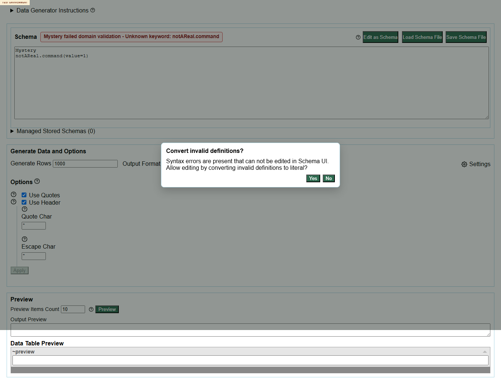
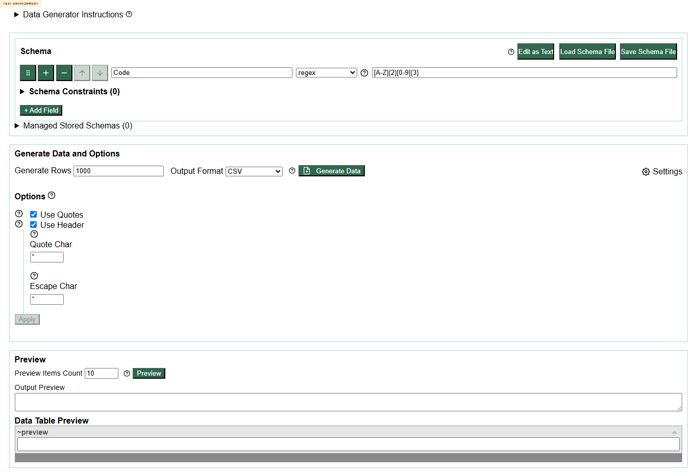
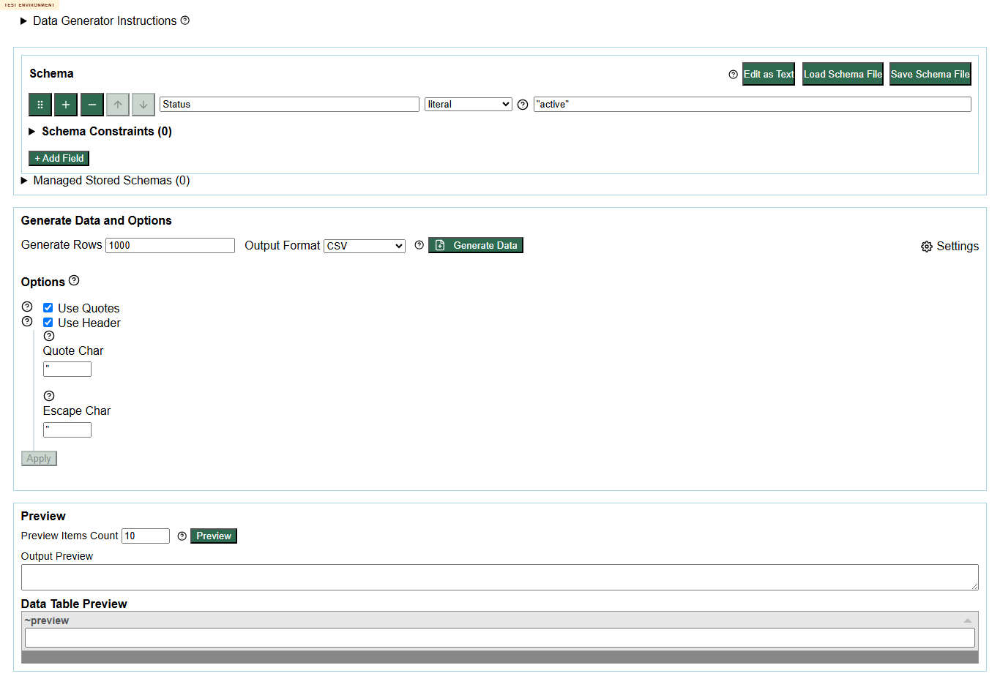

# Main Loop 1 Command Sampling

| Case | Family | Mode after switch | Button | Dialogs | Status / evidence | Screenshot |
| --- | --- | --- | --- | --- | --- | --- |
| story-duplicate-min | domain validator duplicate params | schema | Edit as Text |  | Row 1: invalid domain params - Invalid keyword arguments: duplicate named argument "min" |  |
| valid-number-int | domain valid params | schema | Edit as Text |  |  |  |
| invalid-number-range | domain validator invalid range | schema | Edit as Text |  | Row 1: invalid domain params - Invalid keyword arguments: argument "min" must be less than or equal to argument "max" |  |
| sequence-step-zero | changed autoIncrement.sequence validator | schema | Edit as Text |  | Row 1: invalid domain params - Invalid keyword arguments: argument "step" must be a non-zero integer |  |
| sequence-negative-zeropadding | changed autoIncrement.sequence validator | schema | Edit as Text |  | Row 1: invalid domain params - Invalid keyword arguments: argument "zeropadding" must be greater than or equal to 0 |  |
| valid-sequence | changed autoIncrement.sequence valid | schema | Edit as Text |  |  |  |
| unknown-command | removed/unknown command | text | Edit as Schema |  | Mystery failed domain validation - Unknown keyword: notAReal.command / Row 1: unknown domain command "notAReal.command". |  |
| malformed-call | malformed syntax | schema | Edit as Text |  | Row 1: params should be wrapped in parentheses, e.g. (min=1, max=3). |  |
| regex-default | regex default examples | schema | Edit as Text |  |  |  |
| literal-default | literal/default examples | schema | Edit as Text |  |  |  |