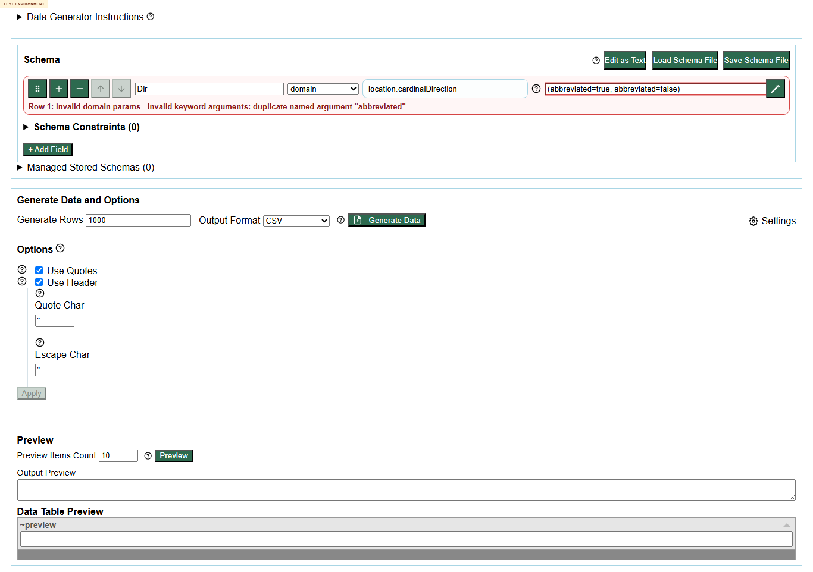
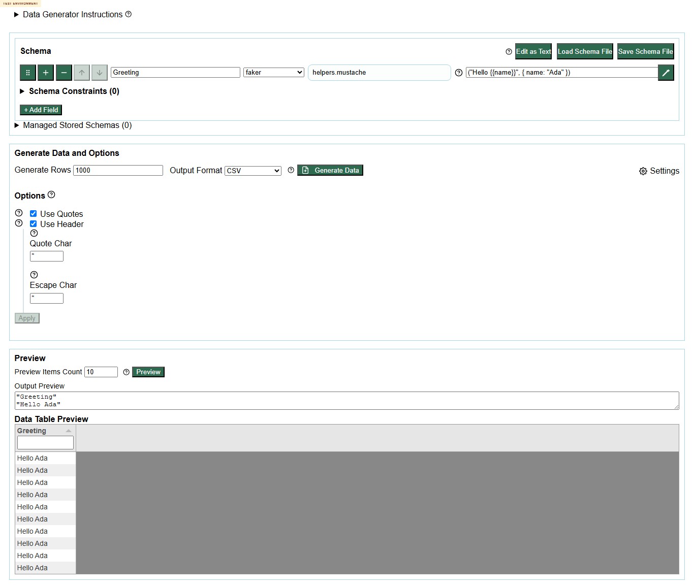
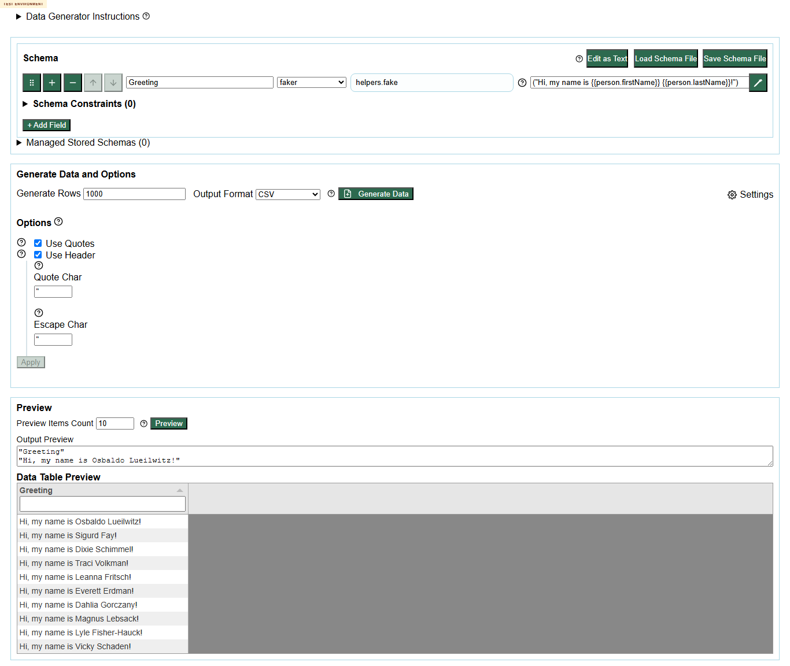
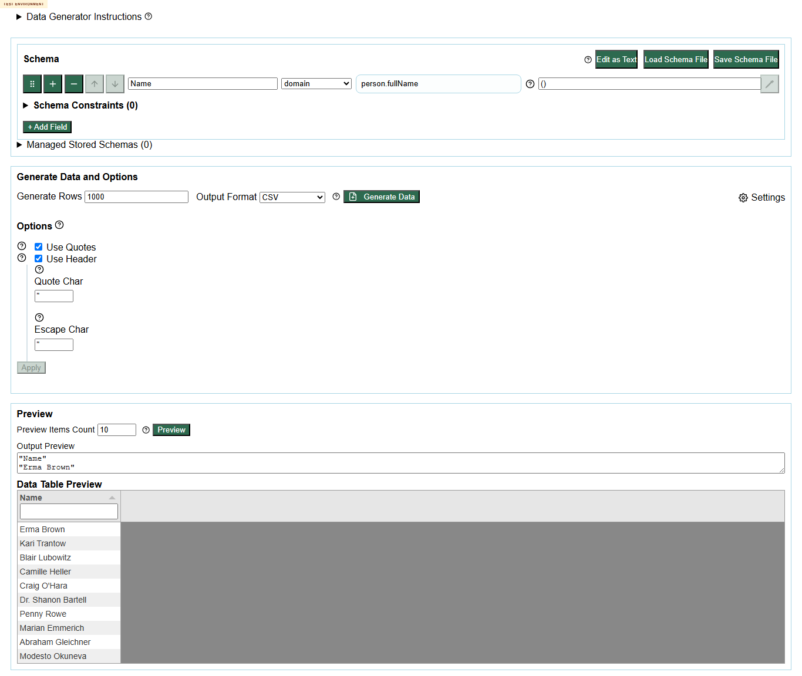
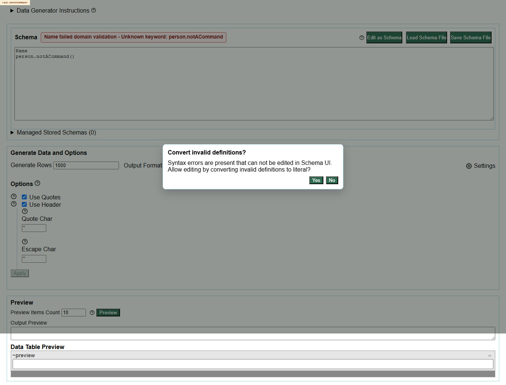
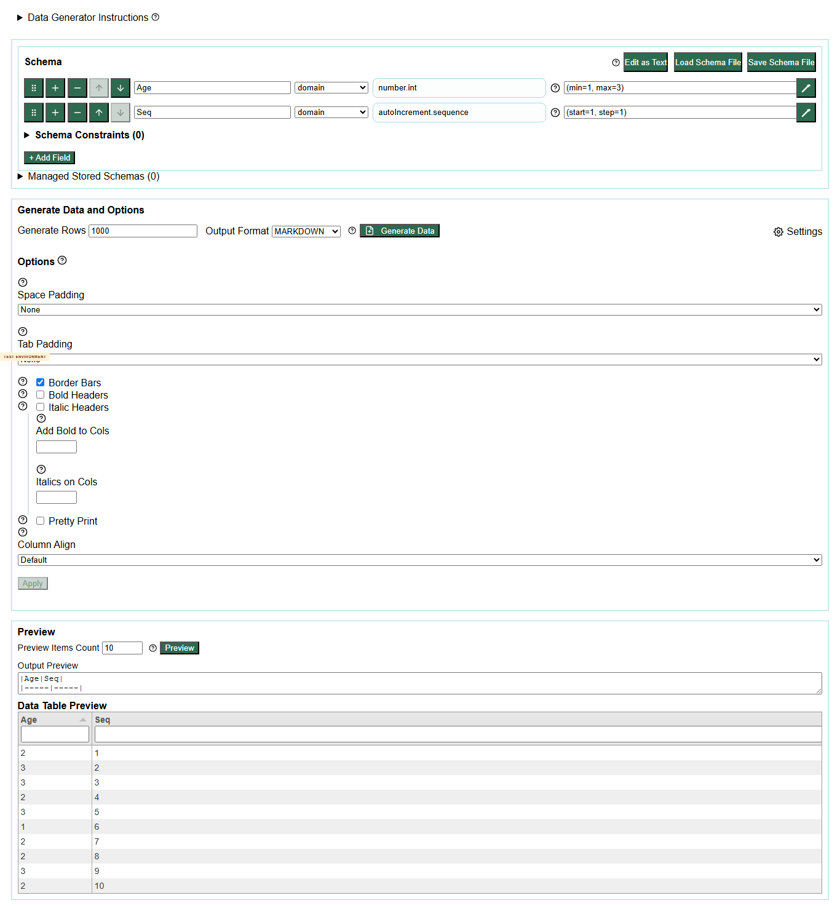

# Loop 2 Ideas And Results

| ID | Idea | Class | Result summary | Screenshot |
| --- | --- | --- | --- | --- |
| L2-01 | Duplicate params on autoIncrement.sequence | execute-now | mode=schema; status=Row 1: invalid domain params - Invalid keyword arguments: duplicate named argument "step"; dialogs=none; output= |  |
| L2-02 | Duplicate params on location cardinal direction | execute-now | mode=schema; status=Row 1: invalid domain params - Invalid keyword arguments: duplicate named argument "abbreviated"; dialogs=none; output= |  |
| L2-03 | Malformed quote in number.int | execute-now | mode=schema; status=Row 1: invalid faker params - Invalid Faker API Call Unsafe faker rule syntax detected: requires complex argument parsing; dialogs=none; output= |  |
| L2-04 | String structured param valid characters array | execute-now | mode=schema; status=none; dialogs=none; output=CSV:"Token" "AAAA" "BABA" "ABAB" "BBAA" "BAAA" "ABAA" "BBBB" "BBAB" "AAAA" "BBBA" |  |
| L2-05 | String structured param malformed quoted array | execute-now | ERROR: page.goto: net::ERR_CONNECTION_RESET at https://eviltester.github.io/grid-table-editor/generator.html
Call log:
  - navigating to "https://eviltester.github.io/grid-table-editor/generator.html", waiting until "domcontentloaded"
 |  |
| L2-06 | Faker helper mustache from docs | execute-now | mode=schema; status=none; dialogs=none; output=CSV:"Greeting" "Hello Ada" "Hello Ada" "Hello Ada" "Hello Ada" "Hello Ada" "Hello Ad |  |
| L2-07 | Faker helper fake from docs | execute-now | mode=schema; status=none; dialogs=none; output=CSV:"Greeting" "Hi, my name is Osbaldo Lueilwitz!" "Hi, my name is Sigurd Fay!" "Hi, |  |
| L2-08 | person.fullName command-like docs example | execute-now | mode=schema; status=none; dialogs=none; output=CSV:"Name" "Erma Brown" "Kari Trantow" "Blair Lubowitz" "Camille Heller" "Craig O'Ha |  |
| L2-09 | Unknown command-like docs boundary | execute-now | mode=text; status=Name failed domain validation - Unknown keyword: person.notACommand / Row 1: unknown domain command "person.notACommand".; dialogs=none; output= |  |
| L2-10 | Output format sweep JSON/Markdown for valid mixed schema | execute-now | mode=schema; status=none; dialogs=none; output=JSON:[ 	{ 		"Age": 2, 		"Seq": 1 	}, 	{ 		"Age": 3, 		"Seq": 2 	}, 	{ 		"Age": 3, 		" \| MARKDOWN:\|Age\|Seq\| \|-----\|-----\| \|2\|1\| \|3\|2\| \|3\|3\| \|2\|4\| \|3\|5\| \|1\|6\| \|2\|7\| \|2\|8\| \|3\|9\| \|2 |  |
| L2-11 | Full output-format sweep for all command matrix cases | defer | Deferred: Large combinatorial sweep; sampled representative alternate formats now. |  |
| L2-12 | Spec-oracle check for empty arrays in string.fromCharacters | defer | Deferred: Requires product/source oracle beyond deployed-only evidence. |  |