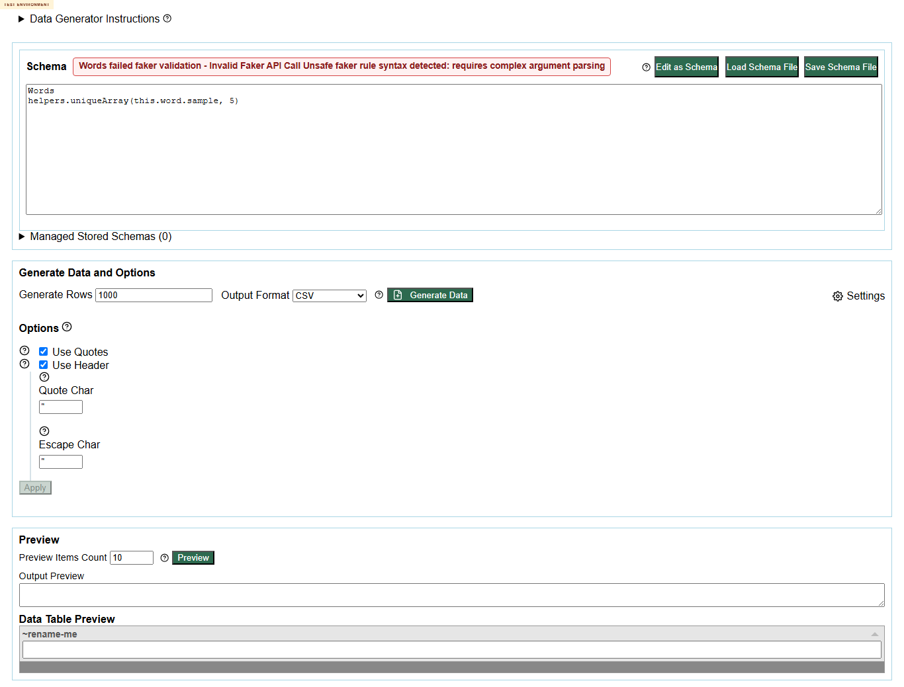
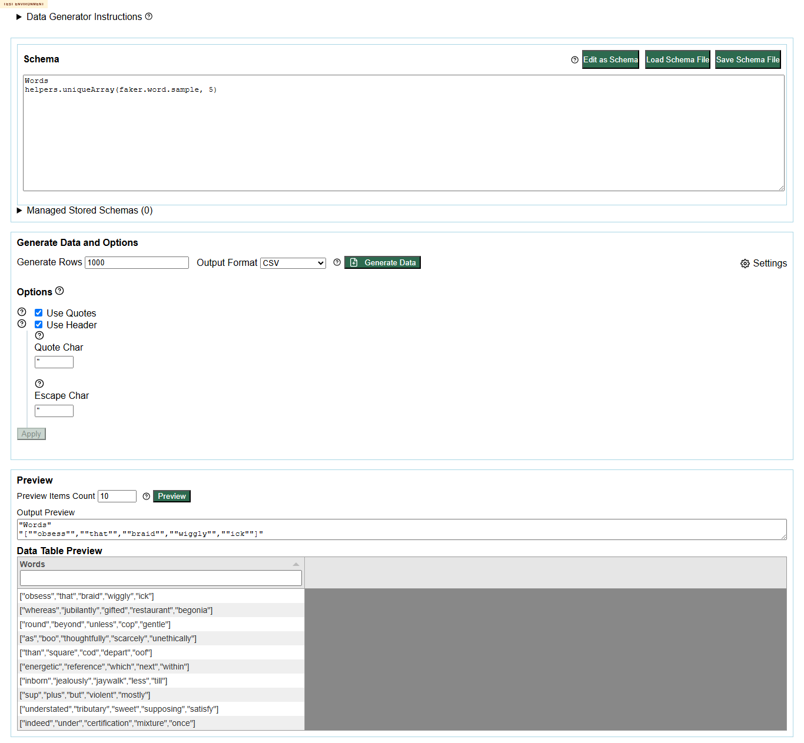
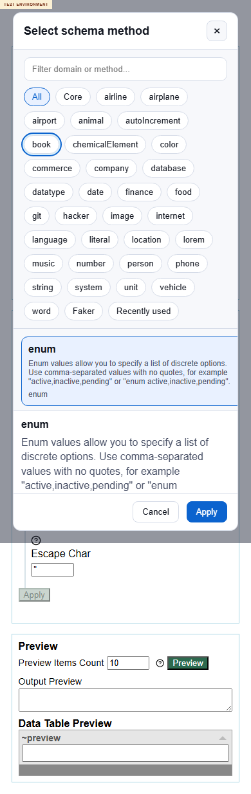
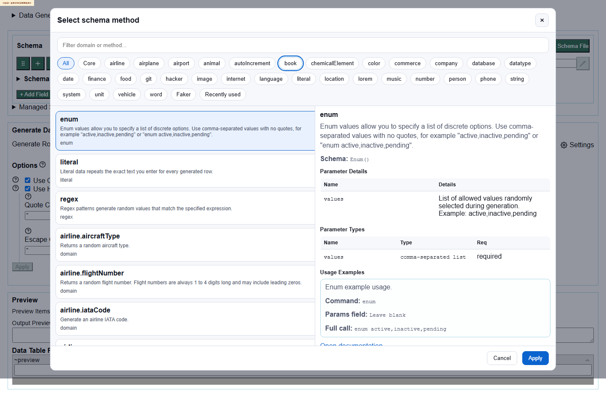
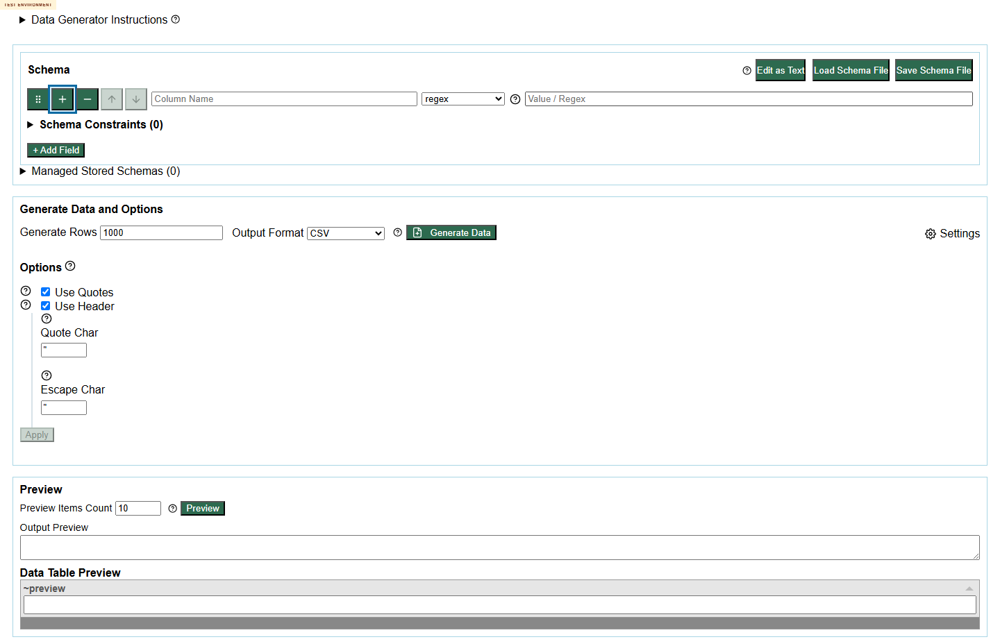
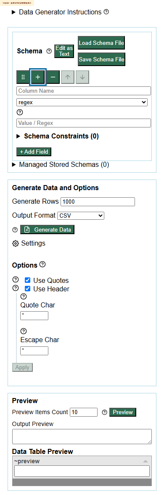

# Loop 3 Ideas And Results

| ID | Idea | Class | Result summary | Screenshot |
| --- | --- | --- | --- | --- |
| L3-01 | Recheck docs uniqueArray this.word.sample failure | execute-now | {"containsError":true,"excerpt":"Skip to main content\nData Generator\nData Generator Instructions \nSchema\nWords failed faker validation - Invalid Faker API Call Unsafe faker rule syntax detected: requires complex argument parsing\nEdit as Schema\nLoad Schema File\nSave Schema File\nManaged Stored Schemas (0)\nGenerate Data and Options\nGenerate  |  |
| L3-02 | Control check uniqueArray faker.word.sample succeeds | execute-now | {"containsError":false,"excerpt":"Skip to main content\nData Generator\nData Generator Instructions \nSchema\nEdit as Schema\nLoad Schema File\nSave Schema File\nManaged Stored Schemas (0)\nGenerate Data and Options\nGenerate Rows \nOutput Format \nCSV\nJSON\nJSONL\nXML\nSQL\nMARKDOWN\nDSV\nHTML\nGHERKIN\nASCIITABLE\nC#\nJava\nJavaScript\nKotlin\nP |  |
| L3-03 | App page landmark and H1 scan across desktop/mobile | execute-now | [{"vp":{"width":1440,"height":900},"mainCount":0,"h1Count":0,"title":"Test Data Generator and Table Editor for Markdown, CSV, JSON, Gherkin and HTML - AnyWayData"},{"vp":{"width":390,"height":844},"mainCount":0,"h1Count":0,"title":"Test Data Generator and Table Editor for Markdown, CSV, JSON, Gherkin and HTML - AnyWayData"},{"vp":{"width":320,"heig |  |
| L3-04 | Generator landmark and H1 scan across desktop/mobile | execute-now | [{"vp":{"width":1440,"height":900},"mainCount":1,"h1Count":1,"title":"Data Generator - AnyWayData"},{"vp":{"width":390,"height":844},"mainCount":1,"h1Count":1,"title":"Data Generator - AnyWayData"},{"vp":{"width":320,"height":568},"mainCount":1,"h1Count":1,"title":"Data Generator - AnyWayData"}] |  |
| L3-05 | App mobile touch target scan | execute-now | [{"tag":"A","text":"AnyWayData","width":93,"height":17},{"tag":"A","text":"Generator","width":72,"height":17},{"tag":"A","text":"Docs","width":36,"height":17},{"tag":"A","text":"Blog","width":32,"height":17},{"tag":"BUTTON","text":"Show help","width":13,"height":13},{"tag":"BUTTON","text":"Copy Instructions To Grid","width":165,"height":21},{"tag": |  |
| L3-06 | Generator mobile touch target scan | execute-now | [{"tag":"BUTTON","text":"Show help","width":13,"height":13},{"tag":"BUTTON","text":"Show help","width":13,"height":13},{"tag":"INPUT","text":"Column Name","width":320,"height":21},{"tag":"SELECT","text":"enum\nliteral\nregex\ndomain\nfaker","width":312,"height":19},{"tag":"A","text":"Regex data help","width":16,"height":16},{"tag":"INPUT","text":"V |  |
| L3-07 | Method picker mobile Tab sequence repeat | execute-now | [{"tag":"INPUT","label":"Filter methods","text":""},{"tag":"BUTTON","label":null,"text":"All"},{"tag":"BUTTON","label":null,"text":"Core"},{"tag":"BUTTON","label":null,"text":"airline"},{"tag":"BUTTON","label":null,"text":"airplane"},{"tag":"BUTTON","label":null,"text":"airport"},{"tag":"BUTTON","label":null,"text":"animal"},{"tag":"BUTTON","label" |  |
| L3-08 | Method picker desktop Tab sequence repeat | execute-now | [{"tag":"INPUT","label":"Filter methods","text":""},{"tag":"BUTTON","label":null,"text":"All"},{"tag":"BUTTON","label":null,"text":"Core"},{"tag":"BUTTON","label":null,"text":"airline"},{"tag":"BUTTON","label":null,"text":"airplane"},{"tag":"BUTTON","label":null,"text":"airport"},{"tag":"BUTTON","label":null,"text":"animal"},{"tag":"BUTTON","label" |  |
| L3-09 | Generator schema row desktop Tab sequence | execute-now | [{"tag":"INPUT","label":"Column Name","text":""},{"tag":"BODY","label":null,"text":"Skip to main content\nData Generator\nData Generator Instructions \nSchema\nEdit as "},{"tag":"BUTTON","label":"Drag field to reorder","text":""},{"tag":"BUTTON","label":"Insert field after this row","text":""},{"tag":"BUTTON","label":"Remove field","text":""},{"tag |  |
| L3-10 | Generator schema row mobile Tab sequence | execute-now | [{"tag":"INPUT","label":"Column Name","text":""},{"tag":"BODY","label":null,"text":"Skip to main content\nData Generator\nData Generator Instructions \nSchema\nEdit as "},{"tag":"BUTTON","label":"Drag field to reorder","text":""},{"tag":"BUTTON","label":"Insert field after this row","text":""},{"tag":"BUTTON","label":"Remove field","text":""},{"tag |  |
| L3-11 | Manual screen-reader confirmation of focus model | defer | Deferred: Requires assistive tech outside current deployed-browser automation. |  |
| L3-12 | Full cross-browser keyboard comparison | defer | Deferred: Current requirement allows Playwright/DevTools; one-browser repeat is enough for defect packaging. |  |