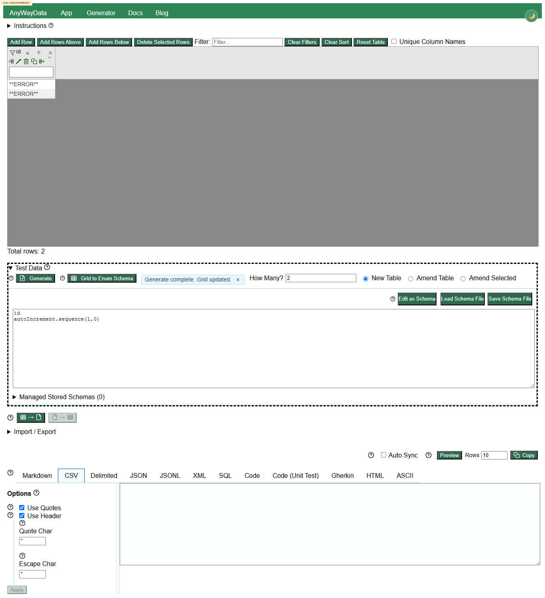
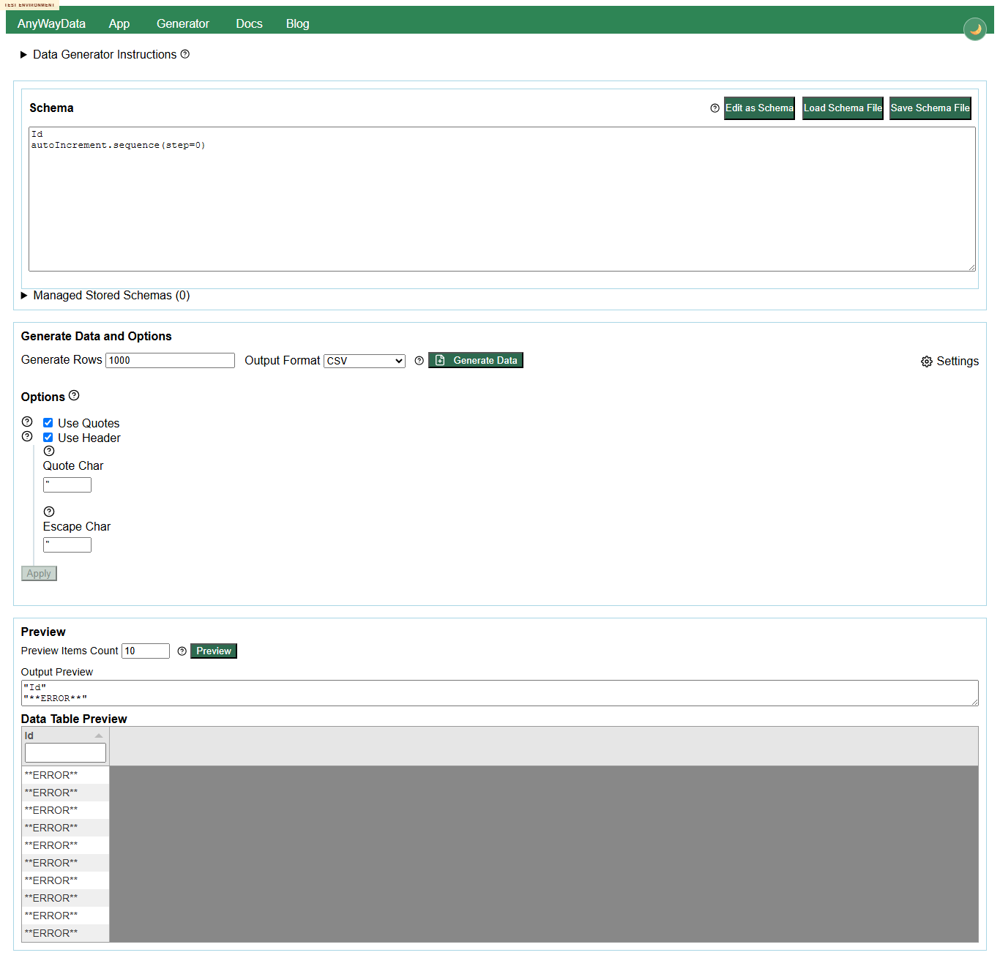

# Defect 001 - autoIncrement.sequence step 0 generates **ERROR** rows instead of validation

## Summary

`autoIncrement.sequence(1,0)` and `autoIncrement.sequence(step=0)` are accepted far enough to generate `**ERROR**` cell values. The app reports `Generate complete. Grid updated.` and the generator preview shows repeated `**ERROR**` rows instead of blocking the invalid parameter with a visible validation message.

## Environment

- Deployed app: `https://eviltester.github.io/grid-table-editor/site/app.html`
- Deployed generator: `https://eviltester.github.io/grid-table-editor/site/generator.html`
- Date tested: 2026-06-29

## Repeatability

Repeatable in both `app.html` and `generator.html`.

## App Reproduction

1. Open `https://eviltester.github.io/grid-table-editor/site/app.html`.
2. Open `Test Data`.
3. Click `Edit as Text`.
4. Enter schema:

```text
id
autoIncrement.sequence(1,0)
```

5. Set `How Many?` to `2`.
6. Click `Generate`.

## App Observed

- Grid column `id` is created.
- Two rows contain `**ERROR**`.
- Message says `Generate complete. Grid updated.`



Video: [defect-autoincrement-invalid-step-app.webm](../videos/defect-autoincrement-invalid-step-app.webm)

## Generator Reproduction

1. Open `https://eviltester.github.io/grid-table-editor/site/generator.html`.
2. Click `Edit as Text`.
3. Enter schema:

```text
Id
autoIncrement.sequence(step=0)
```

4. Click `Preview`.

## Generator Observed

- Preview table contains ten `**ERROR**` rows.
- No visible validation message explains that `step=0` is invalid.



Video: [defect-autoincrement-invalid-step-generator.webm](../videos/defect-autoincrement-invalid-step-generator.webm)

## Expected

The schema should be rejected before generation with a visible validation message, e.g. `step must not be 0`, and no `**ERROR**` values should be written into the grid or preview.

## Notes For Fix Investigation

Other invalid auto-increment arguments, such as `start="abc"`, are blocked with clear domain validation. This suggests `step=0` is missing equivalent argument validation or is throwing during row generation after schema validation has passed.
