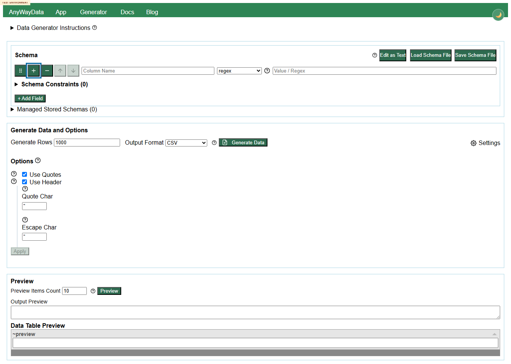

# Defect 004 - generator schema row keyboard tab order skips Field type and Value controls

## Summary

In `generator.html`, keyboard users cannot naturally tab from the `Column Name` input to the `Field type` select and `Value / Regex` input in row-based schema mode. Pressing Tab from `Column Name` moves focus to `body`, then cycles back through row action buttons.

## Environment

- Deployed generator: `https://eviltester.github.io/grid-table-editor/site/generator.html`
- Date tested: 2026-06-29

## Repeatability

Repeatable on desktop in main-agent confirmation. Responsive/accessibility subagent also repeated the issue on desktop and mobile.

## Reproduction

1. Open `https://eviltester.github.io/grid-table-editor/site/generator.html`.
2. Leave the schema editor in row mode.
3. Focus the first row `Column Name` input.
4. Press `Tab` repeatedly.

## Observed

- Initial focus is `Column Name`.
- First Tab moves focus to the document `body`.
- Subsequent Tabs eventually return to row action buttons such as `Drag field to reorder` and `Insert field after this row`.
- Natural keyboard navigation does not proceed from `Column Name` to `Field type` or `Value / Regex`.

Video: [defect-generator-schema-keyboard-loop.webm](../videos/defect-generator-schema-keyboard-loop.webm)

## Expected

Keyboard focus should proceed through the row controls in an expected order, including `Column Name`, `Field type`, help/control buttons, and `Value / Regex`, without jumping to `body`.

## Notes For Fix Investigation

The issue appears in the shared schema row component. Check tabIndex/focus handling around row action buttons, selects, and the command/value input wrappers.
