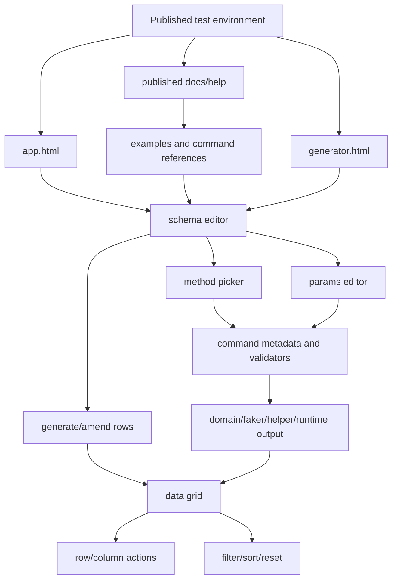
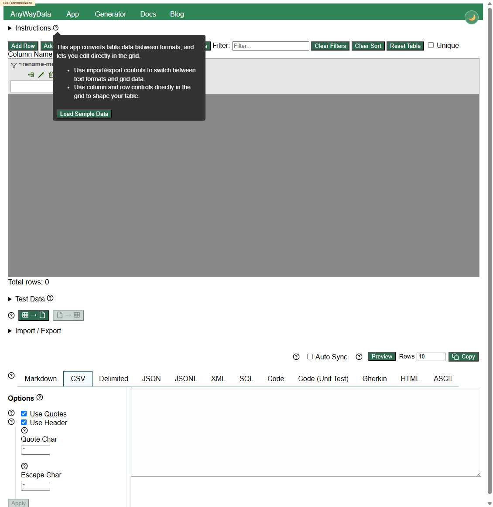
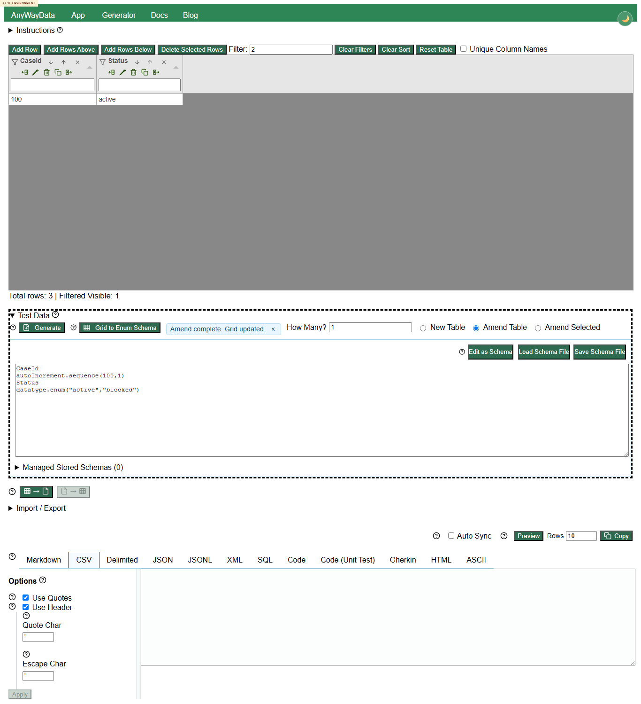
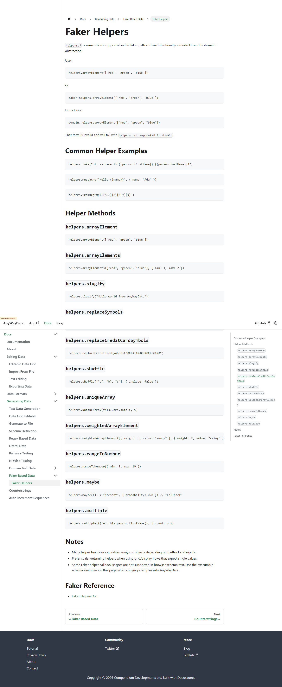
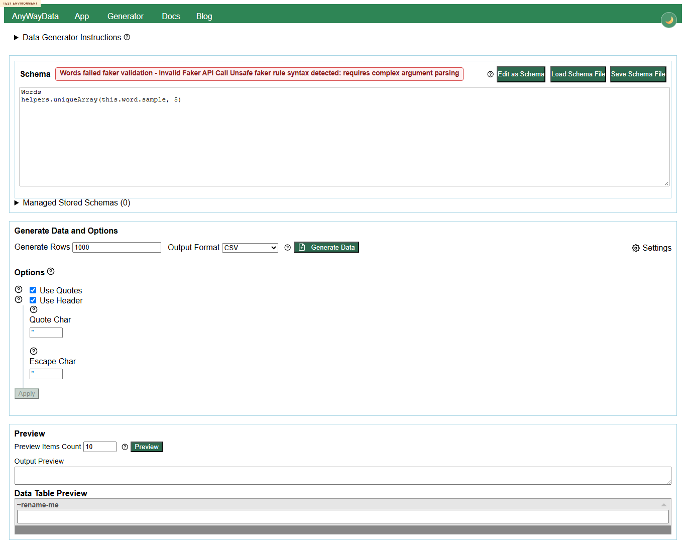

# Issue 266 Exploratory Test Report

## Executive Summary

A deployed-only multi-agent exploratory review was completed for issue #266 using `https://eviltester.github.io/grid-table-editor/site/`. The application is broadly healthy for normal generation and command execution: representative regex, domain, faker/helper, enum, auto-increment, validator-backed, and structured-parameter examples worked in the deployed generator, and app text-schema mode generated/amended grid data successfully.

Five repeatable defects were confirmed. The highest product risk is that invalid auto-increment parameters can write `**ERROR**` into generated output while reporting success. The strongest issue-specific grid/generation defect is that active global filters are not reapplied after `Amend Table` changes data. One accessibility defect and one docs/runtime mismatch were also confirmed.

Final recommendation: the changes are not cleanly acceptable without follow-up. Most happy paths look good, but the confirmed defects should be fixed or explicitly accepted before treating the story as complete.

## Scope and References

- Target issue: https://github.com/eviltester/grid-table-editor/issues/266
- Target repo: https://github.com/eviltester/grid-table-editor
- Test environment: https://eviltester.github.io/grid-table-editor/site/
- Primary runtime page: https://eviltester.github.io/grid-table-editor/site/app.html
- Supporting runtime page: https://eviltester.github.io/grid-table-editor/site/generator.html
- Relevant recent PR context used for changed-surface planning:
  - PR #247 method picker MVC: https://github.com/eviltester/grid-table-editor/pull/247
  - PR #243 enum/domain command changes: https://github.com/eviltester/grid-table-editor/pull/243

Issue #266 asked for app-grid/test-data-generation interplay review and to ignore preview/export areas except where needed for setup or observation. The command-definition surface was also treated as primary coverage because recent changes affected broad command metadata, validators, docs, and method-picker behavior.

## Planning Summary

The mandatory planning stage was completed before substantive testing. The initial report identified:

- Story scope: data grid, grid features, and test-data generation interplay in `app.html`.
- Risk areas: command-definition breadth, app/generator parity, method-picker/params editor regressions, grid-generation state, docs/help oracle drift, and mobile/accessibility.
- Changed-surface inventories saved in `support/pr-247-changed-surface-summary.txt` and `support/pr-243-changed-surface-summary.txt`.
- Command coverage strategy across domain commands, faker/helper commands, newly added commands, removed/deprecated commands, validators, structured params, and docs with multiple examples.

## Delegation Summary

Six subagents were used:

| Lane | Subagent | Log |
| --- | --- | --- |
| Command coverage and example execution | Kant | `logs/command-coverage-test-log.md` |
| Negative validation and malformed parameters | Schrodinger | `logs/negative-validation-test-log.md` |
| Docs/help/content consistency | Singer | `logs/docs-consistency-test-log.md` |
| UX/usability and workflow regression | Poincare | `logs/ux-regression-test-log.md` |
| Responsive/mobile and accessibility review | Aquinas | `logs/responsive-accessibility-test-log.md` |
| Issue-specific grid-generation interplay | Boyle | `logs/grid-generation-interplay-test-log.md` |

## Model-Based Coverage

## Techniques and Heuristics

Used exploratory testing, risk-based testing, equivalence partitioning, boundary analysis, negative testing, consistency/oracle checking, state/flow modeling, pairwise thinking, accessibility heuristics, responsive testing heuristics, and documentation testing.

Browser control was proven before testing by opening the deployed site, clicking into `app.html`, opening the Instructions help control, and saving this screenshot:

## Coverage by Area

### Command Families

Sampled and executed:

- Domain commands: `person.firstName`, `person.lastName`, `internet.email`, `internet.httpMethod(commonOnly=true)`, `location.streetAddress`, `location.direction(abbreviated=true)`, `location.city`, `number.int(min=32,max=47)`, `date.between(...)`, `finance.iban(...)`, `airline.name`, `book.title`, `food.dish`, `music.genre`, `vehicle.vin`.
- Faker/helper commands: `helpers.mustache`, `helpers.fake`, `helpers.arrayElement`, `helpers.uniqueArray`, and helper negative cases.
- Newly/actively changed commands: `datatype.enum`, `autoIncrement.sequence`, current image commands from the picker.
- Removed/unknown commands: `image.urlLoremFlickr()` and `notAReal.domainCommand(foo=true)` were rejected with visible unknown-keyword messages.
- Validators and structured params: numeric ranges, date ordering, booleans, country-code params, enum CSV values, faker helper arrays/callbacks.
- Multiple-example docs: Faker helpers, schema definition, auto-increment sequences, counterstrings, domain docs, pairwise/n-wise docs.

Deferred: exhaustive execution of all 253 domain commands and every output format; broad sampling was enough for this story and PR risk.

### Docs Surfaces

Reviewed deployed docs for intro, generating-data category, test-data generation, editable data grid, generate to file, schema definition, faker test data, faker helpers, domain test data, counterstrings, auto-increment sequences, pairwise, n-wise, web UI, REST API, and CLI.

One docs/runtime mismatch was confirmed: `helpers.uniqueArray(this.word.sample, 5)` is documented but rejected by the deployed generator.

### Workflow Areas

Covered app new-table generation, amend-table generation, amend-selected behavior, global filter plus amend, sort plus amend, duplicate generated names, grid-to-enum schema, reset table, generator parity, method picker, params editor, stored schema save path, docs navigation, responsive/mobile layout, keyboard navigation, and validation/error handling.

## Loops Performed

### Loop 1 - Broad Initial Coverage

Covered positive app/generator generation, command examples, grid amend/filter/sort flows, docs/runtime checks, negative validation, UX, and responsive/accessibility. Identified repeat candidates without filing early.

### Loop 2 - Confirmation and New Ideas

Generated 10 ideas and executed the in-scope confirmations: auto-increment invalid params, filter/amend, invalid JSON import, keyboard tab order, docs uniqueArray example, positive baselines, and removed-command validation. Confirmed five defects and dropped the JSON import suspected defect because a visible message appeared on repeat.

### Loop 3 - Gap Review

Generated 10 more ideas. Created defect files for repeatable issues and kept weaker items as suspicious behavior or deferred risks: help icon touch targets, method-picker search ranking, generated duplicate headers, method-picker docs gap, and app grid accessible naming.

### Final Review Loop

Reviewed the story, PR summaries, changed files, logs, coverage model, sampled command families, docs reviewed, examples tried, defects, and remaining gaps. Generated 10 final ideas, executed packaging/consistency checks, and stopped because recent loops produced packaging or expectation questions rather than new runtime findings.

## Confirmed Defects

1. [Defect 001 - autoIncrement.sequence step 0 generates **ERROR** rows instead of validation](defects/defect-001-autoincrement-step-zero-error-sentinel.md)
2. [Defect 002 - autoIncrement.sequence negative zeropadding generates **ERROR** rows](defects/defect-002-autoincrement-negative-zeropadding-error-sentinel.md)
3. [Defect 003 - active global filter is not reapplied after Amend Table changes generated data](defects/defect-003-global-filter-not-reapplied-after-amend-table.md)
4. [Defect 004 - generator schema row keyboard tab order skips Field type and Value controls](defects/defect-004-generator-schema-keyboard-tab-loop.md)
5. [Defect 005 - Faker Helpers docs show a uniqueArray example that deployed generator rejects](defects/defect-005-faker-helpers-docs-unique-array-example-rejected.md)

Key evidence:

## Suspicious Behaviors and Risks

- `Unique Column Names` did not change duplicate generated schema headers in subagent testing. This may be intended only for import/manual grid editing, so it was not filed.
- Method-picker search for `firstName` surfaced `helpers.fake` via example text before direct command discovery. This may be broad-search behavior rather than a defect.
- Some help icons are very small and inconsistent under hover/click. Needs design/accessibility expectation review.
- App Tabulator grid appeared unnamed in accessibility probes. Needs accessibility-owner confirmation before filing.
- Docs do not strongly explain the method-picker workflow. This is a docs improvement risk rather than a replicable defect.
- `datatype.enum(active,inactive,pending)` fails while `datatype.enum(csv="...")` works; docs are accurate for CSV form, but params-editor handoff should be checked.

## Dropped or Not Confirmed

- Invalid JSON import initially looked console-only, but main-agent repeat showed visible text: `Import failed. Check file format/options.` It was not filed.
- `+ Add Field` occasional automation friction was not manually repeatable enough to file.
- Method-picker focus leak was observed once by UX lane but did not repeat cleanly.

## What Was Not Covered

- Exhaustive execution of all 253 domain commands.
- Every output/export format for every command family.
- Manual screen-reader testing.
- Multiple browsers beyond Chromium/Chrome automation.
- Deep file import/export and download content checks outside generator parity evidence.
- Full stored-schema load/rename/delete lifecycle.
- N-wise/combinatorial flows, except docs review.

## Screenshot Inventory

All images left in `screenshots/` are referenced here or in defect files:

- [browser-proof-app-help.png](screenshots/browser-proof-app-help.png)
- [command-coverage-browser-proof.png](screenshots/command-coverage-browser-proof.png)
- [command-coverage-edit-as-text-final-case.png](screenshots/command-coverage-edit-as-text-final-case.png)
- [command-coverage-edit-as-text-smoke.png](screenshots/command-coverage-edit-as-text-smoke.png)
- [command-coverage-ui-sample-after.png](screenshots/command-coverage-ui-sample-after.png)
- [defect-autoincrement-invalid-step-app.png](screenshots/defect-autoincrement-invalid-step-app.png)
- [defect-autoincrement-invalid-step-generator.png](screenshots/defect-autoincrement-invalid-step-generator.png)
- [defect-autoincrement-negative-zeropadding-generator.png](screenshots/defect-autoincrement-negative-zeropadding-generator.png)
- [defect-docs-unique-array-generator-rejects-this-example.png](screenshots/defect-docs-unique-array-generator-rejects-this-example.png)
- [defect-docs-unique-array-this-example.png](screenshots/defect-docs-unique-array-this-example.png)
- [defect-filter-amend-not-reapplied.png](screenshots/defect-filter-amend-not-reapplied.png)
- [defect-generator-schema-keyboard-loop.png](screenshots/defect-generator-schema-keyboard-loop.png)
- [defect-invalid-json-import-no-visible-error.png](screenshots/defect-invalid-json-import-no-visible-error.png)
- [main-loop-domain-row-inspection.png](screenshots/main-loop-domain-row-inspection.png)
- [main-loop-filter-sort-after-generation.png](screenshots/main-loop-filter-sort-after-generation.png)
- [main-loop-invalid-command-feedback.png](screenshots/main-loop-invalid-command-feedback.png)
- [main-loop-regex-domain-enum-new-table.png](screenshots/main-loop-regex-domain-enum-new-table.png)
- [main-loop-text-amend-table-adds-city.png](screenshots/main-loop-text-amend-table-adds-city.png)
- [main-loop-text-filter-open-after-generation.png](screenshots/main-loop-text-filter-open-after-generation.png)
- [main-loop-text-grid-to-enum-schema.png](screenshots/main-loop-text-grid-to-enum-schema.png)
- [main-loop-text-invalid-auto-sequence-step-zero.png](screenshots/main-loop-text-invalid-auto-sequence-step-zero.png)
- [main-loop-text-invalid-helper-message.png](screenshots/main-loop-text-invalid-helper-message.png)
- [main-loop-text-mode-smoke.png](screenshots/main-loop-text-mode-smoke.png)
- [main-loop-text-positive-regex-domain-enum.png](screenshots/main-loop-text-positive-regex-domain-enum.png)
- [main-loop-text-sort-after-generation.png](screenshots/main-loop-text-sort-after-generation.png)

## Final Recommendation

The deployed environment supports the main happy paths and broad command coverage well, but the confirmed defects are significant enough to require follow-up. Fix the auto-increment validation leaks and filter reapplication issue first; then address the keyboard navigation and docs mismatch.
