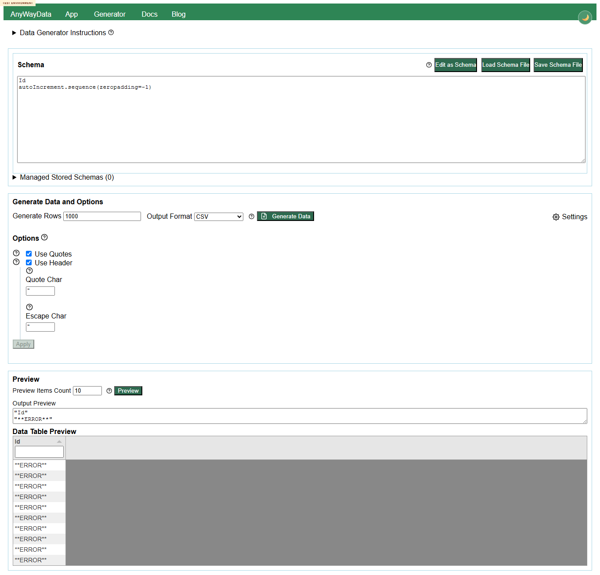

# Issue 266 Test Logs and Defects

This file collates the full content of the session logs and defect files for PDF export and downstream review.

## Main Sequential Log

---
## 2026-06-29 11:59:01 +01:00

- What you think you want to do and why

Create the session folder, preserve the full prompt, verify live browser control before substantive testing, collect the issue and PR context, and write the mandatory planning baseline so the session is evidence-led rather than ad hoc.

the actions you take - include urls, steps and data that you use, describe any UI interactions that you make

Created docs/testing/20260629/issue-266-001/ with logs, support, screenshots, defects, and ideos. Saved the user's full goal to issue-266-session-goal-prompt.md. Opened https://eviltester.github.io/grid-table-editor/site/ in Playwright, clicked Use The Application, reached https://eviltester.github.io/grid-table-editor/site/app.html, clicked the Instructions Show help control, and captured screenshots/browser-proof-app-help.png. Fetched GitHub issue #266 with gh issue view and reviewed recent relevant PR metadata for PR #247 and PR #243 using gh pr list/gh pr diff --name-only. Spawned six subagents: command coverage, negative validation, docs consistency, UX regression, responsive/accessibility, and issue-specific grid-generation interplay.

the observations and results that you make

Browser control is confirmed on the deployed test environment, including page navigation, UI interaction, snapshots, and screenshot evidence. Issue #266 requests a deployed exploratory review of app.html focused on the interaction between the data grid, grid features, and test data generation, while ignoring preview/export except where needed. No PR is directly linked from issue #266; the current deployed story context is therefore derived from recent relevant merged PRs, especially #247 (method picker MVC and shared schema editor wiring) and #243 (enum/domain command definition changes). Subagent delegation is active before substantial testing.

---
---
## 2026-06-29 12:20:31 +01:00

- What you think you want to do and why

Complete Loop 1 by integrating the main browser probes and first completed subagent results, then identify which suspected behaviors deserve confirmation rather than filing early.

the actions you take - include urls, steps and data that you use, describe any UI interactions that you make

Ran deployed-only Playwright probes against https://eviltester.github.io/grid-table-editor/site/app.html and https://eviltester.github.io/grid-table-editor/site/generator.html. Tested schema text mode with regex, domain 
umber.int, datatype.enum, utoIncrement.sequence, location.city, app Amend Table, filter/sort after generation, grid-to-enum modal, invalid faker helper input, and utoIncrement.sequence(1,0). Read subagent logs as they completed: command coverage, negative validation, grid-generation interplay, UX, responsive/accessibility, and docs consistency.

the observations and results that you make

Loop 1 established that broad positive generation is healthy for representative regex/domain/faker/helper examples and that app text schema mode can generate and amend grid data. It also produced repeat candidates: invalid auto-increment params leaking **ERROR**, active filters not reapplying after Amend Table, generator keyboard tab order skipping schema controls, and a Faker Helpers docs/runtime mismatch. An invalid JSON import suspected by a subagent was retested and showed visible Import failed. Check file format/options., so it was not filed as a defect.

---
## 2026-06-29 12:20:31 +01:00

- What you think you want to do and why

Run Loop 2 by generating new ideas from Loop 1 gaps and executing the high-value confirmation checks before writing defect files.

the actions you take - include urls, steps and data that you use, describe any UI interactions that you make

Generated Loop 2 ideas and classified them:

1. xecute-now Confirm utoIncrement.sequence(1,0) in app grid generation.
2. xecute-now Confirm utoIncrement.sequence(step=0) in generator preview.
3. xecute-now Confirm utoIncrement.sequence(zeropadding=-1) in generator preview.
4. xecute-now Confirm global filter behavior after Amend Table changes generated data.
5. xecute-now Retest invalid JSON import for visible user feedback.
6. xecute-now Confirm generator schema row keyboard tab path.
7. xecute-now Confirm published helpers.uniqueArray(this.word.sample, 5) docs example against runtime.
8. xecute-now Verify positive app generation baseline after earlier harness noise.
9. xecute-now Verify removed/unknown command feedback from deployed runtime through command-coverage log.
10. defer Exhaust every one of the 253 domain commands; broad sampling is enough for this session.

Executed the xecute-now ideas using fresh deployed browser contexts and saved JSON, screenshots, and defect videos under support/, screenshots/, and ideos/.

the observations and results that you make

Loop 2 confirmed five repeatable defects: invalid auto-increment step zero, invalid negative zero padding, filter not reapplied after amend, generator schema keyboard tab order, and the Faker Helpers docs example mismatch. The invalid JSON import issue was not confirmed because the deployed app now shows visible import failure text. Removed/unknown command feedback was healthy: image.urlLoremFlickr() and 
otAReal.domainCommand(foo=true) are rejected with visible unknown keyword messages.

---
## 2026-06-29 12:20:31 +01:00

- What you think you want to do and why

Run Loop 3 to avoid stopping at the first defect pattern and to decide which remaining risks should stay as suspicious behavior rather than be over-filed.

the actions you take - include urls, steps and data that you use, describe any UI interactions that you make

Generated Loop 3 ideas and classified them:

1. xecute-now Create one defect markdown file per repeatable confirmed defect.
2. xecute-now Keep invalid JSON import as a dropped/non-defect finding with evidence in the report.
3. xecute-now Compare command coverage against required families: domain, faker/helper, new, removed, validator-backed, structured params, multi-example docs.
4. xecute-now Review docs consistency findings for docs/runtime drift.
5. xecute-now Review responsive/accessibility findings for repeatable keyboard/accessibility defects.
6. defer File tiny help-icon touch target concerns; evidence is broad but needs design expectation confirmation.
7. defer File method-picker search ranking; it may be intended broad search behavior.
8. defer File Unique Column Names generated duplicate-header behavior; intent is unclear.
9. defer File docs method-picker gap; useful docs improvement, but not a replicable functional defect.
10. defer File app grid accessible-name concern; needs screen-reader/a11y owner confirmation.

Created /defects/defect-001 through /defects/defect-005 with repeat steps, expected/observed behavior, screenshots, and videos.

the observations and results that you make

Loop 3 did not produce a new defect class beyond the five already confirmed. Remaining concerns are useful follow-up risks but not sufficiently repeatable or expectation-backed for defect files in this session. Coverage is broad enough across the issue story, the PR #247 method-picker/schema surface, and PR #243 command definitions.

---
## 2026-06-29 12:20:31 +01:00

- What you think you want to do and why

Perform the mandatory final review loop over the story, PR context, changed surface, logs, coverage model, examples, defects, and remaining gaps before PDF generation.

the actions you take - include urls, steps and data that you use, describe any UI interactions that you make

Final review ideas and classifications:

1. xecute-now Reconcile story focus with final defects: grid/generation interplay is represented by Defect 003 and auto-increment app failure.
2. xecute-now Reconcile command-definition coverage: command-coverage and negative-validation lanes sampled broad families and validators.
3. xecute-now Reconcile docs coverage: docs consistency confirmed one docs/runtime defect and several docs gaps.
4. xecute-now Reconcile accessibility coverage: responsive/accessibility lane and confirmation produced one keyboard defect.
5. xecute-now Confirm all defect videos are non-empty and linked from defect markdown.
6. xecute-now Confirm every screenshot left in /screenshots is referenced by markdown.
7. xecute-now Collate logs and defects into 	est-logs-and-defects.md.
8. xecute-now Generate issue-266-test-report.pdf only after the final review loop.
9. xecute-now Generate 	est-logs-and-defects.pdf from the collated markdown.
10. defer Continue Loop 4; recent loops are producing mostly packaging and expectation questions rather than new runtime information.

No additional runtime browser testing was needed in the final review because recent confirmation runs already covered the actionable gaps. Proceeded to report/package generation.

the observations and results that you make

Stopping is justified because the session completed multiple explicit loops, used six delegated lanes, covered the changed command surface broadly, confirmed repeatable defects with screenshots/videos, and recent loops produced little genuinely new runtime information beyond packaging and expectation follow-ups.

---


## Subagent Logs

# command-coverage-test-log.md

---
## 2026-06-29T11:56:00+01:00

- What I think I want to do and why

Establish subagent A scope for command coverage and example execution, confirm that I can work only against the deployed public site, and save support evidence under the requested session folder using the `command-coverage-` prefix.

the actions you take - include urls, steps and data that you use, describe any UI interactions that you make

Read the session prompt from `issue-266-session-goal-prompt.md`, used the deployed target `https://eviltester.github.io/grid-table-editor/site/`, and checked these public pages by HTTP/browser automation:

- `https://eviltester.github.io/grid-table-editor/site/`
- `https://eviltester.github.io/grid-table-editor/site/app.html`
- `https://eviltester.github.io/grid-table-editor/site/generator.html`
- `https://eviltester.github.io/grid-table-editor/site/docs/`

Tried Playwright MCP first, but it failed with a Chrome attach URL/config error. Tried Chrome DevTools MCP next, but it was blocked by an existing profile lock. Switched to the npx-cached Playwright package imported through the Node REPL, launching installed Chrome headless against the public site. Opened the site, collected nav links, and saved the browser proof artifact:

- `../support/command-coverage-browser-proof.json`
- `../screenshots/command-coverage-browser-proof.png`

the observations and results that you make

Browser control was proven against the deployed site using real Chrome automation, but not through the MCP browser tools because both MCP controllers were locally blocked. The public home, app, generator, and docs pages returned HTTP 200. The first nav click attempt on the home page matched the App link but did not leave the home page in that run, so I treated direct public page navigation as the reliable setup path for the rest of this lane.

---
## 2026-06-29T12:02:00+01:00

- What I think I want to do and why

Inventory the deployed docs and command surfaces before executing examples, because issue #266 and PR #243/#247 make broad command-definition coverage the primary risk.

the actions you take - include urls, steps and data that you use, describe any UI interactions that you make

Reviewed and extracted text/code blocks from these deployed docs pages:

- `https://eviltester.github.io/grid-table-editor/site/docs/test-data/test-data-generation/`
- `https://eviltester.github.io/grid-table-editor/site/docs/test-data/Schema-Definition/`
- `https://eviltester.github.io/grid-table-editor/site/docs/test-data/faker-test-data/`
- `https://eviltester.github.io/grid-table-editor/site/docs/test-data/domain/domain-test-data/`
- `https://eviltester.github.io/grid-table-editor/site/docs/test-data/regex-test-data/`
- `https://eviltester.github.io/grid-table-editor/site/docs/test-data/literal-test-data/`
- `https://eviltester.github.io/grid-table-editor/site/docs/test-data/auto-increment-sequences/`
- `https://eviltester.github.io/grid-table-editor/site/docs/test-data/counterstrings/`
- `https://eviltester.github.io/grid-table-editor/site/docs/test-data/pairwise-testing/`
- `https://eviltester.github.io/grid-table-editor/site/docs/test-data/n-wise-testing/`

Saved the docs extract to `../support/command-coverage-docs-extract.json`.

On `https://eviltester.github.io/grid-table-editor/site/generator.html`, inspected the schema row UI. The visible field types were `enum`, `literal`, `regex`, `domain`, and `faker`. Selecting `domain` exposed 253 command options. Selecting `faker` exposed 15 helper options. Saved the inventory to `../support/command-coverage-command-picker-inventory.json`.

the observations and results that you make

The command picker contains broad domain coverage including airline, book, commerce, datatype, date, finance, food, internet, location, music, number, phone, string, vehicle, and many more. The faker picker is helper-only, including `helpers.mustache`, `helpers.fake`, `helpers.arrayElement`, `helpers.multiple`, `helpers.shuffle`, and related helper commands.

No removed/deprecated command label was visible in the picker, and `image.urlLoremFlickr` was not visible in the domain or faker options. This gives a useful deployed UI oracle for removed-command coverage: it is absent from the picker and should be rejected if manually entered in text schema mode.

Techniques and heuristics used: exploratory testing, risk-based sampling from changed command-definition areas, documentation testing, consistency/oracle checking between docs and runtime, equivalence partitioning across command families, and constrained-parameter sampling.

---
## 2026-06-29T12:07:00+01:00

- What I think I want to do and why

Execute representative documented examples through the deployed generator UI, prioritizing command breadth over deep repetition in one family.

the actions you take - include urls, steps and data that you use, describe any UI interactions that you make

Used `https://eviltester.github.io/grid-table-editor/site/generator.html`. The most reliable path was:

1. Click `Edit as Text`.
2. Fill the `Schema text` textarea with documented schema examples.
3. Click `Generate Data`.
4. Click `Preview` to refresh the visible output textarea.
5. Read `Output Preview` and the generated table rows.

Saved the smoke output to `../support/command-coverage-edit-as-text-smoke.json` and screenshot `../screenshots/command-coverage-edit-as-text-smoke.png`.

Executed these representative schemas, saving full outputs in `../support/command-coverage-edit-as-text-results.json` and screenshot `../screenshots/command-coverage-edit-as-text-final-case.png`:

- Domain quick examples:
  - `FirstName / person.firstName()`
  - `LastName / person.lastName()`
  - `Email / internet.email()`
  - `Address / location.streetAddress()`
- Validators and constrained params:
  - `Method / internet.httpMethod(commonOnly=true)`
  - `Direction / location.direction(abbreviated=true)`
  - `Num / number.int(min=32, max=47)`
- Structured params:
  - `Date / date.between(from=1577836800000, to=1659312000000)`
  - `IBAN / finance.iban(formatted=true, countryCode="GB")`
  - `IBANDE / finance.iban(formatted=false, countryCode="DE")`
- Faker/helper structured params:
  - `Sentence / helpers.mustache("Hello {{name}}", { name: "Ada" })`
  - `FakeSentence / helpers.fake("Hi, my name is {{person.firstName}} {{person.lastName}}!")`
- New/helper sequence examples:
  - `Id / autoIncrement.sequence()`
  - `Build / autoIncrement.sequence(start=10, step=5)`
  - `Filename / autoIncrement.sequence(start=1, step=5, prefix="filename", suffix=".txt", zeropadding=3)`
- Counterstring examples:
  - `Counter15 / string.counterString(15)`
  - `CounterRange / string.counterString(5, 12)`
  - `CounterPipe / string.counterString(5, 12, delimiter="|")`
- Enum variants:
  - `Status / enum("Open","In Progress","Closed")`
  - `Priority / datatype.enum(csv="high,medium,low")`
  - `Legacy / high,medium,low`
- Newer domain family sample:
  - `Airline / airline.name()`
  - `Book / book.title()`
  - `Food / food.dish()`
  - `Music / music.genre()`
  - `Vehicle / vehicle.vin()`
- Baseline literal and regex:
  - `Environment / UAT`
  - `Code / [A-Z ]{3,12}`
  - `Digits / [\d]{2,11}`

the observations and results that you make

Positive command execution was broadly healthy in generator text-schema mode. All positive cases above produced 10 preview rows plus headers in CSV output. Representative observed output:

- `internet.httpMethod(commonOnly=true)` produced common methods such as `POST`, `DELETE`, `GET`, and `HEAD`.
- `location.direction(abbreviated=true)` produced abbreviated directions such as `N`, `E`, `SW`, and `NW`.
- `number.int(min=32, max=47)` stayed inside the sampled range.
- `helpers.mustache("Hello {{name}}", { name: "Ada" })` repeatedly produced `Hello Ada`.
- `autoIncrement.sequence(start=1, step=5, prefix="filename", suffix=".txt", zeropadding=3)` produced `filename001.txt`, `filename006.txt`, `filename011.txt`, continuing as documented.
- `string.counterString(15)` produced `*3*5*7*9*12*15*`.
- `datatype.enum(csv="high,medium,low")` and legacy comma enum syntax both generated enum values.
- Newer sampled domain families generated plausible airline, book, food, music, and vehicle values.

One UI nuance: after `Generate Data`, the output textarea did not refresh until `Preview` was clicked in this path. I did not classify this as a defect in this lane because the generated table did update and the Preview control appears designed to refresh the text preview, but it is worth main-loop UX comparison against expected behavior.

---
## 2026-06-29T12:10:00+01:00

- What I think I want to do and why

Probe removed/deprecated and unknown commands, then sample app.html as far as public UI automation allows.

the actions you take - include urls, steps and data that you use, describe any UI interactions that you make

On `https://eviltester.github.io/grid-table-editor/site/generator.html`, entered these text schemas:

- Removed/deprecated probe:
  - `Image / image.urlLoremFlickr()`
  - `StillWorks / internet.email()`
- Unknown command probe:
  - `Mystery / notAReal.domainCommand(foo=true)`
  - `StillWorks / internet.email()`

I also attempted `app.html` coverage. The visible app page exposes the generator controls, but automated selectors repeatedly resolved duplicated/hidden schema controls first. I tried visible schema text mode and visible schema row controls. Both app attempts blocked on hidden-control resolution before realistic interaction could complete, so I stopped rather than using DOM-level forced clicks as evidence of user behavior.

the observations and results that you make

Removed/unknown command validation was clear and repeatable in generator text schema mode:

- `image.urlLoremFlickr()` produced visible validation text: `Image failed domain validation - Unknown keyword: image.urlLoremFlickr`.
- `notAReal.domainCommand(foo=true)` produced visible validation text: `Mystery failed domain validation - Unknown keyword: notAReal.domainCommand`.
- Neither probe produced output rows.

This is positive evidence for issue #266 compared with the older risk that unknown command-like text could fall back to regex-like generation. It also means `image.urlLoremFlickr` is absent from the picker and rejected if manually entered.

Coverage gaps:

- I did not complete app.html command execution because visible automation against duplicated generator controls was blocked. Other lanes should compare app.html if they have a stable selector path.
- I did not execute every one of the 253 domain commands or every helper option; this lane sampled by family and parameter risk.
- I did not deeply verify output value domains beyond lightweight oracle checks; e.g. finance IBAN shape looked plausible but was not algorithmically validated.
- I did not perform pairwise/n-wise generation from the app grid in this lane; I only reviewed those docs and sampled enum syntax relevant to command definitions.

Suspected defects for main agent to confirm:

- None from this lane are ready for defect-file creation. The only behavior worth follow-up is whether `Generate Data` should refresh Output Preview immediately or whether the separate `Preview` button requirement is intentional.

New ideas for main-loop follow-up:

- Execute the same `Edit as Text` command matrix through app.html once a stable visible-control selector path is found, and compare app grid output with generator.html output.
- Test command-picker row mode and text-schema mode side by side for the same parameterized commands, especially `helpers.mustache`, `finance.iban`, `date.between`, and `autoIncrement.sequence`.
- Use constraints with command-generated columns, e.g. constrain `number.int(min=32,max=47)` or conditional outputs based on enum values.
- Test malformed but nearly valid params for successful families: `commonOnly="true"`, `countryCode=GB` without quotes, `min > max`, missing `to`, and unknown named params.
- Exercise every helper command in the 15-item faker helper picker at least once, because helper params are more structured than many domain commands.
- Compare docs examples that use `domain.*` or `helpers.*` language against the actual picker split where domain commands and faker helpers are separate UI types.
- Check whether default output row count, generate row count, and preview item count are intentionally decoupled; this lane saw 10 preview rows consistently.
- Sample output formats beyond CSV for command-rich schemas, especially JSON/JSONL/XML/code export where quoting and structured values may expose formatting defects.
- Re-run removed-command probes for any other commands removed by PR #243/#247 if the changed-surface inventory identifies names beyond `image.urlLoremFlickr`.
- Add a small deterministic oracle script for output checks, e.g. HTTP method set membership, number ranges, sequence increments, country-specific IBAN prefixes, and counterstring lengths.

---


# docs-consistency-test-log.md

# Docs/help/content consistency test log

Session: issue-266-001
Lane: subagent C - docs/help/content consistency
Target: https://eviltester.github.io/grid-table-editor/site/
Date: 2026-06-29

## Charter

Inspect changed docs/help surfaces relevant to PR #247 method picker, PR #243 command definitions/enum/datatype, and issue #266 app.html grid/test-data interplay. Compare published docs examples against app/generator runtime where practical. Record pages reviewed, examples tried, stale/misleading/missing docs, removed commands still visible, new commands missing from docs/help, techniques/heuristics, suspected defects, and at least 5 follow-up ideas. Save support artifacts under `support/` prefixed `docs-consistency-`. Do not create defect files.

## Guardrails

- Deployed-only review: published site pages under `https://eviltester.github.io/grid-table-editor/site/`.
- No local build/test/package commands.
- Findings here are suspected docs/content defects or follow-up risks for the main agent to confirm.

---

## 2026-06-29 docs/help/content consistency pass

### Scope and setup

- Used only the published deployed site and published deployed assets reached from it:
  - `https://eviltester.github.io/grid-table-editor/site/`
  - `https://eviltester.github.io/grid-table-editor/site/app.html`
  - `https://eviltester.github.io/grid-table-editor/generator.html` as linked by the deployed app page.
- Did not run local build, test, package, or repo application commands.
- Browser automation: Playwright through installed Chrome, targeting deployed URLs only.
- Support artifacts saved under `docs/testing/20260629/issue-266-001/support/` with `docs-consistency-` prefix.

### Pages reviewed

- Landing/app/docs entry: `/site/`, `/site/app.html`, `/generator.html`.
- Main docs: `/site/docs/intro`, `/site/docs/category/generating-data`.
- Generation docs: `/site/docs/test-data/test-data-generation`, `/site/docs/test-data/data-grid-editable`, `/site/docs/test-data/generate-to-file`, `/site/docs/test-data/Schema-Definition`, `/site/docs/test-data/faker-test-data`, `/site/docs/test-data/faker/helpers`, `/site/docs/test-data/domain/domain-test-data`, `/site/docs/test-data/counterstrings`, `/site/docs/test-data/auto-increment-sequences`, `/site/docs/test-data/pairwise-testing`, `/site/docs/test-data/n-wise-testing`.
- Interface docs: `/site/docs/interfaces-and-deployment/web-ui`, `/site/docs/interfaces-and-deployment/rest-api`, `/site/docs/interfaces-and-deployment/cli-node-and-bun`.

### Runtime examples tried

- `Status / enum("Open","In Progress","Closed")`: preview generated CSV values.
- Compact inline schema `Browser: Chrome,Firefox,Safari` and `Theme: Light,Dark`: preview generated CSV values.
- `datatype.enum(active,inactive,pending)`: rejected with `Invalid keyword arguments: bare values are not allowed; wrap strings in quotes`.
- Documented `datatype.enum(csv="active,inactive,pending")`: preview generated CSV values.
- Documented `awd.datatype.enum(csv="active,inactive,pending")`: preview generated CSV values.
- `internet.httpMethod(commonOnly=true)`: preview generated CSV values including common HTTP verbs.
- Deployed catalog example `helpers.uniqueArray(["red", "green", "blue"], 2)`: preview generated JSON with stringified arrays.
- Callback form `helpers.uniqueArray(faker.word.sample, 3)`: preview generated JSON with stringified arrays.
- Published Faker Helpers docs example `helpers.uniqueArray(this.word.sample, 5)`: rejected with unsafe/complex argument parsing validation.
- `image.urlLoremFlickr()`: rejected as unknown keyword.
- `person.notACommand()`: rejected as unknown keyword, matching the Schema Definition docs' command-like validation note.
- Constraint example with `Priority` and `Status`: preview respected the documented `High -> Open` rule in the sampled output.
- App grid/test-data interplay: imported CSV through the deployed app text preview, opened Test Data, ran `Grid to Enum Schema`, confirmed modal, and captured schema:
  - `Browser enum("Chrome","Firefox")`
  - `Device enum("Desktop","Mobile","Tablet")`
  - `Theme enum("Light","Dark")`

### Content consistency observations

- The core Schema Definition examples tested were consistent with generator runtime: basic enum, compact inline enum, unknown command-like validation, and the sampled constraint example behaved as documented.
- The Data Grid Editable `Grid to Enum Schema` description matched deployed app behavior after completing the modal confirmation. The visible schema grid shows comma values without quotes, while the captured text schema uses quoted `enum(...)` values; this looks acceptable, but it is worth documenting if users rely on text copy/paste.
- The PR #243 `datatype.enum` docs are accurate where they show the `csv="..."` keyword form. Bare positional values are rejected. Follow-up: confirm the method picker/params editor always inserts or suggests the valid `csv="..."` form for `datatype.enum`, because the generic params placeholder is `Params e.g. (10)` and could encourage invalid bare params.
- Published Faker Helpers docs include `helpers.uniqueArray(this.word.sample, 5)`, but deployed generator validation rejected that exact example. The equivalent callback form `helpers.uniqueArray(faker.word.sample, 3)` worked. Suspected docs defect: update the docs example from `this.word.sample` to the supported `faker.word.sample` form or document the supported callback syntax.
- No user-facing docs/help page reviewed referenced `image.urlLoremFlickr`. The deployed domain picker list contained `image.url` and `image.urlPicsumPhotos`, and the typed legacy command was rejected as unknown. The deployed minified vendor bundle still contains `urlLoremFlickr`, but I treated that as bundled Faker internals, not user-visible docs/content drift.
- I did not find a docs page that names or explains the PR #247 method picker explicitly. The app/generator UI exposes command picker controls for domain/faker schema rows, but docs mostly describe command text and links to Faker/domain pages. Suspected docs gap: add a short "using the method picker" section with screenshots or usage notes.
- REST/CLI docs were reviewed for schema language references, but no deployed runtime comparison was attempted because the charter was deployed browser pages only and no local API/CLI commands were allowed.

### Removed/new command visibility notes

- Removed/stale command check: `image.urlLoremFlickr` was not visible in reviewed docs or the inspected domain picker list; typed use is rejected with a clear unknown keyword message.
- New/current command check: domain picker includes `datatype.boolean`, `datatype.enum`, `internet.httpMethod`, `internet.httpStatusCode`, `image.url`, `image.urlPicsumPhotos`, and many other current commands. Docs cover some of these by family, but method-picker-specific help is thin.
- Faker Helpers docs cover helpers commands, but at least one example uses callback syntax that runtime rejects.

### Techniques and heuristics used

- Crawled deployed docs links from published HTML and selected pages around generation, schema definitions, domain/faker helpers, app grid behavior, and interfaces.
- Compared docs examples against deployed generator preview output instead of local code or tests.
- Used the deployed app's own navigation to include `/grid-table-editor/generator.html`.
- Treated generated/download-ready and preview output separately; preview output was used for actual example comparison.
- Rechecked suspicious examples with exact published syntax before recording them as suspected docs drift.
- Separated user-visible docs/help drift from strings present only inside bundled/minified runtime chunks.

### Suspected defects for main-agent confirmation

- `docs/test-data/faker/helpers` documents `helpers.uniqueArray(this.word.sample, 5)`, but deployed generator rejects that exact schema as unsafe/complex argument parsing. `helpers.uniqueArray(faker.word.sample, 3)` works.
- Method picker/help docs appear incomplete: no reviewed docs page explicitly introduces the method picker UI or explains how to choose commands/params from it.
- `datatype.enum` UX/docs handoff needs confirmation: documented `csv="..."` forms work, but bare params fail and the visible params placeholder is generic. Confirm whether selecting `datatype.enum` via the picker suggests/creates valid params.

### Follow-up ideas

1. Add a docs section showing the method picker workflow in both `app.html` and `generator.html`, including source type selection, command search, params editor, and preview.
2. Update Faker Helpers callback examples to use supported runtime syntax, especially `helpers.uniqueArray(faker.word.sample, 5)`.
3. Add a small docs table for `datatype.enum` showing valid `csv="..."`, `values=[...]` if supported, and invalid bare values.
4. Add a Grid to Enum Schema note explaining the confirmation modal and the max-enum-size option.
5. Add a docs example that round-trips imported CSV -> Grid to Enum Schema -> Generate/Generate Combinations in `app.html`.
6. Add a removed/deprecated command note for image URL commands: prefer `image.url` or `image.urlPicsumPhotos`; `image.urlLoremFlickr` is not accepted.
7. Add docs examples for `internet.httpMethod(commonOnly=true)` because it is visible in the domain picker and worked in runtime.
8. Add a "preview vs generate/download" note in Generate to File docs so users know Preview fills the output area while Generate Data prepares a download.

### Support artifacts

- `docs-consistency-page-inventory.json` and `.md`: page inventory, headings, links, excerpts, and code snippets.
- `docs-consistency-site*.png`, `docs-consistency-generator-html.png`, `docs-consistency-site-app-html.png`: page screenshots from the deployed scout.
- `docs-consistency-runtime-results.json` and `.md`: runtime examples and preview/error evidence.
- `docs-consistency-runtime-*.png`: screenshots for individual runtime examples.
- `docs-consistency-app-grid-check.json` and `.md`: app grid/test-data interplay check and captured enum schema.
- `docs-consistency-app-after-load-sample-data.png`, `docs-consistency-app-grid-to-enum-schema.png`: app flow screenshots.
- `docs-consistency-method-picker-domain-controls.png`: domain picker UI after selecting the `domain` source type.

---


# grid-generation-interplay-test-log.md

# Subagent F - Grid Generation Interplay Test Log

Session: 2026-06-29  
Target: eviltester/grid-table-editor issue #266  
Scope: deployed-only exploratory review using:

- `https://eviltester.github.io/grid-table-editor/site/app.html`
- `https://eviltester.github.io/grid-table-editor/site/generator.html`
- published docs/help under `https://eviltester.github.io/grid-table-editor/site/`

Out of scope: local build/test/package commands; defect-file creation; preview/export coverage except where needed to set or observe grid state.

## Charter

Concentrate on the interaction between the app data grid, grid features, and test data generation. Test generation into empty/existing grids, column names, selected rows/amend flows if present, filters/sorts with generated data, row counts, unique column names, grid-to-schema or schema-to-grid interactions, reset/clear flows, and whether generation respects grid shape/state.

## Running Notes

### Environment and Constraints

- Browser automation: Playwright against system Chrome.
- Browser proof captured:
  - `../support/grid-generation-app-initial-browser-proof.png`
  - `../support/grid-generation-help-browser-proof.png`
  - `../support/grid-generation-generator-initial-browser-proof.png`
- No local build, test, or package commands were run.
- No defect files were created.

### Techniques / Heuristics

- Started from the deployed app and used the visible UI controls for state changes.
- Used rendered-grid DOM reads only to record exact observed headers, cells, selected rows, sort/filter state, and row-count text after actions.
- Rechecked one suspected filter/generation problem from a fresh value in the same session.
- Captured screenshots at each meaningful state transition and saved scenario JSON for exact row/header data.
- Used app in-page help text to distinguish observed behavior from documented control wording. Relevant help captured in `../support/grid-generation-app-help-texts.json`.

### Scout Notes

- `app.html` starts with one empty grid column titled `~rename-me` and `Total rows: 0`.
- Test Data panel exposes:
  - `Generate`
  - `Grid to Enum Schema`
  - `How Many?`
  - generation modes: `New Table`, `Amend Table`, `Amend Selected`
  - row-based schema editor and `Edit as Text`
- The generation help says: "Generate data from the current schema directly into the grid."
- The grid-to-schema help says it scans the current grid and builds an enum-only schema from visible column values.
- `generator.html` has a shared schema editor plus `Generate Data`, output options, and preview.

### Scenario 1 - Generate into Empty / Default Grid

Support:

- `../support/grid-generation-new-table-3rows.png`
- `../support/grid-generation-scenario-01-new-table.json`

Steps:

1. Opened `app.html`.
2. Opened `Test Data`.
3. Entered schema:
   - `CaseId` -> `regex(TC-[0-9]{2})`
   - `Status` -> `regex((active|blocked|pending))`
4. Set `How Many?` to `3`.
5. Selected `New Table`.
6. Clicked `Generate`.

Observed:

- Grid headers changed from `~rename-me` to `CaseId`, `Status`.
- 3 rows were generated.
- Row counter showed `Total rows: 3`.
- Example generated cells:
  - `TC-28`, `active`
  - `TC-86`, `blocked`
  - `TC-58`, `pending`

Assessment: healthy baseline. Generation into an empty/default grid replaces the grid shape with the schema shape and honors `How Many?`.

### Scenario 2 - Amend Existing Grid with Added Schema Column

Support:

- `../support/grid-generation-amend-table-existing-grid.png`
- `../support/grid-generation-scenario-02-amend-table.json`

Steps:

1. Started from the generated 3-row `CaseId` / `Status` grid.
2. Added a third schema field:
   - `Priority` -> `regex((P1|P2|P3))`
3. Set `How Many?` to `5`.
4. Selected `Amend Table`.
5. Clicked `Generate`.

Observed:

- Grid gained a new `Priority` column.
- Existing row count remained 3, despite `How Many? = 5`.
- All existing rows were regenerated/amended with new values.
- Row counter stayed `Total rows: 3`.

Assessment: likely intended distinction. `Amend Table` appears to operate over existing rows rather than generating the requested row count.

### Scenario 3 - Amend Selected Row

Support:

- `../support/grid-generation-amend-selected-one-row.png`
- `../support/grid-generation-scenario-03-amend-selected.json`

Steps:

1. Clicked the second visible grid row to select it.
2. Set `How Many?` to `10`.
3. Selected `Amend Selected`.
4. Clicked `Generate`.

Observed:

- Only the selected row changed.
- Non-selected rows retained their previous values.
- Row count remained 3.
- The selected row remained selected after generation.

Suspicious note:

- Immediately after selecting the row and before generation, the selected row's `Status` cell was observed blank in the DOM capture, then after `Amend Selected` it contained a generated value again. I did not repeat this enough to call it a defect; it may be a cell-focus/rendering artifact from the row click.

Assessment: selected-row amend behavior mostly matched the expected "only selected rows" model.

### Scenario 4 - Filtered Grid plus Amend Table

Support:

- `../support/grid-generation-filtered-amend-table-before-clear.png`
- `../support/grid-generation-filtered-amend-table-after-clear.png`
- `../support/grid-generation-filtered-amend-repeat.png`
- `../support/grid-generation-scenario-04-filter-amend.json`
- `../support/grid-generation-scenario-04-filter-amend-repeat.json`

Steps, first pass:

1. Set global grid filter to `TC-49`.
2. Confirmed only the row with `CaseId = TC-49` was visible.
3. Selected `Amend Table`.
4. Clicked `Generate`.
5. Observed grid before clearing filters.
6. Clicked `Clear Filters`.
7. Observed all rows.

Observed, first pass:

- Filter box still contained `TC-49`.
- Visible amended row changed from `TC-49` to `TC-50`.
- The row remained visible even though it no longer matched the filter text.
- Clearing filters revealed the full 3-row table.

Repeat attempt:

1. Used the current first row value `TC-50` as the filter.
2. Confirmed only `TC-50` row was visible.
3. Ran `Amend Table` again.

Observed, repeat:

- Filter box still contained `TC-50`.
- Visible amended row changed to `TC-11`.
- The row remained visible even though it no longer matched `TC-50`.

Suspected defect for main agent confirmation:

- Active global filter is not reapplied after generated/amended data changes. The UI can show a row that no longer matches the still-visible filter text. This repeated twice with different filter values.

### Scenario 5 - Sorted Grid plus Amend Table

Support:

- `../support/grid-generation-sort-amend-table.png`
- `../support/grid-generation-scenario-05-sort-amend.json`

Steps:

1. Cleared filters.
2. Applied descending sort to `CaseId`.
3. Ran `Amend Table`.
4. Observed row order and column sort metadata.
5. Used toolbar `Clear Sort`.

Observed:

- After generation, `CaseId` still reported `aria-sort = descending`.
- Visible row order matched descending `CaseId` order, e.g. `TC-91`, `TC-22`, `TC-11`.
- `Clear Sort` changed the row order back away from sorted order.

Assessment: sort state appeared to be maintained/reapplied more consistently than filter state.

### Scenario 6 - Duplicate Column Names and Unique Column Names Toggle

Support:

- `../support/grid-generation-duplicate-names-unique-on.png`
- `../support/grid-generation-duplicate-names-unique-off.png`
- `../support/grid-generation-scenario-06-duplicate-column-names.json`

Schema used:

```text
Dup
regex([A-C])
Dup
regex([1-3])
```

Steps:

1. Reset app.
2. Checked `Unique Column Names`.
3. Used schema text mode with duplicate `Dup` fields.
4. Generated 2 rows.
5. Reset app.
6. Unchecked `Unique Column Names`.
7. Used the same schema.
8. Generated 2 rows.

Observed:

- With `Unique Column Names` checked, generated grid headers were still `Dup`, `Dup`.
- With `Unique Column Names` unchecked, generated grid headers were also `Dup`, `Dup`.
- Both generated columns retained separate data fields internally (`column1`, `column2`), and both displayed data.

Suspected behavior question:

- If `Unique Column Names` is intended to apply to generation, it does not appear to enforce unique generated header names. If the toggle is only intended for import/manual grid editing, then this is a documentation/discoverability gap rather than a generation defect.

Setup friction note:

- In two automated attempts, clicking `+ Add Field` did not immediately add a second row before timeout. A later direct click did add a row. I used schema text mode to finish duplicate-name coverage. This needs manual confirmation before treating it as a UI bug.

### Scenario 7 - Grid to Enum Schema, Then Regenerate

Support:

- `../support/grid-generation-grid-to-schema-modal-state.json`
- `../support/grid-generation-grid-to-schema-after-build.png`
- `../support/grid-generation-regenerate-from-grid-enum-schema.png`
- `../support/grid-generation-scenario-07-grid-to-schema.json`

Steps:

1. Started from duplicate-header generated grid:
   - headers `Dup`, `Dup`
   - rows similar to `C,2` and `A,2`
2. Clicked `Grid to Enum Schema`.
3. Observed modal:
   - title `Grid to Enum Schema`
   - text included `largest Column has 2 unique values`
   - field value `2`
   - action `Build Schema`
4. Clicked `Build Schema`.
5. Observed schema text.
6. Generated 4 new rows from the resulting enum schema.

Observed:

- Built schema:

```text
Dup
enum("C","A")
Dup
enum("2")
```

- Regenerated grid still had duplicate headers `Dup`, `Dup`.
- Regenerated data respected enum values from the previous visible grid:
  - first `Dup`: `A` or `C`
  - second `Dup`: `2`

Assessment: grid-to-schema conversion works with duplicate headers by preserving duplicate names and using positional columns. This is useful but may compound ambiguity if users expect unique generated column names.

### Scenario 8 - Reset / Clear Flow

Support:

- `../support/grid-generation-reset-table-after-generated.png`
- `../support/grid-generation-scenario-08-reset-table.json`

Steps:

1. From generated data, clicked `Reset Table`.
2. Confirmed modal:
   - `Are you sure you want to reset the table and all data?`
3. Clicked `OK`.

Observed:

- Grid returned to one empty column titled `~rename-me`.
- Row counter returned to `Total rows: 0`.
- Generation mode reset to `New Table`.

Assessment: reset flow worked as expected.

### Scenario 9 - Generator Page Parity Check

Support:

- `../support/grid-generation-generator-parity-preview.png`
- `../support/grid-generation-generator-generate-data-generated-data.csv`
- `../support/grid-generation-scenario-09-generator-parity.json`
- `../support/grid-generation-scenario-09-generator-download.json`

Steps:

1. Opened `generator.html`.
2. Used schema text:

```text
CaseId
regex(TC-[0-9]{2})
Status
regex((active|blocked|pending))
```

3. Set `Generate Rows` to `3`.
4. Clicked `Preview`.
5. Clicked `Generate Data` and saved the downloaded CSV.

Observed:

- Preview output showed 10 rows because `Preview Items Count` remained `10`.
- Downloaded CSV contained exactly 3 generated data rows plus header:

```csv
"CaseId","Status"
"TC-58","blocked"
"TC-98","blocked"
"TC-79","pending"
```

Assessment: generator page uses the same schema syntax successfully. Preview count and generation row count are independent; that may be expected, but it is easy to misread when comparing app generation and generator-page output.

## Suspected Defects / Risks for Main Agent Confirmation

1. Active global filter is not reapplied after `Amend Table` changes data. Repeated twice: filter text remained `TC-49`/`TC-50`, while the still-visible amended row changed to `TC-50`/`TC-11`.
2. `Unique Column Names` does not make generated duplicate schema headers unique. Needs expectation check because the toggle may not be intended for generation.
3. `+ Add Field` sometimes did not add a schema row in automated user-like attempts, then worked on a later click. Needs manual repeat before filing.
4. Selecting a row before `Amend Selected` produced one DOM capture where the selected row's `Status` cell appeared blank before generation. Needs repeat; may be focus/rendering rather than data loss.
5. `Grid to Enum Schema` preserves duplicate header names through schema creation and regeneration. This may be acceptable positional behavior, but it creates an ambiguous schema/grid round trip when duplicate names are present.

## Coverage / Gaps

- Covered:
  - generation into default empty grid
  - generation into existing grid
  - add-column amend flow
  - selected-row amend flow
  - filter plus amend flow with repeat
  - sort plus amend flow
  - duplicate column-name generation
  - grid-to-enum-schema and schema-to-grid regeneration
  - reset table flow
  - generator.html schema/generation parity
- Not covered:
  - n-wise `Generate Combinations`
  - import/export beyond necessary generator download observation
  - schema constraints with generated app-grid data
  - multi-row selection with `Ctrl`/range selection
  - column rename/delete/duplicate toolbar interactions followed by generation
  - mobile/responsive behavior
  - accessibility review of generation controls

## Follow-Up Ideas

1. Confirm manually whether the global filter should re-run after generated/amended data mutation, then file a defect if the repeated behavior is unintended.
2. Clarify whether `Unique Column Names` is meant to apply to generated schema headers; if yes, add a regression around duplicate schema names.
3. Test `Amend Selected` with multiple selected rows, including non-contiguous selection and selected rows hidden by filters.
4. Test column toolbar edits, especially rename/duplicate/delete, then generate with matching and non-matching schema field names.
5. Test `Grid to Enum Schema` after filtering: confirm whether "visible column values" means filtered-visible rows only and whether that is documented clearly.
6. Test generation with schema constraints into an existing grid to see whether constraints reference old row values, newly generated row values, or only schema-generated values.
7. Test very high `How Many?` values in `New Table` versus `Amend Table` to verify performance and row-count semantics.
8. Test duplicate generated headers with export/import round trip to see whether duplicate names cause data loss or column collapse outside the grid UI.
9. Test preview auto-sync after app grid generation to confirm whether generated grid changes propagate to import/export preview consistently.
10. Compare app `Generate` and generator `Generate Data` output for the same schema and row count using deterministic/simple rules, especially enum and literal fields.


# negative-validation-test-log.md

# Negative Validation Test Log - Subagent B

Session: issue-266-001 deployed-only exploratory review  
Lane: negative validation and malformed parameter testing  
Tester: subagent B  
Date: 2026-06-29  
Target scope: `https://eviltester.github.io/grid-table-editor/site/app.html`, `https://eviltester.github.io/grid-table-editor/site/generator.html`, and public docs pages under `/site/docs/`  
Local commands avoided: no local build, test, package, or repo verification commands were run.

## Charter

Test malformed schema rows, invalid parameter values, unknown command-like text, structured parameter edge cases, invalid enum/datatype/autoIncrement/faker helper examples, invalid row counts if exposed, and behavior of validation/error messages in `app.html` and `generator.html`.

## Techniques and Heuristics

- Started with browser proof on deployed `app.html`: opened the public page, toggled theme, captured screenshot.
- Used accessibility snapshots to map visible controls before interacting.
- Used public docs pages only to learn valid syntax: Schema Definition, Faker Based Data, Domain Test Data, Auto Increment Sequences, Literal Data, Pairwise Testing.
- Used a valid generator baseline before negative data: `Status enum("Open","Closed")` plus `Ticket regex([A-Z]{3}-\d{4})`.
- Partitioned invalid examples by parser layer: text schema shape, enum/datatype syntax, domain/faker params, helper syntax, auto-increment params, constraints, row counts, and import text.
- Repeated suspicious results through visible DevTools fill/click paths after a scripted matrix, because the schema editor has both textarea and structured-row state.
- Treated console-only errors as weaker user-facing evidence unless the UI also showed a message.

## Supporting Artifacts

- `support/negative-validation-app-browser-proof-dark-theme.png`
- `support/negative-validation-app-controls.json`
- `support/negative-validation-app-initial-snapshot.txt`
- `support/negative-validation-generator-initial-snapshot.txt`
- `support/negative-validation-generator-controls.json`
- `support/negative-validation-doc-extracts.json`
- `support/negative-validation-generator-matrix-results.json`
- `support/negative-validation-generator-matrix-summary.json`
- `support/negative-validation-generator-onlycolumn-error.png`
- `support/negative-validation-generator-autoincrement-step-zero-error-rows.png`
- `support/negative-validation-generator-autoincrement-negative-zeropadding-error-rows.png`
- `support/negative-validation-constraint-valid-direct-repeat.json`
- `support/negative-validation-app-invalid-json-no-visible-error.png`
- `support/negative-validation-app-invalid-json-console.txt`

## Generator Baseline

Input:

```text
Status
enum("Open","Closed")
Ticket
regex([A-Z]{3}-\d{4})
```

Observation: Preview generated 10 CSV rows with Status values and Ticket values like `HAN-9835`, confirming schema text mode, Preview, and output capture worked.

## Schema Row Shape Tests

Input:

```text
OnlyColumn
```

First scripted matrix pass looked stale, so I repeated using visible `Schema text` fill and Preview click. Repeat result was good: the app showed a schema validation message:

```text
column OnlyColumn requires a data definition, use 'literal("")' for blank data
```

Output Preview stayed blank. Artifact: `negative-validation-generator-onlycolumn-error.png`.

Input:

```text

enum("A","B")
```

Matrix path was inconclusive because direct textarea state did not mimic visible input for malformed row-shape cases. Follow-up should repeat via normal fill if this exact case matters.

Input:

```text
Priority:
```

Same caveat as above. Do not treat the scripted stale-output row as a confirmed product issue.

## Enum and Datatype Validation

Input:

```text
EmptyEnum
enum()
```

Observation: blocked with visible validation:

```text
EmptyEnum failed domain validation - Unknown keyword: enum
```

Note: the message blocks generation, but "Unknown keyword: enum" may be less helpful than "enum requires values".

Input:

```text
BadEnum
enum("A","B)
```

Observation: blocked with visible validation:

```text
BadEnum failed domain validation - Invalid keyword arguments: unbalanced expression
```

Input:

```text
Dt
datatype.enum(csv="")
```

Observation: blocked with visible validation:

```text
Dt failed domain validation - Invalid keyword arguments: argument "values" is required
```

Input:

```text
Dt
datatype.notAThing(csv="A,B")
```

Observation: blocked with visible validation:

```text
Dt failed domain validation - Unknown keyword: datatype.notAThing
```

## Unknown Command-Like Text

Input:

```text
Danger
DROP TABLE users; --
Status
enum("Open","Closed")
```

Observation: generated as inert literal data, e.g. `"DROP TABLE users; --","Open"`. No visible error. This appears acceptable because docs support literal data without wrapper syntax.

Input:

```text
Script
<script>alert("x")</script>
Status
enum("Open","Closed")
```

Observation: generated as literal CSV text, escaped in the output preview as `"<script>alert""x""</script>"`. No script execution observed during preview.

## Structured Parameter Edge Cases

Input:

```text
Direction
location.cardinalDirection(abbreviated=maybe)
```

Observation: blocked with visible validation:

```text
Direction failed domain validation - Invalid keyword arguments: bare values are not allowed; wrap strings in quotes
```

Input:

```text
N
number.int(min=10, max=1)
```

Observation: blocked with visible validation:

```text
N failed domain validation - Invalid keyword arguments: argument "min" must be less than or equal to argument "max"
```

Input:

```text
N
number.int(min="one", max=5)
```

Observation: blocked with visible validation:

```text
N failed domain validation - Invalid keyword arguments: argument "min" must be number, not string
```

Input:

```text
D
date.between(from=1659312000000, to=1577836800000)
```

Observation: blocked with visible validation:

```text
D failed domain validation - Invalid keyword arguments: argument "from" must be less than or equal to argument "to"
```

Input:

```text
D
date.between(from="abc", to="def")
```

Observation: blocked with visible validation:

```text
D failed domain validation - Invalid keyword arguments: argument "from" must be integer, not string
```

## Faker Helper Edge Cases

Input:

```text
Bad
domain.helpers.fake("{{person.firstName}}")
```

Observation: blocked with visible validation aligned with docs:

```text
Bad failed domain validation - helpers_not_supported_in_domain: helpers.* is faker-only; use faker.helpers.*
```

Input:

```text
Sentence
helpers.mustache("Hello {{name}}", { name: })
```

Observation: blocked with visible validation:

```text
Sentence failed faker validation - Invalid Faker API Call Unsafe faker rule syntax detected: requires complex argument parsing
```

Input:

```text
Sentence
helpers.fake("{{person.firstName}")
```

Observation: generated literal-looking output rows containing `{{person.firstName}`. No visible error. This may be acceptable because the malformed template is still just string input, but follow-up should clarify expected helper semantics.

## Auto-Increment Edge Cases

Input:

```text
Id
autoIncrement.sequence(step=0)
```

Repeated using visible fill and Preview. Observation: Preview generated header plus 10 rows of:

```text
**ERROR**
```

No visible validation message explained why. Suspected defect candidate: invalid `step=0` should be blocked with a validation message instead of generating error sentinel values. Artifact: `negative-validation-generator-autoincrement-step-zero-error-rows.png`.

Input:

```text
Id
autoIncrement.sequence(zeropadding=-1)
```

Repeated using visible fill and Preview. Observation: Preview generated header plus 10 rows of:

```text
**ERROR**
```

No visible validation message explained why. Suspected defect candidate: invalid negative zero padding should be blocked with a validation message instead of generating error sentinel values. Artifact: `negative-validation-generator-autoincrement-negative-zeropadding-error-rows.png`.

Input:

```text
Id
autoIncrement.sequence(start="abc", step=2)
```

Observation: blocked with visible validation:

```text
Id failed domain validation - Invalid keyword arguments: argument "start" must be integer, not string
```

Input:

```text
Id
autoIncrement.sequence(step=-1)
```

Observation: generated descending sequence `1, 0, -1, -2...`. This may be valid unless docs intend positive-only steps. Marked as open expectation question, not a suspected defect.

## Regex Edge Case

Input:

```text
Code
regex([A-Z]{3)
```

Observation from matrix: generated strings like `O{3`, `C{3`, `M{3`. This might be parser interpretation rather than an invalid regex error because the unclosed class changes how the string is parsed. Follow-up should compare against intended regex validation rules before filing.

## Constraint Validation

Valid control:

```text
Priority
enum("High","Low")
Status
enum("Open","Closed")

IF [Priority] = "High" THEN [Status] = "Open";
```

Observation: valid constraint applied; all sampled `High` rows had `Open` status. Artifact: `negative-validation-constraint-valid-direct-repeat.json`.

Malformed operator:

```text
Priority
enum("High","Low")
Status
enum("Open","Closed")

IF [Priority] ~~ "High" THEN [Status] = "Open";
```

Observation: blocked with visible line-numbered validation:

```text
Line 6: Unexpected token "~".
```

Unknown field:

```text
Priority
enum("High","Low")
Status
enum("Open","Closed")

IF [Missing] = "High" THEN [Status] = "Open";
```

Observation: blocked with visible line-numbered validation:

```text
Line 6: unknown constraint parameter [Missing].
```

## Generator Row Count Edge Cases

Preview Items Count:

- `0`: accepted; output preview contained only the CSV header `"Status"`.
- `-1`: blocked with `Preview Items Count must be a number greater than or equal to 0.`
- `51`: blocked with `Preview Items Count must be less than or equal to 50.`
- `abc`: input emptied and was blocked with `Preview Items Count must be a number greater than or equal to 0.`

Generate Rows:

- `-1`: blocked with `Generate Rows must be a number greater than or equal to 0.`
- `0`: allowed and reported `Download ready: generated-data.csv`.

Open expectation question: `Generate Rows = 0` may be intended for header-only downloads, but should be confirmed.

## App Import and Row Count Tests

Invalid JSON import on `app.html`:

Selected JSON tab, filled Preview text editor with:

```json
[{"name":"Ada",]
```

Clicked `Set Grid From Text`.

Observation: grid stayed at `Total rows: 0` and the editor still showed the invalid JSON. No visible error message appeared in the app. DevTools console recorded:

```text
Failed importing preview text SyntaxError: Expected double-quoted property name in JSON at position 15 (line 1 column 16)
```

Suspected defect candidate: invalid import text should surface a visible validation/error message, not only a console error. Artifact: `negative-validation-app-invalid-json-no-visible-error.png`.

`app.html` preview row count:

- Entering `0` clamped the spinbutton to `1` after `Set Text From Grid`.
- Entering `51` clamped the spinbutton to `50` after `Set Text From Grid`.

Observation: app row-count control enforces visible min/max and did not show an error. This looks healthy.

## Suspected Defects for Main-Agent Confirmation

1. `generator.html`: `autoIncrement.sequence(step=0)` generates `**ERROR**` rows with no visible validation message.
2. `generator.html`: `autoIncrement.sequence(zeropadding=-1)` generates `**ERROR**` rows with no visible validation message.
3. `app.html`: malformed JSON import logs a console error but does not show a visible validation message to the user.

## Coverage Notes

- Covered both `app.html` and `generator.html` on the deployed `/site/` surface.
- Covered public docs references for syntax/expectations without reading local source.
- Covered text schema mode more deeply than structured row mode.
- Covered preview output more deeply than direct file download contents.
- Covered CSV output format for generator validation; did not cross-check every export format.
- Covered constraints through text-mode schema input.
- Captured screenshots for repeatable suspected defects and representative healthy validation.

## Gaps and Caveats

- The scripted matrix used direct DOM value setting and produced stale results for some malformed row-shape cases. Those cases were not treated as defects unless repeated through visible fill/click.
- Did not create defect files per instruction.
- Did not inspect downloaded `generated-data.csv` for the `Generate Rows = 0` case.
- Did not perform local source, build, package, or test commands.
- Did not exhaustively test every faker helper or domain method; sampled representative invalid examples.
- Did not test mobile/responsive behavior; outside this lane.

## Follow-Up Ideas

1. Confirm whether `autoIncrement.sequence(step=0)` should be rejected at schema-validation time and add a targeted validation message if so.
2. Confirm whether `autoIncrement.sequence(zeropadding=-1)` should be rejected with a message such as `zeropadding must be greater than or equal to 0`.
3. Add visible import error feedback in `app.html` for JSON, JSONL, CSV, XML, and Markdown parser failures, not just console logging.
4. Test `Generate Rows = 0` download contents to decide whether header-only output is intentional or should be blocked.
5. Repeat malformed regex expectations with docs/source owner input: decide whether `regex([A-Z]{3)` should be accepted as literal-ish regex behavior or rejected as malformed.
6. Expand faker helper negative tests for arrays, nested objects, escaped quotes, trailing commas, and unsupported helper namespaces.
7. Add a cross-format generator pass for the same invalid schema cases under JSON, SQL, XML, and HTML output formats to check whether error sentinels leak differently.
8. Test schema file load with malformed schema JSON/text to check if file-import errors are more visible than textarea import errors.
9. Verify whether row-count spinbuttons should expose consistent minimums across `app.html` Preview rows and `generator.html` Preview Items Count.


# responsive-accessibility-test-log.md

---

# Subagent E: Responsive/mobile and accessibility review

Started: 2026-06-29 (Europe/London)
Target: https://eviltester.github.io/grid-table-editor/site/
Scope: deployed public app/generator/docs pages only. No local build/test/package commands run.
Charter: desktop/tablet/mobile layouts, keyboard reachability, accessible names/roles, focus traps/restoration, dialogs/help/tooltips, grid controls, generator/schema editor, and changed-surface docs pages.
Artifact prefix: `support/responsive-accessibility-*`.

## Techniques and heuristics

- Playwright-driven Chromium against deployed GitHub Pages URLs only.
- Viewport sampling: desktop 1440x900, tablet 768x1024, mobile 390x844, small mobile 320x568, plus focused overflow checks.
- Accessibility heuristics: keyboard-only reachability, visible focus, role/name inspection from Playwright accessibility snapshots and DOM probes, dialog focus containment/restoration, touch target/reflow checks, horizontal overflow scan, zoom/narrow layout sampling, form labels and control descriptions.
- Evidence policy: screenshots/snapshots saved from the same Playwright session used for interaction; suspected defects retried once from a clean page when practical.

## Execution notes

Completed: 2026-06-29 12:12:30 +01:00

Tooling:

- Confirmed deployed homepage loaded at `https://eviltester.github.io/grid-table-editor/site/` with Playwright CLI snapshot and a theme-toggle interaction.
- DevTools MCP was unavailable because the shared Chrome profile was already locked, so the rest of the run used Playwright through the Node REPL against installed system Chrome.
- Playwright package Chromium was not installed, so system Chrome was used via `C:/Program Files/Google/Chrome/Application/chrome.exe`.
- No local app build, test, or package commands were run.

Pages and viewports covered:

- Home: `site/` at 1440x900, 768x1024, 390x844, 320x568.
- App/table editor: `site/app.html` at 1440x900, 768x1024, 390x844, 320x568, with targeted desktop/mobile help and schema probes.
- Standalone generator: `site/generator.html` at 1440x900 and 390x844, with targeted schema keyboard repeat.
- Docs intro: `site/docs/intro` at 1440x900, 768x1024, 390x844, 320x568.
- Docs generator category: `site/docs/category/generating-data` at 390x844 with mobile drawer/menu probe.

Support artifacts saved:

- `support/responsive-accessibility-inventory.json`
- `support/responsive-accessibility-app-desktop-probe.json`
- `support/responsive-accessibility-app-mobile-probe.json`
- `support/responsive-accessibility-app-desktop-control-probe.json`
- `support/responsive-accessibility-generator-desktop-probe.json`
- `support/responsive-accessibility-generator-mobile-probe.json`
- `support/responsive-accessibility-generator-schema-tab-repeat.json`
- `support/responsive-accessibility-docs-generator-mobile-probe.json`
- `support/responsive-accessibility-docs-drawer-escape-probe.json`
- Screenshots under `support/responsive-accessibility-*.png`, including home/app/generator/docs desktop and mobile captures plus help, drawer, and schema-tab evidence.

## Observations

General responsive layout:

- Home and Docusaurus docs pages did not show page-level horizontal overflow at the sampled desktop, tablet, mobile, and small-mobile widths.
- `app.html` did not show page-level horizontal overflow at 1440x900, 768x1024, 390x844, or 320x568. On mobile, the app uses wrapping controls rather than a collapsed menu; the result is usable but dense, with many compact controls and a wrapped top nav.
- `generator.html` did not show page-level horizontal overflow at 1440x900 or 390x844. The schema/generate/preview panels reflow into a single column on mobile.
- Docs generator category cards were readable at 390x844 and exposed large card-style links for schema/generation topics.

Keyboard and focus:

- Docusaurus home/docs pages expose a skip link and mobile navigation button. Initial tab order on docs pages starts with skip link, nav toggle, brand/home, then page controls.
- App `app.html` keyboard order reached nav, theme toggle, instructions summary, grid row buttons, filter input, grid buttons, import/export controls, generator controls, schema editor controls, and preview controls in the first pass.
- App Tabulator grid exposes an unnamed AX `grid` plus unnamed rowgroups in the Chrome accessibility tree. Most app form controls had labels or aria names when checked through DOM labels/aria/placeholder, but the grid itself may need an accessible label.
- Standalone generator schema row keyboard repeat produced a stronger issue: from a clean page, focusing `Column Name` and pressing `Tab` moved focus to `body`, then subsequent tabs looped back through the row action buttons (`Drag field to reorder`, `Insert field after this row`, `Remove field`, `Column Name`) on both desktop and mobile. `Field type` and `Value / Regex` could receive programmatic focus and then tab onward, but the natural tab sequence did not reach them from `Column Name`.

Dialogs, help, and tooltips:

- App and generator help controls are mostly tiny icon buttons, commonly 13x13 or 16x16 CSS pixels.
- App help hovers/clicks were inconsistent. Some help icons showed the same translucent overview text overlay; several generator/grid/schema help icons showed no visible help text in the probe. No visible help surfaces were exposed as `dialog`, `[role=dialog]`, `[aria-modal=true]`, or native browser dialogs during the sampled clicks.
- Generator help hover did show useful help text for the screen overview and regex help in some cases, but several help icons have no visible text/name beyond generic `Show help`.
- Focus-trap testing found no modal dialog trap because the help surfaces did not behave as modal dialogs in the sampled paths.

Docs mobile drawer:

- The docs mobile drawer opened, kept focus within drawer/sidebar links during tabbing, and exposed generating-data child links.
- Repeat check: pressing `Escape` while the docs drawer was open left `Close navigation bar` visible and focus remained associated with the drawer/toggle area. Clicking the close button was attempted separately. This should be retested manually because Docusaurus drawer state detection through DOM classes was noisy, but the visible close control remained present after Escape in the probe.

Console notes:

- Home/docs/app/generator samples occasionally logged a deployed 404 resource error. App also logged `Using grid engine: tabulator`, `TODO: Create help for instructions-summary-title`, and a Tabulator warning about `getHeaderFilters` before initialization. These were recorded as environmental context, not filed as accessibility defects in this lane.

## Suspected defects for confirmation

1. Generator schema row keyboard loop blocks natural access to `Field type` and `Value / Regex`.
   - Repeated on desktop 1440x900 and mobile 390x844.
   - Steps: open `site/generator.html`, focus `Column Name`, press `Tab`.
   - Observed: focus moves to `body`, then cycles back to row action buttons and `Column Name`; it does not proceed to `Field type` or `Value / Regex`.
   - Evidence: `support/responsive-accessibility-generator-schema-tab-repeat.json`, `support/responsive-accessibility-generator-desktop-probe.json`, `support/responsive-accessibility-generator-mobile-probe.json`.

2. Help/icon controls may miss touch-target sizing and consistent accessible/help behavior.
   - Repeated across app and generator.
   - Observed sizes include 13x13 and 16x16 for help icons; several hovers/clicks showed no visible help text, while others showed shared/generic overlays.
   - Evidence: `support/responsive-accessibility-app-desktop-control-probe.json`, `support/responsive-accessibility-generator-*-probe.json`, and `support/responsive-accessibility-app-desktop-visible-help-hover-*.png`.

3. Docs mobile drawer may not close on Escape.
   - Repeated on `site/docs/category/generating-data` at 390x844.
   - Observed: after pressing Escape, `Close navigation bar` remained visible in the DOM/visibility probe.
   - Evidence: `support/responsive-accessibility-docs-drawer-escape-probe.json`, `support/responsive-accessibility-docs-generator-mobile-after-escape.png`.

4. App Tabulator grid lacks an accessible name in the Chrome AX tree.
   - Observed on `site/app.html` desktop and mobile.
   - AX tree included unnamed `grid` and rowgroup nodes.
   - Evidence: `support/responsive-accessibility-app-desktop-probe.json`, `support/responsive-accessibility-app-mobile-probe.json`.

5. Mobile app/generator controls meet layout reflow but remain dense with small click/tap targets.
   - Observed on `site/app.html` and `site/generator.html` at 390x844 and `site/app.html` at 320x568.
   - Not all compact controls are necessarily defects, but the grid/generator surfaces include many 21px-high buttons/inputs and 13px checkboxes/help icons.
   - Evidence: `support/responsive-accessibility-app-html-mobile.png`, `support/responsive-accessibility-app-html-small-mobile.png`, `support/responsive-accessibility-generator-mobile.png`.

## Coverage and gaps

- Covered public deployed pages only; no local repo build/test/package commands.
- Covered Chrome/Playwright behavior only; no manual screen-reader run.
- Did not run axe or Lighthouse because this lane stayed with browser snapshots/DOM/CDP probes rather than adding audit tooling.
- Docs coverage sampled intro plus generating-data category, not every child docs page.
- File upload/download flows were not exercised because the charter focused on responsive/accessibility and public deployed behavior, and destructive/download side effects were kept out of scope.
- Help behavior was probed by hover, click, Tab, Escape, DOM role checks, and screenshots; main agent should manually confirm before filing because some help overlays are visually translucent and state detection is somewhat noisy.

## Follow-up ideas

1. Manually confirm the `generator.html` schema tab loop with a visible headed browser and screen reader focus announcement.
2. Check whether the shared schema row component in `app.html` has the same `Column Name` to `body` tab-loop behavior.
3. Add automated keyboard-order coverage around schema row controls: row action buttons, column name, field type, help link, value/regex, constraints, add field.
4. Add accessible names to the app grid container, preview grid, and any rowgroup/interactive grid wrappers exposed to assistive tech.
5. Normalize help icon behavior: consistent tooltip/popover semantics, reachable by keyboard, dismissed by Escape, and connected via `aria-describedby` where appropriate.
6. Increase help icon/checkable control hit areas to at least a practical touch target while preserving the compact visual design.
7. Recheck the docs mobile drawer Escape behavior in a headed browser and compare with Docusaurus expected keyboard interaction.
8. Add a mobile visual QA check for the custom app/generator header because it wraps instead of using the Docusaurus mobile drawer.
9. Review the deployed 404 resource in app/generator pages to confirm it is harmless and not affecting icons, help, or theme assets.
10. Run a follow-up with browser zoom or text-size increase to 200 percent, especially on the dense app/generator controls.


# ux-regression-test-log.md

# UX/usability and workflow regression exploratory log - subagent D

Session: issue-266-001
Date: 2026-06-29
Tester lane: D - UX/usability and workflow regression
Target: https://eviltester.github.io/grid-table-editor/site/
Scope guardrail: deployed-only public GitHub Pages app/generator/docs pages. No local build, test, or package commands.

## Charter

Focus on generator, method-picker, help, schema editor, params editor, stored/schema related flows, and related app.html workflows. Exercise keyboard, focus, cancel, apply, search, navigation, and help behavior where visible, including how those flows interact with grid/test-data work.

## Techniques and heuristics

- Charter-based exploratory testing with clean-state retries for suspicious behavior.
- CRUD/state-transition heuristics for schema rows, params, stored schemas, generated data, and app grid edits.
- Keyboard/focus heuristics: Tab order, Enter/Escape activation, modal focus containment, visible focus, and post-dialog focus return.
- Navigation/history heuristics: public site links, docs/help routing, browser back/forward, and deep app/generator pages.
- Search/filter heuristics for method picker discovery, empty results, typed selection, and cancellation.
- Data integrity heuristics: generator/schema changes should be reflected in generated grid/test-data output without stale or hidden state.
- UX regression watchpoints from prior deployed reviews: semantic-invalid parameter handling, misleading optional/required labels, and mobile/accessibility rough edges.

## Coverage plan

1. Public site navigation and live browser proof.
2. Generator method-picker search, help, keyboard, cancel/apply.
3. Generator schema editor and params editor interactions.
4. Stored schema / schema loading and persistence-style flows visible in deployed app.
5. app.html grid/test-data workflows that consume or expose schema/method choices.
6. Docs/help navigation and discoverability from public pages.
7. Narrow/mobile or constrained viewport pass if time permits.

## Running notes

- Log file was absent at start, so this file begins the append-only lane log.
- Existing session folder already had other lane artifacts; this lane will write support artifacts using the `ux-regression-` prefix only.

---

## 2026-06-29 subagent D execution notes

### Environment and proof

- Used deployed public pages only:
  - `https://eviltester.github.io/grid-table-editor/site/`
  - `https://eviltester.github.io/grid-table-editor/site/app.html`
  - `https://eviltester.github.io/grid-table-editor/generator.html`
  - `https://eviltester.github.io/grid-table-editor/site/docs/intro`
- Did not run local app build/test/package commands.
- Browser proof:
  - Opened public site, clicked body, captured title `AnyWayData - Data Table Editor & Generator`.
  - Saved `support/ux-regression-00-site-proof.png` and `support/ux-regression-00-site-proof.txt`.
  - Visual verification: screenshot rendered the public Docusaurus landing page, app/docs/blog nav, and "Use The Application" CTA.

### Generator and method-picker coverage

Interactions:

- Opened generator route from public nav.
- Changed first schema row:
  - Column name: `full_name`, then later `person_name`.
  - Type: `faker`.
  - Opened `Select faker command` method picker.
- Searched method picker for `firstName`.
  - Result list narrowed to `helpers.fake` because `firstName` appeared in that method's usage example.
  - Applied `helpers.fake` once without params; preview output remained empty, consistent with invalid/missing required params.
- Clean retry:
  - Opened picker, searched `person`, pressed `Escape`.
  - Overlay closed and focus returned to `Select faker command`.
  - Reopened picker, selected `person` category, picked `person.firstName`, applied.
  - Set preview item count to `3`; preview produced CSV:

```text
"person_name"
"Lelia"
"Todd"
"Meghan"
```

Evidence:

- `support/ux-regression-03-faker-row-before-picker.png`
- `support/ux-regression-04-method-picker-open.png`
- `support/ux-regression-08-method-picker-escape-intercept-state.png`
- `support/ux-regression-09-method-picker-search-firstName.png`
- `support/ux-regression-13-method-picker-escape-repeat.png`
- `support/ux-regression-16-valid-person-preview.png`

Suspicious but not confirmed:

- First method-picker Escape/reopen attempt left the overlay visible across the full viewport and pointer events intercepted clicks to the underlying picker button. Active focus was on the preview grid filter behind the modal. Clean repeat did not reproduce; treat as a follow-up risk, not a confirmed defect.
- Search discoverability may be confusing: searching `firstName` surfaced `helpers.fake` via example text rather than a direct `person.firstName` result. This may be intentional broad search, but it is worth checking whether result ranking should prefer command names over examples.

### Params editor coverage

Interactions:

- Opened params editor for `person.firstName`.
- Verified centered modal opens with focus in the value input for optional `sex`.
- Cancel left params unchanged.
- Escape returned focus to the params edit button.
- Reopened, entered `female`, applied.
- Schema params field updated to `(sex="female")`.
- Preview count `5` produced plausible female first names:

```text
"person_name"
"Beulah"
"Madyson"
"Vicky"
"Sheila"
"Leticia"
```

Evidence:

- `support/ux-regression-17-params-editor-open.png`
- `support/ux-regression-18-params-editor-after-cancel.png`
- `support/ux-regression-20-params-editor-viewport-open.png`
- `support/ux-regression-22-params-applied-preview.png`

Notes:

- The `Req` column displayed an unchecked checkbox for optional `sex`; I did not see the optional param mislabeled as required in this path.
- Params editor modal focus and apply/cancel behavior looked usable in this focused pass.

### Schema editor and stored-schema coverage

Interactions:

- Entered regex schema row:
  - Column name: `simple_code`.
  - Type: `regex`.
  - Value: `[A-Z]{2}[0-9]{2}`.
- Initial validation briefly showed `Row 1: regex value is required` while the value field was visibly populated; after blur/tab, the message cleared.
- Expanded `Managed Stored Schemas (0)`.
- Clicked visible `Save Schema As`.
- Dialog opened, focus landed in schema name input.
- Saved as `uxRegressionSchemaD`.
- Managed section updated to `Managed Stored Schemas (1)` and displayed saved-schema controls.
- Tested the `Load Saved Schema` entry point enough to learn it opens a `Saved Schemas` chooser with `Load`, `Rename`, `Delete`, and `Close`.

Evidence:

- `support/ux-regression-35-save-repeat-before-click.png`
- `support/ux-regression-38-regex-value-validation-after-blur.png`
- `support/ux-regression-42-managed-stored-expanded.png`
- `support/ux-regression-43-managed-save-schema-modal.png`
- `support/ux-regression-44-managed-save-after-ok.png`
- `support/ux-regression-47-load-saved-schema-restored.png`
- `support/ux-regression-51-stored-state-after-close.png`

Invalid / interrupted attempts:

- I initially targeted the collapsed `Managed Stored Schemas` disclosure as if it were `Save Schema As`; corrected after screenshot review.
- I accidentally clicked general `Load Schema File` and row `Remove field` while trying to target stored-schema load/delete controls; results from that attempt are invalid for stored-schema load/delete.
- A later saved-schema chooser `Load` attempt timed out and reset the browser kernel before I could capture a reliable result. Treat load-from-chooser and delete/rename as gaps needing follow-up.

Suspicious but not confirmed:

- Hidden zero-sized `role="dialog" aria-modal="true"` text-input dialog elements were present in the DOM when no visible dialog was open. This confused role-based automation more than once. Needs accessibility confirmation with a screen reader/accessibility tree before filing.

### app.html workflow coverage

Interactions:

- Opened public `site/app.html`.
- Opened help on the app page and captured state.
- Added one grid row.
- Edited the first cell to `alpha`; total rows changed to `1`.
- Accidentally clicked the grid-to-text arrow rather than export preview; confirm modal opened:
  - Title/body: `Set Text From Grid` / `Do you want to Set Text From Grid?`
  - Cancel closed the modal.
  - Row remained present after cancel.

Evidence:

- `support/ux-regression-53-app-help-open.png`
- `support/ux-regression-54-app-add-row-preview.png`
- `support/ux-regression-58-app-backdrop-intercept-state.png`
- `support/ux-regression-59-app-after-set-text-cancel.png`

Invalid / not claimed:

- The attempted export preview click did not find a visible exact `Preview` button in the resumed app run, so no export-preview result is claimed.
- Reset Table was not tested because the earlier mis-targeted confirm modal blocked that branch until cancelled.

### Docs/help/navigation/mobile coverage

Interactions:

- Opened `site/docs/intro`.
- Captured docs intro page and collected 14 relevant docs/app/generator/schema-style links from the public docs page.
- Opened generator at mobile viewport `390x844`.
- Measured `documentElement.scrollWidth === 390`, so no page-level horizontal overflow at that viewport in the initial generator state.

Evidence:

- `support/ux-regression-61-docs-intro.png`
- `support/ux-regression-62-generator-mobile.png`
- `support/ux-regression-59-app-docs-mobile-results.txt`

### Suspected defects / risks for main-agent confirmation

1. Potential modal focus leak in method picker:
   - First run left method-picker overlay open while focus was on the preview grid filter behind the modal.
   - Clean repeat of Escape closed correctly, so this is suspicious/non-repeatable.
2. Potential accessibility issue from hidden zero-sized modal dialogs:
   - Hidden `role="dialog" aria-modal="true"` elements stayed in DOM with zero rectangles.
   - Role-based automation was confused by these; needs accessibility-tree or screen-reader-oriented confirmation.
3. Method picker search ranking/discoverability:
   - Searching `firstName` returned `helpers.fake` because examples mention `person.firstName`, while direct `person.firstName` required navigating to the `person` category.
   - This may be by design but could be a UX regression if users expect command-name search first.
4. Regex field validation timing:
   - `Row 1: regex value is required` appeared while `[A-Z]{2}[0-9]{2}` was visible in the value field, then cleared after blur.
   - Looks like validation-on-change timing; not confirmed as a defect.
5. Stored-schema chooser load/delete not completed:
   - Save path passed after expansion, but chooser `Load`, `Rename`, and `Delete` need a clean retest because my first load/delete targeting attempts were invalid and one chooser-load attempt timed out.

### Coverage gaps

- Did not file defect markdown files, per instruction.
- Did not complete stored-schema chooser `Load`, `Rename`, and `Delete`.
- Did not complete app export preview, Reset Table OK path, or Generate-to-grid in `app.html`.
- Did not test file import/export because charter constrained to visible deployed workflows and time was spent on picker/schema/storage behavior.
- Did not run a screen reader; accessibility observations are DOM/focus/browser-automation based.
- Did not test multiple browsers.

### Follow-up ideas

1. Repeat the method-picker focus-leak scenario with a trace: open picker, search, Escape, immediately click the underlying picker button, then inspect active element and overlay count.
2. Run an accessibility-tree pass on hidden modal/backdrop elements and verify whether closed dialogs are exposed as `aria-modal`.
3. Add a method-picker search-ranking test matrix: `firstName`, `person.first`, `email`, `uuid`, `array`, `country`, and `recent`.
4. Retest stored-schema chooser from a clean browser profile: save, close/reopen page, load saved schema, rename, delete, cancel delete, confirm delete.
5. Retest app grid/test-data chain deliberately: add/edit grid row, Set Text From Grid OK, edit text, Set Grid From Text OK, export preview, Reset Table cancel/OK.
6. Check keyboard-only path for generator: Tab from schema name to type to method picker, open with Enter/Space, search, select result, apply, and verify focus return.
7. Verify mobile method picker and params editor at 390px: overlay fit, scrolling, Apply/Cancel visibility, and no control clipping.
8. Test validation timing in schema editor with regex, literal, enum, domain, and faker rows to see whether messages clear consistently on input/change/blur.


## Defect Files

# defect-001-autoincrement-step-zero-error-sentinel.md

# Defect 001 - autoIncrement.sequence step 0 generates **ERROR** rows instead of validation

## Summary

`autoIncrement.sequence(1,0)` and `autoIncrement.sequence(step=0)` are accepted far enough to generate `**ERROR**` cell values. The app reports `Generate complete. Grid updated.` and the generator preview shows repeated `**ERROR**` rows instead of blocking the invalid parameter with a visible validation message.

## Environment

- Deployed app: `https://eviltester.github.io/grid-table-editor/site/app.html`
- Deployed generator: `https://eviltester.github.io/grid-table-editor/site/generator.html`
- Date tested: 2026-06-29

## Repeatability

Repeatable in both `app.html` and `generator.html`.

## App Reproduction

1. Open `https://eviltester.github.io/grid-table-editor/site/app.html`.
2. Open `Test Data`.
3. Click `Edit as Text`.
4. Enter schema:

```text
id
autoIncrement.sequence(1,0)
```

5. Set `How Many?` to `2`.
6. Click `Generate`.

## App Observed

- Grid column `id` is created.
- Two rows contain `**ERROR**`.
- Message says `Generate complete. Grid updated.`


Video: [defect-autoincrement-invalid-step-app.webm](videos/defect-autoincrement-invalid-step-app.webm)

## Generator Reproduction

1. Open `https://eviltester.github.io/grid-table-editor/site/generator.html`.
2. Click `Edit as Text`.
3. Enter schema:

```text
Id
autoIncrement.sequence(step=0)
```

4. Click `Preview`.

## Generator Observed

- Preview table contains ten `**ERROR**` rows.
- No visible validation message explains that `step=0` is invalid.


Video: [defect-autoincrement-invalid-step-generator.webm](videos/defect-autoincrement-invalid-step-generator.webm)

## Expected

The schema should be rejected before generation with a visible validation message, e.g. `step must not be 0`, and no `**ERROR**` values should be written into the grid or preview.

## Notes For Fix Investigation

Other invalid auto-increment arguments, such as `start="abc"`, are blocked with clear domain validation. This suggests `step=0` is missing equivalent argument validation or is throwing during row generation after schema validation has passed.


# defect-002-autoincrement-negative-zeropadding-error-sentinel.md

# Defect 002 - autoIncrement.sequence negative zeropadding generates **ERROR** rows

## Summary

`autoIncrement.sequence(zeropadding=-1)` generates repeated `**ERROR**` values in the deployed generator preview instead of being rejected with a visible validation message.

## Environment

- Deployed generator: `https://eviltester.github.io/grid-table-editor/site/generator.html`
- Date tested: 2026-06-29

## Repeatability

Repeatable in generator text schema mode.

## Reproduction

1. Open `https://eviltester.github.io/grid-table-editor/site/generator.html`.
2. Click `Edit as Text`.
3. Enter schema:

```text
Id
autoIncrement.sequence(zeropadding=-1)
```

4. Click `Preview`.

## Observed

- Preview table contains ten `**ERROR**` rows under `Id`.
- No visible validation message explains that negative zero padding is invalid.



Video: [defect-autoincrement-negative-zeropadding-generator.webm](videos/defect-autoincrement-negative-zeropadding-generator.webm)

## Expected

The schema should be rejected before generation with a visible validation message, e.g. `zeropadding must be greater than or equal to 0`.

## Notes For Fix Investigation

This appears related to Defect 001. Both failures allow invalid auto-increment parameters through validation and then surface runtime error sentinels as generated data.


# defect-003-global-filter-not-reapplied-after-amend-table.md

# Defect 003 - active global filter is not reapplied after Amend Table changes generated data

## Summary

When a global grid filter is active, `Amend Table` can change the visible row so that it no longer matches the filter text. The row remains visible and the status still reports one filtered-visible row.

## Environment

- Deployed app: `https://eviltester.github.io/grid-table-editor/site/app.html`
- Date tested: 2026-06-29

## Repeatability

Repeatable. The grid-generation subagent repeated it twice with generated `TC-*` values; the main-agent confirmation repeated it with deterministic `autoIncrement.sequence` values.

## Reproduction

1. Open `https://eviltester.github.io/grid-table-editor/site/app.html`.
2. Open `Test Data`.
3. Click `Edit as Text`.
4. Generate a new table with:

```text
CaseId
autoIncrement.sequence(1,1)
Status
datatype.enum("active","blocked")
```

5. Set `How Many?` to `3`.
6. Click `Generate`.
7. Enter `2` in the global grid `Filter` box. Confirm only the `CaseId = 2` row is visible.
8. Replace the schema with:

```text
CaseId
autoIncrement.sequence(100,1)
Status
datatype.enum("active","blocked")
```

9. Select `Amend Table`.
10. Click `Generate`.

## Observed

- The filter box still contains `2`.
- The visible row changes to `CaseId = 100`.
- `100` does not match the active filter text `2`.
- The status still reports `Total rows: 3 | Filtered Visible: 1`.


Video: [defect-filter-amend-not-reapplied.webm](videos/defect-filter-amend-not-reapplied.webm)

## Expected

After generated/amended data changes, the active global filter should be reapplied. In this reproduction, no rows should remain visible for filter `2` after the visible row changes to `100`.

## Notes For Fix Investigation

Sort state appeared to reapply more consistently in subagent testing. The likely gap is filter refresh/reapplication after generated row mutation in the `Amend Table` path.


# defect-004-generator-schema-keyboard-tab-loop.md

# Defect 004 - generator schema row keyboard tab order skips Field type and Value controls

## Summary

In `generator.html`, keyboard users cannot naturally tab from the `Column Name` input to the `Field type` select and `Value / Regex` input in row-based schema mode. Pressing Tab from `Column Name` moves focus to `body`, then cycles back through row action buttons.

## Environment

- Deployed generator: `https://eviltester.github.io/grid-table-editor/site/generator.html`
- Date tested: 2026-06-29

## Repeatability

Repeatable on desktop in main-agent confirmation. Responsive/accessibility subagent also repeated the issue on desktop and mobile.

## Reproduction

1. Open `https://eviltester.github.io/grid-table-editor/site/generator.html`.
2. Leave the schema editor in row mode.
3. Focus the first row `Column Name` input.
4. Press `Tab` repeatedly.

## Observed

- Initial focus is `Column Name`.
- First Tab moves focus to the document `body`.
- Subsequent Tabs eventually return to row action buttons such as `Drag field to reorder` and `Insert field after this row`.
- Natural keyboard navigation does not proceed from `Column Name` to `Field type` or `Value / Regex`.


Video: [defect-generator-schema-keyboard-loop.webm](videos/defect-generator-schema-keyboard-loop.webm)

## Expected

Keyboard focus should proceed through the row controls in an expected order, including `Column Name`, `Field type`, help/control buttons, and `Value / Regex`, without jumping to `body`.

## Notes For Fix Investigation

The issue appears in the shared schema row component. Check tabIndex/focus handling around row action buttons, selects, and the command/value input wrappers.


# defect-005-faker-helpers-docs-unique-array-example-rejected.md

# Defect 005 - Faker Helpers docs show a uniqueArray example that deployed generator rejects

## Summary

The deployed Faker Helpers docs show `helpers.uniqueArray(this.word.sample, 5)`, but the deployed generator rejects that exact schema with `Unsafe faker rule syntax detected: requires complex argument parsing`.

## Environment

- Deployed docs: `https://eviltester.github.io/grid-table-editor/site/docs/test-data/faker/helpers`
- Deployed generator: `https://eviltester.github.io/grid-table-editor/site/generator.html`
- Date tested: 2026-06-29

## Repeatability

Repeatable in deployed generator text schema mode. Subagent docs consistency also confirmed that `helpers.uniqueArray(faker.word.sample, 3)` works while the documented `this.word.sample` form fails.

## Reproduction

1. Open the deployed Faker Helpers docs.
2. Locate the `helpers.uniqueArray` section.
3. Observe the documented example:

```text
helpers.uniqueArray(this.word.sample, 5)
```

4. Open `https://eviltester.github.io/grid-table-editor/site/generator.html`.
5. Click `Edit as Text`.
6. Enter:

```text
Words
helpers.uniqueArray(this.word.sample, 5)
```

7. Click `Preview`.

## Observed

- Docs present `helpers.uniqueArray(this.word.sample, 5)` as the helper example.
- Generator rejects the schema with:

```text
Words failed faker validation - Invalid Faker API Call Unsafe faker rule syntax detected: requires complex argument parsing
```

Docs evidence:


Runtime evidence:


Video: [defect-docs-unique-array-this-example.webm](videos/defect-docs-unique-array-this-example.webm)

## Expected

Published docs should only show executable examples for the deployed schema parser, or should explicitly mark unsupported Faker-native callback syntax. The working form observed in this session was:

```text
helpers.uniqueArray(faker.word.sample, 3)
```

## Notes For Fix Investigation

The same docs page already warns that some callback shapes are not supported in browser schema text. This specific example should be updated to a supported form or moved under a clearly marked unsupported/native Faker comparison.

