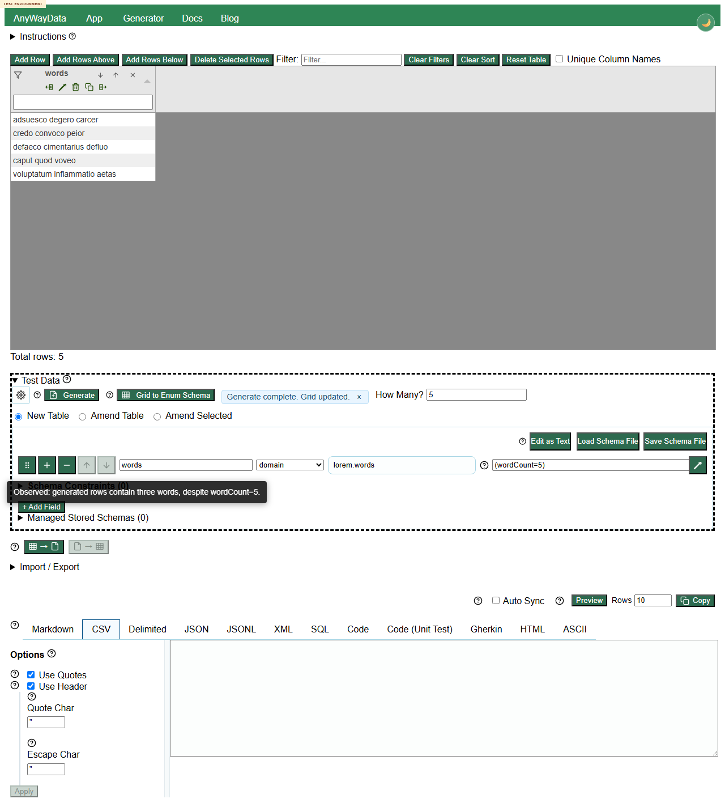

# DEFECT-001: lorem count parameters are ignored by runtime generation

## Summary

`lorem.words(wordCount=5)` and related `lorem.*` count parameters are accepted by the deployed generator but do not control the generated output count. The clearest repeatable case is `lorem.words(wordCount=5)`, which generated three words per row instead of five.

## Environment

- Deployed app: https://eviltester.github.io/grid-table-editor/site/app.html
- Story: https://github.com/eviltester/grid-table-editor/issues/286
- PR: https://github.com/eviltester/grid-table-editor/pull/294
- Date tested: 2026-07-01

## Steps To Reproduce

1. Open the deployed app.
2. Expand `Test Data`.
3. Switch to schema text mode.
4. Enter this schema:

```text
words
lorem.words(wordCount=5)
```

5. Set row count to 5.
6. Click `Generate`.

## Expected Result

Each generated row should contain five words, or the app should reject/clarify the unsupported parameter.

## Actual Result

Generation completes successfully, but each sampled row contains three words. Final review evidence also showed `lorem.words(wordCount=1)`, `lorem.sentence(wordCount=3)`, and `lorem.lines(lineCount=5)` not honoring exact requested counts.

## Evidence



Local-only replication video: `../videos/defect-lorem-count-params-ignored.webm`

Supporting data: `../support/final-review-execute-now-results.json`, `../logs/removed-deprecated-test-log.md`

## Repeatability

Repeatable in the main final review loop and the removed/deprecated subagent lane.
