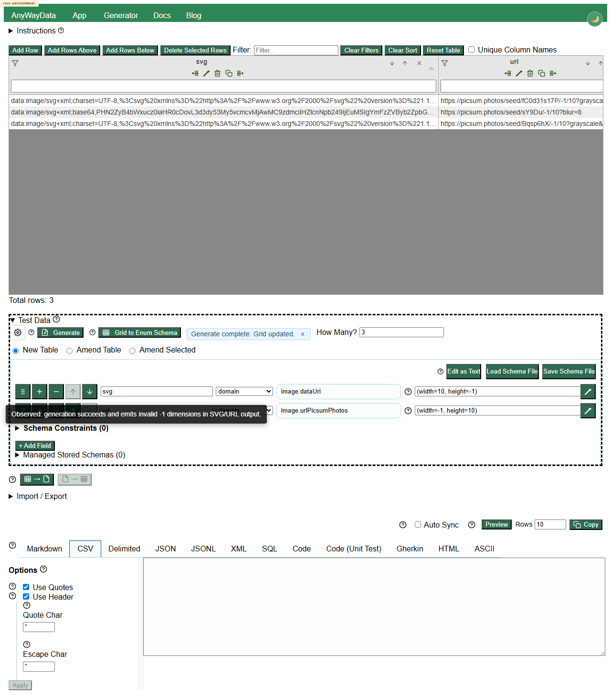

# DEFECT-002: image commands accept negative dimensions

## Summary

Image generation commands accept negative dimensions and generate invalid-looking output instead of rejecting invalid width/height values.

## Environment

- Deployed app: https://eviltester.github.io/grid-table-editor/site/app.html
- Date tested: 2026-07-01

## Steps To Reproduce

1. Open the deployed app.
2. Expand `Test Data`.
3. Switch to schema text mode.
4. Enter this schema:

```text
svg
image.dataUri(width=10, height=-1)
url
image.urlPicsumPhotos(width=-1, height=10)
```

5. Set row count to 3.
6. Click `Generate`.

## Expected Result

The app should reject negative image dimensions with validation errors before generation.

## Actual Result

Generation completes successfully. `image.dataUri` emits SVG data containing `height="-1"` and `10x-1`; `image.urlPicsumPhotos` emits URLs containing `/-1/10`.

## Evidence



Local-only replication video: `../videos/defect-negative-image-dimensions-accepted.webm`

Supporting data: `../support/final-review-execute-now-results.json`, `../logs/negative-validation-test-log.md`

## Repeatability

Repeatable in the final review loop and independently noted by the negative-validation subagent.
