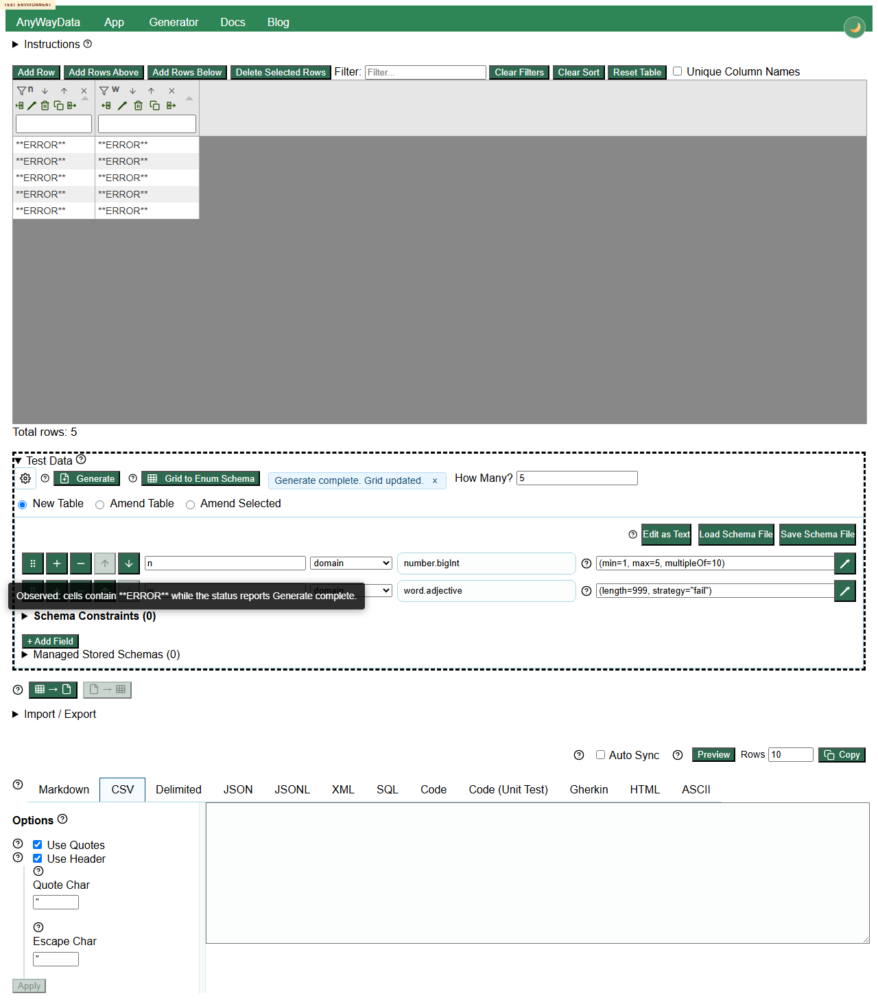

# DEFECT-003: runtime failures are written as **ERROR** data while generation reports complete

## Summary

Some parameter combinations that cannot generate valid data are accepted and then produce `**ERROR**` cell values while the app reports `Generate complete. Grid updated.` This can silently contaminate generated datasets.

## Environment

- Deployed app: https://eviltester.github.io/grid-table-editor/site/app.html
- Date tested: 2026-07-01

## Steps To Reproduce

1. Open the deployed app.
2. Expand `Test Data`.
3. Switch to schema text mode.
4. Enter this schema:

```text
n
number.bigInt(min=1, max=5, multipleOf=10)
w
word.adjective(length=999, strategy="fail")
```

5. Set row count to 5.
6. Click `Generate`.

## Expected Result

The app should reject impossible generation parameters, or report a generation failure and not mark the grid update as successful.

## Actual Result

The grid is updated with `**ERROR**` cell values and the status reports `Generate complete. Grid updated.` Similar `**ERROR**` success behavior was also observed for `internet.httpStatusCode(types=[])` and `lorem.word(length=0)`.

## Evidence



Local-only replication video: `../videos/defect-error-cells-report-generate-complete.webm`

Supporting data: `../support/final-review-execute-now-results.json`, `../support/main-loop3-execute-now-results.json`, `../logs/removed-deprecated-test-log.md`

## Repeatability

Repeatable in Loop 2, Loop 3, final review, and the removed/deprecated subagent lane.
