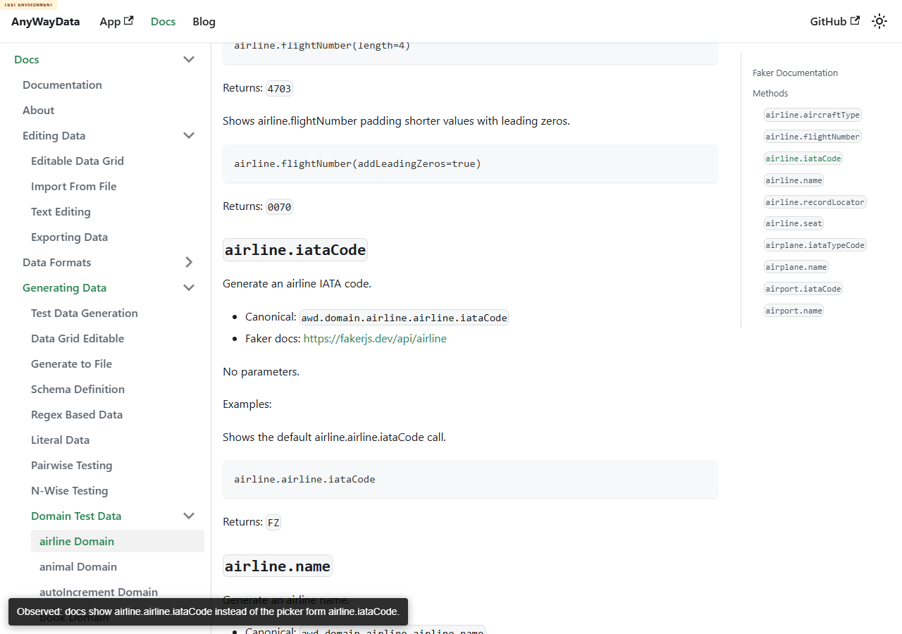

# DEFECT-005: airline docs show duplicated command prefixes

## Summary

The deployed airline domain docs show duplicated command prefixes such as `airline.airline.iataCode`, while the app method picker exposes the command as `airline.iataCode`. This makes the docs inconsistent with the primary command picker/help surface.

## Environment

- Deployed docs: https://eviltester.github.io/grid-table-editor/site/docs/test-data/domain/airline/
- Deployed app: https://eviltester.github.io/grid-table-editor/site/app.html
- Date tested: 2026-07-01

## Steps To Reproduce

1. Open the deployed airline docs page.
2. Scroll to the airline IATA/name examples.
3. Search visible code examples for `airline.airline`.
4. Compare with the method picker, which lists `airline.iataCode` and `airline.name`.

## Expected Result

Published docs should use the same command prefix users see in the app method picker, for example `airline.iataCode`.

## Actual Result

The docs include duplicated forms such as `awd.domain.airline.airline.iataCode` and `airline.airline.iataCode`. The runtime accepts the duplicated alias, so this is not a broken runtime example, but it is a docs/help consistency defect.

## Evidence

Additional video-state screenshot: 

Local-only replication video: `../videos/defect-airline-docs-duplicated-prefix.webm`

Supporting data: `../support/main-loop2-airline-duplicate-docs-evidence.json`, `../support/main-loop3-execute-now-results.json`

## Repeatability

Repeatable in Loop 2 and final verification. Runtime also accepts the duplicated form, but the docs remain inconsistent with app help/picker naming.
