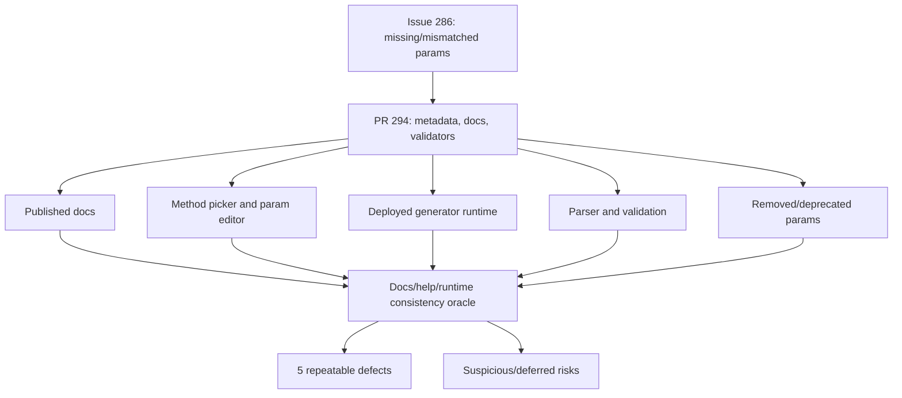
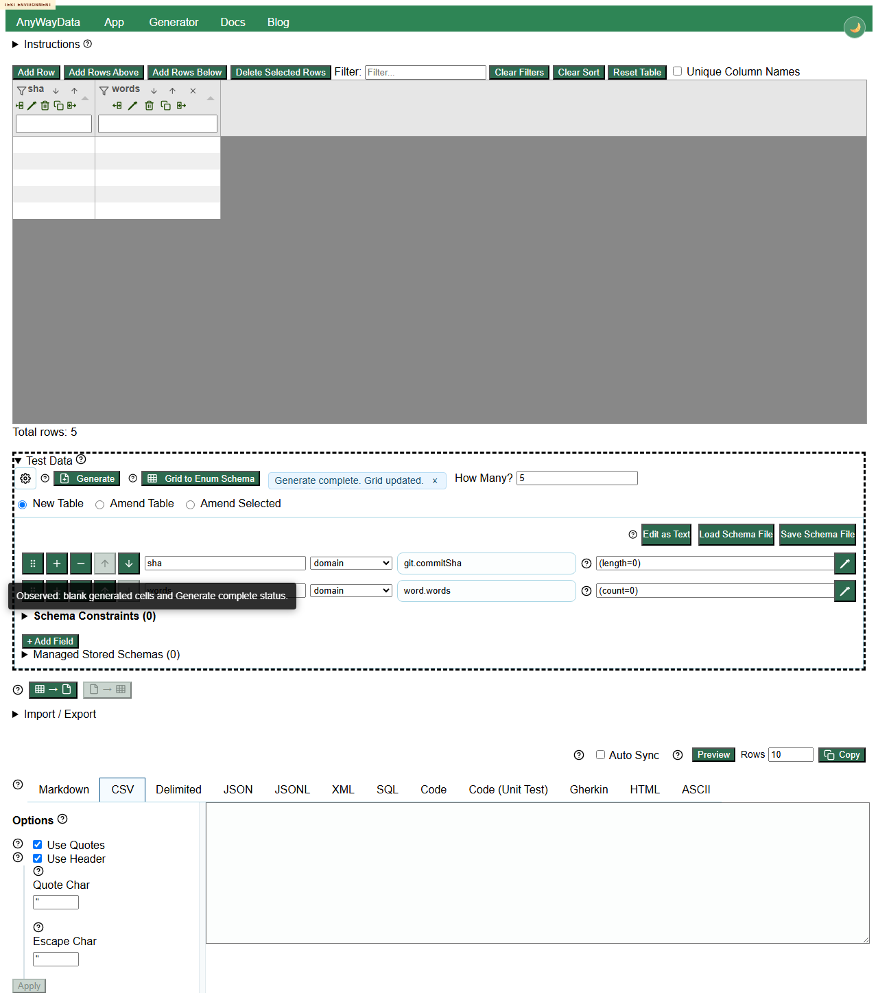
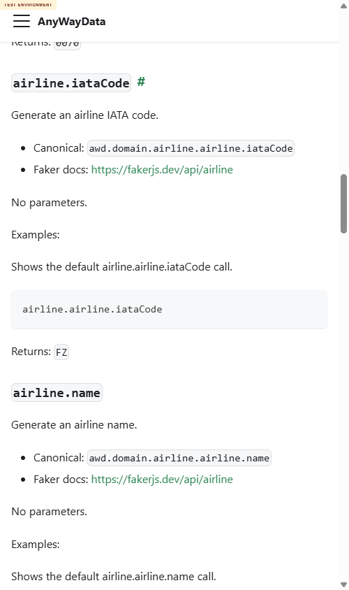

# Issue 286 / PR 294 Exploratory Test Report

## Executive Summary

A deployed-only multi-agent exploratory review was performed for story #286 and PR #294 against https://eviltester.github.io/grid-table-editor/site/. Browser interaction was proven with Chrome DevTools MCP before substantive testing. Six delegated lanes plus the main agent completed three loops and a mandatory final review loop.

The PR broadly improves the changed command-parameter surface: representative positive examples for `number.bigInt`, airline, git, image, internet, location, person, system, word, and several negative validators behaved correctly. The original story example, `number.bigInt(min=100, max=1000)`, works in the deployed runtime and is visible in app help and docs.

Recommendation: do not treat the changes as fully acceptable yet. Five repeatable defects remain, including ignored `lorem.*` count params, accepted negative image dimensions, runtime failures written as `**ERROR**` data with a success status, blank generated cells from zero count/length params, and duplicated airline docs prefixes.

## Scope And References

- Target repo: https://github.com/eviltester/grid-table-editor
- Story: https://github.com/eviltester/grid-table-editor/issues/286
- PR: https://github.com/eviltester/grid-table-editor/pull/294
- Test environment: https://eviltester.github.io/grid-table-editor/site/
- App tested: https://eviltester.github.io/grid-table-editor/site/app.html
- Docs tested: deployed domain docs under `site/docs/test-data/domain/*`

## Planning Summary

Story #286 asks for command params to be reviewed and aligned with Faker-backed command signatures, with `number.BigInt()` min/max/options as a motivating example. PR #294 changes 50 files with 1,704 additions and 555 deletions, expanding command metadata, examples, docs, validators, and comparison tooling.

Primary risks were broad command-definition churn, docs/help/runtime divergence, removed param residue, validator gaps, structured/constrained parameter handling, and usability of much larger command help/parameter surfaces.

Changed docs and command families sampled included airline, git, image, internet, location, lorem, number, person, system, and word. Changed runtime definitions sampled included `airline.flightNumber`, `airline.recordLocator`, `git.commitSha`, `image.dataUri`, `image.urlPicsumPhotos`, `internet.exampleEmail`, `internet.httpStatusCode`, `location.countryCode`, `location.zipCode`, `lorem.word`, `lorem.words`, `number.bigInt`, `person.fullName`, `system.fileName`, `system.networkInterface`, `word.adjective`, and `word.words`.

## Delegation Summary

- Command coverage and example execution: sampled airline/git parameterized examples; no confirmed lane defect.
- Negative validation and malformed parameters: 37 deployed Preview-flow cases; identified image dimension, `**ERROR**`, and boundary follow-ups.
- Docs/help/content consistency: sampled deployed docs/help/runtime; noted comparison-report publish and docs-fetch risks.
- UX/usability and workflow regression: exercised generator, method picker, and command help; found risks but no split defect.
- Responsive/mobile and accessibility: tested mobile picker/param editor; found usable but cramped controls and a non-reproduced root warning.
- Removed/deprecated and changed-surface gaps: confirmed removed `word.*(max)` / `lorem.word(min/max)` rejection and found the `lorem.*` count-param defect.

## Model-Based Coverage

## Techniques And Heuristics

Exploratory testing, risk-based testing, equivalence partitioning, boundary analysis, negative testing, consistency/oracle checking, state/flow modeling, pairwise thinking, accessibility heuristics, responsive testing heuristics, and documentation testing were used. Browser proof and most main-agent testing used Chrome DevTools MCP; subagents used MCP where available and terminal Playwright browser control against deployed URLs when MCP attachment was blocked.

## Coverage Summary

Positive runtime coverage included default and parameterized examples across airline, git, image, internet, location, number, person, system, word, and lorem. Negative/runtime validation coverage included invalid BigInt bounds/multiples, HTTP status categories, removed `word.*(max)` and `lorem.word(min/max)`, invalid image type/blur, invalid network interface/schema, invalid country variants, and zero/negative count/dimension edges.

Published docs reviewed: airline, git, image, internet, location, lorem, number, person, system, and word. The app method picker/help was inspected for `number.bigInt`, `lorem.word`, and many command cards through snapshots and subagent screenshots.

Deferred: exhaustive command-by-command verification for every changed file, full screen-reader/contrast audit, high-volume/performance generation, and local build/test verification, which was explicitly out of scope.

## Loops Performed

Loop 1 established browser proof, planning, broad positive command samples, and initial negative checks. It confirmed the headline `number.bigInt(min=100, max=1000)` case works.

Loop 2 used gap review to test docs retry, array params, word/lorem removed params, system/image/person boundaries, and param-editor behavior. It added the airline docs defect candidate.

Loop 3 retested airline docs/runtime, boundary values, validation messages, blank SHA generation, and `**ERROR**` cell behavior. It added `git.commitSha(length=0)` and `word.adjective(...strategy="fail")` as defect candidates.

Final review rechecked story/PR/logs/subagents/coverage and executed 12 more ideas. It confirmed the final five defects and downgraded the site-root warning to non-reproduced risk.

## Confirmed Defects

1. [DEFECT-001-lorem-count-params-ignored.md](defects/DEFECT-001-lorem-count-params-ignored.md) - `lorem.words(wordCount=5)` and related count params are accepted but ignored.

2. [DEFECT-002-negative-image-dimensions-accepted.md](defects/DEFECT-002-negative-image-dimensions-accepted.md) - negative image dimensions are accepted and emitted in SVG/URL output.

3. [DEFECT-003-error-cells-report-generate-complete.md](defects/DEFECT-003-error-cells-report-generate-complete.md) - impossible generation params produce `**ERROR**` cells while status says generation completed.

4. [DEFECT-004-zero-counts-blank-values.md](defects/DEFECT-004-zero-counts-blank-values.md) - zero count/length params generate blank cells with a success status.

5. [DEFECT-005-airline-docs-duplicated-prefix.md](defects/DEFECT-005-airline-docs-duplicated-prefix.md) - airline docs show duplicated prefixes such as `airline.airline.iataCode`.

## Suspicious Behaviors And Risks

- Validation messages for unsupported constrained values often end with confusing type text, such as `not string` for an unsupported string value or `not integer` for an integer outside an allowed set.
- `person.fullName(firstName="Ada", lastName="Lovelace", sex="female")` sometimes adds a prefix such as `Miss` or `Mrs.`. This may be Faker-intended full-name behavior, but docs/examples may lead users to expect exactly the supplied first/last names.
- Mobile method picker and parameter editor are usable but cramped; at 390px width the param editor requires horizontal scrolling to reveal value inputs.
- A Docusaurus root warning was observed by the responsive subagent but did not reproduce in final DevTools verification.

## What Was Not Covered And Why

No local verify/build/package-manager test commands were run because the operating rules forbade them. The generated comparison report and local scripts were not run. Full exhaustive command coverage was deferred because the review demonstrated broad family sampling and used looped idea generation rather than trying to reproduce the PR's automated comparison suite manually.

## Final Recommendation

The PR appears directionally correct and improves the original `number.bigInt` problem, but it should not be accepted without follow-up on the five confirmed defects. The highest-priority fixes are the ignored `lorem.*` count params, accepted negative image dimensions, and success statuses that hide `**ERROR**` generated data.

## GitHub Follow-Up

Created target-repo tracking issue and subissues:

- Parent review issue: https://github.com/eviltester/grid-table-editor/issues/296
- Defect subissue #297: https://github.com/eviltester/grid-table-editor/issues/297
- Defect subissue #298: https://github.com/eviltester/grid-table-editor/issues/298
- Defect subissue #299: https://github.com/eviltester/grid-table-editor/issues/299
- Defect subissue #300: https://github.com/eviltester/grid-table-editor/issues/300
- Defect subissue #301: https://github.com/eviltester/grid-table-editor/issues/301

GitHub CLI did not provide binary issue-attachment upload in this environment, so the issue bodies include full defect text plus screenshot/video artifact filenames. Local videos remain under `videos/` and are local-only by repository guardrail.
