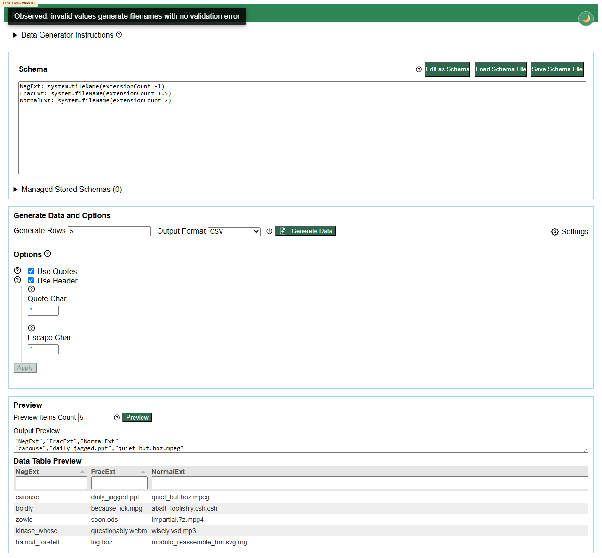

# DEFECT-001: `system.fileName(extensionCount)` accepts negative and fractional counts

## Summary

The deployed generator accepts invalid `system.fileName(extensionCount)` values such as `-1` and `1.5` and generates filenames instead of rejecting the schema with a validation error.

## Environment

- Test environment: https://eviltester.github.io/grid-table-editor/site/generator.html
- Date tested: 2026-07-02
- Browser automation: Chrome DevTools MCP and Playwright video replay
- Story/PR under review: issue #286 / PR #294

## Reproduction Steps

1. Open https://eviltester.github.io/grid-table-editor/site/generator.html.
2. Click `Edit as Text`.
3. Paste this schema:

```text
NegExt: system.fileName(extensionCount=-1)
FracExt: system.fileName(extensionCount=1.5)
NormalExt: system.fileName(extensionCount=2)
```

4. Set `Preview Items Count` to `5`.
5. Click `Preview`.

## Expected Result

The app should reject `extensionCount=-1` and `extensionCount=1.5` with validation errors. An extension count is a count and should be a positive integer, consistent with nearby validators for length/count-like params such as `finance.accountNumber(length=1.5)` and `string.*(length=0/-1)`.

## Actual Result

The app generates values for both invalid columns. Example observed output:

```csv
"NegExt","FracExt","NormalExt"
"quaintly","pfft_like.htm","within.html.sh"
"ha_tabletop_uh_huh","meh.dump","colour_smuggle_technologist.mpga.so"
"edge_instantly","outfit.xul","hutch.deb.xlt"
```

`extensionCount=-1` produces filenames without extensions, and `extensionCount=1.5` produces filenames with one extension, with no validation warning.

## Repeatability

Repeatable. Found by the negative-validation subagent and independently reproduced by the main agent in the deployed environment.

## Evidence


Video replay: `../videos/DEFECT-001-system-filename-extensioncount-invalid.webm`

Additional final replay screenshot: 

## Notes for Investigation

This appears to be a missing validator or insufficient numeric-integer/range validation on the `extensionCount` param for `system.fileName`. Compare the validator behavior with commands that correctly reject invalid count/length values, such as `finance.accountNumber(length=1.5)` and `string.fromCharacters(characters=["A"], length=-1)`.
