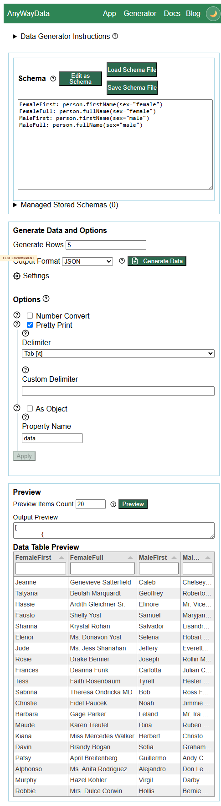
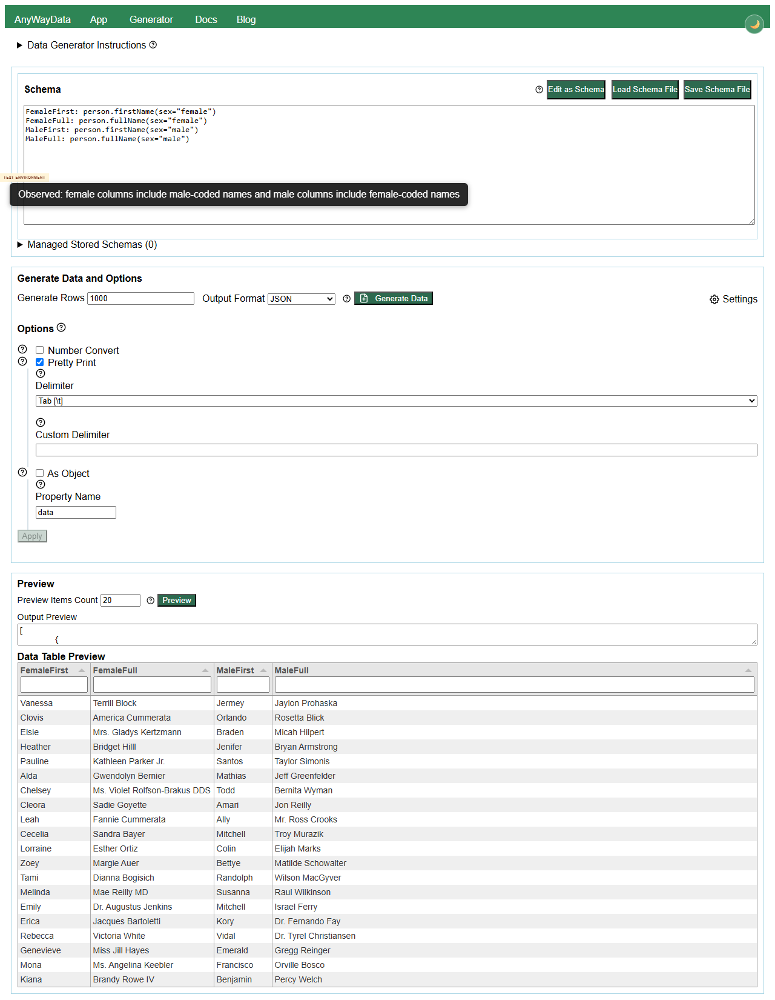

# DEFECT-002: `person.firstName` and `person.fullName` do not consistently honor the `sex` parameter

## Summary

The deployed generator accepts `sex="female"` and `sex="male"` for `person.firstName` and `person.fullName`, but generated values do not consistently match the requested sex. The output includes male-coded names in `sex="female"` columns and female-coded names in `sex="male"` columns.

## Environment

- Test environment: https://eviltester.github.io/grid-table-editor/site/generator.html
- Date tested: 2026-07-02
- Browser automation: Chrome DevTools MCP and Playwright video replay
- Story/PR under review: issue #286 / PR #294

## Reproduction Steps

1. Open https://eviltester.github.io/grid-table-editor/site/generator.html.
2. Click `Edit as Text`.
3. Paste this schema:

```text
FemaleFirst: person.firstName(sex="female")
FemaleFull: person.fullName(sex="female")
MaleFirst: person.firstName(sex="male")
MaleFull: person.fullName(sex="male")
```

4. Set `Output Format` to `JSON`.
5. Set `Preview Items Count` to `20`.
6. Click `Preview`.

## Expected Result

`person.firstName(sex="female")` and `person.fullName(sex="female")` should generate female names. `person.firstName(sex="male")` and `person.fullName(sex="male")` should generate male names. This follows the published docs and app help examples showing `person.firstName(sex="female")`, `person.fullName(..., sex="female")`, and related sex-constrained params.

## Actual Result

The output contains values that do not match the requested sex. Representative examples from a repeat run:

```json
{
  "FemaleFirst": "Fausto",
  "FemaleFull": "Shelly Yost",
  "MaleFirst": "Samuel",
  "MaleFull": "Maryjane Kub"
}
{
  "FemaleFirst": "Davin",
  "FemaleFull": "Brandy Bogan",
  "MaleFirst": "Sofia",
  "MaleFull": "Graham Baumbach"
}
{
  "FemaleFirst": "Alphonso",
  "FemaleFull": "Ms. Anita Rodriguez",
  "MaleFirst": "Alejandro",
  "MaleFull": "Don Legros"
}
```

The full raw repeat output is saved in `../support/loop3-person-sex-repeat-output.json`.

## Repeatability

Repeatable. First observed by the command-coverage subagent as suspicious output, then reproduced by the main agent with a 20-row sample.

## Evidence



Video replay: `../videos/DEFECT-002-person-sex-parameter-not-applied.webm`

Additional final replay screenshot: 

## Notes for Investigation

This may indicate that named `sex` params are parsed and accepted but not mapped correctly into the Faker options object, or that the value is not passed through to `faker.person.firstName` / `faker.person.fullName`. Compare with the PR's `argTransform: optionsFromHelpArgs` handling and with tests that assert parameterized usage examples produce semantically constrained output, not only non-error output.
