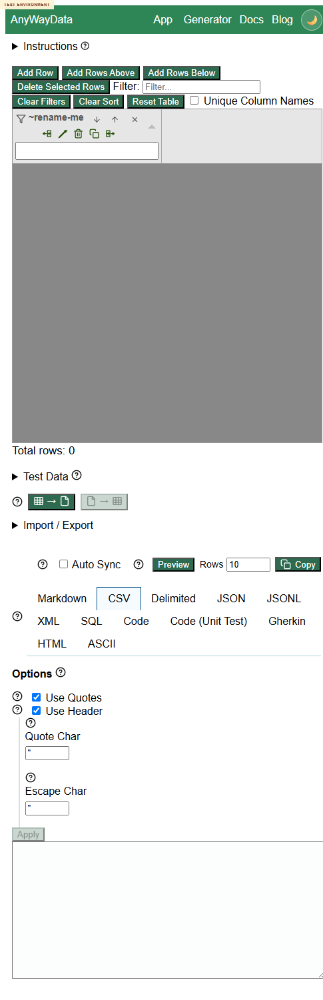
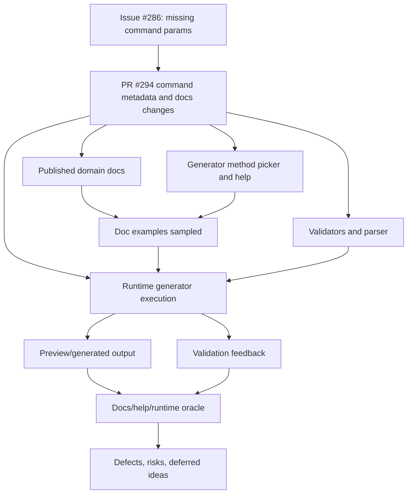
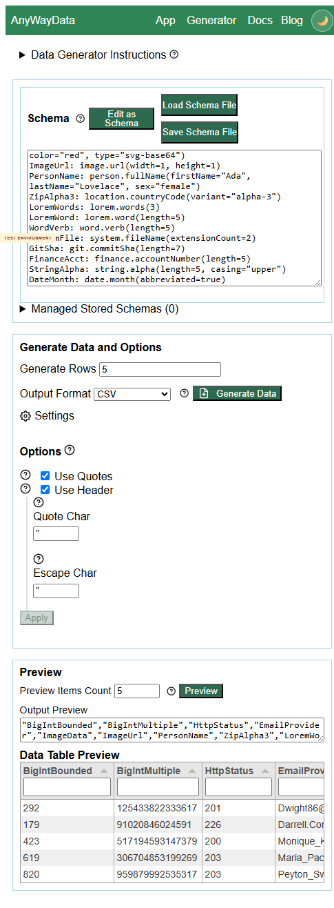
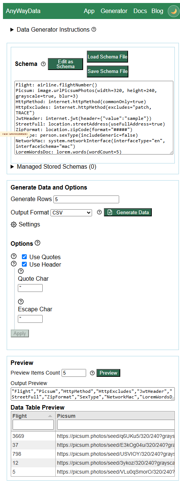
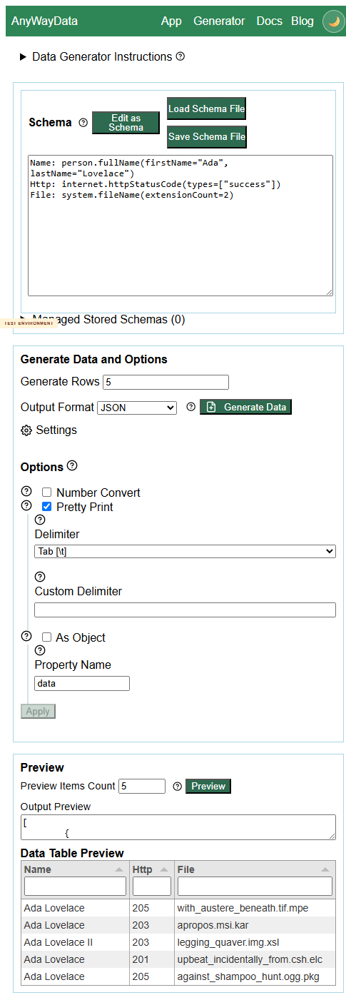
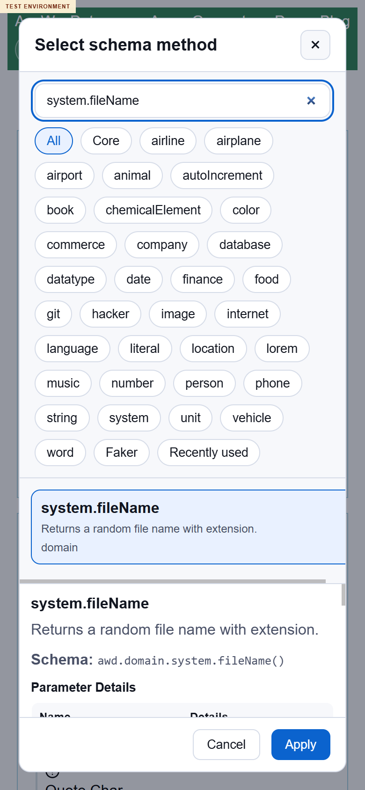
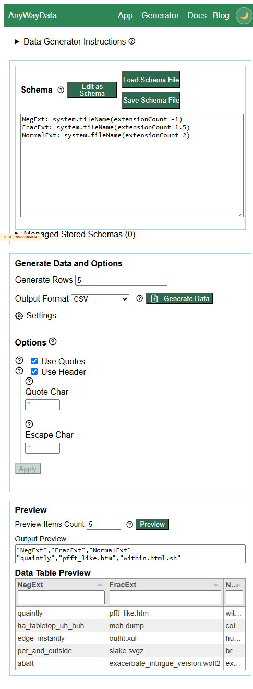

# Issue 286 / PR 294 Exploratory Test Report

## Executive Summary

A comprehensive deployed-environment exploratory review was completed for issue #286 and PR #294. Testing used the published test environment only: https://eviltester.github.io/grid-table-editor/site/.

The PR broadly improves command parameter metadata, docs, help, and validation. Most sampled validators behaved well, and broad positive command coverage generated output across the changed command families. However, two repeatable defects were found in the PR's core risk area:

- [DEFECT-001](defects/DEFECT-001-system-filename-extensioncount-invalid.md): `system.fileName(extensionCount)` accepts negative and fractional values.
- [DEFECT-002](defects/DEFECT-002-person-sex-parameter-not-applied.md): `person.firstName` and `person.fullName` do not consistently honor `sex="female"` / `sex="male"`.

Recommendation: do not treat the changes as fully acceptable for the story until these two parameter behavior defects are investigated and fixed or explicitly accepted.

## Scope and References

- Story: https://github.com/eviltester/grid-table-editor/issues/286
- PR: https://github.com/eviltester/grid-table-editor/pull/294
- Test environment: https://eviltester.github.io/grid-table-editor/site/
- Main sequential log: [issue-286-test-log.md](issue-286-test-log.md)
- Collated logs/defects: [test-logs-and-defects.md](test-logs-and-defects.md)
- Browser proof: 

## Planning Summary

Issue #286 reports that some Faker-backed domain commands mention parameters in help but lack corresponding command parameter definitions. PR #294 expands domain command parameter metadata, usage examples, docs, validators, and comparison tooling, while removing unsupported params.

### Changed-Surface Inventory

PR #294 remained open during final review with 81 changed files, 2368 additions, and 652 deletions. The changed surface reviewed was:

- Domain docs: airline, git, image, internet, location, lorem, number, person, science, system, word, plus representative date/finance/string pages.
- Command definitions: airline, date, finance, git, image, internet, location, lorem, number, person, string, system, word.
- Shared metadata/validation plumbing: domain keyword registry, arg validators, compiler/validator, faker helper definitions.
- Help/example plumbing: command help examples and domain param invocation coverage.
- Generated/comparison assets: `docs/domain-faker-param-comparison.md`, `scripts/compare-domain-faker-params.mjs`, `scripts/generate-domain-docs.mjs`.

### Risk Analysis

- Breadth risk: many command definitions changed, so one-command testing would be weak.
- Mapping risk: named params must become the correct Faker options object.
- Validator risk: count, enum, object, array, and numeric params may accept invalid values or reject valid ones.
- Docs/help/runtime consistency risk: generated docs, method-picker help, and actual generator behavior can diverge.
- UX/accessibility risk: wider help and method-picker surfaces may regress navigation, mobile use, or feedback clarity.

### Command Coverage Strategy

Coverage sampled default and parameterized examples, positive and negative cases, removed/unsupported params, validators, structured params, and helper commands. The strategy explicitly treated the broad command-definition changes as the primary test surface.

## Delegation Summary

Six subagents were used, each with a written charter and append-only log:

| Area | Log |
|---|---|
| Command coverage and example execution | [command-coverage-test-log.md](logs/command-coverage-test-log.md) |
| Negative validation and malformed parameters | [negative-validation-test-log.md](logs/negative-validation-test-log.md) |
| Docs/help/content consistency | [docs-consistency-test-log.md](logs/docs-consistency-test-log.md) |
| UX/usability workflow regression | [ux-regression-test-log.md](logs/ux-regression-test-log.md) |
| Responsive/mobile and accessibility | [responsive-accessibility-test-log.md](logs/responsive-accessibility-test-log.md) |
| Change-surface/comparison tooling risk | [change-surface-risk-test-log.md](logs/change-surface-risk-test-log.md) |

## Coverage Model

## Techniques and Heuristics

Techniques used: exploratory testing, risk-based testing, equivalence partitioning, boundary analysis, negative testing, consistency/oracle checking, state/flow modeling, pairwise thinking, accessibility heuristics, responsive testing heuristics, and documentation testing.

## Coverage Summary

| Family / Area | Examples sampled |
|---|---|
| number | `number.bigInt(min,max,multipleOf)`, invalid ordering, zero/quoted `multipleOf`, quoted numeric params |
| internet | `httpStatusCode(types)`, invalid types, `email(provider)`, `httpMethod(commonOnly/excludes)`, `jwt(header/payload)` |
| image | `dataUri(width,height,color,type)`, `url(width,height)`, `urlPicsumPhotos(width,height,grayscale,blur)`, invalid sizes/blur |
| location | `countryCode(variant)`, `streetAddress(useFullAddress)`, `zipCode(format)`, `zipCode(state)` risk |
| lorem/word | `lorem.word(length)`, `lorem.words(wordCount)`, `word.sample(strategy)`, removed `max`/`count` negatives |
| person | `firstName(sex)`, `fullName(firstName,lastName,sex)`, `sexType(includeGeneric)` |
| system | `fileName(extensionCount)`, `commonFileName(extension)`, `networkInterface(interfaceType,interfaceSchema)` |
| git/airline/date/finance/string | `commitSha(length)`, `flightNumber`, `date.month`, `date.birthdate`, `accountNumber(length)`, `bic(includeBranchCode)`, `string.alpha`, `string.fromCharacters`, `string.binary` |
| faker/helpers | `helpers.arrayElement`, `helpers.replaceSymbols` |
| workflows | generator text/schema mode, method picker/help, preview, generate, JSON/CSV output, app/table navigation |
| responsive/a11y | desktop/tablet/mobile generator, docs, method picker, keyboard/focus heuristics, live region feedback |

Representative screenshots:

## Loops Performed

### Loop 1

Planned and executed broad positive command coverage plus initial negative validation. This established that many changed examples work and validators reject many malformed values. It also surfaced the `system.fileName(extensionCount)` candidate, later confirmed.

### Loop 2

Reviewed Loop 1 and subagent results, generated 13 ideas, executed 11. This strengthened validator coverage for network, date, finance, string, JWT, Picsum, and JSON output. `system.fileName(extensionCount)` was confirmed and recorded as DEFECT-001.

### Loop 3

Reviewed all returned subagent logs, generated 12 ideas, executed 11. This added helper-command coverage, rechecked BigInt, captured mobile/help evidence, and confirmed the person `sex` parameter defect as DEFECT-002.

### Final Review Loop

Reviewed story, PR metadata, changed files, logs, coverage, docs, sampled examples, defects, and remaining gaps. Generated 12 final ideas, executed 10. Final checks confirmed subagent logs, defect evidence, docs oracles, screenshot tidiness, and a clean BigInt positive/negative smoke run.

## Confirmed Defects

### DEFECT-001: `system.fileName(extensionCount)` accepts negative and fractional counts

`system.fileName(extensionCount=-1)` and `system.fileName(extensionCount=1.5)` generate filenames rather than rejecting invalid count values.

See [DEFECT-001](defects/DEFECT-001-system-filename-extensioncount-invalid.md).

### DEFECT-002: Person `sex` parameter is not consistently applied

`person.firstName(sex="female")` and `person.fullName(sex="female")` produced male-coded names; male variants also produced female-coded names.

See [DEFECT-002](defects/DEFECT-002-person-sex-parameter-not-applied.md).

## Suspicious Behaviors and Risks

- `location.zipCode(state="CA")` is exposed in help/docs but fails with a Faker locale-data error. Because the PR marks `state` as usage-example unsupported, this was classified as a follow-up risk rather than a confirmed defect.
- Mobile docs tables and method-picker details are usable but dense and sometimes require careful horizontal/vertical navigation.
- Intermittent deployed-page fetch/SSL/navigation failures occurred in automation but succeeded on retry; these were environmental risks, not product defects.

## Deferred Ideas

- Exhaustive runtime testing of every comparison-report command was deferred because broad sampling was achieved and exhaustive coverage is beyond this exploratory session.
- Local comparison-script execution was deferred because the operating rules prohibit local repo verification/build/test activity.
- Full screen-reader traversal was deferred as useful but outside the story-specific risk envelope.
- GitHub video upload was deferred because videos are local-only evidence and the request excludes video/support-log attachments.

## What Was Not Covered and Why

- Not every changed command was executed; the report shows broad sampling across changed families instead.
- Local tests, builds, package-manager verification, and repo scripts were not run, per instruction.
- The comparison script behavior was reviewed from PR/published context but not executed locally.

## GitHub Follow-Through

Created target-repo tracking issue and defect subissues:

- Parent testing activity issue: https://github.com/eviltester/grid-table-editor/issues/302
- DEFECT-001 subissue: https://github.com/eviltester/grid-table-editor/issues/303
- DEFECT-002 subissue: https://github.com/eviltester/grid-table-editor/issues/304

The defect subissues were linked under the parent issue using GitHub subissues. Screenshot evidence filenames and reproduction details are included in each defect issue. Videos remain local-only evidence under this repository's guardrails.
## Final Recommendation

The PR appears to substantially improve parameter metadata and validation coverage, but it should not be accepted as complete for issue #286 until the confirmed `system.fileName(extensionCount)` validation defect and `person` sex-parameter behavior defect are resolved or explicitly accepted.

