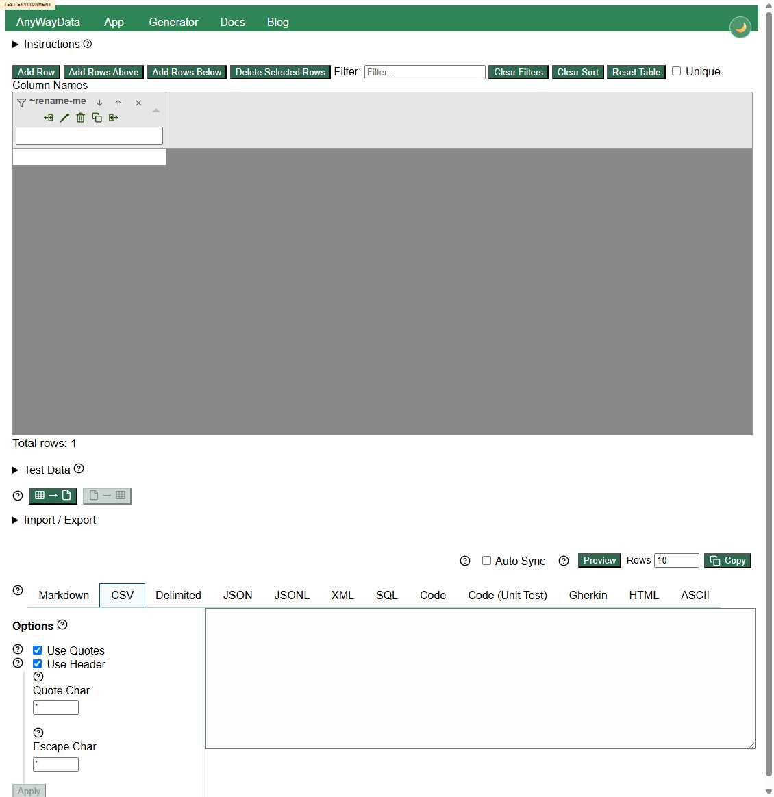
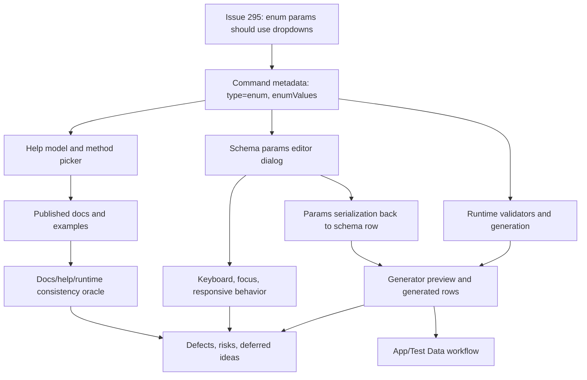

# Issue 295 / PR 305 Deployed Exploratory Test Report

## Executive Summary

This deployed-only, multi-agent exploratory review covered story [eviltester/grid-table-editor#295](https://github.com/eviltester/grid-table-editor/issues/295) and PR [#305](https://github.com/eviltester/grid-table-editor/pull/305) against `https://eviltester.github.io/grid-table-editor/site/` and the deployed generator/app/docs pages.

Core enum picker behavior is working on the happy path: sampled enum params render as dropdowns, apply to schema rows, round-trip through text/row mode, and generate output across the changed command families. The review found six repeatable defects, mainly around validation edge cases, accessibility/focus, mobile layout, and stale published docs.

Recommendation: the change looks functionally promising for the story, but I would not call it fully acceptable without triaging the confirmed defects, especially the params-editor focus loss, mobile value-column issue, timestamp `**ERROR**` output, and docs/app metadata mismatch.

## Scope and References

- Story: `Schema UI Param editor should support enum values`
- PR: `Add enum picker editing for schema params`
- Test environment: `https://eviltester.github.io/grid-table-editor/site/`
- App surface: `https://eviltester.github.io/grid-table-editor/site/app.html`
- Generator surface: `https://eviltester.github.io/grid-table-editor/generator.html`
- Main log: [issue-295-test-log.md](issue-295-test-log.md)
- Captured metadata:
  - [support/github-issue-295.json](support/github-issue-295.json)
  - [support/github-pr-305.json](support/github-pr-305.json)
  - [support/github-pr-305-files.txt](support/github-pr-305-files.txt)
  - [support/github-pr-305.patch](support/github-pr-305.patch)

Browser control was proven before substantive testing by opening the deployed app and clicking `Add Row`, changing the visible status to `Total rows: 1`.

## Planning Summary

Issue 295 asks for schema params whose types represent constrained value sets, for example `LF|CRLF`, `svg-uri|svg-base64`, `female|generic|male`, `alpha-2|alpha-3|numeric`, or similar lists, to be represented as dropdowns in the schema params editor.

PR 305 says it renders enum metadata as dropdown pickers, refactors many domain command params to `type: "enum"` plus `enumValues`, preserves enum metadata through help normalization and validation, and adds UI/story/test coverage.

Live PR metadata showed 56 changed files, 869 additions, and 153 deletions. High-risk changed surfaces:

- Params editor UI/styling: `params-editor-modal.js`, `params-editor-modal.css`
- Help/schema metadata propagation: `help-model-builder.js`, `domain-keywords.js`, `faker-helper-keyword-definitions.js`
- Domain command definitions: airline, autoIncrement, color, commerce, date, finance, internet, location, lorem, person, phone, string, and word
- Docs/reference surface: `docs/domain-faker-param-comparison.md`
- UI/test/story assets around shared schema editor and params dialog behavior

## Risk Analysis

Primary risks derived from the PR:

- Enum metadata may not reach app help, picker details, docs, and runtime consistently.
- Optional enum params may confuse `Unset`, empty string, defaults, and explicit choices.
- Numeric-looking enum values such as UUID version or ISBN variant may serialize incorrectly.
- String-like union params may still require raw-schema quoting knowledge in the guided editor.
- Dialog changes may regress focus return, keyboard flow, responsive layout, or accessibility.
- Published docs may lag behind the app metadata after command definitions changed.
- Invalid values may bypass validation and generate broken output.

## Delegation Summary

Six subagents were used:

| Subagent lane | Log |
| --- | --- |
| Command coverage and example execution | [logs/command-coverage-test-log.md](logs/command-coverage-test-log.md) |
| Negative validation and malformed parameter testing | [logs/negative-validation-test-log.md](logs/negative-validation-test-log.md) |
| Docs/help/content consistency | [logs/docs-consistency-test-log.md](logs/docs-consistency-test-log.md) |
| UX/usability and workflow regression | [logs/ux-regression-test-log.md](logs/ux-regression-test-log.md) |
| Responsive/mobile and accessibility | [logs/responsive-accessibility-test-log.md](logs/responsive-accessibility-test-log.md) |
| Story-specific enum dropdown behavior | [logs/enum-dropdown-test-log.md](logs/enum-dropdown-test-log.md) |

## Model-Based Coverage

## Techniques and Heuristics

Used: exploratory testing, risk-based testing, equivalence partitioning, boundary analysis, negative testing, consistency/oracle checking, state/flow modeling, pairwise thinking, accessibility heuristics, responsive testing heuristics, and documentation testing.

## Coverage Summary

Command families sampled across the main and subagent passes:

| Family | Representative coverage |
| --- | --- |
| airline | `airline.seat(aircraftType="widebody")` |
| autoIncrement | `autoIncrement.timestamp(type="days")`, invalid `start`, `autoIncrement.sequence(...)` |
| color | `color.rgb`, `color.cmyk`, `color.colorByCSSColorSpace`, `color.hsl`, `color.hwb` |
| commerce | `commerce.isbn(variant=10/13)` |
| date | `date.birthdate(mode="year")` |
| finance | `finance.bitcoinAddress(type=..., network=...)`, `finance.iban(...)` |
| internet | `internet.url(protocol="https")`, `internet.ipv4(network=...)`, `internet.mac(separator="")`, `internet.httpMethod(...)` |
| location | `location.countryCode(variant=alpha-2/alpha-3/numeric)` |
| lorem | `lorem.word(strategy=...)` |
| person | `person.firstName`, `person.lastName`, `person.middleName`, `person.prefix`, `person.fullName` |
| phone | `phone.number(style="international")` |
| string | `string.uuid(version=7)`, `string.alpha`, `string.hexadecimal` |
| word | `word.sample`, `word.noun`, `word.verb` |
| helpers/faker | `helpers.mustache`, `helpers.arrayElement`, `helpers.rangeToNumber`, `helpers.slugify`, faker email/http examples |

Docs/pages reviewed included:

- `site/docs/intro`
- `site/docs/test-data/faker-test-data/`
- domain pages for airline, autoIncrement, color, commerce, date, finance, internet, location, lorem, person, phone, string, and word
- generator/app workflow pages surfaced from deployed navigation

Examples tried included default commands, parameterized docs examples, enum dropdown-selected examples, malformed params, old pipe-style enum shorthand, JSON output, CSV output, and Generate Data download behavior.

## Loop Summary

Loop 1:

- Planned from the PR changed-surface inventory.
- Ran broad command, docs, UX, negative, responsive, and enum-dropdown coverage.
- Found core enum picker happy path working.
- Identified candidate defects around empty enum values, timestamp invalid starts, focus return, mobile layout, docs mismatch, and params editor quoting.

Loop 2:

- Generated 12 ideas, executed 10, deferred 2.
- Confirmed row/text round trips preserve enum params for `location.countryCode`, `internet.mac(separator="")`, and `string.uuid(version=7)`.
- Confirmed `Cancel` leaves enum params unchanged.
- Confirmed invalid enum values produce useful messages, whitespace enum values work, empty enum values fail, invalid timestamp `start` propagates `**ERROR**` to JSON, and mobile off-screen value controls repeat.

Loop 3:

- Generated 12 ideas, executed 10, deferred 2.
- Confirmed quoted `string.uuid` `refDate` works, while raw date-like values are blocked by params editor validation.
- Added mixed enum/non-enum positive coverage for `internet.url`, `color.rgb`, `word.sample`, and multi-field JSON output.
- Confirmed Generate Data can export invalid timestamp `**ERROR**` rows.

Final review loop:

- Generated 12 ideas, executed 10, deferred 2.
- Verified required files, subagent logs, defect files, screenshots, and local-only videos.
- Rechecked the core story happy path and two key defects.
- Confirmed all PR-changed command families were sampled or explicitly deferred.

Stopping is justified because multiple explicit loops plus final review are complete, command-family coverage is broad for the story/PR, recent loops mainly confirmed existing patterns rather than uncovering new categories, and remaining gaps are exhaustive or device-specific.

## Confirmed Defects

1. [Defect 001: Params editor date-like values require manual quotes](defects/defect-001-params-editor-date-like-values-require-manual-quotes.md)

The params editor emits bare date-like values for `string.uuid.refDate` and `autoIncrement.timestamp.start`, then blocks Apply with `wrap strings in quotes`. The quoted schema works, so this is a guided-editor serialization/UX issue.

2. [Defect 002: Empty string enum values fail as Unknown keyword](defects/defect-002-empty-string-enum-values-fail-as-unknown-keyword.md)

`enum("","A")` fails as `Unknown keyword: enum`, while whitespace enum values and `literal("")` work.

3. [Defect 003: Invalid timestamp start generates error rows](defects/defect-003-invalid-timestamp-start-generates-error-rows.md)

`autoIncrement.timestamp(start="not-a-date", step=1, type="seconds")` generates `**ERROR**` rows and can export them.

4. [Defect 004: Params editor Apply loses keyboard focus](defects/defect-004-params-editor-apply-loses-keyboard-focus.md)

After Apply, focus lands on `<body>`. Escape and Cancel return focus correctly.

5. [Defect 005: Mobile params editor value controls start off-screen](defects/defect-005-mobile-params-editor-value-controls-start-offscreen.md)

At 390 px and 320 px widths, the enum `Value` controls start off-screen inside a horizontally scrollable table.

6. [Defect 006: Published docs show old pipe enum types](defects/defect-006-published-docs-show-old-pipe-enum-types.md)

Published docs still show old pipe-style types while the app exposes enum dropdowns.

## Suspicious Behaviors and Risks

- Help tooltip dismissal looked sticky in the UX lane, but the main repeatability pass did not reproduce it. Kept as a risk, not a split defect.
- Some malformed domain commands with unclosed quotes reported Faker unsafe-syntax wording. Generation is blocked, so this is a lower-confidence wording risk.
- The params editor dialog remains visible in the accessibility tree along with background content. Focus trapping behaved acceptably in sampled tab flows, but deeper screen-reader testing was deferred.
- Visible method picker automation was slower/flakier than shadow-select setup; manual/keyboard picker selection worked in subagent UX/accessibility passes.

## Deferred Ideas

- Exhaustive all-domain-command enum option scrape and comparison to changed files.
- Required enum behavior, if a deployed-visible required enum command can be found.
- Save/load schema file round trip for enum params.
- Physical mobile/touch testing on iOS/Android.
- Screen-reader testing with NVDA/VoiceOver.
- Browser zoom and forced-colors/high-contrast testing.
- Full axe-core/WCAG audit if the project wants rule-level accessibility output.

## What Was Not Covered

- No local build, verify, package-manager, or repo test commands were run, by request.
- No local source changes were made.
- No exhaustive all-command matrix was attempted; the review sampled broadly from every changed family instead.
- No physical mobile devices were used.
- No downloadable schema save/load round trip was completed.

## Final Recommendation

The core story path is viable: enum metadata reaches the deployed params editor for sampled commands, dropdown selections serialize, and generated data works across many changed families. However, the change should be treated as needing follow-up before being considered polished or release-ready. The confirmed defects are concentrated in the exact areas users will notice when relying on the guided editor: validation edge cases, keyboard focus, mobile usability, and docs/help consistency.
