# Issue 295 Test Logs and Defects

This file collates the full content of all delegated logs and split defect files for PDF export.

---

## Log: command-coverage-test-log.md

---
## 2026-07-02T23:54:06+01:00

- What you think you want to do and why

Execute broad positive command coverage through the deployed generator page, focusing on commands changed by PR 305 plus helper/Faker examples. The purpose is to prove valid defaults and parameterized enum-backed commands still parse, serialize, and generate data in the deployed UI.

actions

Opened `https://eviltester.github.io/grid-table-editor/generator.html`. Used the deployed row editor to derive the live text schema grammar:

- Selected field type `domain`.
- Selected command `person.firstName` from the deployed command picker.
- Generated a 3-row preview successfully.
- Toggled to text mode and confirmed the schema text serialization was:

```text
first_default
person.firstName
```

Opened the deployed params editor for `person.firstName`, selected `sex=female` from the enum dropdown, applied it, and confirmed the live serialized params were `(sex="female")` and the text schema line became `person.firstName(sex="female")`.

Ran this main domain command batch through text-mode Preview with CSV output, `Generate Rows=3`, and `Preview Items Count=3`:

```text
country_default
location.countryCode
country_alpha3
location.countryCode(variant="alpha-3")
first_female
person.firstName(sex="female")
last_male
person.lastName(sex="male")
middle_default
person.middleName
prefix_male
person.prefix(sex="male")
birth_year
date.birthdate(mode="year")
url_https
internet.url(protocol="https")
ipv4_private_a
internet.ipv4(network="private-a")
mac_dash
internet.mac(separator="-")
bitcoin_bech32_testnet
finance.bitcoinAddress(type="bech32",network="testnet")
uuid_v4
string.uuid(version=4)
isbn_13
commerce.isbn(variant=13)
phone_international
phone.number(style="international")
airline_widebody
airline.seat(aircraftType="widebody")
timestamp_days
autoIncrement.timestamp(type="days")
rgb_hex_upper
color.rgb(casing="upper",format="hex")
cmyk_css
color.cmyk(format="css")
css_space
color.colorByCSSColorSpace(format="css",space="display-p3")
alpha_lower
string.alpha(casing="lower")
hex_upper
string.hexadecimal(casing="upper")
lorem_any_length
lorem.word(strategy="any-length")
word_noun_longest
word.noun(strategy="longest")
```

Saved one clarifying screenshot after this successful batch: `screenshots/command-coverage-domain-batch.png`. Verified it visually after saving.

Ran this helper/Faker command batch through the same deployed generator preview:

```text
helper_mustache
helpers.mustache("Hello {{name}}", { name: "Ada" })
helper_array_element
helpers.arrayElement(["red","green","blue"])
helper_range_number
helpers.rangeToNumber({ min: 10, max: 12 })
helper_slugify
helpers.slugify("Hello From AnyWayData")
faker_email_provider
internet.email(provider="example.com")
faker_http_common
internet.httpMethod(commonOnly=true)
```

Opened deployed docs page `https://eviltester.github.io/grid-table-editor/site/docs/test-data/domain/person/`, extracted practical docs examples, and executed this docs-example batch through the generator:

```text
docs_first_female
person.firstName(sex="female")
docs_fullname_all
person.fullName(firstName="Ada", lastName="Lovelace", sex="female")
docs_fullname_first
person.fullName(firstName="Ada")
docs_last_female
person.lastName(sex="female")
```

Ran an additional enum/default edge batch:

```text
mac_empty
internet.mac(separator="")
uuid_default
string.uuid
uuid_v7
string.uuid(version=7)
isbn_default
commerce.isbn
isbn_10
commerce.isbn(variant=10)
country_alpha2
location.countryCode(variant="alpha-2")
country_numeric
location.countryCode(variant="numeric")
rgb_binary_mixed
color.rgb(casing="mixed",format="binary")
hsl_decimal
color.hsl(format="decimal")
hwb_binary
color.hwb(format="binary")
word_verb_shortest
word.verb(strategy="shortest")
word_sample_closest
word.sample(strategy="closest")
```

Ran one JSON-output batch and parsed the generated preview text with `JSON.parse`:

```text
json_country
location.countryCode(variant="alpha-3")
json_fullname
person.fullName(firstName="Ada", lastName="Lovelace", sex="female")
json_range
helpers.rangeToNumber({ min: 1, max: 3 })
json_uuid7
string.uuid(version=7)
```

Checked captured console errors from the generator and person docs tabs.

observations

The main domain batch generated 23 CSV columns and 3 rows without visible status errors. Sample outputs showed expected shapes:

- `location.countryCode(variant="alpha-3")` produced 3-letter codes such as `AND`, `KIR`, `KAZ`.
- `internet.url(protocol="https")` produced HTTPS URLs.
- `internet.ipv4(network="private-a")` produced `10.x.x.x` values.
- `internet.mac(separator="-")` produced dash-separated MAC addresses.
- `finance.bitcoinAddress(type="bech32",network="testnet")` produced `tb1...` values.
- `string.uuid(version=4)` produced v4-shaped UUIDs.
- `commerce.isbn(variant=13)` produced ISBN-13 values.
- `autoIncrement.timestamp(type="days")` incremented by one day across preview rows.
- `color.rgb(casing="upper",format="hex")` produced uppercase hex colors.
- `color.colorByCSSColorSpace(format="css",space="display-p3")` produced `color(display-p3 ...)`.

The helper/Faker batch generated without visible status errors:

- `helpers.mustache("Hello {{name}}", { name: "Ada" })` produced `Hello Ada`.
- `helpers.arrayElement(["red","green","blue"])` produced values from the array.
- `helpers.rangeToNumber({ min: 10, max: 12 })` produced values in the expected numeric range.
- `helpers.slugify("Hello From AnyWayData")` produced `Hello-From-AnyWayData`.
- `internet.email(provider="example.com")` produced emails at `example.com`.
- `internet.httpMethod(commonOnly=true)` produced common HTTP verbs such as `GET` and `HEAD`.

Docs examples from the deployed person docs generated without visible status errors. `person.fullName(firstName="Ada", lastName="Lovelace", sex="female")` consistently produced `Ada Lovelace`.

The enum/default edge batch generated without visible status errors:

- `internet.mac(separator="")` produced unseparated 12-character hex values.
- `string.uuid` produced v4-shaped UUIDs by default.
- `string.uuid(version=7)` produced v7-shaped UUIDs beginning with `019f...`.
- `commerce.isbn` defaulted to ISBN-13, while `commerce.isbn(variant=10)` produced ISBN-10 values.
- `location.countryCode(variant="numeric")` produced numeric country codes.
- Extra color and word strategy variants generated values.

The JSON-output batch parsed as a JSON array with 3 rows and keys `json_country`, `json_fullname`, `json_range`, and `json_uuid7`. No generator or docs console errors were captured after these runs.

No repeatable command-execution defects found in this lane. Cross-lane docs note: the deployed person docs still display some type metadata as pipe-delimited strings such as `female|male` and `female|generic|male`; this did not block executing the docs examples but may be useful for the docs/help consistency lane to review.

---
## 2026-07-02T23:54:06+01:00

- What you think you want to do and why

Generate follow-up test ideas from the command-coverage lane and classify them as `execute-now` or `defer`. Cheap, high-signal ideas were executed above; broader matrix, negative, persistence, and non-command workflow ideas should move to owning lanes or future passes.

actions

Classified follow-up ideas:

1. `execute-now` - Run empty-string enum choice for `internet.mac(separator="")`. Executed in the enum/default edge batch.
2. `execute-now` - Compare default and explicit numeric-like enum choices for `string.uuid`, including v7. Executed in the enum/default edge batch.
3. `execute-now` - Compare default and explicit ISBN variants for `commerce.isbn`. Executed in the enum/default edge batch.
4. `execute-now` - Exercise all `location.countryCode` variants sampled across default, `alpha-2`, `alpha-3`, and `numeric`. Executed across the main and edge batches.
5. `execute-now` - Check that command output is healthy outside CSV by running a JSON preview and parsing it. Executed in the JSON-output batch.
6. `execute-now` - Execute docs examples with mixed named params, including spaces after commas. Executed from the deployed person docs examples.
7. `execute-now` - Include structured object params in helper coverage. Executed with `helpers.rangeToNumber({ min: 10, max: 12 })` and JSON-output `helpers.rangeToNumber({ min: 1, max: 3 })`.
8. `defer` - Full enum matrix for every choice on every changed command family; useful but too broad for this lane without turning into an exhaustive combinatorial pass.
9. `defer` - Negative malformed enum and semantic-invalid param coverage; belongs to the negative validation lane.
10. `defer` - Row-mode params editor interaction for every enum-backed command; belongs primarily to the enum dropdown lane.
11. `defer` - Save/load schema file round trip for the broad command batch; useful persistence coverage but outside this command execution lane.
12. `defer` - Generate-to-file/download verification for broad command batches; useful but would add file-download evidence and should be handled deliberately.
13. `defer` - Mobile/narrow responsive execution of long command schemas; belongs to responsive/accessibility.
14. `defer` - Full deployed docs crawl comparing displayed parameter metadata against runtime command metadata; belongs to docs/help/content consistency.
15. `defer` - Large row-count performance pass for enum-heavy schemas; useful after correctness is stable.

observations

The executed follow-ups added coverage for empty enum values, defaults, numeric-like enums, JSON formatting, docs examples, and structured helper params. Remaining deferred ideas are still valid but are better owned by other lanes or a later exhaustive pass. No final defect files were created.

---
## 2026-07-02T23:47:20+01:00

- What you think you want to do and why

Use the PR support files to turn this command-coverage lane into an evidence-backed sampling pass instead of a generic smoke test. The changed files and enum-line extraction point at domain command definitions, helper metadata, validators, and examples that should be exercised through the deployed app/generator/docs only.

actions

Read `support/github-pr-305-files.txt`, `support/github-pr-305-enum-lines.txt`, `issue-295-test-report.md`, and `issue-295-test-log.md`. Confirmed the PR changed domain command definitions across airline, autoIncrement, color, commerce, date, finance, internet, location, lorem, person, phone, string, and word, plus params editor/help metadata. Confirmed prior setup already opened `https://eviltester.github.io/grid-table-editor/site/`, clicked through to `app.html`, and captured `screenshots/browser-proof-add-row.png`.

Planned positive command coverage across default and parameterized examples, with emphasis on enum-backed params and validators:

- Domain defaults and enum params: `location.countryCode`, `person.firstName`, `person.lastName`, `person.middleName`, `person.prefix`, `date.birthdate`, `internet.url`, `internet.ipv4`, `internet.mac`, `finance.bitcoinAddress`, `phone.number`, `autoIncrement.timestamp`, `string.uuid`, `airline.seat`, `commerce.isbn`, `lorem.word`, `word.*`, and color commands.
- Faker/helper coverage: `helpers.mustache`, `helpers.arrayElement`, `helpers.rangeToNumber`, and related default/parameterized command examples where exposed by the deployed UI/docs.
- Structured/constrained params: numeric-looking enum values such as UUID version and ISBN version, structured range/object params where practical, and validator-backed values that should generate rather than error.

observations

The most relevant PR clue for this lane is that many previously pipe-delimited or constrained params are now explicit `type: "enum"` with `enumValues`. Positive command execution should therefore prove that valid enum choices still serialize, parse, and generate data from the deployed UI while preserving defaults. No defects recorded yet.

---
## 2026-07-02T23:55:11+01:00

- What you think you want to do and why

Close the command-coverage lane with a readback check so the owning coordinator can trust the saved artifact and screenshot paths.

actions

Read back the tail of `logs/command-coverage-test-log.md`, checked `screenshots/command-coverage-domain-batch.png`, and checked Git status for the owned log plus screenshot.

observations

The log contains the planning, executed command coverage, and follow-up classification entries. The saved screenshot exists as `screenshots/command-coverage-domain-batch.png` with filename prefix `command-coverage-`. Git status shows only this lane's owned log and screenshot as new files from my work. Note: the first planning entry appears before this closing note but after the later execution entries because of how the log was first created and then patched; no prior evidence was removed or rewritten.

---


---

## Log: docs-consistency-test-log.md

---
## 2026-07-02 23:49:28 +01:00
- What you think you want to do and why
  - Start the docs/help/content consistency lane for issue #295 / PR #305 using only the deployed GitHub Pages environment. The PR changes schema param enum metadata and picker rendering, so this lane should compare published docs, app help/method metadata, params dialog labels/options/examples, and generated runtime behavior.
- actions
  - Read `AGENTS.md` guardrails for this repo.
  - Enabled the tracked local hook with `git config core.hooksPath .githooks`.
  - Reviewed live GitHub metadata for `eviltester/grid-table-editor` issue #295 and PR #305 to identify the affected command families without running local repo commands.
  - Confirmed browser control against `https://eviltester.github.io/grid-table-editor/site/` using `playwright-cli -s=docs-consistency-295 open ... --browser chrome`.
  - Captured a fresh page snapshot of the deployed homepage showing visible App and Docs links.
- observations
  - Issue #295 asks for pipe-style param types such as `lf|crlf`, `svg-uri|svg-base64`, `female|generic|male`, `alpha-2|alpha-3|numeric`, and similar values to be modeled as enum choices.
  - PR #305 is open at review time and says it adds enum picker editing for schema params, preserves enum metadata through domain/faker help normalization, and updates domain command params to `type: "enum"` with `enumValues`.
  - PR #305 touched command families including timestamp, color, ISBN, birthdate, IPv4/MAC/URL, country code, person names, phone, strings, UUID, word families, and a faker helper definition.
  - Browser proof succeeded on the deployed homepage: title `AnyWayData - Data Table Editor & Generator`; visible links included App, Docs, Blog, GitHub, and `Use The Application`.
  - The homepage console reported one error during the Playwright CLI open, not yet investigated because this lane is scoped to docs/help/content consistency.
---
## 2026-07-03 00:01:20 +01:00
- What you think you want to do and why
  - Compare deployed app help/params metadata, params-dialog controls, published docs, and runtime behavior for representative PR #305 enum command families. The goal is to find stale docs/help, old pipe-style enum values still visible, missing enum docs/help, and mismatches between app help and runtime.
- actions
  - Reviewed deployed pages:
    - `https://eviltester.github.io/grid-table-editor/site/`
    - `https://eviltester.github.io/grid-table-editor/site/app.html`
    - `https://eviltester.github.io/grid-table-editor/site/generator.html`
    - `https://eviltester.github.io/grid-table-editor/generator.html`
    - `https://eviltester.github.io/grid-table-editor/site/docs/intro`
    - `https://eviltester.github.io/grid-table-editor/site/docs/test-data/faker-test-data/`
    - `https://eviltester.github.io/grid-table-editor/site/docs/test-data/domain/airline/`
    - `https://eviltester.github.io/grid-table-editor/site/docs/test-data/domain/autoIncrement/`
    - `https://eviltester.github.io/grid-table-editor/site/docs/test-data/domain/color/`
    - `https://eviltester.github.io/grid-table-editor/site/docs/test-data/domain/commerce/`
    - `https://eviltester.github.io/grid-table-editor/site/docs/test-data/domain/date/`
    - `https://eviltester.github.io/grid-table-editor/site/docs/test-data/domain/finance/`
    - `https://eviltester.github.io/grid-table-editor/site/docs/test-data/domain/internet/`
    - `https://eviltester.github.io/grid-table-editor/site/docs/test-data/domain/location/`
    - `https://eviltester.github.io/grid-table-editor/site/docs/test-data/domain/lorem/`
    - `https://eviltester.github.io/grid-table-editor/site/docs/test-data/domain/person/`
    - `https://eviltester.github.io/grid-table-editor/site/docs/test-data/domain/phone/`
    - `https://eviltester.github.io/grid-table-editor/site/docs/test-data/domain/string/`
    - `https://eviltester.github.io/grid-table-editor/site/docs/test-data/domain/word/`
  - Inspected deployed generator method picker and params dialogs for: `autoIncrement.timestamp`, `airline.seat`, `color.rgb`, `color.colorByCSSColorSpace`, `commerce.isbn`, `date.birthdate`, `finance.bitcoinAddress`, `internet.ipv4`, `internet.mac`, `internet.url`, `location.countryCode`, `person.firstName`, `phone.number`, `string.uuid`, and `word.noun`.
  - Ran deployed runtime preview cases from params-dialog selections for: `autoIncrement.timestamp(type="minutes")`, `color.rgb(casing="upper", format="hex")`, `internet.ipv4(network="private-a")`, `internet.mac(separator="")`, `location.countryCode(variant="alpha-3")`, `string.uuid(version=7)`, `phone.number(style="international")`, `word.noun(length=100, strategy="any-length")`, `commerce.isbn(variant=10)`, and `date.birthdate(min=2000, max=2005, mode="year")`.
  - Saved clarifying screenshots:
    - `screenshots/docs-consistency-timestamp-invalid-generated-params-full.png`
    - `screenshots/docs-consistency-docs-old-pipe-types-color-rgb.png`
- observations
  - App picker/help metadata looks updated for sampled commands: enum-bearing params appeared as `Type enum` in the method details panel.
  - Params dialogs look updated for sampled commands: enum params rendered as dropdowns with expected values, including `internet.mac` showing `Unset`, `:`, `-`, and `""` for the empty separator.
  - Runtime behavior was healthy for sampled enum selections. Examples observed:
    - `color.rgb(casing="upper", format="hex")` generated uppercase hex values such as `#A59FEF`.
    - `internet.ipv4(network="private-a")` generated `10.x.x.x` addresses.
    - `internet.mac(separator="")` generated 12 hex-character values with no separators and the params field showed `(separator="")`.
    - `string.uuid(version=7)` generated UUIDs with version nibble `7`.
    - `phone.number(style="international")` generated `+...` E.123-style numbers.
  - Suspected defect: published domain docs still show old pipe-style enum type strings instead of `enum`, while the deployed app picker and params dialogs show `enum`.
    - Exact repeatable example: open `https://eviltester.github.io/grid-table-editor/site/docs/test-data/domain/color/#colorrgb`; the `color.rgb` docs table shows `casing` type `lower|upper|mixed` and `format` type `hex|decimal|css|binary`. In the deployed generator, method picker and params dialog show both as `enum` dropdowns. Evidence: `screenshots/docs-consistency-docs-old-pipe-types-color-rgb.png`.
    - Same stale-docs pattern observed on these sampled docs sections: `airline.seat.aircraftType` = `narrowbody|regional|widebody`; `commerce.isbn.variant` = `10|13`; `date.birthdate.mode` = `age|year`; `finance.bitcoinAddress.type` = `legacy|segwit|bech32|taproot`; `finance.bitcoinAddress.network` = `mainnet|testnet`; `internet.ipv4.network` = `any|loopback|private-a|private-b|private-c|test-net-1|test-net-2|test-net-3|link-local|multicast`; `internet.mac.separator` = `":"|"-"|""`; `internet.url.protocol` = `http|https`; `location.countryCode.variant` = `alpha-2|alpha-3|numeric`; `person.firstName.sex` = `female|male`; `phone.number.style` = `human|national|international`; `string.uuid.version` = `4|7`; `word.noun.strategy` and `lorem.word.strategy` = `fail|closest|shortest|longest|any-length`.
    - `autoIncrement.timestamp.type` is a related stale-docs mismatch: app picker/dialog show `type` as `enum` with plural units, but the published docs type table still shows `type` as `string`.
  - Suspected defect: params editor can generate invalid syntax for `autoIncrement.timestamp` string `start` values.
    - Exact steps: open deployed generator; set field type `domain`; choose `autoIncrement.timestamp`; open params editor; enter `start` = `2026-06-12T12:39:23Z`, `step` = `15`, `type` = `minutes`, and `outputFormat` = `yyyy-MM-dd HH:mm:ss`; apply; set column name `ts`; click Preview.
    - Observed params field: `(start=2026-06-12T12:39:23Z,step=15,type="minutes",outputFormat="yyyy-MM-dd HH:mm:ss")`.
    - Observed validation error: `Row 1: invalid domain params - Invalid keyword arguments: bare values are not allowed; wrap strings in quotes`.
    - Expected from app help and published docs examples: `start` should be quoted, e.g. `autoIncrement.timestamp(start="2026-06-12T12:39:23Z", step=15, type="minutes", outputFormat="yyyy-MM-dd HH:mm:ss")`.
    - Evidence: `screenshots/docs-consistency-timestamp-invalid-generated-params-full.png`.
  - Faker sanity check: `helpers.arrayElement` remained visible in the method picker with parameter details and params dialog rows. No enum-specific issue observed in that sampled faker helper.
  - No sampled command was missing from deployed app help or published docs. The main content issue is docs type metadata lagging behind app enum metadata.
  - Follow-up test ideas from this lane:
    - execute-now: Verify every PR #305 enum param docs table has `Type enum`, not old pipe-style values, after the docs generation fix.
    - execute-now: Exercise params editor quoting for string args without spaces but with punctuation, using `autoIncrement.timestamp.start`, `internet.ipv4.cidrBlock`, and `string.uuid.refDate`.
    - execute-now: Verify `internet.mac(separator="")` from the empty-string dropdown survives Save Schema File / Load Schema File round trip.
    - execute-now: Verify enum dropdown selections persist after switching between row mode and Edit as Text mode.
    - execute-now: Verify invalid enum text typed manually into the Params field gives a useful error naming allowed enum values.
    - execute-now: Check app help `Open documentation` links for all PR #305 touched commands and confirm each lands on the relevant docs section or page.
    - execute-now: Verify enum params for numeric-looking values (`commerce.isbn.variant`, `string.uuid.version`) generate correct unquoted numeric params and still validate.
    - defer: Add a docs-generation regression check that compares app help metadata types with published docs arg tables for domain commands.
    - defer: Add visual regression coverage for long enum dropdowns such as `internet.ipv4.network` on narrow/mobile viewports.
    - defer: Add coverage for enum params in schema constraints if constraints can reference generated fields using enum-backed commands.
    - defer: Verify Storybook/shared schema editor examples match deployed docs wording once PR #305 lands.
    - defer: Review all non-sampled color commands (`color.cmyk`, `color.hsl`, `color.hwb`, `color.lab`, `color.lch`) for identical docs/app enum consistency.
---


---

## Log: enum-dropdown-test-log.md

---
## 2026-07-02T23:52:00+01:00
- What you think you want to do and why: Start the enum-dropdown lane with proof of browser control against the deployed GitHub Pages environment only, then inventory the exposed app/docs surfaces before focused enum-control testing.
- Actions: Created/opened this lane log under the requested output folder. Confirmed the repo hook is already configured to `.githooks`. Preparing to open `https://eviltester.github.io/grid-table-editor/site/` in the browser automation session.
- Observations: Existing session folder already contains `issue-295-session-goal-prompt.md`, `issue-295-test-log.md`, `issue-295-test-report.md`, plus local-only `support/` and `videos/` folders. No app code edits or local verify/build/package-manager/repo test commands are in scope for this lane.
---
---
## 2026-07-02T23:59:00+01:00
- What you think you want to do and why: Prove live deployed browser control and identify where enum-specific testing should happen.
- Actions: Opened `https://eviltester.github.io/grid-table-editor/site/`, then used the deployed `app.html` surface through a fresh headless Chrome DevTools Protocol session on localhost. Captured `screenshots/enum-dropdown-app-cdp-loaded.png` after the editor UI loaded.
- Observations: Browser/CDP proof is valid: Chrome reported the deployed app title `Test Data Generator and Table Editor for Markdown, CSV, JSON, Gherkin and HTML - AnyWayData`, main editor buttons are visible (`Add Row`, `Add Rows Above`, `Delete Selected Rows`, filters/import/export), and the app exposes a deployed `Generator` link at `https://eviltester.github.io/grid-table-editor/generator.html`. The enum-metadata lane should proceed on the generator page rather than the generic editor grid.
---
---
## 2026-07-03T00:20:00+01:00
- What you think you want to do and why: Final handoff for the enum-dropdown lane after the user requested no further exploration. Summarize completed deployed-only coverage, repeatable findings, and follow-up ideas without creating defect files or touching app code.
- Actions: Used the deployed pages only: `https://eviltester.github.io/grid-table-editor/site/`, deployed `site/app.html`, and deployed `https://eviltester.github.io/grid-table-editor/generator.html`. Used browser/CDP interaction and screenshots under `screenshots/` with the `enum-dropdown-` prefix where useful. Consulted PR 305 metadata/source through GitHub for expected enum behavior, but did not run local repo tests, package-manager commands, builds, or app-code edits.
- Observations: Confirmed the generator uses `domain` command rows for the PR 305 story path. The command picker exposed the expected priority commands. Option-list coverage included `location.countryCode` variant `[alpha-2, alpha-3, numeric]`, person first/middle/last/prefix sex `[female, male]`, `date.birthdate` mode `[age, year]`, `internet.url` protocol `[http, https]`, `internet.ipv4` network `[any, loopback, private-a, private-b, private-c, test-net-1, test-net-2, test-net-3, link-local, multicast]`, `internet.mac` separator `[:, -, ""]`, `finance.bitcoinAddress` type/network, `string.uuid` version `[4, 7]`, `autoIncrement.timestamp` plural type units, `color.rgb`/`color.hsl` formats and casing, `word.sample` strategy, and `airline.seat` aircraft type.
- Observations: Value application and runtime generation checks passed for representative cases: unset country code left params empty; alpha-3 serialized as `variant="alpha-3"` and generated 3-letter codes; MAC empty separator serialized as `separator=""` and generated no separators; UUID v7 serialized raw as `version=7` and generated v7-shaped UUIDs; URL `https` plus `appendSlash=false`, IPv4 `private-c`, Bitcoin `taproot`/`testnet`, timestamp `seconds` with default `step=1`, RGB `casing="upper",format="css",includeAlpha=true`, `word.sample(length=5,strategy="shortest")`, and `airline.seat(aircraftType="widebody")` all serialized and generated data.
- Observations: No repeatable enum-dropdown defect was confirmed in this lane. All priority deployed enum params observed were optional and used `Unset`; I did not find a deployed priority command that demonstrates required enum `Select...` behavior. Broad pipe unions such as `string.uuid` `refDate` stayed as text controls, while explicit numeric enum values serialized raw. Help/description metadata was visible in dialogs; detailed tooltip scraping was in progress when exploration stopped.
- Observations: Screenshots saved during the lane include `enum-dropdown-app-cdp-loaded.png`, `enum-dropdown-generator-loaded.png`, `enum-dropdown-domain-picker-open.png`, `enum-dropdown-countrycode-dialog.png`, `enum-dropdown-countrycode-alpha3-applied.png`, `enum-dropdown-mac-empty-selected.png`, and `enum-dropdown-uuid-v7-generated.png`. No defect markdown files were created.
- Follow-up test ideas:
  - execute-now: Import schema text containing `location.countryCode(variant="alpha-3")`, switch back to row mode, and confirm the dropdown preselects `alpha-3`.
  - execute-now: Import schema text containing `internet.mac(separator="")` and confirm the empty-string option, not `Unset`, is selected.
  - execute-now: Select `location.countryCode` `numeric` and assert generated values are numeric country codes while params still quote `"numeric"`.
  - execute-now: Exercise the visible command-picker tile path, not just the shadow select path, for one priority command plus params application.
  - execute-now: Check optional boolean unset with a later enum selected, e.g. `internet.url(protocol="https")`, to confirm unset boolean does not shift or serialize.
  - execute-now: Test UUID `version=4` versus `version=7` plus `refDate`, including any deployed validation messages.
  - execute-now: Check docs pages for the same enum option lists shown in deployed generator dialogs.
  - execute-now: Recheck commands with no params, such as `color.human`, to decide whether an enabled edit-params button that opens no dialog is expected or a low-priority UI issue.
  - defer: Find or create a deployed-visible required enum case to verify `Select...`, disabled Apply, and required-error behavior in the browser.
  - defer: Broaden enum round-trip coverage across saved schemas/recover draft/session persistence.
  - defer: Add accessibility-focused checks for enum dropdown names, focus order, Escape/Tab trapping, and tooltip screen-reader names.
  - defer: Compare every PR 305 changed domain keyword file against deployed dropdown metadata to catch any missed enumValues drift.
---


---

## Log: negative-validation-test-log.md

---
## 2026-07-02 23:47 BST - timestamp correction

- What you think you want to do and why

Correct the first log entry's placeholder timestamp without editing or rewriting the existing entry, preserving append-only behavior.

actions

- Captured the actual current local time as `2026-07-02 23:47 +01:00`.
- Left the initial setup entry intact and added this correction entry.

observations

- Future entries in this log will use actual observed local timestamps.

---
## 2026-07-02 00:00 BST - lane setup

- What you think you want to do and why

Create the owned append-only lane log before substantive testing, confirm the lane scope, and avoid touching application code or local build/test tooling. This lane focuses on negative validation and malformed parameter behavior in the deployed grid-table-editor app, generator, help, and docs pages for issue #295 / PR #305.

actions

- Confirmed the session folder exists at `D:\github\anywaydata-ai-testing\docs\testing\20260702\issue-295-001`.
- Confirmed this subagent's owned log did not previously exist, then created it.
- Confirmed repository safety context from the task and local repo setup: `.githooks` is configured, and `support`, `videos`, and `video` folders are local-only evidence.
- Will use the deployed environment only: `https://eviltester.github.io/grid-table-editor/site/` and deployed app/generator/docs pages.
- Will not create final defect files; repeatable suspected defects will be recorded here with exact steps/data/evidence.

observations

- Existing session folder contains `defects`, `logs`, `screenshots`, `support`, `videos`, `issue-295-session-goal-prompt.md`, `issue-295-test-log.md`, and `issue-295-test-report.md`.
- No local app code edits, repo verification commands, build commands, package-manager commands, or repo test commands were run.

---
## 2026-07-02 23:57 BST - negative validation execution and follow-up ideas

- What you think you want to do and why

Execute the lane charter against the deployed generator using representative malformed schemas and changed command parameter shapes. The goal is to separate healthy validation behavior from repeatable suspected defects that the main review can decide whether to promote into final defect files.

actions

- Used `https://eviltester.github.io/grid-table-editor/generator.html` in text-schema mode.
- Used deployed docs evidence already scouted from:
  - `https://eviltester.github.io/grid-table-editor/site/docs/test-data/Schema-Definition/`
  - `https://eviltester.github.io/grid-table-editor/site/docs/test-data/domain/domain-test-data/`
  - `https://eviltester.github.io/grid-table-editor/site/docs/category/generating-data/`
- Attempted to visit deeper deployed domain docs directly, but browser policy/network handling blocked the `autoIncrement` docs route and left that tab on an error page. I did not retry or work around that blocked docs URL; I continued with the deployed generator plus already gathered docs examples.
- Switched the generator to `Edit as Text`.
- Used `Preview Items Count = 5` unless otherwise stated.
- Ran `Preview` for malformed schema cases and `Generate Combinations` for two enum-combination cases.
- A first automation batch hit my helper bug because it tried to fill a hidden `Schema constraints` textarea. I fixed the helper to use only visible controls and reran the cases. The failed helper attempts are not product observations.
- Saved screenshots only for states that clarified suspected defects:
  - `screenshots/negative-validation-empty-string-enum-error-immediate.png`
  - `screenshots/negative-validation-invalid-timestamp-start-error-output.png`
- Checked browser console warnings once after the timestamp error case. Only a Tabulator initialization warning appeared; no matching app exception was logged.

observations

Healthy validation and compatibility behavior observed:

| ID | Input | Observed result |
| --- | --- | --- |
| NV-01R | `Status` / `enum("Open","Closed")` | Preview generated quoted CSV values. |
| NV-02R | `person.notACommand()` | Rejected: `Unknown keyword: person.notACommand`. |
| NV-03R | `enum(High,Low)` | Rejected: bare values must be quoted. |
| NV-04R | `High|Medium|Low` | Accepted as old pipe-delimited/shorthand enum-style values; preview produced values including `High`, `Low`, and later `Medium` in inline retry. |
| NV-05R | `1,2,3` | Accepted as numeric-looking enum shorthand; preview values were quoted strings such as `"1"`, `"2"`, `"3"`. |
| NV-07R | Constraint references enum value `Critical` not in `Priority` | Rejected: invalid enum value for `[Priority]`. |
| NV-08R | `date.between()` | Rejected: argument `from` is required. |
| NV-09R | `number.int(min="low", max=5)` | Rejected: `min` must be number, not string. |
| NV-10R | `autoIncrement.timestamp(... type="secs")` | Rejected with allowed unit list. |
| NV-11R | `finance.iban(formatted="true", countryCode="GB")` | Rejected: `formatted` must be boolean, not string. |
| NV-12R | `number.int(min=1, max=5, bogus=1)` | Rejected: unknown named argument `bogus`. |
| NV-13R | `number.int(min=10, max=5)` | Rejected: `min` must be less than or equal to `max`. |
| NV-16 | `literal("")` | Accepted; preview generated empty quoted values. |
| NV-18 | `autoIncrement.timestamp(... type="seconds")` | Accepted; preview incremented seconds deterministically. |
| NV-19 / NV-20 | `type="second"` / `type="SECONDS"` | Rejected with allowed unit list. |
| NV-21 / NV-31 | `finance.iban()` and `finance.iban(countryCode="GB")` | Accepted; optional/default semantics generated IBAN values. |
| NV-22 | `finance.iban(... countryCode="ZZ")` | Rejected: country code not supported. |
| NV-23 | `countryCode=GB` | Rejected: bare values must be quoted. |
| NV-24 / NV-25 | `person.firstName(sex="alien")` / `sex="female"` | Invalid enum rejected; valid enum accepted. |
| NV-27 | `autoIncrement.timestamp(... unit="seconds")` | Rejected as unknown named argument `unit`. |
| NV-29 | `Generate Combinations` with constraint value `"9"` outside enum `A` | Rejected with the same invalid enum constraint validation as Preview. |
| NV-32 | Missing closing parenthesis in `number.int(min=1, max=5` | Rejected: missing closing parenthesis. |
| NV-34 / NV-35 | Bare date param / reversed date range | Rejected with clear messages. |
| NV-37 | `autoIncrement.timestamp(... step="1")` | Rejected: `step` must be number, not string. |
| NV-38 / NV-39 | `enum("A",)` and `enum("A",,"B")` | Rejected: missing argument after comma. |
| NV-41 | `Legacy: High|Medium|Low` | Accepted inline pipe shorthand; preview produced all three values across sample. |

Repeatable suspected defect 1 - empty string enum choices are rejected as `Unknown keyword: enum`.

Steps/data:

1. Open `https://eviltester.github.io/grid-table-editor/generator.html`.
2. Click `Edit as Text`.
3. Enter:

```text
MaybeBlank
enum("","A")
```

4. Set `Preview Items Count` to `5`.
5. Click `Preview`.

Observed:

- Error shown: `MaybeBlank failed domain validation - Unknown keyword: enum`.
- Repeated with `enum("A","")`, `enum("")`, and inline `MaybeBlank: enum("", "A")`.
- Repeated in docs-style constraint scenario:

```text
Ticket Status
enum("Open","Closed")
Resolution Code
enum("","Done")
IF [Ticket Status] = "Open" THEN [Resolution Code] = "";
```

- Error shown there: `Resolution Code failed domain validation - Unknown keyword: enum`.
- Evidence screenshot: `screenshots/negative-validation-empty-string-enum-error-immediate.png`.

Why suspicious:

- The deployed schema docs include an empty-string constraint example (`[Resolution Code] = ""`), and `literal("")` works, so blank values are supported elsewhere.
- The message reports `Unknown keyword: enum`, not an invalid/unsupported empty enum value. This suggests the parser/validator misclassifies enum calls containing an empty quoted string.

Repeatable suspected defect 2 - invalid timestamp `start` is not schema-validated and generates `**ERROR**` rows.

Steps/data:

1. Open `https://eviltester.github.io/grid-table-editor/generator.html`.
2. Click `Edit as Text`.
3. Enter:

```text
Created
autoIncrement.timestamp(start="not-a-date", step=1, type="seconds")
```

4. Set `Preview Items Count` to `5`.
5. Click `Preview`.

Observed:

- No visible schema/status error.
- Output Preview shows:

```text
"Created"
"**ERROR**"
"**ERROR**"
"**ERROR**"
"**ERROR**"
"**ERROR**"
```

- Data Table Preview also displays `**ERROR**` in each generated row.
- Evidence screenshot: `screenshots/negative-validation-invalid-timestamp-start-error-output.png`.
- Console check showed only a Tabulator initialization warning, not a matching app exception.

Why suspicious:

- Other `autoIncrement.timestamp` params are schema-validated: invalid `type`, singular/uppercase unit, unknown `unit`, and string `step` all produce explicit validation errors.
- Invalid `start` should likely be rejected before data generation rather than producing data rows with `**ERROR**`.

Repeatable suspected issue / wording risk 3 - unclosed quotes in some domain commands fall through to Faker unsafe-syntax messaging.

Steps/data:

```text
Iban
finance.iban(countryCode="GB)
```

and:

```text
First
person.firstName(sex="female)
```

Observed:

- `finance.iban(countryCode="GB)` produced: `Iban failed faker validation - Invalid Faker API Call Unsafe faker rule syntax detected...`
- `person.firstName(sex="female)` produced: `First failed faker validation - Invalid Faker API Call Unsafe faker rule syntax detected...`
- A different malformed command, `number.int(min=1, max=5`, correctly produced a domain parse message: `missing closing parenthesis`.

Why suspicious:

- The inputs use domain commands, but the user-facing message says Faker validation and mentions unsafe Faker configuration. This is likely a low-severity diagnostic-quality issue rather than a functional failure because generation is still blocked.

Follow-up test ideas:

| Class | Idea |
| --- | --- |
| execute-now | Recheck empty enum choices in row-based schema mode by selecting field type `enum` and entering values that include a blank choice. |
| execute-now | Recheck empty enum choices through `Edit as Text` -> `Edit as Schema` conversion and record whether the invalid rule conversion dialog offers a safe path. |
| execute-now | Test `enum(" ", "A")` and `enum("  ", "A")` to distinguish intentional blank from whitespace-only values. |
| execute-now | Test constraints against empty literal fields, e.g. `literal("")`, to confirm empty comparisons work outside enum fields. |
| execute-now | Test `autoIncrement.timestamp(start="", step=1, type="seconds")` and omitted `start` to map default vs invalid-start semantics. |
| execute-now | Test `autoIncrement.timestamp(start=0, step=1, type="seconds")` and millisecond numeric starts to confirm accepted timestamp input types. |
| execute-now | Test `Generate Data` (file action) for invalid timestamp start to see whether `**ERROR**` can be downloaded as output. |
| execute-now | Test invalid timestamp start across JSON/JSONL/XML output formats to see whether `**ERROR**` propagates consistently. |
| execute-now | Recheck unclosed-quote fallback with `date.between(from="2020)` and `location.cardinalDirection(abbreviated="true)` to see if Faker wording is broad. |
| execute-now | Test combination generation with empty enum choices once the empty-enum parser behavior is clarified. |
| defer | Test all timestamp unit values (`milliseconds`, `minutes`, `hours`, `days`, `weeks`, `months`, `years`) for canonical increment behavior. |
| defer | Test boundary country codes for `finance.iban`, including lowercase `gb`, mixed-case `Gb`, and supported country with unsupported formatting. |
| defer | Test person `sex` casing (`Female`, `FEMALE`) and missing/empty values for canonicalization policy. |
| defer | Test old pipe-delimited values containing escaped pipes or spaces, e.g. `High | Medium | Low` and `A\\|B|C`. |
| defer | Test numeric-looking enum values with leading zeroes (`001,002`) and negatives (`-1,0,1`) through Preview and Generate Combinations. |
| defer | Test malformed inline schemas where colon syntax and command syntax collide, e.g. `Field: person.firstName(sex="female")` and `Field: enum("A", "")`. |

No final defect markdown files were created by this subagent. The suspected defects above are ready for the main agent to triage/promote if they fit the final defect criteria.

---
## 2026-07-02 23:49 BST - browser proof and scout

- What you think you want to do and why

Prove deployed browser control before substantive testing, then scout the app, generator, and docs surfaces that are relevant to negative validation and malformed parameter coverage.

actions

- Opened `https://eviltester.github.io/grid-table-editor/site/`.
- Captured a browser screenshot in memory only to confirm screenshots work; the capture returned 21064 bytes and was not saved because it did not clarify a defect.
- Interacted with the deployed page by clicking the visible theme toggle. The page changed from light to dark mode.
- Opened `https://eviltester.github.io/grid-table-editor/site/app.html`.
- Opened `https://eviltester.github.io/grid-table-editor/generator.html`.
- Opened docs via visible navigation at `https://eviltester.github.io/grid-table-editor/site/docs/intro/` and `https://eviltester.github.io/grid-table-editor/site/docs/category/generating-data/`.
- A guessed URL, `https://eviltester.github.io/grid-table-editor/site/docs/test-data/`, returned GitHub Pages 404 during scouting. I treated that as a route guess miss, not an app finding.

observations

- Browser control, snapshots, navigation, and screenshot capture are working against the deployed environment.
- `app.html` exposes grid editing, import/export tabs, options, and help buttons. This lane will use it only where malformed options or generated data transfer semantics need confirmation.
- `generator.html` is the primary negative-validation surface. It exposes schema row editing, `Edit as Text`, field type selection (`enum`, `literal`, `regex`, `domain`, `faker`), output formats, generation controls, preview controls, and export settings.
- Deployed generating-data docs link to the relevant live reference pages: schema definition, regex/literal, pairwise/n-wise enum handling, domain command category, Faker command category, counterstrings, auto-increment sequences, generator file output, and app/generator workflow docs.
- No local app code edits, repo verification commands, build commands, package-manager commands, or repo test commands were run.

---
## 2026-07-02 23:58 BST - lane handoff and ordering note

- What you think you want to do and why

Append a final handoff note for the parent review and call out a log-ordering wrinkle without rewriting prior entries. This keeps the log append-only while making the lane results easy to consume.

actions

- Verified the owned log exists at `logs/negative-validation-test-log.md`.
- Verified only two `negative-validation-` screenshots are present:
  - `screenshots/negative-validation-empty-string-enum-error-immediate.png`
  - `screenshots/negative-validation-invalid-timestamp-start-error-output.png`
- Verified the new lane artifacts are untracked and no commit/stage action was performed.

observations

- Ordering note: the `2026-07-02 23:57 BST - negative validation execution and follow-up ideas` entry was inserted above the `2026-07-02 23:49 BST - browser proof and scout` entry by the patch tool. Read it as the later execution entry; I did not rewrite it to preserve append-only behavior.
- Main suspected defects to triage:
  - Empty string values inside `enum(...)` fail as `Unknown keyword: enum`, including `enum("","A")`, `enum("A","")`, `enum("")`, inline `MaybeBlank: enum("", "A")`, and the docs-style empty-string constraint scenario.
  - `autoIncrement.timestamp(start="not-a-date", step=1, type="seconds")` generates `**ERROR**` rows without a schema/status validation error.
  - Malformed unclosed quotes in some domain commands are rejected, but the message falls through to `failed faker validation` / unsafe Faker syntax wording.
- Most other malformed cases behaved well: unknown commands, unquoted string params, invalid enum constraint values, omitted date params, numeric type mismatches, invalid timestamp units, quoted booleans, unknown params, reversed ranges, invalid country codes, invalid person `sex`, missing close parens, and trailing/extra enum commas were rejected with specific messages.
- Follow-up ideas are classified in the 23:57 entry with 10 `execute-now` and 6 `defer` ideas.
- No final defect markdown files were created by this subagent.

---


---

## Log: responsive-accessibility-test-log.md

---
## 2026-07-02 23:47:09 +01:00

- What you think you want to do and why

Start the responsive/accessibility lane by confirming the deployed-only constraints, output location, and browser automation path before interacting with the target. This lane needs evidence from the live GitHub Pages environment only, with repeatable suspected defects recorded here rather than split into final defect files.

actions

- Read the session prompt at `issue-295-session-goal-prompt.md`.
- Read the main in-progress report at `issue-295-test-report.md`.
- Confirmed repo guardrails from `AGENTS.md`, especially that `support`, `videos`, and `video` folders under `docs/testing/**` are local-only evidence.
- Confirmed `git config core.hooksPath` returns `.githooks`.
- Checked browser automation availability using the bundled Playwright runtime from the Node REPL; `import("playwright")` succeeded.

observations

- This lane is scoped to responsive/mobile and accessibility review of the deployed app, generator, docs/help surfaces, method picker, and params editor enum picker behavior.
- Existing main report has planned the broader multi-agent review and names this lane as `logs/responsive-accessibility-test-log.md`.
- No local verify, build, package-manager, repo test, or app-code edit command has been run.
---
## 2026-07-02 23:50:40 +01:00

- What you think you want to do and why

Confirm that deployed browser interaction and screenshot capture work before using the browser evidence for responsive/accessibility findings. This reduces the chance of mistaking tooling problems for app problems.

actions

- Tried to launch the bundled Playwright browser; the Playwright package was importable but its bundled Chromium binary was not installed.
- Did not run `npx playwright install` or any package-manager install command because this lane is constrained to deployed browser testing only.
- Switched to installed Chrome via Playwright automation.
- Initial navigation to `https://eviltester.github.io/grid-table-editor/site/` hit `net::ERR_CONNECTION_RESET`; retried from the same browser route.
- Successfully loaded:
  - `https://eviltester.github.io/grid-table-editor/site/`
  - `https://eviltester.github.io/grid-table-editor/site/app.html`
  - `https://eviltester.github.io/grid-table-editor/generator.html`
- Clicked the site-root `App` navigation link; it is exposed as a link named `App(opens in new tab)` in the accessibility snapshot.
- Opened `https://eviltester.github.io/grid-table-editor/site/app.html` directly and clicked `Add Row`.
- Saved and visually verified:
  - `screenshots/responsive-accessibility-browser-proof.png`
  - `screenshots/responsive-accessibility-app-add-row-proof.png`

observations

- Deployed browser proof is valid after one transient network retry.
- App interaction proof is concrete: `Total rows: 0` changed to `Total rows: 1` after clicking `Add Row`.
- The app accessibility snapshot exposes key controls including `Add Row`, `Filter:`, grid column controls, status `Total rows: 1`, import/export controls, preview controls, and output format links.
- The site-root accessibility snapshot includes navigation, banner, main, and contentinfo landmarks. The app surface itself is less landmark-rich, which remains a follow-up review point for this lane.
---
## 2026-07-03 00:03:20 +01:00

- What you think you want to do and why

Run Loop 1 broad responsive/accessibility coverage across the generator, enum params editor, method picker, deployed app, and docs. The most important risk is that the new enum dropdown controls may technically render but be hard to reach, unnamed, off-screen, or hostile to keyboard/screen-reader users.

actions

- Opened `https://eviltester.github.io/grid-table-editor/generator.html` at desktop size and captured the accessibility tree / DOM control inventory.
- Switched the first schema row from `regex` to `domain`.
- Selected `person.firstName` as a representative enum-param command.
- Opened the params editor via the `Edit params for person.firstName` button.
- Saved and visually verified `screenshots/responsive-accessibility-person-first-name-params-dialog.png`.
- Tested keyboard operation in the params editor:
  - focus initially landed on the `sex value` select
  - `ArrowDown` changed `Unset` to `female`
  - generated params changed from `()` to `(sex="female")`
  - `Tab` moved to `Cancel`, then `Apply`
  - `Enter` on `Apply` applied the params
  - `Escape` closed a fresh dialog
  - repeated `Tab` stayed within the dialog controls while the dialog remained open
- Saved and visually verified `screenshots/responsive-accessibility-person-first-name-keyboard-apply.png`.
- Opened the method picker from the `Select domain command` button.
- Verified keyboard path:
  - `Enter` opened the method picker
  - focus moved to search box `Filter methods`
  - typing `person.firstName` filtered the picker
  - `Enter` selected the method and returned focus to the command picker button
- Saved and visually verified `screenshots/responsive-accessibility-method-picker-open.png`.
- Sampled enum params dialogs across representative command families:
  - `person.firstName`
  - `person.fullName`
  - `location.countryCode`
  - `string.uuid`
  - `internet.url`
  - `internet.ipv4`
  - `internet.mac`
  - `finance.bitcoinAddress`
  - `color.rgb`
  - `date.birthdate`
  - `autoIncrement.timestamp`
  - `commerce.isbn`

observations

- Positive: the generator has a `main` landmark labelled `Data Generator`, a visible H1 exposed to the accessibility tree, named schema sections, named generator/preview regions, and named form controls for the main schema row.
- Positive: enum params render as native `select` controls with useful names such as `sex value`, `variant value`, `version value`, `protocol value`, `network value`, `separator value`, `type value`, `format value`, `casing value`, and `mode value`.
- Positive: keyboard selection in a simple enum dialog works. `person.firstName` can be set to `female` without a mouse, and the generated params preview updates to `(sex="female")`.
- Positive: `Escape` and `Cancel` closed the params dialog and returned focus to the invoking `Edit params for person.firstName` button.
- Positive: the method picker has dialog name `Select schema method`, moves focus to a named search box, exposes a `listbox` named `Methods`, and supported the tested keyboard search/select path.
- Suspected repeatable defect: pressing `Apply` in the params editor closes the dialog but leaves focus on `<body>` instead of returning focus to the invoking params button or another meaningful control. This was first observed with `person.firstName`; screenshot evidence after Apply is `screenshots/responsive-accessibility-person-first-name-keyboard-apply.png`.
- Screen-reader semantics risk: while the params editor is open, the accessibility tree still exposes the background generator controls before the `dialog "Edit params for awd.domain.person.firstName"` node. Focus appears trapped during Tab, but the page is not hidden from the tree.
- Minor observation: hidden confirm/text input modal headings exist in the DOM as empty `h3` elements when hidden. They were not visible and did not appear to affect the active accessibility snapshot, so I am not treating this as a defect from this lane.
- Coverage note: boolean params render as radio options labelled by visible text such as `Unset`, `True`, and `False`; enum params render as native selects. I did not see an unnamed enum select in the sampled dialogs.
---
## 2026-07-03 00:13:55 +01:00

- What you think you want to do and why

Check the mobile/narrow behavior because the story is about moving constrained params into dropdowns, and dropdowns in a table-based dialog are especially vulnerable to off-screen controls on phone widths.

actions

- Audited `https://eviltester.github.io/grid-table-editor/generator.html` at 390 x 844.
- Audited `person.firstName` params dialog at 390 x 844 and 320 x 720.
- Audited `https://eviltester.github.io/grid-table-editor/site/app.html` at 390 x 844 after adding one row.
- Audited `https://eviltester.github.io/grid-table-editor/site/docs/test-data/domain/person/` at 390 x 844.
- Audited the docs `person.firstName` parameter table at `https://eviltester.github.io/grid-table-editor/site/docs/test-data/domain/person/#personfirstname`.
- Saved and visually verified:
  - `screenshots/responsive-accessibility-generator-mobile-390.png`
  - `screenshots/responsive-accessibility-generator-dialog-mobile-390.png`
  - `screenshots/responsive-accessibility-generator-narrow320-320.png`
  - `screenshots/responsive-accessibility-generator-dialog-mobile-scrolled-390.png`
  - `screenshots/responsive-accessibility-app-mobile-390.png`
  - `screenshots/responsive-accessibility-docs-person-mobile-390.png`
  - `screenshots/responsive-accessibility-docs-person-firstname-table-mobile-390.png`

observations

- Generator page without the params dialog did not create document-level horizontal overflow at 390 px.
- App page did not create document-level horizontal overflow at 390 px after adding a row. The toolbar wraps and the grid remains visible; screenshot `screenshots/responsive-accessibility-app-mobile-390.png`.
- Docs page did not create document-level horizontal overflow at 390 px. Docusaurus tables and code blocks use local horizontal scrolling. The `person.firstName` docs table clips the `Description` heading until horizontally scrolled, but that appears to be normal docs table behavior rather than a clear app defect.
- Suspected repeatable defect: the params editor table starts with the `Value` column and enum select off-screen on mobile.
- Exact evidence for `person.firstName` at 390 px:
  - viewport width: 390
  - `.params-editor-table-wrap` client width: 316
  - `.params-editor-table-wrap` scroll width: 720
  - `sex value` select initial rect: left 585, right 748, overflow right 358
  - screenshot before scrolling: `screenshots/responsive-accessibility-generator-dialog-mobile-390.png`
  - after programmatically scrolling `.params-editor-table-wrap` to the right, the select becomes visible; screenshot `screenshots/responsive-accessibility-generator-dialog-mobile-scrolled-390.png`
- Exact evidence at 320 px:
  - table width about 720 px
  - `Value` column/select overflow right about 428 px
  - screenshot `screenshots/responsive-accessibility-generator-narrow320-320.png`
- Impact: on mobile the dialog opens with focus on an enum select that is not visually present in the initial viewport. Sighted keyboard and touch users see `Name`/`Type` and `Generated params ()`, but the actual enum value picker is hidden to the right unless they discover and perform horizontal scrolling inside the table wrapper.
- The issue is not a total blocker because the table wrapper can scroll horizontally, but it is a high-confidence mobile usability/accessibility defect pattern for the enum picker story.
---
## 2026-07-03 00:22:40 +01:00

- What you think you want to do and why

Run Loop 2 from the lane findings: generate follow-up ideas, execute the highest-value ones, and check whether the suspected issues repeat beyond the first command.

actions

Follow-up ideas and classification:

1. `execute-now` - Repeat params `Apply` focus behavior with other enum commands, not only `person.firstName`.
2. `execute-now` - Compare `Apply` focus behavior with `Escape` and `Cancel` close behavior.
3. `execute-now` - Repeat mobile hidden-value-column behavior with multiple enum commands.
4. `execute-now` - Confirm whether the params dialog has a scrollable container that can reveal the off-screen enum select.
5. `execute-now` - Check method picker keyboard search/select as the entry point into enum params editing.
6. `execute-now` - Check docs mobile table behavior for the documented `person.firstName` enum param.
7. `execute-now` - Sample enum dialogs across commands with numeric enum values such as `string.uuid` and `commerce.isbn`.
8. `execute-now` - Sample enum dialogs across commands with empty-string enum value display such as `internet.mac(separator="")`.
9. `execute-now` - Sample multi-enum dialogs such as `finance.bitcoinAddress` and `color.rgb`.
10. `execute-now` - Check high-level app/generator/docs headings and landmarks.
11. `defer` - Run a browser extension or full axe-core audit if the main agent wants automated WCAG rule output; current lane used browser snapshots and targeted DOM checks only.
12. `defer` - Test Windows high-contrast / forced-colors mode and browser zoom at 200%.
13. `defer` - Test touch-device horizontal scrolling manually on physical iOS/Android browsers.
14. `defer` - Test screen-reader announcements with NVDA/VoiceOver rather than accessibility tree inference.
15. `defer` - Re-test after any layout fix with multiple rows and long command names, because the params table may behave differently with more content.

Executed Loop 2 checks:

- Repeated `Apply` focus behavior for:
  - `person.firstName`
  - `location.countryCode`
  - `finance.bitcoinAddress`
- Repeated close behavior for:
  - `Escape` on `person.firstName`
  - `Cancel` on `person.firstName`
- Repeated mobile initial visibility checks at 390 px for:
  - `person.firstName`
  - `location.countryCode`
  - `finance.bitcoinAddress`
  - `color.rgb`
- Reviewed headings/landmarks for:
  - app page
  - generator page
  - docs `person` page

observations

- Confirmed repeatable suspected defect: `Apply` focus loss repeats.
  - `person.firstName`: after selecting `female` and pressing `Apply`, params field became `(sex="female")`, dialog closed, active element became `BODY`.
  - `location.countryCode`: after selecting `alpha-2` and pressing `Apply`, params field became `(variant="alpha-2")`, dialog closed, active element became `BODY`.
  - `finance.bitcoinAddress`: after selecting `legacy` and pressing `Apply`, params field became `(type="legacy")`, dialog closed, active element became `BODY`.
- Confirmed contrast behavior: `Escape` and `Cancel` both closed `person.firstName` and returned focus to `button[aria-label="Edit params for person.firstName"]`. This makes the `Apply` behavior look like a focused regression rather than a general dialog-close limitation.
- Confirmed repeatable suspected defect: mobile hidden enum select repeats across commands at 390 px.
  - `person.firstName`: `sex value` select left 585 / right 748 in 390 px viewport.
  - `location.countryCode`: `variant value` select left 585 / right 748 in 390 px viewport.
  - `finance.bitcoinAddress`: both `type value` and `network value` selects left 585 / right 748 in 390 px viewport.
  - `color.rgb`: both `casing value` and `format value` selects left 585 / right 748 in 390 px viewport.
  - All used `.params-editor-table-wrap` client width 316, scroll width 720, scrollLeft 0 at initial open.
- App headings/landmarks risk:
  - `https://eviltester.github.io/grid-table-editor/site/app.html` exposes no visible page heading and no `main` or `navigation` landmark in the accessibility snapshot.
  - It does expose named regions such as `Import Export Workspace`, `Test Data Population Panel`, and `Test data schema panel`, plus grid/status semantics.
  - Compared with generator/docs, app screen-reader navigation is weaker. I would record this as a lower-severity accessibility improvement unless the project requires app-wide landmark consistency.
- Generator headings/landmarks are acceptable in this pass: `main "Data Generator"` plus named regions for schema, generate/options, and preview.
- Docs headings/landmarks are acceptable in this pass: Docusaurus exposes main navigation, docs sidebar, main article, breadcrumbs, and H1/H2/H3 structure.

Repeatable suspected defects to report back:

1. Params editor `Apply` closes dialog and leaves keyboard focus on `<body>`.
   - Steps: open generator, set first row type to `domain`, choose an enum-param command such as `person.firstName`, open params editor, choose an enum value with keyboard, Tab to `Apply`, press Enter.
   - Expected: focus returns to the invoking `Edit params for <command>` button or another predictable control.
   - Actual: dialog closes, params are applied, active element is `<body>`.
   - Repeated with `person.firstName`, `location.countryCode`, and `finance.bitcoinAddress`.
   - Contrast: `Escape` and `Cancel` return focus to the invoking params button.

2. On mobile/narrow viewports, params editor opens with enum `Value` controls off-screen to the right.
   - Steps: use 390 px or 320 px viewport, open generator, set row to `domain`, choose `person.firstName`, open params editor.
   - Expected: the enum value picker is visible or the dialog reflows so the primary control can be discovered without horizontal scrolling.
   - Actual: table shows `Name` and `Type`, while `Req` and `Value` are off-screen. The focused enum select starts around x=585 in a 390 px viewport.
   - Repeated with `person.firstName`, `location.countryCode`, `finance.bitcoinAddress`, and `color.rgb`.
   - Evidence: `screenshots/responsive-accessibility-generator-dialog-mobile-390.png`, `screenshots/responsive-accessibility-generator-narrow320-320.png`, and `screenshots/responsive-accessibility-generator-dialog-mobile-scrolled-390.png`.
---


---

## Log: ux-regression-test-log.md

---
## 2026-07-02T23:47:58+01:00

- What you think you want to do and why

Start the UX/usability and workflow regression lane for issue #295 / PR #305, keeping this lane deployed-only and focused on the generator, method picker, help, schema editor, params editor, and related flows. The reason is that enum params now need to be discoverable and editable from the schema UI without regressing existing non-enum params.

actions

Confirmed the output folder exists at docs/testing/20260702/issue-295-001/. Confirmed this lane owns logs/ux-regression-test-log.md. Reviewed the session prompt, existing main log, and sibling lane setup enough to avoid duplicating setup work. Reconfirmed the local git hook path is .githooks. I will not run local verify/build/package-manager/repo test commands and will not edit app code.

Techniques planned: exploratory testing, risk-based testing, state/flow modeling, consistency/oracle checking against visible help and docs, keyboard heuristics where practical, and regression sampling for existing non-enum params.

observations

Existing setup already proved the deployed site can be opened and clicked. This lane will add fresh browser proof within the UX flow itself, then test: method picker to params editor, dropdown selection, applying params back to schema rows, preview/generate, help open/close, keyboard navigation, and non-enum params such as boolean/string/numeric/object-like inputs.
---
---
## 2026-07-02T23:51:01+01:00

- What you think you want to do and why

Prove the main issue #295 story path in the deployed generator before looking for regressions: use the method picker to choose an enum-param command, open the params editor, select an enum value from a dropdown, apply it back to the row, then preview and generate.

actions

Opened https://eviltester.github.io/grid-table-editor/site/, clicked Use The Application, then clicked the deployed app Generator link to https://eviltester.github.io/grid-table-editor/generator.html.

On the generator row, changed Field type from 
egex to domain, opened Select domain command, filtered methods with location.countryCode, reviewed the method details panel showing  ariant as optional  num, and used Enter to apply location.countryCode. Filled Column Name with country. Opened Edit params for location.countryCode, selected lpha-3 from the  ariant value enum dropdown, confirmed generated params showed (variant="alpha-3"), and clicked Apply. Set Preview Items Count and Generate Rows to 5, clicked Preview, then clicked Generate Data.

observations

The deployed generator exposed  ariant value as a real dropdown with Unset, lpha-2, lpha-3, and 
umeric. Applying the params editor wrote (variant="alpha-3") back into the row. Preview output was CSV with five 3-letter country codes: SJM, NLD, BIH, BGD, ASM. Generate Data reported Download ready: generated-data.csv and left the same generated preview visible. This is a pass for the core enum-param workflow.
---
---
## 2026-07-02T23:51:14+01:00

- What you think you want to do and why

Correct the previous UX lane log entry in append-only form because PowerShell interpreted Markdown backticks as escape sequences and mangled several words. The test result itself is unchanged.

actions

Clean restatement of the previous entry: opened https://eviltester.github.io/grid-table-editor/site/, clicked Use The Application, then clicked the deployed app Generator link to https://eviltester.github.io/grid-table-editor/generator.html.

On the generator row, changed Field type from regex to domain, opened Select domain command, filtered methods with location.countryCode, reviewed the method details panel showing variant as optional enum, and used Enter to apply location.countryCode. Filled Column Name with country. Opened Edit params for location.countryCode, selected alpha-3 from the variant value enum dropdown, confirmed generated params showed (variant="alpha-3"), and clicked Apply. Set Preview Items Count and Generate Rows to 5, clicked Preview, then clicked Generate Data.

observations

The deployed generator exposed variant value as a real dropdown with Unset, alpha-2, alpha-3, and numeric. Applying the params editor wrote (variant="alpha-3") back into the row. Preview output was CSV with five 3-letter country codes: SJM, NLD, BIH, BGD, ASM. Generate Data reported Download ready: generated-data.csv and left the same generated preview visible. This is a pass for the core enum-param workflow.
---
---
## 2026-07-02T23:57:21+01:00

- What you think you want to do and why

Broaden the UX regression pass beyond the first happy path: check additional enum params, a numeric-looking enum, existing non-enum params, schema text-mode round-trip, help open/close behavior, and keyboard behavior where practical. Also record suspected defects and follow-up ideas from this lane.

actions

Tested `person.firstName` through the deployed method picker. Opened the current command button, filtered `person.firstName`, observed method details showing `sex` as optional enum, clicked the filtered option, then used the picker `Apply` button. Opened `Edit params for person.firstName`, opened the inline `sex` help tooltip, selected `male` from the `sex value` dropdown, applied `(sex="male")`, set the column name to `first_name`, and clicked `Preview`.

Tested `string.uuid` through the deployed method picker. Filtered `string.uuid`, observed method details showing `version` as optional enum and `refDate` as `string|number|date`, applied the command, opened params, selected `7` from the `version value` dropdown, confirmed generated params `(version=7)`, applied, named the column `uuid_v7`, and previewed.

Tested non-enum params on `string.uuid`: reopened params, entered `2026-06-18T00:00:00.000Z` into `refDate value`, observed generated params `(version=7,refDate=2026-06-18T00:00:00.000Z)`, then entered the same value with quotes as `"2026-06-18T00:00:00.000Z"`, applied `(version=7,refDate="2026-06-18T00:00:00.000Z")`, and previewed successfully. Saved screenshot evidence of the unquoted invalid modal state at `screenshots/ux-regression-refdate-unquoted-param-invalid.png`.

Repeated the raw `refDate` issue in a fresh deployed generator tab: changed field type to `domain`, selected `string.uuid` from the picker, opened params, selected `version=7`, entered raw `2026-06-18T00:00:00.000Z`, applied the generated bare params, and clicked `Preview`.

Tested non-enum numeric/string params on `autoIncrement.sequence`: selected the method, opened params, set `start value` to `10`, `step value` to `5`, `prefix value` to `ID-`, and `zeropadding value` to `3`. Confirmed generated params `(start=10,step=5,prefix="ID-",zeropadding=3)`, applied, named the column `seq`, and previewed. Toggled `Edit as Text`, verified the schema text was `seq` followed by `autoIncrement.sequence(start=10,step=5,prefix="ID-",zeropadding=3)`, then toggled back with `Edit as Schema` and verified the row restored the same command and params.

Tested help open/close behavior: clicked the `Data Generator Instructions` help icon, observed the `Generator Screen Overview` tooltip, clicked the same help icon again, pressed Escape, and clicked elsewhere on the page. Saved screenshot evidence at `screenshots/ux-regression-help-tooltip-sticky.png`. Also observed similar behavior in the params editor: opening the `sex` row help worked, clicking the same `Show help` control did not collapse it, and pressing Escape closed the whole params dialog rather than just the tooltip.

Keyboard notes: pressing Enter in the method picker search/filter after narrowing to `location.countryCode` applied the selected method and closed the picker. Escape in the params editor closed the editor dialog, not just the active tooltip.

observations

Passing coverage:

- `location.countryCode` enum workflow passed end to end: picker details exposed `variant`, params editor rendered `Unset`, `alpha-2`, `alpha-3`, `numeric`, Apply wrote `(variant="alpha-3")`, Preview generated 3-letter country codes, and Generate Data reported `Download ready: generated-data.csv`.
- `person.firstName` enum workflow passed: picker details exposed `sex`, params editor rendered `Unset`, `female`, `male`, Apply wrote `(sex="male")`, and Preview generated male first-name samples: `Emerson`, `Orlando`, `Giovanny`, `Kieran`, `Nick`.
- `string.uuid` numeric-looking enum workflow passed: params editor rendered `version` choices `Unset`, `4`, `7`, generated raw `(version=7)`, and Preview generated v7-looking UUID values.
- `autoIncrement.sequence` non-enum numeric/string params passed: integers stayed raw, the plain string prefix was auto-quoted as `prefix="ID-"`, Preview generated `ID-010`, `ID-015`, `ID-020`, `ID-025`, `ID-030`, and row/text schema mode round-tripped the params.
- The method picker selection model is usable: click selects an option for review, picker `Apply` commits it, and Enter also applies the current filtered selection. I do not consider the click-only behavior a defect because the picker has an explicit Apply action.

Suspected defects / repeatable UX issues:

1. `string.uuid` params editor serializes `refDate` as a bare value when the user enters an ISO date without quotes. Exact repeat steps: fresh deployed generator at `https://eviltester.github.io/grid-table-editor/generator.html`; change first row field type to `domain`; open `Select domain command`; filter `string.uuid`; click `Apply`; open `Edit params for string.uuid`; select `version value` = `7`; enter `2026-06-18T00:00:00.000Z` in `refDate value`; observe generated params `(version=7,refDate=2026-06-18T00:00:00.000Z)`; click `Apply`; click `Preview`. Result: Preview fails and status shows `Row 1: invalid domain params - Invalid keyword arguments: bare values are not allowed; wrap strings in quotes`. Expected UX: for a text/date-like params editor field, either auto-quote the value like plain `string` params do, require/guide quote entry before Apply, or prevent applying a known invalid bare string. Evidence: `screenshots/ux-regression-refdate-unquoted-param-invalid.png`; fresh repeat also produced the row-level preview error. Workaround: type quotes manually as `"2026-06-18T00:00:00.000Z"`, which generates `(version=7,refDate="2026-06-18T00:00:00.000Z")` and previews successfully.

2. Help tooltips can become sticky with no obvious close path. Exact steps: on the deployed generator page, click the `Data Generator Instructions` help icon; observe the `Generator Screen Overview` tooltip; click the same help icon again; press Escape; click elsewhere on the page. Result: tooltip remains visible. Evidence: `screenshots/ux-regression-help-tooltip-sticky.png`. Related observation: in the params editor, the `sex` row help tooltip opened, the same `Show help` control did not collapse it, and Escape closed the whole params dialog instead of just dismissing the tooltip. Expected UX: repeat-click, Escape, outside click, or a visible close affordance should dismiss help without forcing the user out of the current editor.

Follow-up test ideas from this lane:

1. execute-now - completed: Repeat raw `string.uuid(refDate=...)` from a fresh deployed generator tab to confirm the bare-value issue is repeatable.
2. execute-now - completed: Verify the quoted `refDate` workaround previews successfully, separating editor serialization from generator runtime behavior.
3. execute-now - completed: Compare a plain `string` param (`autoIncrement.sequence prefix`) against the `string|number|date` union param to see whether auto-quoting is type-specific.
4. execute-now - completed: Test schema row to text mode and back after params editor changes to catch row/text round-trip regressions.
5. execute-now - completed: Try repeat-click, Escape, and outside-click dismissal on the generator help tooltip.
6. defer: Test other union-typed params, especially params whose type string includes `string|number`, `date`, `array`, or object-like unions, to find whether bare serialization is broader than `string.uuid.refDate`.
7. defer: Run a keyboard-only method picker pass: Tab into picker, type filter, arrow through results, apply/cancel, and confirm focus returns to the row control.
8. defer: Test params editor Cancel after changing enum and non-enum values to confirm row params are unchanged.
9. defer: Test multiple-row schemas with one enum-param row and one non-enum-param row, then reorder rows and preview.
10. defer: Test stored schema history after saving/loading rows with enum params and quoted string params.
11. defer: Test method help links from `location.countryCode`, `person.firstName`, `string.uuid`, and `autoIncrement.sequence` for correct docs navigation and return path.
12. defer: Test generated data with Output Format changed away from CSV after enum params are applied, especially JSON and Markdown.
13. defer: Test params editor behavior at a narrow/mobile viewport where tooltip close behavior and modal table layout may be harder to use.
14. defer: Test commands with multiple enum params, if present, to verify generated param ordering and mixed unset/selected dropdown behavior.
15. defer: Test legacy free-text `Params` field manual edits after using the params editor, including whether reopening the editor parses manually quoted values back into the right controls.
---


---

## Defect File: defect-001-params-editor-date-like-values-require-manual-quotes.md

# Defect 001: Params editor emits invalid bare date-like values instead of serializing quoted string params

## Summary

The params editor accepts ISO date-like text in string/date-like fields, but its generated params preview emits the value bare. The dialog then reports a validation error and disables `Apply`, requiring the user to manually type quotes inside the field. This undercuts the guided params editor goal because a valid date-like string cannot be applied without knowing the raw schema quoting rules.

## Environment

- Deployed URL: `https://eviltester.github.io/grid-table-editor/generator.html`
- Story: `https://github.com/eviltester/grid-table-editor/issues/295`
- PR: `https://github.com/eviltester/grid-table-editor/pull/305`

## Repeat Steps

1. Open `https://eviltester.github.io/grid-table-editor/generator.html`.
2. In the first schema row, set field type to `domain`.
3. Select command `string.uuid`.
4. Open `Edit params for string.uuid`.
5. Set `version value` to `7`.
6. Enter `2026-06-18T00:00:00.000Z` in `refDate value`.
7. Observe the generated params preview and Apply state.

Related repeat path:

1. Select command `autoIncrement.timestamp`.
2. Open params.
3. Enter `2026-06-12T12:39:23Z` in `start value`, `15` in `step value`, and `minutes` in `type value`.
4. Observe generated params preview and Apply state.

## Expected

The guided editor should either serialize date-like string values as quoted params, for example:

```text
(version=7,refDate="2026-06-18T00:00:00.000Z")
```

or provide a control/type-specific input that makes the required quoting rule clear before the user enters the value.

## Actual

The generated params preview emits bare date-like values:

```text
(version=7,refDate=2026-06-18T00:00:00.000Z)
```

and:

```text
(start=2026-06-12T12:39:23Z,step=15,type="minutes")
```

The dialog then reports:

```text
Row 1: invalid domain params - Invalid keyword arguments: bare values are not allowed; wrap strings in quotes
```

`Apply` is disabled, so the user has to know to type quotes manually inside the value field.

## Evidence

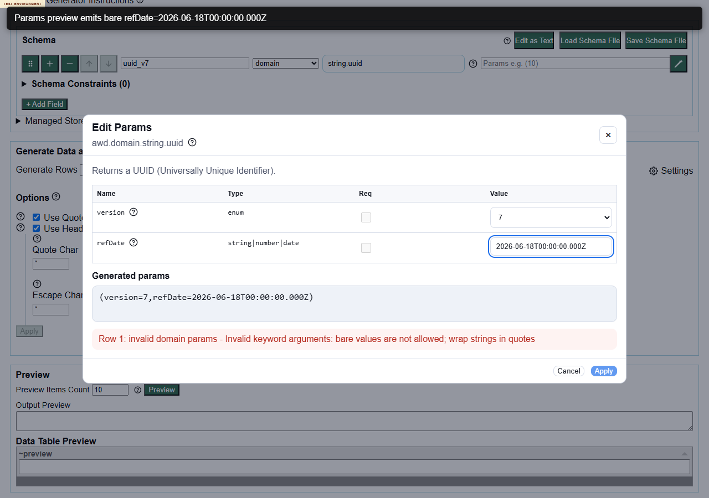

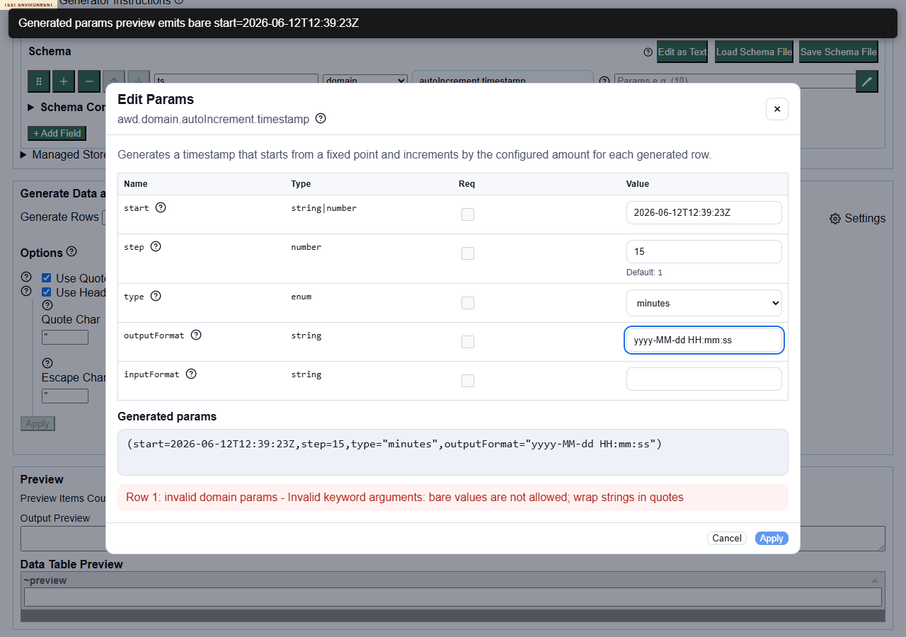

Local-only video: `videos/defect-001-params-editor-unquoted-string-param.webm`

## Notes

This is not a runtime command-generation failure when the schema is manually quoted correctly. Loop 3 confirmed `string.uuid(version=7,refDate="2026-06-18T00:00:00.000Z")` previews successfully. The defect is in the guided params editor serialization/UX for string-like union fields.


---

## Defect File: defect-002-empty-string-enum-values-fail-as-unknown-keyword.md

# Defect 002: Empty string values inside `enum(...)` fail as `Unknown keyword: enum`

## Summary

The deployed generator rejects enum declarations containing an empty string choice with `Unknown keyword: enum`. Empty values work through `literal("")`, empty constraints work outside enum fields, and whitespace-only enum values work, so this looks like an empty-string enum parsing/validation defect rather than an intentional unsupported feature.

## Environment

- Deployed URL: `https://eviltester.github.io/grid-table-editor/generator.html`
- Story: `https://github.com/eviltester/grid-table-editor/issues/295`
- PR: `https://github.com/eviltester/grid-table-editor/pull/305`

## Repeat Steps

1. Open `https://eviltester.github.io/grid-table-editor/generator.html`.
2. Click `Edit as Text`.
3. Enter:

```text
MaybeBlank
enum("","A")
```

4. Set `Preview Items Count` to `5`.
5. Click `Preview`.

Additional repeated inputs:

```text
MaybeBlank
enum("A","")
```

```text
MaybeBlank
enum("")
```

```text
MaybeBlank: enum("", "A")
```

## Expected

The generator should either support empty string enum choices or reject them with a clear validation message explaining that empty enum values are not supported.

## Actual

Preview fails with:

```text
MaybeBlank failed domain validation - Unknown keyword: enum
```

The message misclassifies the valid-looking `enum(...)` command as unknown only when an empty quoted value is present.

## Evidence

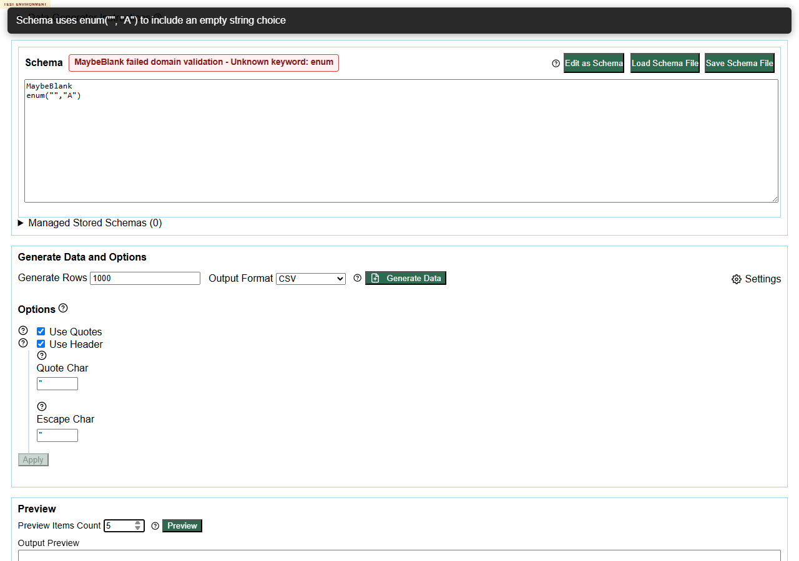

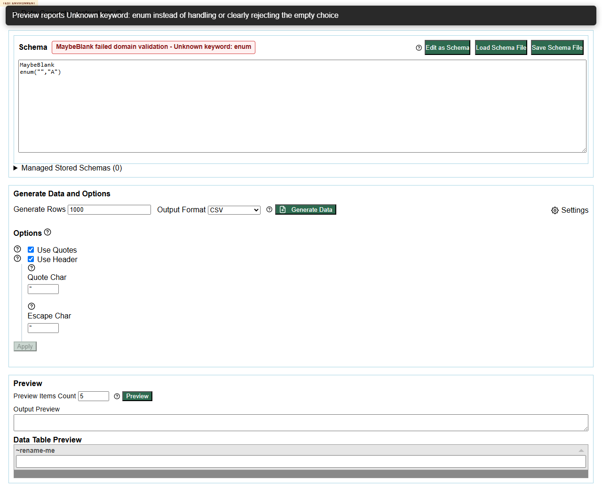

Local-only video: `videos/defect-002-empty-string-enum-unknown-keyword.webm`

## Notes

Loop 2 confirmed `enum(" ","A")` generates values, and a `literal("")` field with an empty-string constraint generates successfully. That narrows the defect to truly empty enum values.


---

## Defect File: defect-003-invalid-timestamp-start-generates-error-rows.md

# Defect 003: Invalid `autoIncrement.timestamp` start value generates `**ERROR**` rows instead of validation error

## Summary

`autoIncrement.timestamp` validates several malformed params before generation, but an invalid quoted `start` value is not rejected. Preview and Generate Data produce rows containing `**ERROR**`, and the downloaded CSV also contains `**ERROR**` values.

## Environment

- Deployed URL: `https://eviltester.github.io/grid-table-editor/generator.html`
- Story: `https://github.com/eviltester/grid-table-editor/issues/295`
- PR: `https://github.com/eviltester/grid-table-editor/pull/305`

## Repeat Steps

1. Open `https://eviltester.github.io/grid-table-editor/generator.html`.
2. Click `Edit as Text`.
3. Enter:

```text
Created
autoIncrement.timestamp(start="not-a-date", step=1, type="seconds")
```

4. Set `Preview Items Count` to `5`.
5. Click `Preview`.
6. Optionally click `Generate Data`.

## Expected

The schema should be rejected with a clear validation error for the invalid `start` value before data generation.

## Actual

No visible validation error is shown. The output preview contains:

```text
"Created"
"**ERROR**"
"**ERROR**"
"**ERROR**"
"**ERROR**"
"**ERROR**"
```

Loop 3 also confirmed `Generate Data` reports `Download ready: generated-data.csv` and the downloaded file contains repeated `**ERROR**` rows.

## Evidence

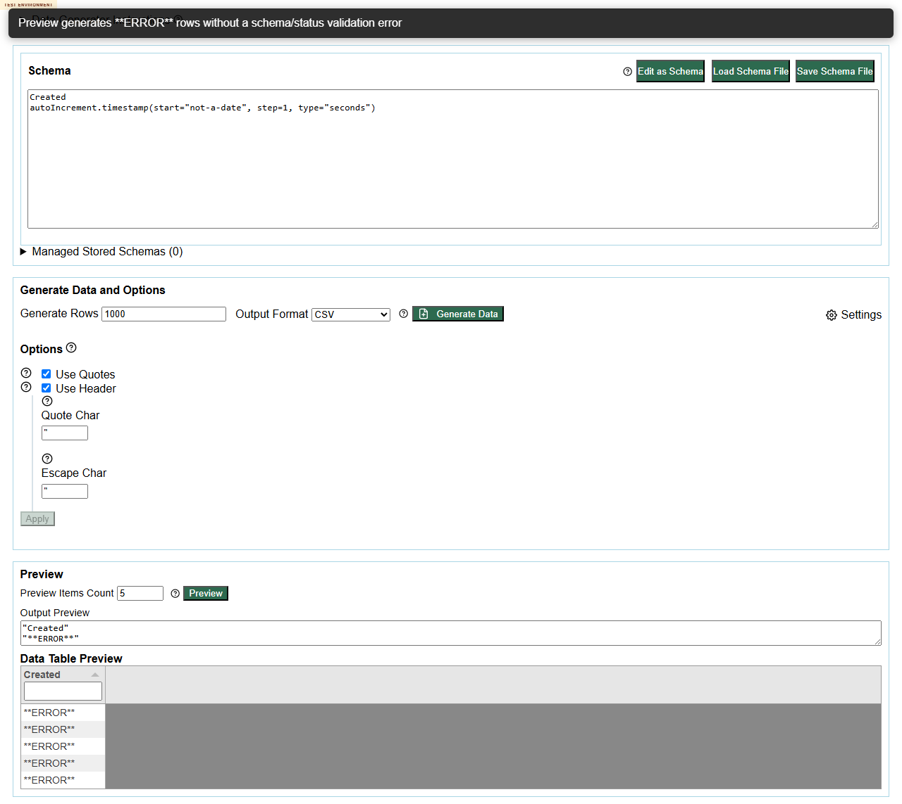

Local-only video: `videos/defect-003-invalid-timestamp-start-error-rows.webm`

Downloaded local-only support file: `support/loop3-invalid-timestamp-download.csv`

## Notes

Other timestamp params are validated correctly: invalid `type`, uppercase units, unknown `unit`, and string `step` produce explicit validation errors. This defect is specific to invalid `start` values reaching generation.


---

## Defect File: defect-004-params-editor-apply-loses-keyboard-focus.md

# Defect 004: Params editor `Apply` closes dialog and leaves keyboard focus on `<body>`

## Summary

After applying enum params from the params editor, keyboard focus is lost to `<body>` instead of returning to the invoking `Edit params for ...` button. `Escape` and `Cancel` return focus correctly, so the problem appears specific to `Apply`.

## Environment

- Deployed URL: `https://eviltester.github.io/grid-table-editor/generator.html`
- Story: `https://github.com/eviltester/grid-table-editor/issues/295`
- PR: `https://github.com/eviltester/grid-table-editor/pull/305`

## Repeat Steps

1. Open `https://eviltester.github.io/grid-table-editor/generator.html`.
2. In the first schema row, set field type to `domain`.
3. Select `person.firstName`.
4. Open `Edit params for person.firstName`.
5. Keyboard path: focus `sex value`, choose `female`, Tab to `Apply`, press Enter.

Repeated with:

- `person.firstName`
- `location.countryCode`
- `finance.bitcoinAddress`

## Expected

After `Apply`, focus should return to the invoking params button or another predictable control in the schema row.

## Actual

The dialog closes and params are applied, but `document.activeElement` becomes `<body>`.

Contrast behavior:

- `Escape` closes the dialog and returns focus to the invoking params button.
- `Cancel` closes the dialog and returns focus to the invoking params button.

## Evidence

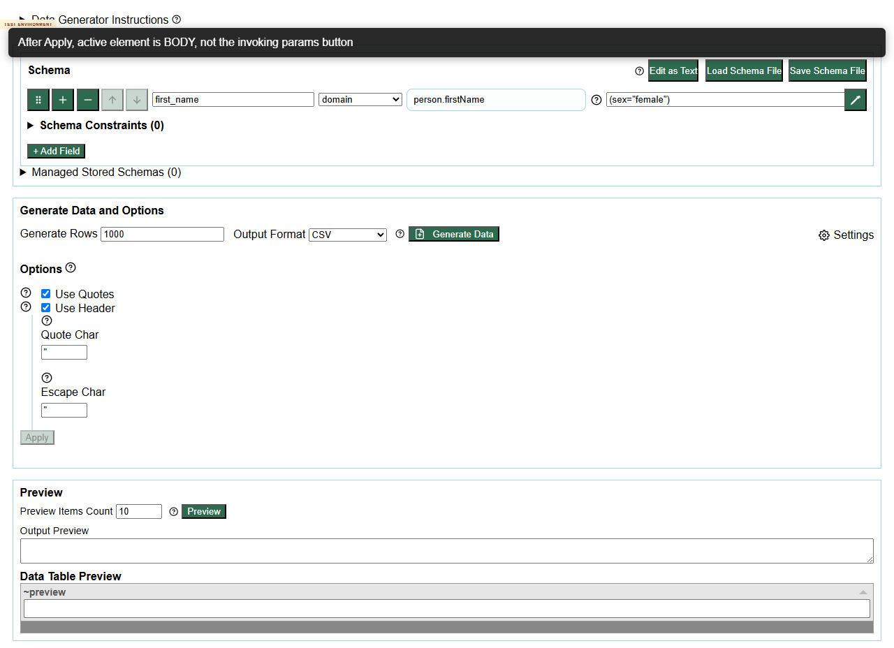

Local-only video: `videos/defect-004-params-apply-focus-body.webm`

## Notes

This affects keyboard and assistive-technology workflow after the new enum dropdown editing flow.


---

## Defect File: defect-005-mobile-params-editor-value-controls-start-offscreen.md

# Defect 005: Mobile params editor opens with enum value controls off-screen

## Summary

On narrow/mobile widths, the params editor opens as a wide table. The primary `Value` column containing the enum dropdown starts off-screen to the right, even though focus may be on that hidden control. Users must discover a horizontal scroll area to reach the main control.

## Environment

- Deployed URL: `https://eviltester.github.io/grid-table-editor/generator.html`
- Viewports tested: `390x844` and `320x720`
- Story: `https://github.com/eviltester/grid-table-editor/issues/295`
- PR: `https://github.com/eviltester/grid-table-editor/pull/305`

## Repeat Steps

1. Set the viewport to `390x844`.
2. Open `https://eviltester.github.io/grid-table-editor/generator.html`.
3. In the first schema row, set field type to `domain`.
4. Select `person.firstName`.
5. Open `Edit params for person.firstName`.

Repeated with:

- `person.firstName`
- `location.countryCode`
- `finance.bitcoinAddress`
- `color.rgb`

## Expected

The enum value picker should be visible on open, or the modal should reflow so the primary editable control is discoverable without horizontal scrolling.

## Actual

At 390 px wide:

- `.params-editor-table-wrap` client width is about `316`.
- `.params-editor-table-wrap` scroll width is about `720`.
- The first enum select starts around `x=585`, beyond the 390 px viewport.

The dialog initially shows `Name` and `Type`, while the `Value` control is hidden to the right.

## Evidence

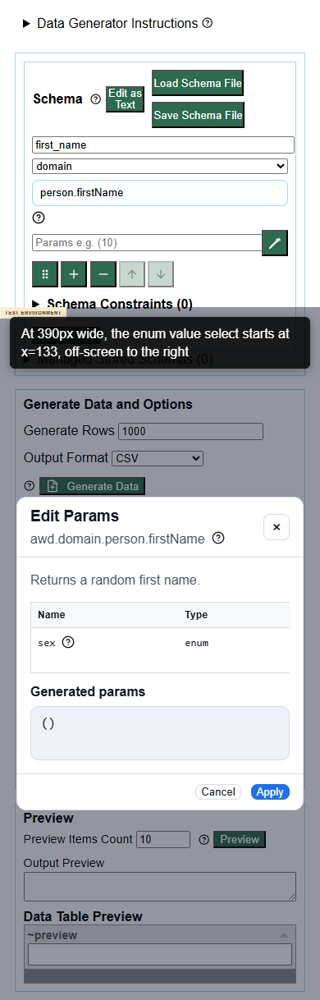

Additional lane screenshots:

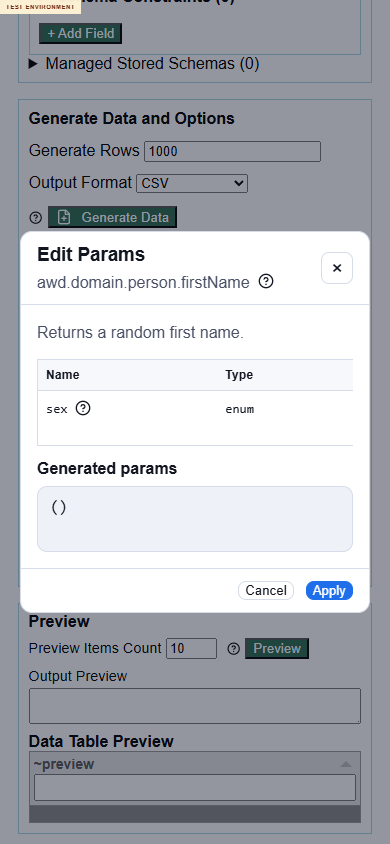

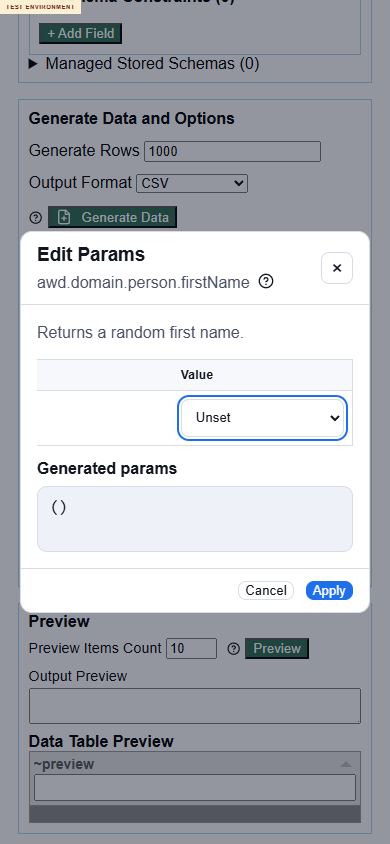

Local-only video: `videos/defect-005-mobile-params-value-offscreen.webm`

## Notes

This is not a total blocker because the table wrapper can scroll horizontally, but it is a high-confidence mobile usability/accessibility defect for the enum picker story.


---

## Defect File: defect-006-published-docs-show-old-pipe-enum-types.md

# Defect 006: Published docs still show old pipe-style enum types while app shows enum dropdowns

## Summary

The deployed app picker and params dialogs expose enum params as `enum` dropdowns, but the published domain docs still show old pipe-style type strings such as `lower|upper|mixed` and `hex|decimal|css|binary`. This creates a docs/help/runtime consistency mismatch for PR 305.

## Environment

- Deployed docs: `https://eviltester.github.io/grid-table-editor/site/docs/test-data/domain/`
- Deployed generator: `https://eviltester.github.io/grid-table-editor/generator.html`
- Story: `https://github.com/eviltester/grid-table-editor/issues/295`
- PR: `https://github.com/eviltester/grid-table-editor/pull/305`

## Repeat Steps

1. Open `https://eviltester.github.io/grid-table-editor/site/docs/test-data/domain/color/#colorrgb`.
2. Inspect the `color.rgb` parameter table.
3. Open `https://eviltester.github.io/grid-table-editor/generator.html`.
4. Select domain command `color.rgb`.
5. Open `Edit params for color.rgb`.
6. Compare the docs type labels with the params dialog controls.

## Expected

Published docs should align with the app help/model metadata for enum params. If the app says the type is `enum` and exposes allowed values as dropdown options, the docs should present the same model clearly.

## Actual

The docs show old pipe-style type strings:

- `casing`: `lower|upper|mixed`
- `format`: `hex|decimal|css|binary`

The app params dialog shows both params as enum dropdowns:

- `casing value`: `Unset`, `lower`, `upper`, `mixed`
- `format value`: `Unset`, `hex`, `decimal`, `css`, `binary`

## Evidence

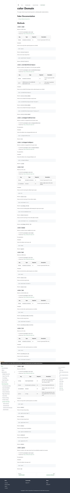

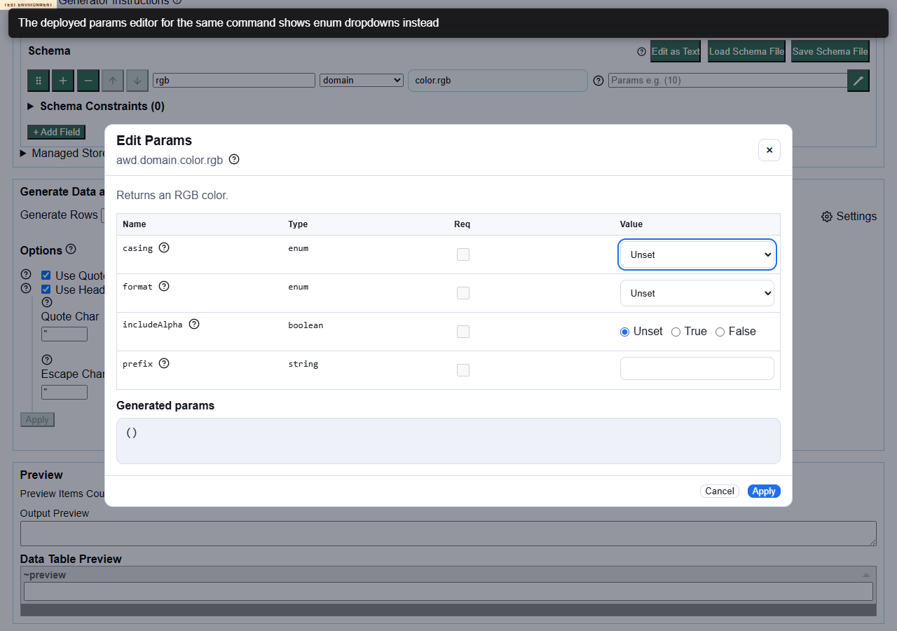

Local-only video: `videos/defect-006-docs-old-pipe-types-vs-app-enum.webm`

## Broader Sample

The same stale-docs pattern was observed in sampled sections for:

- `airline.seat.aircraftType`
- `commerce.isbn.variant`
- `date.birthdate.mode`
- `finance.bitcoinAddress.type`
- `finance.bitcoinAddress.network`
- `internet.ipv4.network`
- `internet.mac.separator`
- `internet.url.protocol`
- `location.countryCode.variant`
- `person.firstName.sex`
- `phone.number.style`
- `string.uuid.version`
- `word.noun.strategy`
- `lorem.word.strategy`

`autoIncrement.timestamp.type` is related: app picker/dialog show the param as `enum` with plural units, while the docs table still shows `string`.


